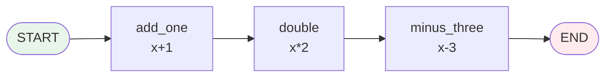
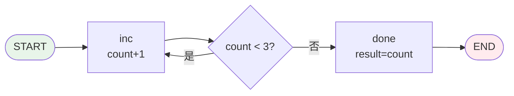
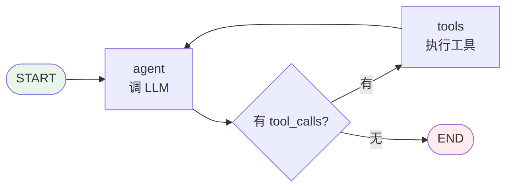
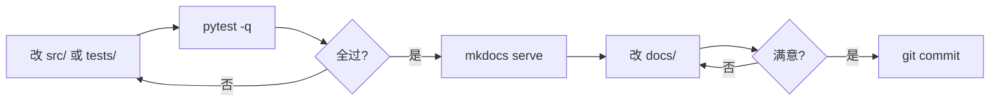

# 快速上手

本页带你从零开始：装好、跑通、切到某个阶段看代码、跑三个示例、最后接真 LLM 跑一个完整 Agent。

!!! tip "时间预算"
    - 装环境 + 跑测试：5 分钟
    - 看完三个示例：20 分钟
    - 接真 LLM 跑 Agent：5 分钟（需要 OpenAI API Key）

---

## 环境要求

| 项 | 最低版本 | 推荐 | 说明 |
|----|:--------:|:----:|------|
| Python | 3.10 | 3.11 / 3.12 | 用到 `Annotated` / `get_type_hints(include_extras=True)` |
| pip | 23 | 最新 | 支持 PEP 621 可选依赖组语法 |
| git | 2.20+ | 最新 | 要能 checkout tag |
| 操作系统 | 任意 | — | 纯标准库，跨平台 |

??? warning "为什么 Python 必须 ≥ 3.10？"
    阶段 5 的 Reducer 机制用 `typing.Annotated` + `typing.get_type_hints(..., include_extras=True)` 从 TypedDict 注解里提取合并函数。`include_extras` 参数是 3.10 才加的。3.9 虽然有 `Annotated`，但 `get_type_hints` 会把元数据丢掉。

    如果你卡在 3.9，可以只看阶段 1-4，跳过阶段 5 及之后。

---

## 安装步骤

### 方式 1 · 开发模式（推荐）

含测试、lint、文档工具，适合边读边改：

```bash
git clone https://github.com/wanglh39/langgraph.git
cd langgraph
pip install -e ".[dev,docs]"
```

验证安装：

```bash
python -c "import tiny_langgraph; print(tiny_langgraph.__version__)"
# 0.0.0

pytest -q
# 10 个文件、几十个测试全过
```

### 方式 2 · 仅运行

只要引擎、不要工具链（适合只想 `import` 来用）：

```bash
pip install git+https://github.com/wanglh39/langgraph.git
```

注意：基础安装**零运行时依赖**（`dependencies = []`），只装 `tiny_langgraph` 包本身。

### 方式 3 · 含 LLM 依赖（阶段 9 才需要）

```bash
pip install -e ".[dev,docs,llm]"
# 多装一个 openai>=1.0
```

!!! info "为什么不一开始就装 openai？"
    阶段 1-8 是纯标准库，跟 OpenAI 毫无关系。把 LLM 依赖放到可选组 `[llm]`，是为了让前 8 个阶段的学习**不被 API Key、网络、付费**这些噪音打断。等你看到阶段 9 真要调 LLM 了，再装也不迟。

---

## 跑测试

```bash
# 跑全部测试
pytest

# 只跑某一阶段
pytest -m stage1
pytest -m stage4
pytest -m stage9

# 跑多个阶段
pytest -m "stage1 or stage2 or stage3"

# 看覆盖率
pytest --cov=tiny_langgraph --cov-report=term-missing
```

测试按阶段分组，每组用 `@pytest.mark.stageN` 标记。`pyproject.toml` 里注册了所有标记：

```toml
[tool.pytest.ini_options]
markers = [
    "stage1: 阶段 1 - DAG 执行器",
    "stage2: 阶段 2 - 共享状态",
    # ...
    "stage9: 阶段 9 - 完整 Agent",
]
```

测试文件镜像源码结构：`tests/tiny_langgraph/test_graph.py` 测 `src/tiny_langgraph/graph.py`，以此类推。

??? tip "测试为什么能离线跑？"
    阶段 1-8 的测试全是纯 Python 逻辑，不调任何外部服务。阶段 9 的 Agent 测试用 monkeypatch 把 OpenAI 客户端换成假对象，所以也能离线跑——`pytest` 不会真的去调 OpenAI。

    如果你想跑**真** LLM，看下面 [阶段 9 接真 LLM 的配置](#阶段-9接真-llm-的配置)。

---

## 本地预览文档

```bash
mkdocs serve
```

浏览器打开 <http://127.0.0.1:8000>。修改 `docs/` 下任何 `.md` 会**实时热刷新**。

!!! tip "文档站点的几个好用功能"
    - 顶部搜索框：支持中文、带高亮
    - 右上角主题切换：浅色 / 深色
    - 代码块右上角**复制按钮**
    - 所有 mermaid 图实时渲染

如果要构建静态站点（部署用）：

```bash
mkdocs build              # 产出 site/ 目录
mkdocs build --strict     # 严格模式：警告当错误
```

---

## 切到某个阶段看代码

整个项目的 10 个阶段叠在**同一组文件**里，用 git tag 区分。这是刻意的——让你能 `git diff` 直接看到"这一步加了什么"。

```bash
# 列出所有阶段 tag
git tag -l
# stage-0  stage-1  stage-2  ...  stage-9

# 切到阶段 2 的代码
git checkout stage-2

# 切回最新（main）
git checkout main
```

### 看阶段间的 diff

这是本项目最重要的学习方式——**看每一阶段加了什么**：

```bash
# 阶段 2 相对阶段 1 加了什么（共享状态）
git diff stage-1..stage-2 -- src/

# 只看某个文件的变化
git diff stage-3..stage-4 -- src/tiny_langgraph/graph.py

# 看测试的变化
git diff stage-5..stage-6 -- tests/

# 看文档的变化
git diff stage-6..stage-7 -- docs/stages/
```

??? tip "推荐的学习节奏"
    ```bash
    for n in 1 2 3 4 5 6 7 8 9; do
        git checkout stage-$n
        pytest -m stage$n -q
        # 读 docs/stages/stage_${n}_*.md
        # 读 src/tiny_langgraph/
    done
    ```

    每个阶段的 diff 通常只有 50-100 行，坐下来半小时就能读完。

---

## 第一个示例：运行阶段 1 的 DAG

阶段 1 是最朴素的"图即程序"：节点是 `Callable[[Any], Any]`，接收上一步输出，返回自己的输出。

```bash
git checkout stage-1
```

```python
# example_stage1.py
from tiny_langgraph.graph import START, END, Graph

graph = Graph()
graph.add_node("add_one", lambda x: x + 1)
graph.add_node("double",  lambda x: x * 2)
graph.add_node("minus_three", lambda x: x - 3)

graph.add_edge(START, "add_one")
graph.add_edge("add_one", "double")
graph.add_edge("double", "minus_three")
graph.add_edge("minus_three", END)

app = graph.compile()
print(app.invoke(3))
# 3 -> add_one:4 -> double:8 -> minus_three:5
# 输出: 5
```

运行：

```bash
python example_stage1.py
# 5
```



!!! info "这个示例展示了什么"
    - **节点 = 函数**：每个节点就是一个普通 Python 函数（这里用 lambda）。
    - **边 = 顺序**：`add_edge(A, B)` 表示"执行完 A 跳 B"。
    - **`START` / `END`** 是保留字，标记图的入口和出口。
    - **`compile()`** 把图编译成可执行物，`invoke(x)` 跑一遍。

---

## 第二个示例：运行阶段 4 的循环图

阶段 4 引入共享状态、条件边和回边，能跑循环——这是 ReAct Agent 的雏形。

```bash
git checkout stage-4
```

下面这个例子：从 0 开始数数，每次 +1，数到 3 停。

```python
# example_stage4.py
from typing import TypedDict
from tiny_langgraph.graph import START, END, StateGraph

class State(TypedDict):
    count: int

graph = StateGraph(State)
graph.add_node("inc",  lambda s: {"count": s["count"] + 1})
graph.add_node("done", lambda s: {"result": s["count"]})

def router(s: State) -> str:
    return "inc" if s["count"] < 3 else "done"

graph.add_edge(START, "inc")
graph.add_conditional_edges("inc", router, {"inc": "inc", "done": "done"})
graph.add_edge("done", END)

app = graph.compile()

# invoke：拿最终状态
print(app.invoke({"count": 0}))
# {'count': 3, 'result': 3}

# stream：看每一步
for event in app.stream({"count": 0}):
    print(event)
# {'nodes': {'inc'}, 'state': {'count': 1}, 'step': 0}
# {'nodes': {'inc'}, 'state': {'count': 2}, 'step': 1}
# {'nodes': {'inc'}, 'state': {'count': 3}, 'step': 2}
# {'nodes': {'done'}, 'state': {'count': 3, 'result': 3}, 'step': 3}
```



!!! info "这个示例展示了什么"
    - **共享状态**：节点签名变成 `Callable[[State], StateUpdate]`，返回的是**更新片段**，引擎合并回完整状态。
    - **条件边**：`add_conditional_edges("inc", router, {...})`，执行完 `inc` 后调用 `router(state)` 决定走哪。
    - **回边**：`router` 返回 `"inc"` 又跳回 `inc`——这就是循环。
    - **`stream()`**：流式 yield 每个超级步的事件，能看到中间状态。`invoke()` 内部就是消费完整个 `stream()`。

---

## 第三个示例：运行阶段 9 的 Agent

阶段 9 用前 8 阶段搭好的引擎，拼出一个完整的 ReAct Tool-calling Agent。

```bash
git checkout stage-9
pip install -e ".[llm]"          # 装 openai
```

### 离线版（用假 LLM，不需要 API Key）

下面这个例子用 monkeypatch 把 OpenAI 客户端换成假对象，可以离线跑——和 `tests/tiny_langgraph/test_prebuilt.py` 里的做法一样：

```python
# example_stage9_offline.py
from tiny_langgraph import create_react_agent, Tool

# 1) 定义工具
@Tool("calculator", "计算数学表达式", {
    "type": "object",
    "properties": {"expr": {"type": "string"}},
    "required": ["expr"],
})
def calculator(expr: str) -> str:
    return str(eval(expr))  # 教学用，生产别这么写

# 2) 造一个假 LLM（模拟 OpenAI 客户端接口）
class FakeMessage:
    def __init__(self, content, tool_calls=None):
        self.content = content
        self.tool_calls = tool_calls
    def model_dump(self):
        d = {"role": "assistant", "content": self.content}
        if self.tool_calls:
            d["tool_calls"] = self.tool_calls
        return d

class FakeChoice:
    def __init__(self, msg): self.message = msg

class FakeResponse:
    def __init__(self, msg): self.choices = [FakeChoice(msg)]

class FakeLLM:
    """假 OpenAI：第一次调工具，第二次返回最终答案。"""
    def __init__(self):
        self._call = 0
    class chat:
        class completions:
            @staticmethod
            def create(model, messages, tools):
                # 简化：用全局计数器
                pass
    # 实际写法见 tests/tiny_langgraph/test_prebuilt.py

# 完整可运行版本看 tests/tiny_langgraph/test_prebuilt.py
# 这里只展示结构
print("见 tests/tiny_langgraph/test_prebuilt.py 的离线测试")
```

!!! tip "想直接看离线跑通的代码？"
    打开 [`tests/tiny_langgraph/test_prebuilt.py`](https://github.com/wanglh39/langgraph/blob/stage-9/tests/tiny_langgraph/test_prebuilt.py)，里面有一个完整的 `FakeOpenAI` 类，模拟"LLM 先调工具、再给最终答案"的两步交互，全程不联网。

### 在线版（接真 OpenAI）

```python
# example_stage9_online.py
import os
from openai import OpenAI
from tiny_langgraph import create_react_agent, Tool, MemorySaver

@Tool("calculator", "计算数学表达式", {
    "type": "object",
    "properties": {"expr": {"type": "string"}},
    "required": ["expr"],
})
def calculator(expr: str) -> str:
    return str(eval(expr))

agent = create_react_agent(
    OpenAI(),
    tools=[calculator],
    model="gpt-4o-mini",
    system_prompt="你是一个计算助手，遇到算术就调 calculator。",
    checkpointer=MemorySaver(),
)

result = agent.invoke({
    "messages": [{"role": "user", "content": "算一下 (12 + 8) * 3"}]
})
for msg in result["messages"]:
    print(msg["role"], ":", msg.get("content", msg.get("tool_calls")))
```

运行：

```bash
export OPENAI_API_KEY="sk-..."
python example_stage9_online.py
```



!!! info "这个示例展示了什么"
    - **阶段 2**：`messages` 列表在节点间共享。
    - **阶段 3**：`should_continue` 根据最后一条消息有没有 `tool_calls` 决定走 `tools` 还是 `END`。
    - **阶段 4**：`agent → tools → agent` 的 ReAct 循环。
    - **阶段 5**：`add_messages` Reducer 智能追加消息。
    - **阶段 7**：`MemorySaver` 保存对话历史，下次 `invoke(None, config)` 能续聊。
    - **阶段 8**：`interrupt_before_tools=True` 可以在调工具前暂停让人审批。

---

## 阶段 9 接真 LLM 的配置

### 1. 装依赖

```bash
pip install -e ".[dev,docs,llm]"
```

`[llm]` 可选组只加一个包：`openai>=1.0.0`。

### 2. 配 API Key

=== "Linux / macOS"

    ```bash
    export OPENAI_API_KEY="sk-..."
    ```

=== "Windows PowerShell"

    ```powershell
    $env:OPENAI_API_KEY = "sk-..."
    ```

=== "Windows CMD"

    ```cmd
    set OPENAI_API_KEY=sk-...
    ```

=== ".env 文件（推荐）"

    ```bash
    # .env
    OPENAI_API_KEY=sk-...
    ```
    然后在脚本开头：
    ```python
    from dotenv import load_dotenv
    load_dotenv()
    ```
    （需要 `pip install python-dotenv`）

### 3. 用兼容 OpenAI 接口的其它服务

`create_react_agent` 的第一个参数只要是个有 `.chat.completions.create()` 方法的对象就行。所以任何兼容 OpenAI 接口的服务都能用：

```python
from openai import OpenAI

# Azure OpenAI
client = OpenAI(
    api_key="...",
    azure_endpoint="https://xxx.openai.azure.com",
    api_version="2024-02-15-preview",
)

# 本地 Ollama / vLLM / LM Studio
client = OpenAI(base_url="http://localhost:11434/v1", api_key="dummy")

# DeepSeek / Moonshot / 智谱 等
client = OpenAI(base_url="https://api.deepseek.com/v1", api_key="...")

agent = create_react_agent(client, tools=[...])
```

??? warning "为什么阶段 9 才需要 LLM？"
    阶段 1-8 讲的是**引擎**，不是"怎么调 LLM"。引擎本身跟 LLM 无关——它只是"跑一张图"。阶段 9 把 LLM 塞进图的某个节点（`agent` 节点），这才需要 OpenAI 客户端。

    这种分层让你能看清：**Agent = 图 + LLM 节点**，引擎不知道 LLM 的存在。

---

## 常见问题

??? question "装完 `pip install -e .` 后 import 报错"
    最常见原因是没装到当前环境。检查：
    ```bash
    which python
    python -c "import sys; print(sys.path)"
    pip show tiny-langgraph
    ```
    如果用了 conda / venv，确保装之前 `activate` 了对应环境。

??? question "`pytest -m stage9` 报 `openai` 找不到"
    阶段 9 的测试虽然用 monkeypatch 不真调 OpenAI，但 `prebuilt.py` 顶部有 `from openai import OpenAI`（在 `TYPE_CHECKING` 下，运行时其实不 import）。如果还是报错，跑：
    ```bash
    pip install -e ".[llm]"
    ```

??? question "`mkdocs serve` 报 `mermaid` 不渲染"
    本项目用 `pymdownx.superfences` 的 `custom_fences` 配 mermaid，`mkdocs.yml` 已经配好。如果还不渲染，检查：
    ```bash
    pip install -e ".[docs]"
    ```
    确认 `mkdocs-material>=9.5` 和 `pymdown-extensions>=10.7` 都装了。

??? question "git checkout 某个 tag 后 pytest 报错"
    不同阶段的测试标记不同。比如在 `stage-2` 上跑 `pytest -m stage9` 会发现没测试。正确做法：
    ```bash
    git checkout stage-2
    pytest -m stage2          # 只跑这个阶段有的
    # 或
    pytest                    # 跑所有（早期 tag 上后面的测试还没有，会被 skip）
    ```

??? question "为什么 `invoke(None, config)` 能续跑？"
    `input=None` 是约定信号，告诉引擎"从检查点恢复"。引擎会从 `checkpointer.get(thread_id)` 取最新快照，恢复 `state` 和 `pending`（下一步要执行的节点集合），接着跑。这是阶段 7 + 8 的核心机制，见 [检查点与时间旅行](principles/checkpoint.md)。

??? question "怎么调试图的执行？"
    用 `stream()` 而不是 `invoke()`。`stream` 会 yield 每个超级步的事件：
    ```python
    for event in app.stream(input, config=config):
        print(f"step {event['step']}: nodes={event['nodes']}")
        print(f"  state={event['state']}")
        if event.get("interrupt"):
            print(f"  ⏸ interrupt {event['interrupt']}")
    ```
    这样能看到每一步走了哪些节点、状态怎么变、在哪暂停。

??? question "recursion_limit 报错怎么办"
    默认 `recursion_limit=25`，防止死循环。如果你的图确实需要更多步：
    ```python
    app.invoke(input, recursion_limit=100)
    ```
    但先想想是不是图设计有问题——Agent 通常不应该跑 25 步还停不下来。

??? question "怎么在执行中途改状态？"
    用 `update_state`（阶段 8）：
    ```python
    # 假设图在 "review" 节点前 interrupt 了
    app.update_state(config, {"approved": True, "comment": "看起来没问题"})
    # 然后续跑
    app.invoke(None, config=config)
    ```
    这是人机协作的关键：人类在暂停点写入决策，引擎接着跑。

---

## 开发工作流：改代码 → 跑测试 → 看文档

日常迭代的三步循环：



### 1. 改代码

```bash
# 改 src/tiny_langgraph/graph.py
```

### 2. 跑测试 + lint

```bash
# 跑相关阶段的测试
pytest -m stage4 -q

# 跑 lint
ruff check src/ tests/
mypy src/

# 看覆盖率
pytest -m stage4 --cov=tiny_langgraph --cov-report=term-missing
```

### 3. 改文档 + 预览

```bash
mkdocs serve
# 改 docs/stages/stage_4_cycle.md
# 浏览器实时刷新
```

### 4. 提交

本项目用约定式提交（可选）：

```bash
git add src/tiny_langgraph/graph.py tests/tiny_langgraph/test_cycle.py
git commit -m "feat(stage4): 支持回边检测"
# 或
git commit -m "docs(stage4): 补充循环图执行模型的说明"
```

??? tip "一个完整的迭代例子"
    假设你想给阶段 4 加一个"最大步数到点抛更友好的错"：

    ```bash
    # 1. 改代码
    # 编辑 src/tiny_langgraph/graph.py，把 RecursionError 的消息改清楚

    # 2. 跑测试
    pytest -m stage4 -q
    # 如果挂了，加一个测试到 tests/tiny_langgraph/test_cycle.py

    # 3. 改文档
    # 编辑 docs/stages/stage_4_cycle.md，说明这个错误

    # 4. 预览
    mkdocs serve

    # 5. 提交
    git commit -am "feat(stage4): 改进 recursion_limit 报错信息"
    ```

---

## 下一步

- **想系统学原理？** 👉 [核心原理](principles/index.md)
- **想逐阶段读实现？** 👉 [阶段 0 · 项目骨架](stages/stage_0_skeleton.md)
- **想查 API？** 👉 [API 参考](api.md)
