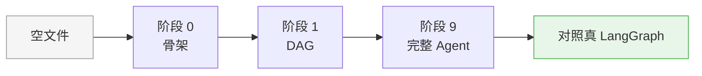
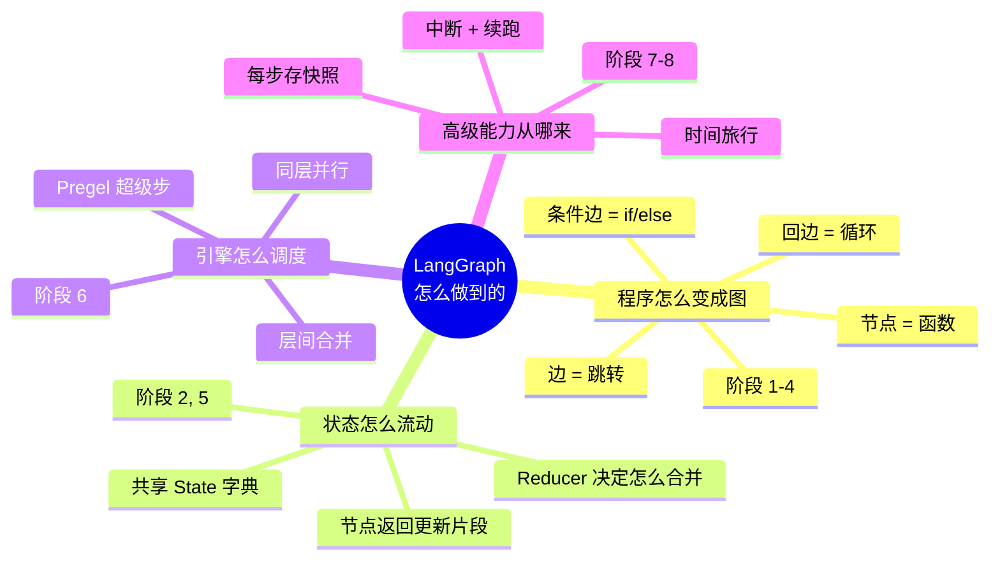
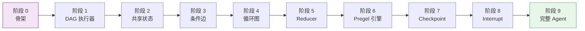

# 从零实现 LangGraph

!!! quote "这个项目要回答的问题"
    LangGraph 到底**怎么做到的**？我们把"写 Agent"从一坨 prompt 拼接，变成"画一张状态机"，再用一个通用引擎去跑这张图——这个引擎内部发生了什么？

    这不是又一份 API 速查表，而是一次**造轮子**的完整记录：从空文件开始，分 10 个阶段，用纯 Python 标准库，亲手实现一个 LangGraph 的核心子集。

---

## 这是什么

**tiny-langgraph** 是一个教学项目。我们从空文件开始，分 **10 个阶段**，手写一个 LangGraph 的核心子集。

不是 API 教程，不是源码注释翻译，而是**造轮子**：每一层只加一个概念，每一层都能跑，每一层都对照真实 LangGraph 源码讲清楚"为什么这么设计"。



整个项目最终只产出 **4 个源文件**、不到 1000 行 Python 代码，却完整覆盖了 LangGraph 的执行模型、状态合并、检查点、人机协作和 Tool-calling Agent。每一行都能讲清楚"为什么在这里"。

## 为什么值得做

LangGraph 的本质是一个**基于图的有状态执行引擎**，受 Google [Pregel](https://research.google/pubs/pregel-a-system-for-large-scale-graph-processing/) 启发。它的"图"不是装饰，而是**执行模型本身**。

理解了它，你就理解了一整类系统的设计：

| 概念 | 在 LangGraph 里的形态 | 在本项目哪一阶段实现 |
|------|----------------------|:--------------------:|
| **Chain** | 单链图（线性） | 阶段 1 |
| **State** | 节点间共享的字典 | 阶段 2 |
| **Router / if-else** | 条件边 | 阶段 3 |
| **Agent（ReAct）** | 带循环的图 | 阶段 4 + 9 |
| **Reducer** | `Annotated[T, add]` 字段合并策略 | 阶段 5 |
| **Multi-Agent** | 嵌套子图 / fan-out | 阶段 6 |
| **人机协作** | 图上的中断点 | 阶段 8 |
| **断点续跑** | 图执行快照 | 阶段 7 |

!!! info "为什么不用 LangChain 的 Chain？"
    Chain 只能表达**线性**流程。一旦 Agent 需要"看 LLM 回复决定下一步走哪"——也就是循环 + 分支——Chain 就得用一堆 `if` 和回调硬拼。LangGraph 把"控制流"从代码里抽出来变成**图的边**，于是 Agent、Multi-Agent、人机协作都成了同一张图的不同形状。

## 这不是什么 / 这是什么

为了避免误解，先把边界画清楚：

| 这**不是**什么 | 这**是**什么 |
|----------------|---------------|
| LangGraph 的替代品 | LangGraph 的**骨架子集**，用于理解原理 |
| 生产级框架 | 教学项目：零运行时依赖、单进程、同步 |
| API 速查表 | **造轮子**的完整记录：每一行都能讲清楚"为什么在这里" |
| LangChain 教程 | 不假设你懂 LangChain；读完反而能更好懂 LangChain |
| 完整复刻 LangGraph | 故意不做 pydantic / async / 流式 token / 分布式 |

!!! warning "请勿用于生产"
    本项目没有错误重试、超时、并发安全、分布式调度、可观测性。它是**教学骨架**。要上生产请用 [真实 LangGraph](https://github.com/langchain-ai/langgraph)。

    但本项目能让你**看懂**真实 LangGraph 的每一行在做什么——这才是它的价值。

---

## 核心问题：LangGraph 到底怎么做到的

我们把这个大问题拆成 4 个小问题，每个对应一组阶段：



- **程序怎么变成图？** —— 节点是函数，边是跳转，`if/else` 是条件边，`while` 是回边。阶段 1-4。
- **状态怎么流动？** —— 节点读共享 State、返回更新片段，引擎用 Reducer 合并。阶段 2、5。
- **引擎怎么调度？** —— Pregel 超级步：一层一层执行，同层并行，层间合并。阶段 6。
- **高级能力从哪来？** —— 每个超级步存快照，于是能时间旅行、能中断、能续跑。阶段 7-8。

每个问题都有一篇原理文档讲透，见 [核心原理](principles/index.md)。

---

## 渐进式路线总览

### 路线图



### 阶段一览表

| 阶段 | 做什么 | 新增概念 | 关键 API | git tag |
|:----:|--------|----------|----------|:-------:|
| 0 | 项目骨架 + 文档站点 | MkDocs Material、hatchling | — | `stage-0` |
| 1 | 最小 DAG 执行器 | `Node=函数`、拓扑排序 | `Graph` / `CompiledGraph` | `stage-1` |
| 2 | 共享状态 | `StateGraph`、覆盖合并 | `StateGraph.compile()` | `stage-2` |
| 3 | 条件边 | 路由分支、运行时遍历 | `add_conditional_edges` | `stage-3` |
| 4 | 循环图 + stream | 回边、ReAct 雏形、终止条件 | `CompiledStateGraph.stream` | `stage-4` |
| 5 | Reducer | `Annotated[T, reducer]`、`add_messages` | `extract_reducers` | `stage-5` |
| 6 | Pregel 超级步 | 通道、并行层、fan-out | `_next_nodes` | `stage-6` |
| 7 | Checkpoint | 内存→SQLite、时间旅行 | `MemorySaver` / `SqliteSaver` | `stage-7` |
| 8 | Interrupt + 流式 | 人机协作、`update_state` | `interrupt_before` | `stage-8` |
| 9 | 完整 Tool Agent | 接 OpenAI、对照真 LangGraph | `create_react_agent` | `stage-9` |

### 每个阶段一句话简介

- **阶段 0 · 项目骨架**：搭好 `pyproject.toml`、MkDocs 站点、pytest 标记，让后续每阶段都能"加一个文件就跑"。
- **阶段 1 · DAG 执行器**：节点是 `Callable[[Any], Any]`，引擎按拓扑序串起来跑——这是最朴素的"图即程序"。
- **阶段 2 · 共享状态**：节点改成 `Callable[[State], StateUpdate]`，引擎负责把更新片段合并回完整状态。
- **阶段 3 · 条件边**：执行完一个节点后，根据状态决定下一步走哪——`if/else` 在图里的表达，执行模型从"预编译顺序"改为"运行时 while 遍历"。
- **阶段 4 · 循环图**：回边 + 条件边构成循环（ReAct 雏形），新增 `stream()` 流式 yield 每步事件。
- **阶段 5 · Reducer**：用 `Annotated[T, reducer]` 声明字段合并策略，`add_messages` 智能合并消息列表（按 id 覆盖、否则追加）。
- **阶段 6 · Pregel 超级步**：执行模型从"单节点遍历"升级为"超级步并行层"，同层多节点读同一快照、各自计算、最后合并。
- **阶段 7 · Checkpoint**：每个超级步后存 `(thread_id, step, state, pending)` 快照，支持断点续跑和时间旅行。
- **阶段 8 · Interrupt**：在指定节点前/后暂停，等人类审批或输入，再 `invoke(None, config)` 续跑。
- **阶段 9 · 完整 Agent**：用前 8 阶段搭好的引擎，拼出一个完整的 ReAct Tool-calling Agent，接真 OpenAI API。

!!! tip "怎么看每一层加了什么"
    ```bash
    # 看阶段 2 相对阶段 1 加了什么
    git diff stage-1..stage-2 -- src/

    # 切到某个阶段的代码
    git checkout stage-2
    ```

---

## 设计原则

本项目坚持 4 条原则，它们决定了"为什么不直接抄 LangGraph 源码""为什么分 10 个阶段而不是 3 个"。

### 原则 1 · 纯标准库优先

> 阶段 1-8 只用 Python 标准库（`typing` / `collections` / `sqlite3` ...），底层原理不被框架噪音淹没。阶段 9 才接真 LLM API。

为什么这么坚持？因为我们要看的是**引擎本身**，不是"怎么调 OpenAI"。一旦引入 pydantic、langchain-core，读者的注意力就会被"这个 BaseModel 怎么序列化""那个 Runnable 怎么 pipe"带走。纯标准库让每一行代码都在回答"引擎怎么工作"，而不是"框架怎么用"。

代价是：有些地方会比真实实现"笨"一点（比如手写 `add_messages` 而不是用 pydantic v2 的验证器）。但教学项目里，**笨一点、看得懂** 比 **优雅、看不懂** 重要。

### 原则 2 · 每个概念只做一件事

> 每阶段只引入一个新概念，可独立运行、独立阅读。

这条原则直接决定了阶段的切分。比如"循环图"（阶段 4）和"Reducer"（阶段 5）本可以一起做——循环图几乎一定要用 `add_messages` 才好用——但我们硬拆成两阶段：

- 阶段 4 先用最朴素的"覆盖合并"跑通循环；
- 阶段 5 再单独把 Reducer 抽出来讲清楚"状态怎么合并"。

这样每阶段的 diff 都很小（通常 50-100 行），读者能在一次坐下来就读完。

### 原则 3 · 对照真实源码

> 每阶段文档会对照 [LangGraph 真实源码](https://github.com/langchain-ai/langgraph) 的关键行，带链接。

本项目不是"另起炉灶"，而是"剥到只剩骨架"。每阶段的文档都会指出：

- 这个概念在真实 LangGraph 里叫什么、在哪个文件；
- 真实实现多了什么（分布式、流式协议、pydantic 验证...）；
- 我们简化了什么、为什么可以简化。

读完本项目，再去看真实源码，你会发现自己能"对上号"了——那些原本像天书的 `PregelLoop`、`ChannelWrite`、`CheckpointSaver`，现在都有了对应的心智模型。

### 原则 4 · 可运行 > 可读 > 完备

> 所有代码都能 `python -m` 跑起来看效果。

我们不写"伪代码"。每个阶段都有对应的 pytest 测试（`tests/tiny_langgraph/test_*.py`），且测试用 `@pytest.mark.stageN` 标记，可以单独跑某一阶段：

```bash
pytest -m stage4        # 只跑阶段 4 的测试
pytest -m "stage1 or stage2"
```

这意味着：你可以在任何一个阶段 tag 上 `git checkout`，跑测试，改代码，看效果。**学习一个执行引擎最好的方式，就是亲手让它跑起来、亲手让它出错。**

---

## 学习路径推荐

不同背景的人，推荐不同的进入顺序：

=== "我是 Agent 新手"

    ```mermaid
    graph LR
        A[本页] --> B[快速上手]
        B --> C[阶段 1-4<br/>图即程序]
        C --> D[阶段 5-6<br/>状态+Pregel]
        D --> E[阶段 7-8<br/>检查点+中断]
        E --> F[阶段 9<br/>完整 Agent]
    ```

    按顺序读，每阶段半小时。遇到看不懂的，跳到对应原理页。

=== "我已会用 LangGraph，想搞懂原理"

    ```mermaid
    graph LR
        A[核心原理 概览] --> B[挑一个你困惑的概念]
        B --> C[读对应原理页]
        C --> D[读对应阶段代码]
        D --> E[对照真实源码]
    ```

    直接跳到 [核心原理](principles/index.md)，按问题驱动选读。

=== "我要面试 / 系统设计"

    重点读 [Pregel 超级步](principles/pregel.md) 和 [检查点与时间旅行](principles/checkpoint.md)——这两个是 LangGraph 区别于"又一个 Agent 框架"的根。阶段 6 和 7-8 的代码最值得逐行读。

=== "我要造自己的框架"

    全部按顺序读，重点看每阶段的 `git diff` 和测试。本项目本身就是"怎么从零造一个框架"的范例——你可以照着这个套路造一个属于你的引擎。

---

## 快速上手指引

3 条路径，按你的目标选一条：

=== "我想先看效果"

    ```bash
    git clone https://github.com/wanglh39/langgraph.git
    cd langgraph
    pip install -e ".[dev]"
    pytest -q                       # 跑全部测试
    git checkout stage-4            # 切到循环图阶段
    pytest -m stage4 -q             # 只跑阶段 4
    ```

    然后打开 [`src/tiny_langgraph/graph.py`](https://github.com/wanglh39/langgraph/blob/main/src/tiny_langgraph/graph.py) 看实现。

=== "我想系统学原理"

    1. 读 [核心原理 · 概览](principles/index.md) 建立 4 个概念的心智模型；
    2. 按 [阶段一览表](#阶段一览表) 顺序，每阶段先读文档再读代码；
    3. 每读完一阶段，`git checkout stage-N` 跑测试，亲手改一改。

=== "我要接真 LLM 跑 Agent"

    ```bash
    pip install -e ".[dev,docs,llm]"
    export OPENAI_API_KEY="sk-..."
    git checkout stage-9
    ```

    然后看 [快速上手 · 阶段 9 接真 LLM](getting_started.md#阶段-9接真-llm-的配置)。

更详细的步骤见 [快速上手](getting_started.md)。

---

## 项目结构概览

```
langgraph/
├── src/tiny_langgraph/        # 引擎源码（4 个文件，<1000 行）
│   ├── __init__.py            #   公共 API 导出
│   ├── graph.py               #   阶段 1-6：Graph / StateGraph / CompiledStateGraph
│   ├── reducers.py            #   阶段 5：add_messages / extract_reducers
│   ├── checkpoint.py          #   阶段 7：MemorySaver / SqliteSaver
│   └── prebuilt.py            #   阶段 9：create_react_agent / Tool
├── tests/tiny_langgraph/      # 测试（每阶段一个文件，按 stage 标记）
│   ├── test_graph.py          #   阶段 1
│   ├── test_state_graph.py    #   阶段 2
│   ├── test_conditional_edges.py  # 阶段 3
│   ├── test_cycle.py          #   阶段 4
│   ├── test_reducers.py       #   阶段 5
│   ├── test_pregel.py         #   阶段 6
│   ├── test_checkpoint.py     #   阶段 7
│   ├── test_interrupt.py      #   阶段 8
│   └── test_prebuilt.py       #   阶段 9
├── docs/                      # MkDocs 文档站点
│   ├── index.md               #   你正在看的这个
│   ├── getting_started.md     #   快速上手
│   ├── api.md                 #   API 参考（mkdocstrings 自动生成）
│   ├── principles/            #   4 篇核心原理
│   └── stages/                #   10 篇阶段实现笔记
├── pyproject.toml             # hatchling 构建 + 可选依赖组
└── mkdocs.yml                 # Material 主题配置
```

!!! info "为什么源码只有 4 个文件？"
    因为引擎本身就很简洁。真实 LangGraph 源码有几十个文件，大部分是**工程化外壳**（pydantic 验证、流式协议、分布式调度、LangChain 兼容层...）。剥掉这些，核心执行逻辑就是 `graph.py` 里那 500 行。教学项目故意把所有阶段叠在同一组文件里（用 git tag 区分），让你能 `git diff stage-N..stage-(N+1)` 直接看到"这一步加了什么"。

### 从阶段 0 到阶段 9 的代码生长

```mermaid
graph LR
    L0["阶段 0<br/>空骨架"] --> L1["阶段 1<br/>+ Graph/CompiledGraph<br/>~70 行"]
    L1 --> L2["阶段 2<br/>+ StateGraph<br/>~50 行"]
    L2 --> L3["阶段 3<br/>+ add_conditional_edges<br/>~40 行"]
    L3 --> L4["阶段 4<br/>+ stream/回边<br/>~30 行"]
    L4 --> L5["阶段 5<br/>+ reducers.py<br/>~90 行"]
    L5 --> L6["阶段 6<br/>+ 超级步重写<br/>~30 行"]
    L6 --> L7["阶段 7<br/>+ checkpoint.py<br/>~160 行"]
    L7 --> L8["阶段 8<br/>+ interrupt/update_state<br/>~40 行"]
    L8 --> L9["阶段 9<br/>+ prebuilt.py<br/>~210 行"]
    style L0 fill:#f3e5f5
    style L9 fill:#e8f5e9
```



每个阶段的增量都很小（30-210 行），坐下来半小时就能读完一个 diff。这是"渐进式"的量化体现：**不是分 3 个大阶段，而是分 10 个小阶段**，每阶段只加一个概念。

---

## 这个项目不做什么

为了让骨架清晰，本项目**故意不做**以下事情。这不是缺陷，是设计选择：

| 不做的事 | 为什么不做 | 真实 LangGraph 怎么做 |
|----------|------------|----------------------|
| pydantic 验证 State | 引入第三方依赖、增加噪音 | 用 pydantic v2 验证 + 序列化 |
| async / asyncio | 同步代码看得清控制流 | 全 async，支持高并发 |
| 流式 LLM token | 引入流式协议、和"引擎原理"无关 | `astream_events` 协议 |
| 分布式调度 | 单进程够教学 | 多进程 / 多机 / 远程通道 |
| LangChain 生态兼容 | 不假设你懂 LangChain | Runnable / Document / Memory 无缝 |
| LangSmith 追踪 | 可观测是工程问题不是原理问题 | 内置 tracing |
| 子图 / 嵌套图 | 阶段 9 之前用不到 | `StateGraph.add_subgraph` |
| 多种 Checkpoint 后端 | 两个够展示接口 | Postgres / Redis / 自定义 |
| 错误重试 / 超时 | 生产级关注点 | RetryPolicy / timeout |

!!! info "什么时候该转向真实 LangGraph？"
    当你能在本项目里**指出每一行对应真实 LangGraph 的哪个文件**时，你就准备好了。阶段 9 文档末尾会给一个"对照表"作为毕业检查。

---

## 技术栈说明

| 层 | 选型 | 为什么 |
|----|------|--------|
| 语言 | Python ≥ 3.10 | 用 `Annotated` / `get_type_hints` 提取 Reducer，需要 3.10+ |
| 运行时依赖 | **无**（`dependencies = []`） | 阶段 1-8 纯标准库，零依赖 |
| LLM 依赖 | `openai>=1.0`（可选 `[llm]`） | 仅阶段 9 需要 |
| 测试 | `pytest` + `pytest-cov` | 每阶段用 `@pytest.mark.stageN` 分组 |
| Lint | `ruff` + `mypy --strict` | 100 行宽、3.10 目标 |
| 构建 | `hatchling` | PEP 621 标准、零配置 |
| 文档 | `mkdocs` + Material + `mkdocstrings` | 支持 admonition / mermaid / 自动 API |

所有依赖都是**可选依赖组**，基础安装（`pip install -e .`）拉不到任何第三方包。

---

## 如何贡献

这是一个教学项目，**欢迎贡献**，但请理解它的定位：

### 欢迎的贡献

- **typo / 表述不清**：文档里讲得绕、有错别字、链接失效——直接 PR。
- **测试覆盖**：给某个阶段的边界情况补测试（保持纯标准库、不引入 mock LLM）。
- **新原理视角**：在 `docs/principles/` 下补一篇从不同角度讲透某个概念的文章。
- **阶段对照真实源码**：在某阶段文档里补"对应真实 LangGraph 的哪几行"。

### 不欢迎的贡献

- 把实现改得更"生产级"（加 pydantic、加 async、加流式协议...）——这会破坏"纯标准库、看得懂"的定位。
- 把 10 个阶段合并成 3 个——阶段的细粒度是刻意的。
- 引入任何运行时第三方依赖到 `dependencies`。

### 贡献流程

```bash
git checkout -b docs/fix-typo-in-stage-3
# 改 docs/stages/stage_3_conditional.md
pytest -q               # 确保没改坏代码
mkdocs serve            # 本地预览文档
git commit -m "docs(stage3): 修正条件边路由的表述"
# 发 PR
```

---

## 相关链接

| 资源 | 链接 |
|------|------|
| 本项目 GitHub | <https://github.com/wanglh39/langgraph> |
| 本项目文档站 | <https://wanglh39.github.io/langgraph/> |
| 真实 LangGraph 源码 | <https://github.com/langchain-ai/langgraph> |
| LangGraph 官方文档 | <https://langchain-ai.github.io/langgraph/> |
| Pregel 论文 | <https://research.google/pubs/pregel-a-system-for-large-scale-graph-processing/> |
| ReAct 论文 | <https://arxiv.org/abs/2210.03629> |

---

## 毕业检查

读完本项目，你应该能回答下面这些问题。如果有一个答不上，回去看对应阶段：

??? question "为什么 Agent 要用图而不是 while 循环写？"
    看阶段 1-4 + [图即程序](principles/graph_as_program.md)。

??? question "`add_messages` 为什么能按 id 覆盖？"
    看阶段 5 + [状态与 Reducer](principles/state_and_reducer.md)。

??? question "同超级步的多个节点为什么能并行？"
    看阶段 6 + [Pregel 超级步](principles/pregel.md)。

??? question "`invoke(None, config)` 怎么续跑的？"
    看阶段 7 + [检查点与时间旅行](principles/checkpoint.md)。

??? question "`interrupt_before` 暂停后，人类决策怎么写回去？"
    看阶段 8 + `update_state` 的实现。

??? question "`create_react_agent` 用了前 8 阶段的哪些能力？"
    看阶段 9 + `prebuilt.py` 的每一行对应哪个阶段。

能全部答上，你就毕业了——去读 [真实 LangGraph 源码](https://github.com/langchain-ai/langgraph) 吧。

---

## FAQ

??? question "为什么不直接读 LangGraph 源码？"
    真实源码要兼顾生产级功能（分布式、流式协议、LangChain 生态兼容、pydantic 验证、async 全家桶...），有大量"噪音"。造一个最小子集，能让你看到**骨架**，而不是被细节淹没。

    本项目的策略是：**先把骨架画出来，再回去看真实源码时，你会发现那些"细节"都长在骨架上**。这比一上来就啃几万行源码效率高得多。

??? question "为什么用 Pregel 模型而不是直接 DFS 跑图？"
    Pregel 的"超级步"模型天然支持**同层并行**和**检查点对齐**，这是 LangGraph 能做并行节点和时间旅行的根。

    如果用 DFS，每走一步状态就变了，没法定义"同一层"——也就没法并行、没法在两层之间存快照。Pregel 把执行切成一层一层的"超级步"，每层读同一份状态快照、各自计算、最后统一合并，于是并行和检查点都自然落地。阶段 6 会讲透。

??? question "和 LangChain 的 Chain 有什么关系？"
    Chain 是单链（线性图），LangGraph 把它推广到任意有向图（含循环）。所以 LangGraph 是 Chain 的超集。

    在本项目的语境里：阶段 1 的 `Graph` ≈ Chain，阶段 4 的循环 `StateGraph` ≈ Agent，阶段 9 的 `create_react_agent` ≈ LangChain 的 `AgentExecutor`。

??? question "我需要先懂 LangChain 才能看这个项目吗？"
    **不需要**。本项目从空文件开始，不假设你读过 LangChain 任何文档。唯一的前置是：会写 Python 函数、知道 `TypedDict`、听说过"Agent"这个词。

    读完本项目，你反而会更好地理解 LangChain——因为你会知道 Chain 在图里是什么形状、AgentExecutor 的循环对应图的哪条回边。

??? question "阶段 9 之后呢？还有阶段 10 吗？"
    没有。阶段 9 是终点：一个能接真 LLM、能用工具、能人机协作的完整 Agent。再往后就是真实 LangGraph 的领地了——Multi-Agent 子图、LangSmith 追踪、流式 token...这些属于"工程化外壳"，不在本教学项目的范围。

    读完阶段 9，建议直接去看 [真实 LangGraph 源码](https://github.com/langchain-ai/langgraph)，你会发现自己能看懂了。

??? question "为什么用 `Annotated[T, reducer]` 而不是装饰器或配置字典？"
    因为 `Annotated` 是 Python 3.9+ 标准库的**类型注解元数据**机制，能把"合并策略"挂在类型上，而不是挂在运行时配置上。这让 `StateGraph(MyState)` 在构造时就能通过 `get_type_hints(MyState, include_extras=True)` 提取出 Reducer——零运行时开销、IDE 友好、和 TypedDict 自然契合。

    这也是真实 LangGraph 的做法，我们在阶段 5 复刻了它。

??? question "代码里为什么有 `sorted(pending)` 这种看似多余的排序？"
    为了**确定性**。`pending` 是一个 `set[str]`，迭代顺序不确定；在超级步里同层多节点并行执行时，如果顺序乱跳，每次跑的结果可能不一样（虽然合并后状态相同，但中间事件序列不同）。`sorted` 让单线程实现也有确定的可复现输出，方便测试和调试。

??? question "这个项目能直接用到生产吗？"
    **不能，也不应该**。它没有错误重试、没有超时、没有分布式、没有流式 token、没有 LangSmith 追踪。它是**教学骨架**。

    但它能让你看懂生产级 LangGraph 的每一行在做什么——这才是它的价值。

??? question "阶段之间代码是叠加的还是重写的？"
    **叠加**。同一组文件（`graph.py` / `reducers.py` / `checkpoint.py` / `prebuilt.py`）在 10 个 tag 上逐步长出来。`git diff stage-N..stage-(N+1)` 永远只有加法（极少数情况下重构，但概念上是叠加）。

    这是刻意的：让你看到"一个引擎是怎么从 50 行长到 500 行的"。

??? question "为什么没有 async 版本？"
    async 会把控制流藏在 `await` 里，反而看不清"超级步 → 屏障 → 合并"这条主线。本项目用同步代码把 Pregel 模型讲透，async 留给真实 LangGraph。

    如果你已经懂了同步版，async 版就是"把每个节点调用加 `await`、把 `for` 改成 `asyncio.gather`"——机械翻译。

??? question "能跳着读阶段吗？比如直接看阶段 6？"
    不推荐。阶段之间有严格依赖：阶段 6 的 Pregel 建在阶段 5 的 Reducer 上，阶段 5 建在阶段 2 的 State 上...跳着读会频繁遇到"这个变量哪来的"。

    如果你坚持要跳，至少先读 [核心原理](principles/index.md) 建立心智模型，再跳到目标阶段。

??? question "为什么测试文件和源码文件一一对应？"
    这是刻意的镜像结构：`tests/tiny_langgraph/test_graph.py` 测 `src/tiny_langgraph/graph.py`。这让"改了哪个文件就跑哪个测试"变得机械：

    ```bash
    # 改了 graph.py？跑
    pytest tests/tiny_langgraph/test_graph.py
    # 改了 checkpoint.py？跑
    pytest tests/tiny_langgraph/test_checkpoint.py
    ```

    每个测试文件还按阶段打 mark，所以也能 `pytest -m stage7` 按阶段跑。
