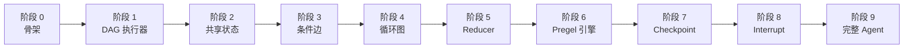

# 从零实现 LangGraph

!!! quote "这个项目要回答的问题"
    LangGraph 到底**怎么做到的**？我们把"写 Agent"从一坨 prompt 拼接，变成"画一张状态机"，再用一个通用引擎去跑这张图——这个引擎内部发生了什么？

---

## 这是什么

**tiny-langgraph** 是一个教学项目。我们从空文件开始，分 **10 个阶段**，手写一个 LangGraph 的核心子集。

不是 API 教程，不是源码注释翻译，而是**造轮子**：每一层只加一个概念，每一层都能跑，每一层都对照真实 LangGraph 源码讲清楚"为什么这么设计"。

## 为什么值得做

LangGraph 的本质是一个**基于图的有状态执行引擎**，受 Google [Pregel](https://research.google/pubs/pregel-a-system-for-large-scale-graph-processing/) 启发。它的"图"不是装饰，而是**执行模型本身**。

理解了它，你就理解了一整类系统的设计：

- **Chain** = 单链图
- **Agent（ReAct）** = 带循环的图
- **Multi-Agent** = 嵌套子图
- **人机协作** = 图上的中断点
- **断点续跑** = 图执行快照

## 渐进式路线



| 阶段 | 做什么 | 新增概念 | git tag |
|:----:|--------|----------|:-------:|
| 0 | 项目骨架 + 文档站点 | MkDocs Material | `stage-0` |
| 1 | 最小 DAG 执行器 | Node=函数, 拓扑排序 | `stage-1` |
| 2 | 共享状态 | StateGraph | `stage-2` |
| 3 | 条件边 | 路由分支 | `stage-3` |
| 4 | 循环图 | ReAct 雏形, 终止条件 | `stage-4` |
| 5 | Reducer | `Annotated` + `add_messages` | `stage-5` |
| 6 | Pregel 超级步 | 通道, 并行层 | `stage-6` |
| 7 | Checkpoint | 内存→SQLite, 时间旅行 | `stage-7` |
| 8 | Interrupt + 流式 | 人机协作 | `stage-8` |
| 9 | 完整 Tool Agent | 接 OpenAI, 对比真 LangGraph | `stage-9` |

!!! tip "怎么看每一层加了什么"
    ```bash
    git diff stage-1..stage-2 -- src/
    ```

## 设计原则

- **纯标准库优先**：阶段 1-8 只用 Python 标准库（`typing` / `collections` / `sqlite3` ...），底层原理不被框架噪音淹没。阶段 9 才接真 LLM API。
- **每个概念只做一件事**：每阶段只引入一个新概念，可独立运行、独立阅读。
- **对照真实源码**：每阶段文档会对照 [LangGraph 真实源码](https://github.com/langchain-ai/langgraph) 的关键行，带链接。
- **可运行 > 可读 > 完备**：所有代码都能 `python -m` 跑起来看效果。

## 下一步

👉 [快速上手](getting_started.md) · [核心原理](principles/index.md) · [阶段 0 文档](stages/stage_0_skeleton.md)