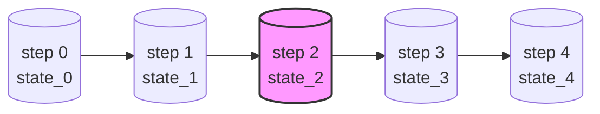

# 检查点与时间旅行

> **在阶段 7、8 亲手实现。**

## 为什么需要检查点

LLM 应用经常需要：

- **断点续跑**：跑到一半挂了，从上次接着跑
- **人机协作**：跑到某个节点暂停，等人类审批，再继续
- **时间旅行**：回到第 3 步的状态，改个输入，重跑
- **调试**：看每一步的状态长什么样

这些都需要一件事：**把每个超级步执行后的状态存下来**。这就是检查点（Checkpoint）。

## 检查点存什么

每个超级步执行完，存一个三元组：

```
(thread_id, step_number, state)
```

- `thread_id`：一次会话的标识（同一个 thread 能续跑）
- `step_number`：第几个超级步
- `state`：该步执行完的完整状态



想"回到第 2 步"？加载 `(thread, 2, state_2)`，从那里接着跑。

## Checkpoint 接口

一个检查点存储只需要实现几个方法：

```python
class BaseCheckpointSaver:
    def put(self, config, checkpoint) -> None: ...      # 存
    def get(self, config) -> Checkpoint | None: ...      # 取最新
    def list(self, config) -> Iterator[Checkpoint]: ...  # 列历史
```

### 两种实现

| 实现 | 用途 | 阶段 |
|------|------|:----:|
| `MemorySaver` | 存内存，开发调试 | 7 |
| `SqliteSaver` | 存 SQLite，持久化 | 7 |

## 人机协作（Interrupt）

有了检查点，**中断**就是顺水推舟：

```python
graph.compile(checkpointer=saver, interrupt_before=["human_review"])
```

引擎执行到 `human_review` 节点**之前**：

1. 存当前检查点
2. **暂停返回**，把控制权交回调用方
3. 调用方拿到人类输入，调 `graph.invoke(None, config)` **续跑**

因为状态在检查点里，续跑时引擎从检查点恢复，跳过已执行的节点，直接到 `human_review`。

## 时间旅行 API

```python
# 列出所有历史状态
for state in graph.get_state_history(config):
    print(state.step, state.values)

# 回到第 2 步重跑
old_config = {"configurable": {"thread_id": "t1", "checkpoint_id": "step-2"}}
graph.invoke(None, old_config)
```

## 在哪个阶段实现

| 概念 | 阶段 |
|------|:----:|
| `MemorySaver` + `SqliteSaver` + 时间旅行 | [阶段 7](../stages/stage_7_checkpoint.md) |
| `interrupt_before/after` + 流式 | [阶段 8](../stages/stage_8_interrupt.md) |

---

👉 上一篇：[Pregel 超级步](pregel.md) · 回到 [原理概览](index.md)