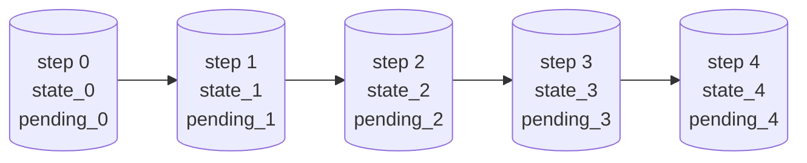

# 检查点与时间旅行

> **图执行的持久化与恢复。在阶段 7、8 亲手实现。**

## 概述

本篇讲 tiny-langgraph 的**检查点（Checkpoint）系统**——图执行的状态怎么存、怎么恢复、
怎么时间旅行、怎么支持人机协作。

检查点是图引擎从"玩具"变成"工具"的关键。没有检查点：

- 挂了从头跑（LLM 调用很贵，重跑烧钱）。
- 不能中断（人机协作不可能）。
- 不能回看（调试只能加 print）。
- 不能续跑（长对话要一次性跑完）。

有了检查点，这些都顺水推舟——因为检查点本质上是"**把执行到哪了存下来**"，存下来就能恢复、
能回看、能改了再跑。

本篇会讲清楚：

1. **检查点的本质**——执行快照，存什么、为什么存。
2. **为什么需要检查点**——容错、续跑、时间旅行、人机协作四大场景。
3. **检查点的内容**——`{thread_id, step, state, pending}` 四元组。
4. **pending 的关键作用**——记住"下一步要执行什么"，续跑的关键。
5. **MemorySaver vs SqliteSaver**——内存 vs 磁盘，开发 vs 生产。
6. **续跑机制**——`input=None + config`，从检查点恢复。
7. **时间旅行**——`get_state_history`，回到任意一步。
8. **人机协作**——`interrupt + update_state + 续跑`，暂停审批续跑。
9. **检查点与超级步的对齐**——为什么对齐到超级步。
10. **状态复制问题**——引用 vs 值，浅拷贝的陷阱。
11. **对照真 LangGraph 的检查点系统**——哪些一致、哪些简化。

读完本篇你会理解：**检查点不是"存个 state"那么简单，它要解决"存什么、何时存、怎么恢复、
怎么和中断配合"四个问题，LangGraph 用"超级步后存 + pending 记住下一步"统一解决。**

!!! info "本篇定位"
    本篇是检查点系统的原理文档。具体实现看阶段 7 和阶段 8 文档。本篇要回答：
    **检查点到底存什么？为什么是这四元组？怎么支持续跑和时间旅行？**

---

## 1. 检查点的本质：执行快照

### 1.1 一句话定义

**检查点 = 图执行到某一点时的完整状态快照。**

"完整状态"包括：

- **业务状态**（state）：消息历史、中间结果、计数器...
- **控制状态**（pending）：下一步要执行哪些节点。
- **元数据**（thread_id, step）：哪个会话、第几步。

### 1.2 为什么叫"快照"

因为它是**某一时刻的静态切面**——执行暂停在那里，所有信息都存下来，能从那里恢复。
就像游戏存档：存档时角色在哪、有什么装备、任务做到哪步，都存；读档时从那里接着玩。

### 1.3 快照 vs 日志

另一种持久化是**日志**——记录每一步的操作，重放日志重建状态。

| 方面 | 快照 | 日志 |
|------|------|------|
| 存什么 | 当前状态 | 每步操作 |
| 恢复速度 | 快（直接加载） | 慢（重放所有操作） |
| 空间 | 固定（状态大小） | 增长（操作累积） |
| 时间旅行 | 跳到任意快照 | 重放到任意点 |
| 适合 | 频繁恢复 | 审计、调试 |

LangGraph 选**快照**——因为 LLM 应用的恢复要快（用户等着），且状态不大（消息列表）。
日志适合审计（如数据库 WAL），但恢复慢。

### 1.4 检查点存在哪

每个超级步后存一个检查点。所以一个 thread 的执行历史是**一串检查点**：



- 最新检查点（step 4）：续跑从这恢复。
- 任意检查点（step 2）：时间旅行到这。
- 全部检查点：完整执行历史。

---

## 2. 为什么需要检查点

### 2.1 场景一：容错

**问题**：Agent 跑了 5 轮工具调用，第 6 轮时服务器挂了。重启后不想从头跑（LLM 调用很贵）。

**检查点的解法**：每超级步后存检查点。挂了重启，从最新检查点续跑。

```python
# 第一次跑（中途挂了）
agent.invoke({"messages": [...]}, config={"configurable": {"thread_id": "t1"}})

# 重启后续跑（从最新检查点）
agent.invoke(None, config={"configurable": {"thread_id": "t1"}})
```

**关键**：`input=None` 表示"不重新开始，从检查点续跑"。引擎从检查点恢复 state 和 pending，
接着 while 循环。

### 2.2 场景二：续跑（长对话）

**问题**：用户和 Agent 聊了 100 轮，消息历史很长。每次新消息都要从头跑？那 100 轮的历史
要重新过一遍？

**检查点的解法**：检查点存了完整历史。新消息时，从检查点恢复历史，加新消息，接着跑。

```python
# 第一轮
agent.invoke({"messages": [user_msg_1]}, config=config)
# 检查点存了 [user_msg_1, assistant_msg_1]

# 第二轮（不用重传第一轮的消息！）
agent.invoke({"messages": [user_msg_2]}, config=config)
# 引擎从检查点恢复 [user_msg_1, assistant_msg_1]，追加 user_msg_2，接着跑
```

**注意**：这里的"续跑"不是 `input=None`，而是传新消息。引擎会从检查点恢复历史，
用 `add_messages` Reducer 追加新消息。

（注：当前实现的 `invoke` 在 `input` 非 None 时是从头跑，不恢复历史。要实现"追加新消息续跑"，
要先用 `update_state` 加消息再 `invoke(None, config)`。真 LangGraph 的 `invoke` 在有
检查点时会自动恢复历史。教学简化。）

### 2.3 场景三：时间旅行

**问题**：Agent 跑完 5 轮，用户说"第 3 轮的决策不对，从那重跑"。

**检查点的解法**：检查点存了每一步。回到第 3 步的检查点，从那接着跑。

```python
# 看历史
for cp in agent.get_state_history(config):
    print(cp["step"], cp["state"]["messages"])
# step 0: [user]
# step 1: [user, assistant(tc)]
# step 2: [user, assistant(tc), tool]
# step 3: [user, assistant(tc), tool, assistant(tc)]
# step 4: [user, assistant(tc), tool, assistant(tc), tool]
# step 5: [user, ..., assistant(最终回复)]

# 回到 step 2 重跑（真 LangGraph 用 checkpoint_id，教学简化）
# 改 state 后续跑
agent.update_state(config, {"messages": [new_msg]})
result = agent.invoke(None, config=config)
```

### 2.4 场景四：人机协作

**问题**：Agent 决定发邮件，但发之前要人类审批。

**检查点的解法**：在工具执行前中断，存检查点，交回控制权。人类审批后续跑。

```python
# 编译时标记中断点
agent = create_react_agent(llm, tools=[send_email],
                           checkpointer=MemorySaver(),
                           interrupt_before_tools=True)

# 第一次执行：到 tools 前暂停
events = list(agent.stream({"messages": [...]}, config=config))
# events[-1]["interrupt"] == "before"

# 人类审批通过，续跑
result = agent.invoke(None, config=config)
```

**检查点让中断成为可能**——中断时存检查点，续跑时从检查点恢复。没有检查点，中断后
没法恢复执行状态。

### 2.5 场景五：调试

**问题**：Agent 输出不对，想知道每一步状态长什么样。

**检查点的解法**：`get_state_history` 列出每步状态。

```python
for cp in agent.get_state_history(config):
    print(f"step {cp['step']}: {cp['state']}")
```

不用加 print、不用调试器——检查点就是天然的执行 trace。

---

## 3. 检查点的内容

### 3.1 四元组

每个检查点是一个 dict：

```python
{
    "thread_id": "t1",       # 会话标识
    "step": 5,               # 超级步编号
    "state": {...},          # 完整业务状态
    "pending": {"agent"},    # 下一步要执行的节点集合
}
```

### 3.2 thread_id：会话标识

**thread_id 区分不同的会话**。同一个 thread_id 的检查点属于同一次会话，能续跑。

```python
config1 = {"configurable": {"thread_id": "user-1-session-1"}}
config2 = {"configurable": {"thread_id": "user-1-session-2"}}
config3 = {"configurable": {"thread_id": "user-2-session-1"}}
```

- 同一用户的不同会话用不同 thread_id。
- 不同用户的会话用不同 thread_id。
- 想续跑某次会话，用那个 thread_id。

**thread_id 是检查点的"主键"**——`get(thread_id)` 取最新，`list(thread_id)` 列历史。

### 3.3 step：超级步编号

**step 是检查点在执行历史中的位置**。

- step 0：第一个超级步后的检查点。
- step 1：第二个超级步后的检查点。
- ...

step 用于：

- **时间旅行**：`get_at(thread_id, step)` 取指定步的检查点。
- **排序**：`list(thread_id)` 按 step 升序。
- **续跑**：从 step N 恢复，从 step N+1 开始执行。

### 3.4 state：完整业务状态

**state 是图执行的业务数据**——消息历史、中间结果、计数器等。

```python
state = {
    "messages": [
        {"role": "user", "content": "算 2+3"},
        {"role": "assistant", "tool_calls": [...]},
        {"role": "tool", "content": "5"},
        {"role": "assistant", "content": "2+3=5"},
    ],
    "tool_call_count": 1,
}
```

state 是**完整状态**（不是更新片段），能独立恢复执行。检查点存全量，不存增量——
恢复时直接加载，不用重放。

### 3.5 pending：下一步要执行什么

**pending 是续跑的关键**——它记住"下一步要执行哪些节点"。

```python
pending = {"agent"}   # 下一步执行 agent 节点
pending = {"tools"}   # 下一步执行 tools 节点
pending = set()       # 没有下一步，执行结束
```

为什么 pending 重要？因为续跑时，引擎要知道"从哪接着跑"。光有 state 不够——state 是
"执行到哪了的数据"，pending 是"执行到哪了的控制流"。两者一起才能恢复执行。

**例子**：Agent 在 tools 前中断。

```python
# 中断时的检查点
{
    "thread_id": "t1",
    "step": 0,
    "state": {"messages": [user_msg, assistant_msg_with_tool_calls]},
    "pending": {"tools"},    # 下一步要执行 tools（但被中断了）
}
```

续跑时，引擎恢复 state 和 pending={"tools"}，从执行 tools 开始。**pending 告诉引擎
"接着执行 tools"**，不用重新调 agent。

---

## 4. pending 的关键作用

### 4.1 pending 是什么

**pending = 下一个超级步要执行的节点集合。**

```python
pending: set[str]  # 如 {"agent"} 或 {"tool_a", "tool_b"} 或 set()
```

### 4.2 pending 在执行循环中的角色

```python
def stream(self, input, ...):
    if input is None:  # 续跑
        cp = checkpointer.get(thread_id)
        state = dict(cp["state"])
        pending = set(cp["pending"])     # 从检查点恢复 pending
        step = cp["step"] + 1
    else:            # 新执行
        state = dict(input)
        pending = {self._entry_point}    # 从入口开始
        step = 0

    while pending:                        # pending 驱动循环
        # 执行 pending 里的节点
        ...
        # 算下一轮 pending
        pending = self._next_nodes(pending, state)
        step += 1
```

**pending 驱动 while 循环**——有 pending 就执行，没有就结束。

### 4.3 续跑时恢复 pending

```python
# 中断时的检查点: pending = {"tools"}
# 续跑:
cp = checkpointer.get(thread_id)
pending = set(cp["pending"])  # {"tools"}
# while pending: 执行 tools
```

**如果不存 pending**，续跑时引擎不知道"该执行 tools"——可能重新从 agent 开始，
那 agent 又调一次 LLM（浪费）、又得到同样的 tool_calls（假设 LLM 确定性），才到 tools。
存 pending 让续跑**直接跳到 tools**，不重复 agent。

### 4.4 pending 在中断时的值

中断时 pending 是**即将执行但被中断的节点**：

```python
# interrupt_before=["tools"]
# 执行到 tools 前中断
if pending & interrupt_before:  # pending 里有 tools
    checkpointer.put(thread_id, step, state, pending)  # 存 pending={"tools"}
    yield {"interrupt": "before", ...}
    return
```

续跑时恢复 pending={"tools"}，直接执行 tools。**中断"冻结"了即将执行的操作**，
续跑"解冻"继续执行。

### 4.5 pending 在正常结束时的值

```python
# 条件边返回 END
pending = next_nodes(pending, state)  # END 被过滤，pending = set()
# while pending: 不进入，结束
```

正常结束时 pending 是空集。如果存了空 pending 的检查点，续跑时 `while pending` 不进入，
直接结束——正确行为。

---

## 5. MemorySaver vs SqliteSaver

### 5.1 BaseCheckpointSaver 接口

```python
class BaseCheckpointSaver:
    def put(self, thread_id, step, state, pending) -> None: ...
    def get(self, thread_id) -> dict | None: ...          # 取最新
    def get_at(self, thread_id, step) -> dict | None: ...  # 取指定步
    def list(self, thread_id) -> Iterator[dict]: ...       # 列历史
```

任何检查点存储实现这四个方法就行。

### 5.2 MemorySaver：内存存储

```python
class MemorySaver(BaseCheckpointSaver):
    def __init__(self):
        self._storage: dict[str, list[dict]] = {}    # {thread_id: [checkpoint...]}

    def put(self, thread_id, step, state, pending):
        history = self._storage.setdefault(thread_id, [])
        history.append(_make_checkpoint(thread_id, step, state, pending))

    def get(self, thread_id):
        history = self._storage.get(thread_id, [])
        return history[-1] if history else None     # 最后一个就是最新

    def list(self, thread_id):
        yield from self._storage.get(thread_id, [])
```

**特点**：

- 存在进程内存，进程结束即丢失。
- 直接存 dict 引用，无序列化开销。
- 实现简单，10 行代码。

**适用**：

- 开发调试（重启就清空，无所谓）。
- 单元测试（测试隔离，不污染磁盘）。
- 短期会话（会话结束就丢弃）。

### 5.3 SqliteSaver：磁盘存储

```python
class SqliteSaver(BaseCheckpointSaver):
    def __init__(self, path):
        self._conn = sqlite3.connect(path)
        self._conn.execute("""
            CREATE TABLE IF NOT EXISTS checkpoints (
                thread_id TEXT NOT NULL,
                step      INTEGER NOT NULL,
                state     TEXT NOT NULL,      -- JSON
                pending   TEXT NOT NULL,      -- JSON
                PRIMARY KEY (thread_id, step)
            )
        """)

    def put(self, thread_id, step, state, pending):
        self._conn.execute(
            "INSERT OR REPLACE INTO checkpoints VALUES (?, ?, ?, ?)",
            (thread_id, step,
             json.dumps(state, ensure_ascii=False),
             json.dumps(sorted(pending), ensure_ascii=False)),
        )
        self._conn.commit()

    def get(self, thread_id):
        row = self._conn.execute(
            "SELECT * FROM checkpoints WHERE thread_id=? ORDER BY step DESC LIMIT 1",
            (thread_id,),
        ).fetchone()
        return self._row_to_checkpoint(row) if row else None
```

**特点**：

- 存在 SQLite 数据库文件，进程结束仍保留。
- state 和 pending JSON 序列化后存。
- 支持跨进程续跑（不同进程连同一个数据库）。

**适用**：

- 生产环境（持久化）。
- 长期会话（跨重启续跑）。
- 多进程（不同进程通过数据库共享状态）。

### 5.4 对照

| 方面 | MemorySaver | SqliteSaver |
|------|-------------|-------------|
| 存储 | 进程内存 | SQLite 文件 |
| 持久化 | ❌ 进程结束丢失 | ✅ 持久 |
| 序列化 | 不需要 | JSON |
| 速度 | 快（直接引用） | 稍慢（序列化 + DB） |
| 跨进程 | ❌ | ✅ |
| 实现 | 10 行 | 30 行 |
| 适用 | 开发/测试 | 生产 |

### 5.5 怎么选

- **开发调试**：MemorySaver。简单、快、重启清空（不污染）。
- **单元测试**：MemorySaver。测试隔离。
- **生产单机**：SqliteSaver。持久化。
- **生产分布式**：要 Redis/Postgres 后端（真 LangGraph 有，教学没实现）。

### 5.6 扩展：其他后端

实现 `BaseCheckpointSaver` 接口就能加后端：

```python
class RedisSaver(BaseCheckpointSaver):
    def __init__(self, redis_client):
        self._redis = redis_client

    def put(self, thread_id, step, state, pending):
        key = f"cp:{thread_id}:{step}"
        self._redis.set(key, json.dumps({"state": state, "pending": list(pending)}))
    # ...
```

接口已抽象，加后端只是实现四个方法。

---

## 6. 续跑机制：input=None + config

### 6.1 续跑的信号

```python
agent.invoke(None, config=config)  # input=None 表示续跑
```

`input=None` 告诉引擎"不重新开始，从检查点恢复"。

### 6.2 续跑的实现

```python
def stream(self, input, *, config=None):
    thread_id = self._get_thread_id(config)

    if input is None and self._checkpointer and thread_id:
        # 续跑：从检查点恢复
        cp = self._checkpointer.get(thread_id)
        if cp is None:
            raise ValueError(f"thread '{thread_id}' 没有检查点，无法续跑")
        state = dict(cp["state"])           # 恢复状态
        pending = set(cp["pending"])        # 恢复 pending
        step = cp["step"] + 1               # 从下一步开始
        resuming = True
    else:
        # 新执行
        state = dict(input) if input else {}
        pending = {self._entry_point}
        step = 0
        resuming = False

    while pending:
        # ... 执行超级步 ...
```

续跑时：

1. 用 `thread_id` 从检查点存储取最新检查点。
2. 恢复 `state`（拷贝，避免改检查点原值）。
3. 恢复 `pending`（拷贝成 set）。
4. `step` 从 `cp["step"] + 1` 开始（下一步）。
5. `resuming = True` 标记，用于跳过中断检查（续跑时第一个超级步不检查中断）。

### 6.3 续跑的例子

```python
# 第一次执行（3 轮工具调用）
agent.invoke({"messages": [user_msg]}, config=config)
# 检查点: step 0 (agent), step 1 (tools), step 2 (agent), step 3 (tools), step 4 (agent)

# 假设 step 2 后挂了（检查点存到 step 2）

# 续跑
agent.invoke(None, config=config)
# 恢复: state = cp["state"], pending = cp["pending"] = {"agent"}, step = 3
# 执行: step 3 (agent), step 4 (tools), step 5 (agent)
# 从 step 3 接着跑，不重复 step 0-2
```

### 6.4 续跑的前提

- **有检查点**：`checkpointer` 不为 None，且 `thread_id` 有检查点。否则报错。
- **检查点是"干净的"**：因为对齐到超级步，检查点的 state 是完整全局状态，能直接恢复。
- **节点是纯函数**：同样的 state + pending，续跑结果和没挂一样（确定性）。

### 6.5 续跑 vs 重新开始

```python
# 重新开始（新会话）
agent.invoke({"messages": [new_user_msg]}, config=config)

# 续跑（从检查点恢复）
agent.invoke(None, config=config)
```

- 重新开始：`input` 非 None，从头跑，覆盖检查点。
- 续跑：`input=None`，从检查点恢复，接着跑。

**注意**：重新开始会覆盖同 thread_id 的检查点。如果想保留旧会话，用新 thread_id。

---

## 7. 时间旅行：get_state_history

### 7.1 列出所有检查点

```python
def get_state_history(self, config):
    thread_id = self._get_thread_id(config)
    if not self._checkpointer or not thread_id:
        return []
    return list(self._checkpointer.list(thread_id))
```

返回该 thread 的所有检查点，按 step 升序。

### 7.2 用法

```python
history = agent.get_state_history(config)
for cp in history:
    print(f"step {cp['step']}:")
    print(f"  state: {cp['state']}")
    print(f"  pending: {cp['pending']}")
```

输出：

```
step 0:
  state: {'messages': [user, assistant(tc)]}
  pending: {'tools'}
step 1:
  state: {'messages': [user, assistant(tc), tool]}
  pending: {'agent'}
step 2:
  state: {'messages': [user, assistant(tc), tool, assistant(最终回复)]}
  pending: set()
```

### 7.3 时间旅行的用途

**调试**：看每步状态，找出哪步开始不对。

```python
for cp in agent.get_state_history(config):
    last_msg = cp["state"]["messages"][-1]
    print(f"step {cp['step']}: {last_msg['role']} - {last_msg.get('content', '')[:50]}")
```

**回滚**：回到某步，改状态，重跑。

```python
history = agent.get_state_history(config)
# 回到 step 1
cp_step1 = history[1]
# 改状态（真 LangGraph 用 checkpoint_id，教学要手动）
agent.update_state(config, {"messages": [corrected_msg]})
result = agent.invoke(None, config=config)
```

**分析**：统计工具调用次数、消息长度等。

```python
for cp in agent.get_state_history(config):
    msgs = cp["state"]["messages"]
    tool_msgs = [m for m in msgs if m["role"] == "tool"]
    print(f"step {cp['step']}: {len(tool_msgs)} tool calls")
```

### 7.4 时间旅行的限制

当前实现的时间旅行是**只读**的——能看历史，但不能"回到 step N 从那重跑"（要手动
`update_state` + 续跑）。真 LangGraph 用 `checkpoint_id` 参数支持直接回到任意检查点：

```python
# 真 LangGraph
config = {"configurable": {"thread_id": "t1", "checkpoint_id": "step-2"}}
agent.invoke(None, config=config)  # 从 step 2 的检查点续跑
```

教学简化——`get_state_history` 能看，`update_state` + 续跑能改后重跑，但不像真 LangGraph
那样一行回到任意点。

---

## 8. 人机协作：interrupt + update_state + 续跑

### 8.1 完整流程

人机协作三步：

1. **中断**：执行到中断点暂停，存检查点，交回控制权。
2. **人类决策**：人类看状态，决定批准/拒绝/改状态。
3. **续跑**：`invoke(None, config)` 从检查点恢复，继续执行。

### 8.2 中断的实现

```python
def stream(self, input, *, config=None):
    # ... 恢复 state, pending, step ...

    while pending:
        # interrupt_before 检查
        if not resuming and self._interrupt_before and (pending & self._interrupt_before):
            # 暂停！存检查点，返回
            if self._checkpointer and thread_id:
                self._checkpointer.put(thread_id, step, dict(state), pending)
            yield {"nodes": pending, "state": dict(state), "step": step, "interrupt": "before"}
            return    # 退出 stream，控制权交回调用方
        resuming = False

        # ... 执行超级步 ...
```

中断时：

1. 检查 `pending & interrupt_before`——如果 pending 里有中断节点，暂停。
2. 存检查点（state + pending）。
3. yield 一个带 `"interrupt": "before"` 的事件。
4. `return`——退出 stream，控制权交回调用方。

**关键**：存检查点时 pending 是**即将执行的中断节点**。续跑时恢复 pending，直接执行那个节点。

### 8.3 人类决策

中断后，调用方拿到事件，能看状态：

```python
events = list(agent.stream({"messages": [...]}, config=config))
last_event = events[-1]
print(last_event["interrupt"])  # "before"
print(last_event["state"]["messages"][-1])  # LLM 的 tool_calls 请求
```

人类看了 LLM 的提议（如"想发邮件给老板"），决定：

- **批准**：什么都不做，直接续跑。
- **拒绝**：用 `update_state` 改状态（如加"用户拒绝"消息），续跑。
- **修改**：用 `update_state` 改 LLM 的提议，续跑。

### 8.4 update_state 的实现

```python
def update_state(self, config, values):
    thread_id = self._get_thread_id(config)
    cp = self._checkpointer.get(thread_id)
    if cp is None:
        raise ValueError(f"thread '{thread_id}' 没有检查点")
    new_state = dict(cp["state"])
    self._merge(new_state, values)    # 用 Reducer 合并
    self._checkpointer.put(thread_id, cp["step"], new_state, cp["pending"])
```

- 取最新检查点。
- 把 `values` 用 Reducer 合并进 state。
- 存回检查点（同 step，覆盖）。

**用 Reducer 合并**——人类加一条消息，`add_messages` 追加；人类改 user_id，覆盖。
和节点返回更新片段的合并语义一致。

### 8.5 续跑

```python
result = agent.invoke(None, config=config)
```

`input=None` 触发续跑。引擎从检查点恢复（可能是 `update_state` 改过的），接着执行。

### 8.6 完整例子

```python
# 编译带中断的图
agent = create_react_agent(llm, tools=[send_email],
                           checkpointer=MemorySaver(),
                           interrupt_before_tools=True)
config = {"configurable": {"thread_id": "hitl"}}

# 1. 中断
events = list(agent.stream(
    {"messages": [{"role": "user", "content": "帮我发邮件给老板"}]},
    config=config,
))
assert events[-1]["interrupt"] == "before"

# 看LLM想干什么
last_msg = events[-1]["state"]["messages"][-1]
print(last_msg["tool_calls"][0]["function"])
# {'name': 'send_email', 'arguments': '{"to": "boss@...", "subject": "..."}'}

# 2. 人类审批（这里假设批准，什么都不做）

# 3. 续跑
result = agent.invoke(None, config=config)
print(result["messages"][-1]["content"])
# "邮件已发送"
```

---

## 9. 检查点与超级步的对齐

### 9.1 对齐点

检查点在**每个超级步执行完、状态合并后、算下一轮 pending 之前**存：

```python
while pending:
    # 执行超级步
    step_state = dict(state)
    updates = [nodes[n](step_state) for n in pending]
    for u in updates:
        self._merge(state, u)

    # 检查点（这里存！）
    if self._checkpointer and thread_id:
        self._checkpointer.put(thread_id, step, dict(state), pending)
    yield {...}

    # 算下一轮
    pending = self._next_nodes(pending, state)
    step += 1
```

### 9.2 为什么对齐到超级步后

**超级步后状态是"干净的"**——所有同层节点已合并，state 是一致的全局状态。

对比其他对齐点：

| 对齐点 | state 状态 | 适合续跑？ |
|--------|-----------|-----------|
| 超级步前 | 上一轮的 state | ✅ 但 pending 是上一轮的 |
| **超级步后** | **本轮合并后的 state** | **✅ 最自然** |
| 节点执行中途 | 半合并 state | ❌ 要处理半成品 |
| 节点执行前 | 上一轮 state | ✅ 但要存"下一个节点" |

超级步后最自然——state 干净、pending 是"刚执行完的节点"（算 next_nodes 之前）。

### 9.3 对齐的代价

每超级步存一次检查点。对 Agent（每超级步一个节点），等于每节点存一次。如果节点执行
很长（如调 LLM 几秒），存检查点（毫秒级）开销可忽略。如果节点很多很快，检查点开销
可能显著。

**优化**：可配置"每 N 步存一次"。教学用每步存，便于调试和续跑。

### 9.4 对齐让续跑简单

因为对齐到超级步，续跑时：

- state 是干净的（直接用）。
- pending 是"下一步要执行什么"（直接接着跑）。

**不用处理半成品状态**——这是对齐的核心价值。如果检查点存在节点执行中途，续跑时要
判断"这个节点执行到哪了、要不要重执行"——复杂。对齐到超级步避免这些。

---

## 10. 状态复制问题：引用 vs 值

### 10.1 浅拷贝的陷阱

```python
state = {"messages": [1, 2, 3]}
snapshot = dict(state)             # 浅拷贝
snapshot["messages"].append(4)     # 改 snapshot 的 list
print(state["messages"])           # [1, 2, 3, 4]！原 state 也变了
```

`dict(state)` 浅拷贝——新 dict 的值还是指向原 list。改 list 会改原 state。

### 10.2 代码里的拷贝

```python
# 恢复时
state = dict(cp["state"])          # 浅拷贝

# 快照时
step_state = dict(state)           # 浅拷贝

# 存检查点时
self._checkpointer.put(thread_id, step, dict(state), pending)  # 浅拷贝

# yield 时
yield {"state": dict(state), ...}  # 浅拷贝
```

到处都是浅拷贝。为什么不会出问题？

### 10.3 为什么浅拷贝够用

**约定：节点不原地改 state 的值，而是返回新值让引擎合并。**

```python
# 错误（原地改）
def bad_node(state):
    state["messages"].append("new")
    return {}

# 正确（返回新值）
def good_node(state):
    return {"messages": ["new"]}
```

引擎合并时 `state[key] = reducer(old, new)`——`reducer` 返回**新对象**（如 `add_messages`
的 `list(old)`），不原地改。所以：

- 节点读 state 的值（如 `state["messages"]`），但不改。
- 引擎合并时用 Reducer 创建新对象，赋值给 state。
- 浅拷贝的 dict 共享值（如 list），但没人原地改 list，所以共享安全。

### 10.4 什么时候浅拷贝不够

如果节点**原地改** state 的值：

```python
def bad_node(state):
    state["messages"].append("new")  # 原地改 list
    return {}
```

这时浅拷贝的快照会看到改后的值（因为共享 list）——破坏快照隔离。

**解法**：

1. **约定不原地改**（当前做法）。
2. **深拷贝**：`copy.deepcopy(state)`。安全但开销大。
3. **不可变数据结构**：如 pyrsistent 的 PVector。天然无原地改。

教学用约定 1——简单，且节点返回更新片段本来就不该原地改。

### 10.5 检查点存储的拷贝

**MemorySaver**：直接存 dict 引用。

```python
def put(self, thread_id, step, state, pending):
    history.append({"state": state, ...})  # 存引用
```

如果调用方之后改了 state，检查点里的 state 也变（因为引用）。但引擎存检查点时传的是
`dict(state)`（浅拷贝），所以 dict 本身是新的。dict 的值（如 list）还是共享——
但同样，没人原地改，安全。

**SqliteSaver**：JSON 序列化，完全独立。

```python
def put(self, thread_id, step, state, pending):
    json.dumps(state)  # 序列化，和原 state 完全独立
```

JSON 序列化是深拷贝（所有数据转成字符串）。SqliteSaver 的检查点和原 state 完全无关。

---

## 11. 对照真 LangGraph 的检查点系统

### 11.1 相同点

| 概念 | 真 LangGraph | tiny-langgraph |
|------|--------------|----------------|
| 检查点 = 快照 | ✅ | ✅ |
| {thread_id, step, state, pending} | ✅ | ✅ |
| 超级步后对齐 | ✅ | ✅ |
| `input=None` 续跑 | ✅ | ✅ |
| `get_state_history` 时间旅行 | ✅ | ✅ |
| `interrupt_before/after` | ✅ | ✅ |
| `update_state` | ✅ | ✅ |
| MemorySaver + SqliteSaver | ✅ | ✅ |

### 11.2 不同点

| 方面 | 真 LangGraph | tiny-langgraph |
|------|--------------|----------------|
| 后端 | Memory, SQLite, Redis, Postgres, Firestore... | Memory, SQLite |
| checkpoint_id | 支持（回到任意检查点） | 不支持（只能最新） |
| 通道版本 | 每通道有版本号 | 无 |
| 异步 | async 接口 | 同步 |
| 检查点内容 | 更丰富（metadata, config...） | 基础四元组 |
| `update_state` 选项 | 丰富（as_node, goto...） | 基础 |

### 11.3 真 LangGraph 的 checkpoint_id

真 LangGraph 每个检查点有唯一 `checkpoint_id`，能直接回到任意检查点：

```python
# 真 LangGraph
config = {"configurable": {"thread_id": "t1", "checkpoint_id": "cp-abc123"}}
agent.invoke(None, config=config)  # 从 cp-abc123 续跑
```

我们的实现只能从最新检查点续跑。要回到历史检查点，要手动 `update_state` 改状态再续跑。
功能上能实现时间旅行，但 API 没真 LangGraph 方便。

### 11.4 真 LangGraph 的通道版本

真 LangGraph 每个通道（字段）有版本号，支持"回到某个通道的某个版本"。这让时间旅行
更细粒度——能回到"messages 字段在第 3 步的值"，不管其他字段。

我们的实现存整个 state，没有通道级版本。时间旅行粒度是超级步，不是通道。

### 11.5 真 LangGraph 的更多后端

真 LangGraph 支持 Redis、Postgres、Firestore 等。接口一样（`BaseCheckpointSaver`），
实现不同。我们的接口已抽象，加后端只是实现四个方法。

---

## 12. 实际代码示例

### 12.1 基础检查点

```python
from tiny_langgraph import MemorySaver
from tiny_langgraph.graph import StateGraph, START, END
from typing import TypedDict

class State(TypedDict):
    count: int

def inc(state):
    return {"count": state["count"] + 1}

graph = StateGraph(State)
graph.add_node("inc", inc)
graph.add_edge(START, "inc")
graph.add_edge("inc", END)
app = graph.compile(checkpointer=MemorySaver())

config = {"configurable": {"thread_id": "t1"}}
result = app.invoke({"count": 0}, config=config)
print(result)  # {'count': 1}

# 看检查点
history = app.get_state_history(config)
for cp in history:
    print(f"step {cp['step']}: state={cp['state']}, pending={cp['pending']}")
# step 0: state={'count': 1}, pending={'inc'}
```

### 12.2 续跑

```python
# 假设有个长执行的图
# 第一次跑（中途挂了）
try:
    app.invoke({"count": 0}, config=config)
except SomeError:
    pass

# 续跑
result = app.invoke(None, config=config)
```

### 12.3 时间旅行

```python
history = app.get_state_history(config)
print(f"共 {len(history)} 个检查点")
for cp in history:
    print(f"step {cp['step']}: count={cp['state']['count']}")
```

### 12.4 人机协作

```python
from tiny_langgraph import MemorySaver, Tool, create_react_agent

# FakeLLM 省略
agent = create_react_agent(llm, tools=[send_email],
                           checkpointer=MemorySaver(),
                           interrupt_before_tools=True)
config = {"configurable": {"thread_id": "hitl"}}

# 1. 中断
events = list(agent.stream(
    {"messages": [{"role": "user", "content": "发邮件"}]},
    config=config,
))
assert events[-1]["interrupt"] == "before"

# 2. 看LLM想干什么
last_msg = events[-1]["state"]["messages"][-1]
print(last_msg["tool_calls"][0]["function"]["name"])  # send_email

# 3. 人类拒绝，加消息
agent.update_state(config, {
    "messages": [{"role": "user", "content": "不要发这封邮件"}]
})

# 4. 续跑（agent 看到新消息，重新决策）
result = agent.invoke(None, config=config)
```

### 12.5 SqliteSaver 持久化

```python
from tiny_langgraph import SqliteSaver

saver = SqliteSaver("checkpoints.db")
app = graph.compile(checkpointer=saver)
config = {"configurable": {"thread_id": "persistent"}}

# 第一次执行（存到磁盘）
app.invoke({"count": 0}, config=config)

# 进程重启，新 saver 连同一个数据库
saver2 = SqliteSaver("checkpoints.db")
app2 = graph.compile(checkpointer=saver2)

# 续跑（从磁盘恢复）
result = app2.invoke(None, config=config)
```

### 12.6 检查点的内容

```python
saver = MemorySaver()
app = graph.compile(checkpointer=saver)
config = {"configurable": {"thread_id": "t1"}}
app.invoke({"count": 0}, config=config)

cp = saver.get("t1")
print(cp)
# {
#     "thread_id": "t1",
#     "step": 0,
#     "state": {"count": 1},
#     "pending": {"inc"},    # 注意：存的是执行前的 pending，因为存检查点在算 next 之前
# }
```

（注：具体 pending 的值取决于存检查点的时机。当前实现在 `yield` 前存，pending 是
"刚执行的节点"。续跑时 `next_nodes(pending, state)` 算下一轮。）

---

## 14. 检查点的历史脉络

### 14.1 从游戏存档到检查点

检查点的概念不新——游戏存档就是检查点：

| 游戏 | 图执行 |
|------|--------|
| 存档 | 检查点 |
| 读档 | 续跑 |
| 多存档槽 | 多 thread_id |
| 自动存档 | 每超级步存 |
| 回放 | 时间旅行 |

游戏存档存"角色在哪、有什么装备、任务做到哪步"。图检查点存"state 是什么、pending 是什么、
step 几"。**结构完全一样**——都是"执行到哪了的完整快照"。

### 14.2 数据库的 WAL vs 检查点

数据库有两种持久化：

- **WAL（Write-Ahead Log）**：预写日志，记录每步操作。恢复时重放。
- **Checkpoint（检查点）**：周期性存全量状态。恢复时加载最近检查点 + 重放后续 WAL。

数据库用**两者结合**——检查点加速恢复，WAL 保证不丢。图执行只用检查点（不用 WAL），
因为：

- 图执行的"操作"是节点函数，可能有副作用（调 LLM），不能重放。
- 检查点已存全量状态，不用重放。

### 14.3 分布式系统的快照

分布式系统的 **Chandy-Lamport 算法**（1985）拍分布式快照：

1. 每个进程记录自己的状态。
2. 进程间发 marker 消息，记录通道中的消息。
3. 合并所有进程状态 + 通道消息 = 全局快照。

图执行的检查点更简单——因为单机，不用分布式快照。但概念一样：**存"所有进程的状态 +
通道中的消息"**。图执行的"进程"是节点，"通道"是字段，"消息"是 pending。

### 14.4 容错系统的 checkpoint-restore

容错系统的经典模式是 **checkpoint-restore**：

1. 周期性存检查点。
2. 失败后从检查点恢复。
3. 继续执行。

图执行就是这个模式——每超级步存检查点，挂了从检查点续跑。和 Hadoop 的 speculative
execution、Spark 的 RDD lineage、Flink 的 checkpointing 是同一类技术。

---

## 15. 检查点的存储格式

### 15.1 MemorySaver 的格式

```python
{
    "thread_1": [
        {"thread_id": "thread_1", "step": 0, "state": {...}, "pending": {...}},
        {"thread_id": "thread_1", "step": 1, "state": {...}, "pending": {...}},
    ],
    "thread_2": [
        {"thread_id": "thread_2", "step": 0, "state": {...}, "pending": {...}},
    ],
}
```

嵌套 dict：`{thread_id: [checkpoint, ...]}`。直接存 Python 对象，无序列化。

### 15.2 SqliteSaver 的格式

```sql
CREATE TABLE checkpoints (
    thread_id TEXT NOT NULL,
    step      INTEGER NOT NULL,
    state     TEXT NOT NULL,      -- JSON 字符串
    pending   TEXT NOT NULL,      -- JSON 数组字符串
    PRIMARY KEY (thread_id, step)
);
```

关系表：每行一个检查点。state 和 pending 存 JSON 字符串。主键 `(thread_id, step)`
保证唯一 + 支持按 thread 查询。

### 15.3 为什么 state 存 JSON

- **通用**：任何能 JSON 序列化的 state 都能存。
- **可读**：直接看数据库能看到 state 内容（调试友好）。
- **跨语言**：JSON 是通用格式，其他语言也能读。
- **安全**：JSON 反序列化不执行代码（不像 pickle）。

**限制**：state 必须是 JSON 兼容的——dict/list/str/int/float/bool/None。不能有
自定义对象、函数、循环引用。

### 15.4 pending 为什么 sorted 再 dumps

```python
json.dumps(sorted(pending), ensure_ascii=False)
```

`pending` 是 set，set 的 JSON 序列化顺序不定。`sorted` 保证顺序固定——同样的 pending
存出同样的 JSON 字符串。对调试和比较重要。

### 15.5 检查点的压缩

长对话的检查点可能很大（消息历史长）。优化：

- **gzip**：JSON 字符串 gzip 压缩，能省 5-10 倍。
- **增量**：只存和上一检查点的 diff。
- **截断**：只存最近 N 条消息。

教学用无压缩全量存——简单，且 SQLite 对小数据够快。

---

## 16. 检查点的并发与生命周期

### 16.1 多线程访问

如果多线程同时 invoke 同一个 checkpointer：

- **不同 thread_id**：安全——不同 thread 的检查点独立。
- **同 thread_id**：危险——两个线程同时写同一 thread 的检查点，可能冲突。

### 16.2 MemorySaver 的并发

`MemorySaver` 用 Python dict，不是线程安全。多线程同 thread_id 写会冲突。
**解法**：同 thread_id 串行（用锁）；不同 thread_id 并行（dict 操作有 GIL 保护）。

### 16.3 SqliteSaver 的并发

SQLite 默认串行写（`PRAGMA journal_mode=WAL` 能并发读 + 串行写）。多线程同 thread_id
写，SQLite 会串行化——安全但慢。

**生产建议**：同 thread_id 串行（业务上一次会话一个人，不会并发）；不同 thread_id
并行（不同用户）。

### 16.4 检查点的累积与清理

不清理的话，检查点会累积：100 轮对话 = 100 个检查点 = 100 份完整消息历史。
空间开销 O(N × |state|)。

当前实现**不自动清理**——所有检查点保留，支持时间旅行。生产要清理：

- **保留最新 N 个**：`DELETE FROM checkpoints WHERE step < (max_step - N)`。
- **保留关键步**：只存中断点、错误点、每 K 步。
- **TTL**：超过时间的检查点删除。

### 16.5 检查点的迁移（schema evolution）

如果 state 结构变了（加字段），旧检查点的 state 没新字段。续跑时节点读新字段会 KeyError。
**解法**：在恢复后补默认值 `state.setdefault("new_field", default)`，或用
`state.get("new_field", default)`。这是状态迁移问题，和数据库的 schema migration 类似。

---

## 17. 常见问题

??? question "检查点存太多会不会占空间？"
    会。每超级步存一个完整 state。对长对话（100 轮），100 个检查点，每个存完整消息历史。
    优化：增量存（只存 diff）、定期清理旧检查点、配置"每 N 步存一次"。教学用全量每步存。

??? question "续跑时 LLM 不确定怎么办（同样输入不同输出）？"
    续跑时，state 恢复了，但下一步调 LLM 可能返回不同结果（LLM 有随机性）。这是正常的——
    续跑不保证"和没挂一样"，只保证"从恢复点接着跑"。如果要确定性，设 `temperature=0` 或
    固定 `seed`。

??? question "能同时跑多个 thread 吗？"
    能。不同 thread_id 的检查点独立存储。`MemorySaver` 用 dict 隔离，`SqliteSaver` 用
    `WHERE thread_id=?` 隔离。多线程/协程同时 invoke 不同 thread_id 安全（只要 checkpointer
    线程安全）。

??? question "update_state 能改 pending 吗？"
    当前实现不能——`update_state` 只改 state。真 LangGraph 的 `update_state` 有 `as_node`
    参数能影响 pending。如果要"不执行 tools 了，跳到 agent"，当前实现做不到，要改引擎。

??? question "检查点和日志（如 LangSmith）什么区别？"
    检查点是**状态快照**，用于续跑/时间旅行。日志是**执行记录**，用于审计/分析。
    检查点存"执行到哪了"，日志存"执行了什么"。两者互补——检查点支持恢复，日志支持调试。

??? question "为什么不用 pickle 序列化 state？"
    pickle 能序列化任意 Python 对象，但有安全风险（反序列化能执行代码）和兼容性问题
    （Python 版本、类定义变化）。JSON 安全且通用。要求 state 是 JSON 兼容的（dict/list/
    str/int/float/bool/None），这也是好习惯——状态应该是数据，不是对象。

---

## 14. 在哪个阶段实现

| 概念 | 阶段 |
|------|:----:|
| BaseCheckpointSaver + MemorySaver + SqliteSaver | [阶段 7](../stages/stage_7_checkpoint.md) |
| 续跑 (input=None) | [阶段 7](../stages/stage_7_checkpoint.md) |
| get_state_history (时间旅行) | [阶段 7](../stages/stage_7_checkpoint.md) |
| interrupt_before/after | [阶段 8](../stages/stage_8_interrupt.md) |
| update_state | [阶段 8](../stages/stage_8_interrupt.md) |
| Agent 的人机协作 | [阶段 9](../stages/stage_9_agent.md) |

---

## 15. 小结

检查点是图引擎的"存档系统"。核心：

1. **本质是执行快照**——存 `{thread_id, step, state, pending}` 四元组。
2. **四大场景**——容错、续跑、时间旅行、人机协作，都靠检查点。
3. **pending 是关键**——记住"下一步执行什么"，续跑直接跳到那。
4. **对齐到超级步**——超级步后 state 干净，恢复简单。
5. **MemorySaver vs SqliteSaver**——内存（开发）vs 磁盘（生产）。
6. **续跑用 input=None**——从检查点恢复 state 和 pending。
7. **时间旅行用 get_state_history**——列出所有检查点，回到任意步。
8. **人机协作三步**——interrupt 暂停、update_state 改状态、invoke(None) 续跑。
9. **浅拷贝 + 约定不原地改**——避免深拷贝开销，靠约定保证安全。

**核心洞察**：检查点不是"存个 state"，是"**存执行到哪了（state + pending），对齐到
超级步（干净恢复点），支持续跑/回看/中断**"。LangGraph 用"超级步后存 + pending 记住
下一步"统一解决容错、续跑、时间旅行、人机协作四个问题。

---

## 相关链接

- 上一篇：[Pregel 超级步](pregel.md)
- 回到：[原理概览](index.md)
- 阶段 7：[检查点](../stages/stage_7_checkpoint.md)
- 阶段 8：[人机协作](../stages/stage_8_interrupt.md)
- 阶段 9：[Agent 的人机协作](../stages/stage_9_agent.md)
- 源码：[`src/tiny_langgraph/checkpoint.py`](https://github.com/your-repo/blob/main/src/tiny_langgraph/checkpoint.py)
- 源码：[`src/tiny_langgraph/graph.py`](https://github.com/your-repo/blob/main/src/tiny_langgraph/graph.py)
