# 图即程序

> **核心理念：把程序画成图。在阶段 1-4 亲手实现。**

## 概述

本篇是 tiny-langgraph 项目最重要的理念文档。我们要论证一个看似奇怪、实则深刻的观点：

**程序就是图，图就是程序。**

传统编程把逻辑写成"一条线"——函数 A 调函数 B 调函数 C，控制流是一条隐式的链。
LangGraph 的核心洞察是：**把这条链显式地画成一张有向图**，节点是函数，边是跳转。
一旦逻辑变成图，你就获得了路由、循环、可视化、并行、检查点、人机协作等所有"图上才能做的事"。

这不是为了花哨，而是因为 **LLM 应用的控制流天然是图状的**——Agent 要循环（思考→行动→观察）、
要分支（有工具调用？→ 调工具 : → 回复）、要并行（同时调多个工具）、要中断（等人类审批）。
这些用传统代码写，会写成嵌套 if/while 的意大利面；用图写，清爽且可分析。

读完本篇你会理解：

1. 为什么用图而不是代码——图带来的四大能力。
2. 各种 LLM 应用模式如何映射到图——Chain、Agent、Multi-Agent、人机协作、断点续跑。
3. 图的基本元素——节点、边、条件边——如何对应传统编程的函数、顺序、if/else。
4. 执行模型——从拓扑排序到 Pregel 超级步。
5. 图执行引擎 vs 传统工作流引擎的本质区别。
6. LangGraph 的设计哲学——为什么是图，为什么是 Pregel。

!!! info "本篇定位"
    本篇是"为什么"文档，不是"怎么做"文档。具体的 API 和代码在阶段文档里。本篇要回答的是：
    **为什么 LangGraph 选择图作为编程原语？这个选择带来了什么、牺牲了什么？**

---

## 1. 核心论点：图即程序

### 1.1 一句话论点

**任何程序的控制流都可以表示为一张有向图；把控制流显式地表示为图，能获得传统代码没有的能力。**

### 1.2 论证的起点

考虑一个最简单的程序：

```python
def run(input):
    x = a(input)
    y = b(x)
    z = c(y)
    return z
```

控制流是 `a → b → c`。这是一条链。链是有向图的特例。所以这个程序**已经是图**，只是没画出来。

画出来：

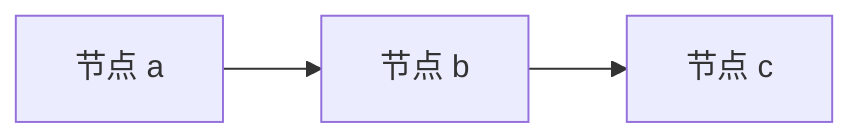

用 LangGraph 写：

```python
graph = StateGraph(State)
graph.add_node("a", a)
graph.add_node("b", b)
graph.add_node("c", c)
graph.add_edge(START, "a")
graph.add_edge("a", "b")
graph.add_edge("b", "c")
graph.add_edge("c", END)
app = graph.compile()
app.invoke(input)
```

**行为完全一样**。但形式从"隐式控制流"变成了"显式图"。

### 1.3 为什么要换形式？

如果只是把链画成图，没好处——反而更啰嗦。好处出现在控制流**不再是链**的时候：

- 要分支？图上加条件边。
- 要循环？图上加回边。
- 要并行？图上一个节点多条出边。
- 要中断？图上标记中断点。
- 要可视化？图天然可画。
- 要分析？图有成熟算法（拓扑排序、环检测、可达性...）。

**每多一个需求，传统代码就多一层嵌套；图只是多一条边。** 这就是图的根本优势——
它的表达能力是"平的"，不是"嵌套的"。

### 1.4 论证的终点

LLM 应用的控制流**天然不是链**：

| LLM 应用 | 控制流形状 | 传统代码的问题 |
|----------|-----------|----------------|
| 简单 Chain | 链 | 没问题，但也没复用 |
| Agent (ReAct) | 带循环的图 | while + if 嵌套，难读 |
| Multi-Agent | 嵌套子图 | 函数调用嵌套，难调试 |
| 人机协作 | 图 + 中断点 | 要手写状态保存/恢复 |
| 并行工具调用 | fan-out + fan-in | 要手写线程/协程 |
| 断点续跑 | 图 + 快照 | 要手写序列化 |

**所有这些，图都能统一表达。** 这就是为什么 LangGraph 选图——不是图酷，是图对。

---

## 2. 为什么用图而不是代码

### 2.1 能力一：可视化

图天然可画。一段代码的逻辑要读懂，得在脑子里"运行"一遍；一张图看一眼就懂。

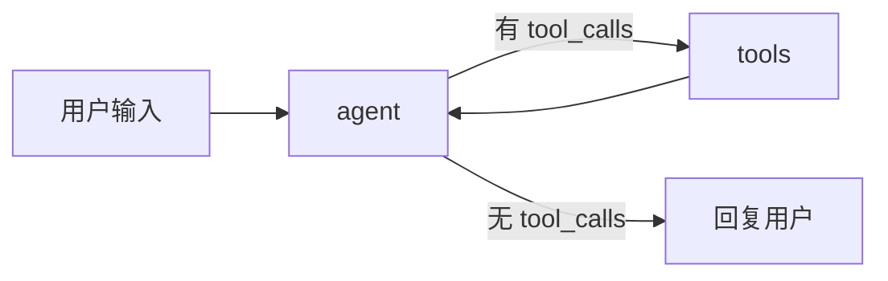

这张图一眼就能看出"这是个 ReAct Agent"。等价的传统代码：

```python
def agent(input):
    messages = [input]
    while True:
        resp = llm(messages)
        messages.append(resp)
        if resp.tool_calls:
            for tc in resp.tool_calls:
                result = execute_tool(tc)
                messages.append(result)
        else:
            return resp.content
```

也能读懂，但要在脑子里跟踪 `messages` 的变化、`while True` 的退出条件。图把控制流
**外化**了——不用在脑子里跟踪，看图就行。

**可视化的实际价值**：

- **沟通**：产品和运营能看懂图，看不懂代码。图是跨职能沟通的工具。
- **调试**：图执行时能高亮当前节点，一眼看出"卡在哪"。
- **文档**：一张图就是文档，不用额外写流程说明。
- **审计**：金融、医疗等场景需要审计决策路径，图天然留痕。

### 2.2 能力二：可分析

图有成熟的算法。代码的分析要靠抽象解释、符号执行（很难）；图的分析有现成算法：

| 分析需求 | 图算法 | 代码对应 |
|----------|--------|----------|
| 执行顺序 | 拓扑排序 | 静态分析（近似） |
| 有没有死循环 | 环检测 | 不可判定（停机问题） |
| 能不能到某节点 | 可达性 | 控制流分析 |
| 哪些节点能并行 | 层次分析 | 依赖分析 |
| 最长路径 | 关键路径 | 性能分析 |

**关键**：图的这些分析是**精确的**（因为图是显式的），代码的分析是**近似的**（因为代码
的控制流隐式、可能有动态分发）。

!!! example "环检测的实际用途"
    `compile()` 时检测图有没有环——如果有且没有条件边终止，就警告"可能死循环"。
    代码里 `while True` 是不是死循环？不可判定（停机问题）。图里有没有环？一眼能看。

### 2.3 能力三：可并行

图天然表达并行：**同一层的多个节点可以并行执行**。

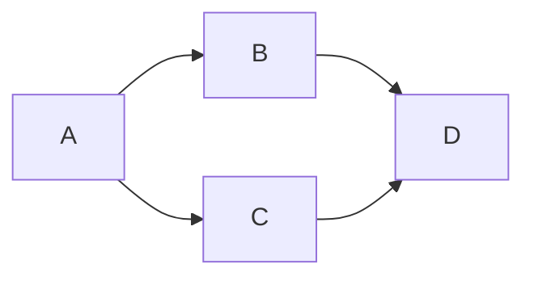

`B` 和 `C` 没有依赖关系（都不依赖对方的输出），可以并行。图引擎看一眼就知道（同一超级步）。

传统代码要并行，得手写：

```python
import asyncio

async def run(input):
    x = a(input)
    b_result, c_result = await asyncio.gather(b(x), c(x))
    return d(b_result, c_result)
```

要手动分析依赖、手动用 `gather`、手动处理异常。图引擎自动做这些——你只画边，引擎算依赖。

### 2.4 能力四：可路由

图的条件边天然表达 `if/else`：

```python
def should_continue(state):
    if state["needs_tool"]:
        return "tools"
    return "end"

graph.add_conditional_edges("agent", should_continue, {
    "tools": "tool_node",
    "end": END,
})
```

传统代码的 `if/else` 嵌套深了难读。图的条件边是**平的**——所有分支都是图上的边，
不嵌套。

### 2.5 能力五：可中断

图上能标记中断点。引擎执行到那暂停，存检查点，交回控制权。传统代码要手写：

```python
state = save_checkpoint()
if needs_human_review(state):
    return "PAUSED"  # 调用方要记得存 state、之后调 resume(state)
```

要手动存状态、手动设计恢复协议、调用方要记得存。图引擎自动做——`interrupt_before=["review"]`
就行，续跑 `invoke(None, config)` 就行。

### 2.6 能力六：可持久化

图执行每一步都能存检查点。因为执行模型是 Pregel 超级步（后面详讲），每个超级步后状态
是"干净的"（所有同层节点已合并），天然适合存快照。传统代码的"中途状态"可能是一堆局部
变量，序列化困难。

---

## 3. Chain = 单链图

最简单的 LLM 应用是 **Chain**：`prompt → LLM → parser → output`。这是一条链。

### 3.1 传统写法

```python
def chain(input):
    prompt = build_prompt(input)
    raw = llm(prompt)
    parsed = parse(raw)
    return parsed
```

### 3.2 图写法

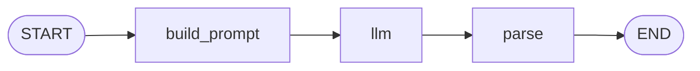

```python
graph = StateGraph(State)
graph.add_node("build_prompt", build_prompt_node)
graph.add_node("llm", llm_node)
graph.add_node("parse", parse_node)
graph.add_edge(START, "build_prompt")
graph.add_edge("build_prompt", "llm")
graph.add_edge("llm", "parse")
graph.add_edge("parse", END)
```

### 3.3 为什么要用图写 Chain？

单链用图写**确实更啰嗦**。但好处是：

1. **统一执行模型**：Chain 和 Agent 用同一个引擎跑。换应用类型不用换引擎。
2. **可加检查点**：Chain 也能存检查点、续跑。传统代码要自己加。
3. **可观测**：每个节点执行有事件，能 trace。
4. **可组合**：Chain 能作为子图嵌进更大的图。

!!! tip "什么时候不用图？"
    如果你的应用就是一条链、不会变、不需要检查点/观测/中断——直接写函数就好，别用图。
    图有图的成本（定义、编译、执行开销）。简单场景用简单工具。

---

## 4. Agent（ReAct）= 带循环的图

Agent 的 ReAct 循环是图最经典的用例。已在 [阶段 9 文档](../stages/stage_9_agent.md) 详讲，
这里从"图即程序"视角再看一遍。

### 4.1 ReAct 的传统代码

```python
def react_agent(user_input, tools, llm):
    messages = [{"role": "user", "content": user_input}]
    while True:                                    # 循环
        resp = llm(messages, tools=tools)
        messages.append(resp)
        if resp.tool_calls:                        # 分支
            for tc in resp.tool_calls:             # 循环
                result = execute_tool(tc, tools)
                messages.append(result)
        else:                                      # 分支
            return resp.content                    # 终止
```

两层 `while`、一个 `if/else`、一个 `for`。能读懂，但控制流要在脑子里跟踪。

### 4.2 ReAct 的图

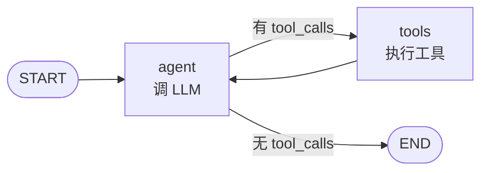

```python
graph = StateGraph(AgentState)
graph.add_node("agent", agent_node)
graph.add_node("tools", tool_node)
graph.add_edge(START, "agent")
graph.add_conditional_edges("agent", should_continue, {"tools": "tools", END: END})
graph.add_edge("tools", "agent")
```

**循环**是 `tools → agent` 的回边。**分支**是 `agent` 的条件边。**终止**是条件边返回 `END`。

### 4.3 对比

| 方面 | 传统代码 | 图 |
|------|----------|-----|
| 循环 | `while True` | 回边 |
| 分支 | `if/else` | 条件边 |
| 终止 | `return` | 条件边返回 `END` |
| 状态 | 局部变量 `messages` | 共享状态 `state["messages"]` |
| 持久化 | 手动 | 检查点自动 |
| 中断 | 手动 | `interrupt_before` |
| 可视化 | 无 | mermaid 一眼 |
| 可分析 | 近似 | 精确 |

**图没有更强大（图灵等价），但更清晰、更可维护、更可扩展。**

---

## 5. Multi-Agent = 嵌套子图

多个 Agent 协作时，每个 Agent 是一个子图，子图之间用边连起来。

### 5.1 例子：规划-执行模式

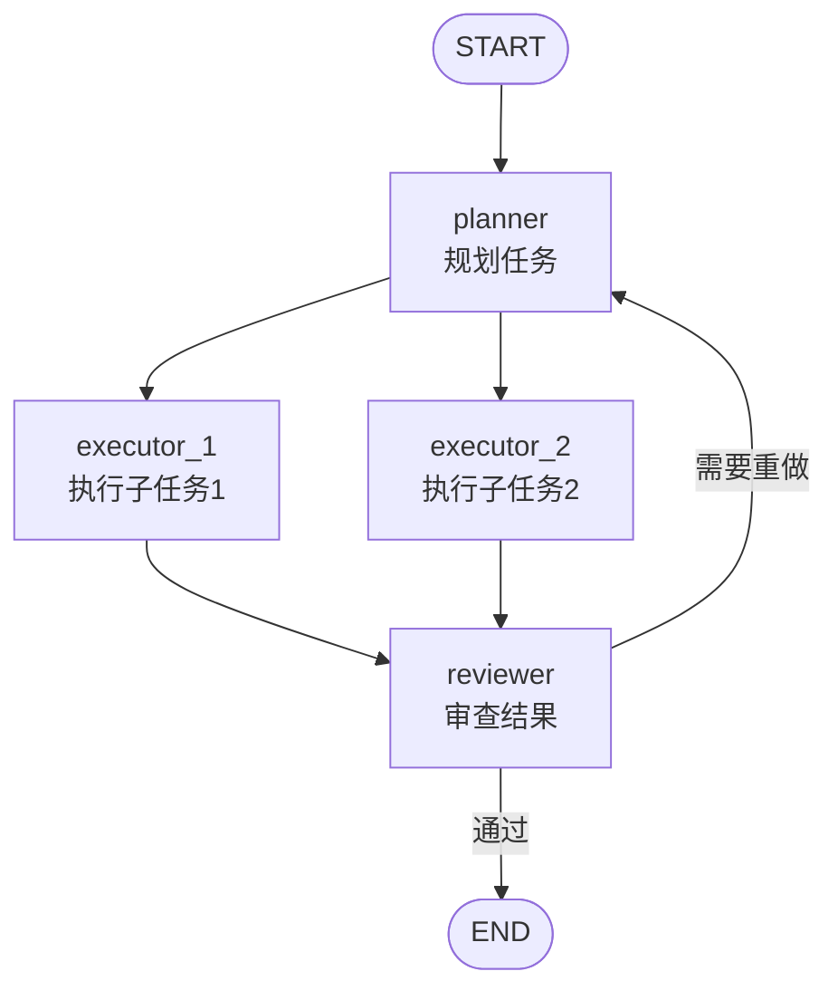

- `planner` 是一个 Agent（自己内部是 ReAct 循环）。
- `executor_1`、`executor_2` 是两个 Agent，可以并行。
- `reviewer` 是一个 Agent，审查两个 executor 的结果。
- `reviewer → planner` 的回边：不通过就重新规划。

### 5.2 传统代码

```python
def multi_agent(input):
    plan = planner(input)
    while True:
        results = []
        for subtask in plan:
            result = executor(subtask)  # 串行，不能并行
            results.append(result)
        review = reviewer(results)
        if review.approved:
            return review
        plan = planner(review.feedback)  # 重新规划
```

问题：

- executor 串行（要并行得加 asyncio）。
- 状态管理混乱（plan、results、review 都是局部变量）。
- 不能中断（想暂停审查？得自己加）。
- 不能持久化（挂了从头来）。

图写法全解决——并行是引擎自动的，状态是共享的，中断是 `interrupt_before`，持久化是检查点。

### 5.3 子图的概念

每个 Agent 是一个子图。子图可以：

- **嵌套**：子图作为节点放进更大的图。
- **复用**：同一个子图在多处用。
- **独立测试**：子图自己能 invoke。

这是"分而治之"——复杂的多 Agent 系统拆成一个个子图，每个子图独立开发，最后组装。

---

## 6. 人机协作 = 图上的中断点

### 6.1 场景

LLM 决定发邮件，但发之前要人类审批。这是"人机协作"。

### 6.2 图的表达

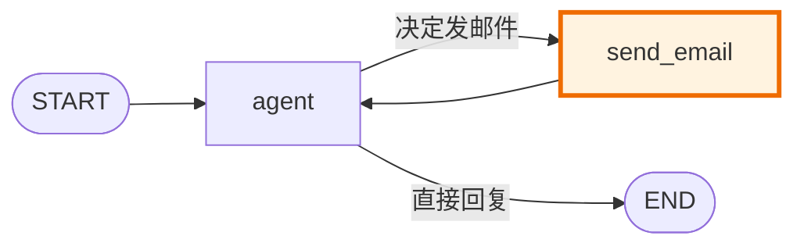

把 `send_email` 节点标记为中断点（橙色）：

```python
graph.compile(checkpointer=saver, interrupt_before=["send_email"])
```

引擎执行到 `send_email` **之前**：存检查点、暂停、交回控制权。人类审批后 `invoke(None, config)` 续跑。

### 6.3 传统代码

```python
def agent_with_approval(input):
    state = {"messages": [input]}
    while True:
        resp = llm(state["messages"])
        state["messages"].append(resp)
        if resp.tool_calls:
            for tc in resp.tool_calls:
                if tc.name == "send_email":
                    # 暂停，等人类审批
                    save_state(state)          # 手动存
                    approved = ask_human(tc)    # 手动问
                    if not approved:
                        continue               # 手动恢复
                result = execute_tool(tc)
                state["messages"].append(result)
        else:
            return resp.content
```

要手动存状态、手动问人类、手动恢复。而且这个 `ask_human` 是阻塞调用——如果人类
半小时后才回复，进程得挂着。图的方式：暂停返回，进程能干别的，人类审批后再调续跑。

---

## 7. 断点续跑 = 图执行快照

### 7.1 场景

Agent 跑了 5 轮工具调用，第 6 轮时服务器挂了。重启后想从第 5 轮接着跑，不要从头。

### 7.2 图的方式

每个超级步后存检查点。挂了重启，`invoke(None, config)` 从最新检查点续跑。

```python
# 第一次跑（中途挂了）
agent.invoke({"messages": [...]}, config={"configurable": {"thread_id": "t1"}})

# 重启后续跑
agent.invoke(None, config={"configurable": {"thread_id": "t1"}})
```

引擎从检查点恢复 `state` 和 `pending`（下一步要执行什么），接着跑。

### 7.3 传统代码

要手动把 `messages`、循环计数器、所有局部状态序列化存盘，重启时反序列化恢复。
每个应用的序列化逻辑不同，没有通用方案。图引擎的检查点是**通用的**——存 state 和 pending
就行，因为图的执行状态就这两样。

### 7.4 时间旅行

检查点不只存最新，存所有历史。能"回到第 3 步"重跑：

```python
for cp in agent.get_state_history(config):
    print(cp["step"], cp["state"])
```

传统代码要"回到第 3 步"？得自己存每步状态、自己设计索引。图引擎天然支持。

---

## 8. 图的基本元素

### 8.1 节点（Node）

**节点 = 一个函数**，签名固定：

```python
def my_node(state: State) -> StateUpdate:
    ...
    return {"key": new_value}
```

- **输入**：当前完整状态。
- **输出**：状态的**更新片段**（只返回要改的部分，不是完整新状态）。

!!! note "为什么返回更新片段？"
    这是 Pregel 模型的基础。多个节点并行执行，各自返回更新片段，引擎用 Reducer 合并。
    如果返回完整状态，并行节点的合并就没法定义（谁覆盖谁？）。更新片段 + Reducer 让
    合并是代数运算，天然可交换可结合。

### 8.2 边（Edge）

#### 静态边

`add_edge("a", "b")`：执行完 `a`，无条件跳 `b`。

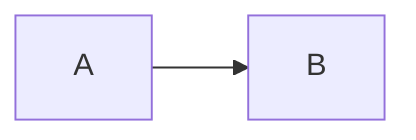

对应传统代码的**顺序执行**：`b(a(x))`。

#### 条件边

`add_conditional_edges("a", router, mapping)`：执行完 `a`，调 `router(state)`，
按返回值查 `mapping` 决定跳哪。

```python
def router(state) -> str:
    if state["needs_tool"]:
        return "call_tool"
    return "respond"

graph.add_conditional_edges("agent", router, {
    "call_tool": "tool_node",
    "respond": END,
})
```

对应传统代码的 **if/else**。但图的条件边是平的——所有分支都是边，不嵌套。

#### 回边

`add_edge("b", "a")`（且 `a` 能再到 `b`）：形成循环。

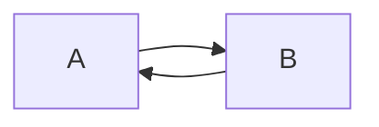

对应传统代码的 **while 循环**。终止靠条件边返回 `END`，对应 `while` 的退出条件。

### 8.3 特殊节点：START 和 END

- `START`：图的入口，不是真正的节点，只是标记"从哪开始"。
- `END`：图的出口，不是真正的节点，条件边返回它表示"结束"。

```python
graph.add_edge(START, "first_node")     # 入口
graph.add_edge("last_node", END)        # 出口
# 或条件边
graph.add_conditional_edges("x", router, {..., END: END})
```

### 8.4 元素对照表

| 图元素 | 传统编程 | 例子 |
|--------|----------|------|
| 节点 | 函数 | `def node(state): ...` |
| 静态边 | 顺序执行 | `b(a(x))` |
| 条件边 | if/else | `if cond: f() else: g()` |
| 回边 | while 循环 | `while cond: ...` |
| 子图 | 函数调用 | `subroutine()` |
| 中断点 | break / yield | `break` 或 `yield` |
| 检查点 | 序列化存盘 | `pickle.dump(state)` |
| fan-out | 并行调用 | `asyncio.gather(...)` |

---

## 9. 执行模型：从拓扑排序到 Pregel 超级步

### 9.1 DAG：拓扑排序

如果图没有环（DAG，有向无环图），执行顺序用**拓扑排序**确定：


拓扑序：`A, B, C, D`（或 `A, C, B, D`）。按这个顺序执行，保证每个节点的前驱都先执行。

这是**阶段 1** 的执行模型：编译时算好拓扑序，运行时按序执行。

### 9.2 有环图：不能拓扑排序

有环图没有拓扑序（环上的节点互为前驱）。这时要换执行模型。

### 9.3 运行时动态遍历

**阶段 3-4** 的执行模型：不预编译顺序，运行时 while 循环动态遍历。

```python
current = entry_point
while current is not END:
    update = nodes[current](state)
    merge(state, update)
    current = next_node(current, state)  # 静态边 or 条件边
```

每步执行当前节点、合并状态、决定下一个节点。条件边让"下一个"依赖状态，所以不能预编译。

### 9.4 Pregel 超级步

**阶段 6** 的执行模型：从"单节点遍历"升级为"超级步层遍历"。

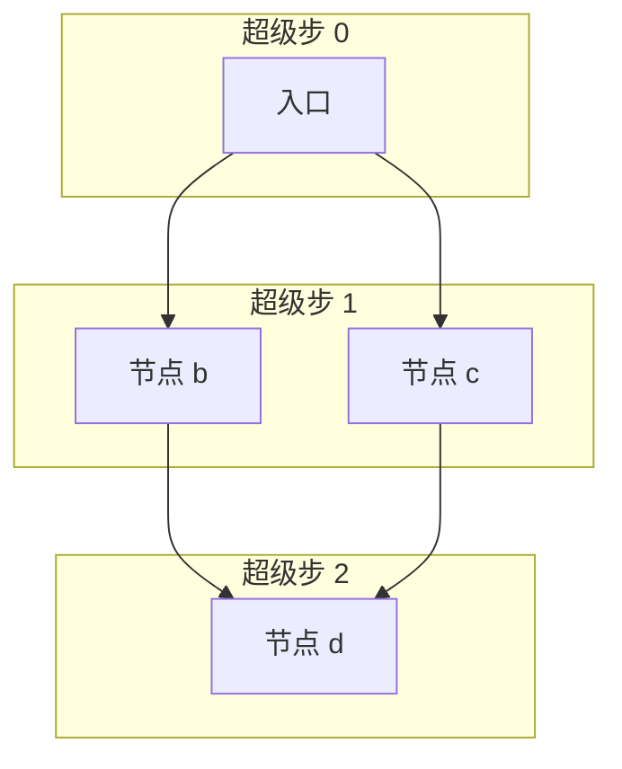

执行规则：

1. 超级步 0：执行 `{A}`。
2. 超级步 1：执行 A 的所有后继 `{B, C}`——**可以并行**。
3. 超级步 2：合并 B、C 的输出，执行 `{D}`。
4. ...直到没有节点要执行。

```python
pending = {entry_point}
step = 0
while pending:
    # 1. 并行执行所有 pending 节点（读同一状态快照）
    updates = [nodes[n](state) for n in pending]
    # 2. 用 Reducer 合并所有更新
    for u in updates:
        merge(state, u)
    # 3. 检查点
    checkpoint.save(step, state)
    # 4. 算下一轮
    pending = next_nodes(pending, state)
    step += 1
```

**关键**：同一超级步的节点读**同一状态快照**（互不影响），合并后下一超级步才看到。
这是 BSP（Bulk Synchronous Parallel）模型——批量同步并行。

### 9.5 为什么从拓扑排序升级到 Pregel？

| 需求 | 拓扑排序 | Pregel 超级步 |
|------|----------|---------------|
| DAG | ✅ | ✅ |
| 有环图 | ❌ | ✅ |
| 同层并行 | 难 | 天然 |
| 检查点对齐 | 难 | 天然（每步一个快照） |
| 中断/续跑 | 难 | 快照对齐到超级步 |

Pregel 是更通用的模型——DAG 是 Pregel 的特例（没有环，超级步就是拓扑层）。

---

## 10. 对照传统编程范式

### 10.1 if/else → 条件边

传统：

```python
if state["x"] > 0:
    do_a()
else:
    do_b()
```

图：

```python
def router(state):
    return "a" if state["x"] > 0 else "b"

graph.add_conditional_edges("prev", router, {"a": "node_a", "b": "node_b"})
```

**区别**：传统的 if/else 嵌套在函数里，图的条件边是图上的边。好处是分支**可视化、可分析、
可组合**——多个条件边不嵌套，都是平的边。

### 10.2 while → 回边

传统：

```python
while state["count"] < 10:
    state["count"] += 1
```

图：

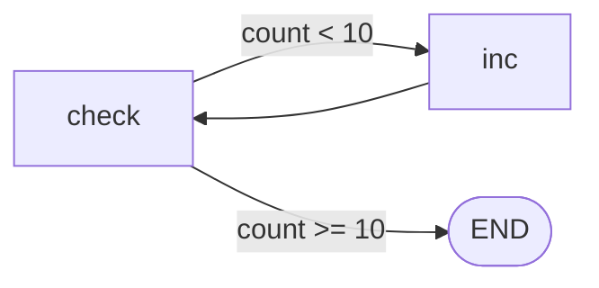

```python
def check(state): return "inc" if state["count"] < 10 else "end"
graph.add_node("inc", lambda s: {"count": s["count"] + 1})
graph.add_conditional_edges("check", check, {"inc": "inc", "end": END})
graph.add_edge("inc", "check")
```

**区别**：传统的 while 在函数里，图的循环是回边。好处是**循环条件和循环体分离**，
各自可测试；**循环可可视化**；**循环可中断**（`interrupt_before=["inc"]`）。

### 10.3 函数调用 → 子图

传统：

```python
def main():
    x = subroutine(input)
    return process(x)
```

图：

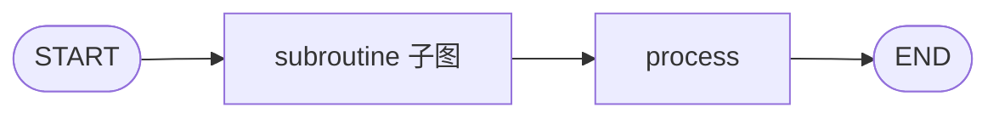

子图是一个节点，内部有自己的图结构。调用子图 = 执行子图、把结果合并回主图状态。

**区别**：传统的函数调用是"压栈"，图的子图是"嵌套执行"。好处是子图**可独立测试、
可独立可视化、可独立检查点**。

### 10.4 异常处理 → 条件边

传统：

```python
try:
    result = risky_op()
except Exception as e:
    result = handle_error(e)
```

图：

```python
def risky_node(state):
    try:
        return {"result": risky_op()}
    except Exception as e:
        return {"error": str(e)}

def after_risky(state):
    return "handle" if state.get("error") else "continue"

graph.add_conditional_edges("risky", after_risky, {"handle": "error_handler", "continue": "next"})
```

**区别**：传统的 try/except 是控制流结构，图的"异常处理"是条件边路由。好处是**错误处理
和正常流程统一**——都是图上的边，可视化时能看到错误路径。

### 10.5 范式对照总结

| 传统范式 | 图元素 | 图的优势 |
|----------|--------|----------|
| 顺序执行 | 静态边 | 可视化 |
| if/else | 条件边 | 平的不嵌套 |
| while 循环 | 回边 | 可中断、可可视化 |
| 函数调用 | 子图 | 可独立测试/检查点 |
| try/except | 条件边路由 | 和正常流程统一 |
| 并行 (asyncio) | fan-out + 超级步 | 引擎自动算依赖 |
| break/yield | interrupt | 通用中断机制 |
| 存盘/恢复 | 检查点 | 通用序列化 |

---

## 11. LangGraph 的设计哲学

### 11.1 哲学一：图是编程原语，不是可视化工具

很多框架把图当"可视化辅助"——先写代码，再画图给人看。LangGraph 反过来：**先写图，
图就是代码**。图是一等公民，不是附属品。

这意味着：

- 图是**可执行**的（不只是可看的）。
- 图的元素（节点、边）有**精确语义**（不只是箭头）。
- 图的**结构就是程序结构**（不是程序的描述）。

### 11.2 哲学二：状态是一等公民

传统框架把状态藏在节点的局部变量里。LangGraph 把状态**显式化**——状态是图级的共享数据，
所有节点读写同一状态。

好处：

- 状态可检查点（不在局部变量里）。
- 状态可观测（每步能看到完整状态）。
- 状态合并有定义（Reducer）。
- 状态可人机协作（人类能读/改状态）。

### 11.3 哲学三：执行模型统一

不管你是 Chain、Agent、Multi-Agent、工作流——**都用同一个执行引擎**（Pregel 超级步）。
换应用类型不用换引擎，只换图结构。

这降低了学习成本（学一次引擎）和维护成本（一套引擎一套检查点一套中断）。

### 11.4 哲学四：节点是纯函数

节点签名固定：`f(state) -> update`。没有副作用（不直接改全局状态，返回更新片段让引擎合并）。

好处：

- 可并行（纯函数天然可并行）。
- 可测试（给定输入有确定输出）。
- 可回放（同输入同输出）。
- 可组合（节点不互相依赖，只依赖状态）。

### 11.5 哲学五：Reducer 声明合并

状态合并策略写在类型注解里（`Annotated[T, reducer]`），不写在节点代码里。节点只管
"我要改什么"，引擎管"怎么合并"。

好处：

- 节点代码更简单（不用管合并逻辑）。
- 合并策略可复用（`add_messages` 到处用）。
- 并行安全（Reducer 天然可交换可结合）。

---

## 12. 图执行引擎 vs 工作流引擎

很多人问：LangGraph 和 Airflow、Temporal、Prefect 这些工作流引擎有什么区别？

### 12.1 工作流引擎的特点

工作流引擎（Airflow、Temporal）为**长期运行的批处理任务**设计：

- 任务是**粗粒度**的（一个任务跑几分钟到几小时）。
- 任务间**数据量大**（传文件、查数据库）。
- **重试**是核心（任务失败重跑）。
- **调度**是核心（定时、依赖触发）。
- 状态主要是**任务状态**（running/success/failed），不是业务数据。

### 12.2 图执行引擎的特点

LangGraph 为**LLM 应用的交互式控制流**设计：

- 节点是**细粒度**的（一次 LLM 调用、一次工具调用）。
- 节点间**数据是状态**（消息历史、中间结果）。
- **路由**是核心（LLM 决定下一步）。
- **人机协作**是核心（中断、审批）。
- 状态是**业务数据**（messages、tool_calls...）。

### 12.3 对照

| 方面 | 工作流引擎 | 图执行引擎 (LangGraph) |
|------|-----------|------------------------|
| 任务粒度 | 粗（分钟-小时） | 细（毫秒-秒） |
| 数据传递 | 文件、数据库 | 共享状态 |
| 核心能力 | 调度、重试 | 路由、循环、中断 |
| 控制流 | 静态 DAG | 动态有环图 |
| 状态 | 任务状态 | 业务数据 |
| 人机协作 | 少 | 核心特性 |
| 典型场景 | ETL、批处理 | Agent、对话、RAG |

### 12.4 能用工作流引擎跑 Agent 吗？

能，但别扭。Airflow 跑 Agent：

- 要把每轮 LLM 调用包成一个 Task。
- 循环要靠 Airflow 的动态 DAG 生成（复杂）。
- 中断要靠外部触发 + 状态查询（没有原生支持）。
- 状态要存外部（Airflow 不存业务数据）。

LangGraph 这些都是原生的——循环是回边、中断是 interrupt、状态是图状态。

### 12.5 能用 LangGraph 跑 ETL 吗？

能，但大材小用。ETL 是静态 DAG，用 Airflow 的调度、重试、分区更合适。LangGraph 的
循环、路由、人机协作在 ETL 里用不上。

**结论**：工具对场景。LLM 应用用图执行引擎，批处理用工作流引擎。

---

## 13. 实际代码示例对照

### 13.1 同一个 Agent，传统代码 vs 图

**需求**：用户问问题，Agent 调搜索工具，如果搜索结果不够，再调一次；够了就回复。

#### 传统代码

```python
def search_agent(user_input, llm, search_tool):
    messages = [{"role": "user", "content": user_input}]
    search_count = 0
    while True:
        resp = llm(messages, tools=[search_tool])
        messages.append(resp)
        if resp.tool_calls:
            for tc in resp.tool_calls:
                result = search_tool(**json.loads(tc.function.arguments))
                messages.append({"role": "tool", "content": result, "tool_call_id": tc.id})
                search_count += 1
                if search_count >= 5:
                    return "搜索太多次了，放弃", messages
        else:
            return resp.content, messages
```

问题：

- `search_count` 是局部变量，不能检查点。
- `while True` 的退出条件藏在 if/else 里。
- 要中断？得自己加。
- 要并行？这个结构改不了。
- 要可视化？得自己画。

#### 图代码

```python
def agent_node(state):
    resp = llm(state["messages"], tools=[search_tool_schema])
    return {"messages": [resp]}

def tool_node(state):
    last = state["messages"][-1]
    results = []
    for tc in last["tool_calls"]:
        result = search_tool(**json.loads(tc.function.arguments))
        results.append({"role": "tool", "content": result, "tool_call_id": tc.id})
    return {"messages": results}

def should_continue(state):
    last = state["messages"][-1]
    return "tools" if last.get("tool_calls") else END

graph = StateGraph(AgentState)
graph.add_node("agent", agent_node)
graph.add_node("tools", tool_node)
graph.add_edge(START, "agent")
graph.add_conditional_edges("agent", should_continue, {"tools": "tools", END: END})
graph.add_edge("tools", "agent")
agent = graph.compile(checkpointer=MemorySaver(), interrupt_before=["tools"])
```

加上检查点、中断、并行——零额外代码。引擎自动处理。

### 13.2 同一个图，可视化

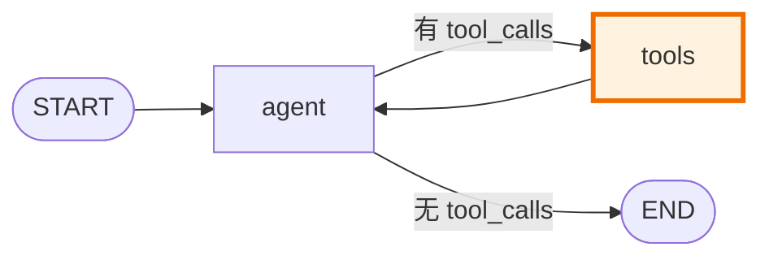

橙色 = 中断点。一眼看出"这是个 ReAct Agent，工具执行前会暂停"。

传统代码要看出这个？得读完函数、跟踪 while、找到 if 分支、推断意图。

---

## 14. 图的代价

讲了这么多好处，公平起见也讲代价。

### 14.1 更啰嗦

简单逻辑用图写比直接写函数啰嗦：

```python
# 直接
def f(x): return x + 1

# 图
graph.add_node("f", lambda s: {"x": s["x"] + 1})
graph.add_edge(START, "f")
graph.add_edge("f", END)
```

简单场景用图是过度工程。

### 14.2 学习曲线

要学图的概念（节点、边、条件边）、状态管理（Reducer）、执行模型（Pregel）、检查点。
传统代码的 if/while 大家都会。

### 14.3 调试间接

图执行时，控制流是引擎驱动的。出 bug 时，要理解引擎怎么跑的，不能只看自己的代码。
传统代码的调用栈更直观。

### 14.4 性能开销

图的每步有调度开销（算 pending、合并状态、检查点）。直接写函数没这些。对性能敏感的
热路径，图可能慢。

### 14.5 什么时候不该用图

- **简单逻辑**：一条链、不循环、不分支——直接写函数。
- **性能敏感**：微秒级延迟、百万 QPS——图的开销可能不值得。
- **一次性脚本**：跑完就扔——图的定义成本收不回来。
- **纯计算**：没有控制流（如矩阵乘法）——图没用。

**图适合：控制流复杂、需要持久化/中断/并行/人机协作的长期运行应用。** LLM 应用正好是这个。

---

## 15. 在哪个阶段实现

| 概念 | 阶段 |
|------|:----:|
| 节点 + 静态边 + 拓扑执行 | [阶段 1](../stages/stage_1_dag.md) |
| 共享状态 | [阶段 2](../stages/stage_2_state.md) |
| 条件边（if/else） | [阶段 3](../stages/stage_3_conditional.md) |
| 循环 + stream（while） | [阶段 4](../stages/stage_4_cycle.md) |
| Reducer（合并策略） | [阶段 5](../stages/stage_5_reducer.md) |
| Pregel 超级步（并行层） | [阶段 6](../stages/stage_6_pregel.md) |
| 检查点（断点续跑） | [阶段 7](../stages/stage_7_checkpoint.md) |
| 中断（人机协作） | [阶段 8](../stages/stage_8_interrupt.md) |
| Agent（ReAct 图） | [阶段 9](../stages/stage_9_agent.md) |

---

## 16. 图的代数视角

### 16.1 图作为代数结构

图执行可以用代数语言描述：

- **状态空间** `S`：所有可能状态的集合。
- **节点函数** `f_i: S → S`：每个节点是一个状态变换。
- **合并运算** `⊕: S × S → S`：用 Reducer 合并更新。
- **路由函数** `r: S → L`：条件边路由，返回标签。

图执行 = 反复应用节点函数 + 合并 + 路由，直到终止。

### 16.2 图作为范畴论对象

从范畴论看，图是一个**对象**，边是**态射**。图执行是态射的复合。

- 节点 A → B → C 的执行是态射复合 `f_C ∘ f_B ∘ f_A`。
- 条件边是**余积**（coproduct）——分支选择。
- fan-out 是**积**（product）——并行执行后合并。

这不只是抽象——它说明图执行有**坚实的数学基础**。并行合并的顺序无关性来自
范畴论的交换图（commutative diagram）。

### 16.3 图作为 Petri 网

Petri 网是并发系统的经典模型。图执行可以看作 Petri 网：

- 节点 = 变迁（transition）。
- 状态字段 = 库所（place）。
- 节点执行 = 变迁触发（fire）。
- 状态值 = token。

Petri 网的并发语义和 Pregel 的并行一致——无依赖的变迁可并发触发。

---

## 17. 图的历史脉络

### 17.1 从流程图到执行图

- **1940s**：流程图（flowchart）——用图形描述程序逻辑，但不执行。
- **1960s**：数据流图（dataflow diagram）——描述数据流动，用于编译器优化。
- **1970s**：Petri 网——并发系统的形式化模型。
- **1990s**：BSP 模型——并行计算的数学模型。
- **2010s**：Pregel（Google）——大规模图计算，BSP 的工业化。
- **2020s**：LangGraph——用图描述 LLM 应用的控制流。

**脉络**：图从"描述工具"演变成"执行原语"。LangGraph 站在这个演变的末端——图不只是
描述程序，图**就是**程序。

### 17.2 为什么现在火

图执行引擎在 LLM 时代火起来，因为 LLM 应用的控制流**天然图状**：

- **循环**：Agent 的 ReAct 循环。
- **分支**：根据 LLM 回复路由。
- **并行**：同时调多个工具。
- **中断**：人机协作。
- **持久化**：长对话要存历史。

传统代码能写这些，但写成嵌套 if/while 的意大利面。图把这些**结构化**——每个控制流
元素是图上的显式元素，可视化、可分析、可中断、可持久化。

### 17.3 和无代码/低代码的区别

图执行引擎和无代码/低代码平台都"用图描述逻辑"，但本质不同：

| 方面 | 无代码/低代码 | 图执行引擎 |
|------|---------------|------------|
| 目标用户 | 非程序员 | 程序员 |
| 节点 | 预定义组件 | 任意函数 |
| 灵活度 | 低（组件固定） | 高（任意 Python） |
| 版本控制 | 难（图形） | 易（代码即图） |
| 测试 | 难 | 易（节点可单测） |

图执行引擎是**程序员的图**——图是代码的结构化表达，不是替代代码。

---

## 18. 图的可视化深度

### 18.1 可视化的层次

图可视化有三个层次：

1. **结构图**：节点和边，静态。用 mermaid 画。
2. **执行图**：高亮当前节点，动态。执行时看"跑到哪了"。
3. **数据流图**：边上标数据，看"数据怎么流动"。

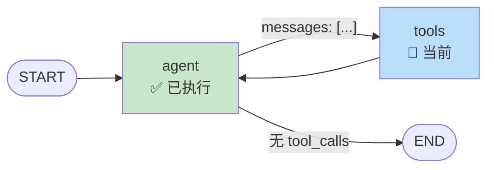

### 18.2 可视化的工具

- **mermaid**：Markdown 内嵌，适合文档。
- **LangSmith**：LangGraph 的观测平台，实时执行图。
- **Graphviz**：更复杂的图，适合离线分析。
- **自研**：执行时 yield 事件，自己渲染。

### 18.3 可视化的价值再强调

- **沟通**：跨职能（产品、运营、法务）能看懂图，看不懂代码。
- **审计**：金融、医疗需要审计决策路径，图天然留痕。
- **调试**：高亮当前节点，一眼看出"卡在哪"。
- **文档**：一张图就是文档，不用额外写流程说明。
- **监控**：生产环境实时看执行图，发现瓶颈。

---

## 19. 图的边界情况

### 19.1 空图与单节点图

空图编译报错（无入口）。单节点图是最简单的图——一个超级步，执行完结束。

### 19.2 图的连通性

图不要求连通——可以有孤立节点（没边连）。但孤立节点不会执行（没有边到它）。
编译时不检查连通性，运行时孤立节点自然不被执行。

### 19.3 图的确定性

图的执行是否确定？取决于：

- **节点函数**是否确定（纯函数 vs 有副作用）。
- **条件边路由**是否确定（看 state 决定，state 确定则路由确定）。
- **Reducer** 是否可交换（可交换则并行合并顺序无关）。

如果节点是纯函数、路由确定、Reducer 可交换——图执行完全确定。同输入同输出，可回放。
LLM 调用有随机性（temperature > 0），所以 Agent 不完全确定——但图结构是确定的。

### 19.4 图的复杂度

- **节点数** N：图的"大小"。
- **边数** E：图的"连接度"。
- **超级步数** S：执行的"长度"。
- **状态大小** |state|：每步的"工作量"。

执行总开销：O(S × (N_super × |node| + |state|))，其中 N_super 是每超级步的节点数。
对 Agent（每超级步 1 节点），S × |node| 主导（|node| 是 LLM 调用，秒级）。

---

## 20. 图的演进方向

### 20.1 子图（阶段 10）

把一个图作为另一个图的节点：

```python
sub_agent = create_react_agent(...)
graph.add_node("sub_agent", sub_agent)  # 子图当节点
```

子图让复杂系统模块化——每个 Agent 是独立子图，组装成多 Agent 系统。

### 20.2 动态图

运行时根据状态改图结构（加节点、改边）。当前不支持——图编译后不可变。
真 LangGraph 也不鼓励动态图——用条件边路由代替动态结构。

### 20.3 异步图

节点是 async 函数，引擎用 asyncio 并行执行同超级步节点。执行模型不变，只是"并行"
从顺序模拟变成真 asyncio。真 LangGraph 支持，教学简化。

### 20.4 流式图

节点能 yield 中间结果（如 LLM 逐 token），引擎透传给调用方。当前只支持超级步级流式。
真 LangGraph 的 `astream_events` 支持 token 级。

### 20.5 图的序列化

把图本身（不是 state）序列化——存图结构，加载后能恢复图。当前不支持——图是 Python
对象，节点是函数，不好序列化。真 LangGraph 用 LangSmith 存图结构。

---

## 21. 常见问题

??? question "图灵完备吗？图能表达任何计算吗？"
    能。有节点（函数）、有条件边（if/else）、有回边（while）——这三者图灵完备。
    事实上任何程序都能转成图（把每条语句当节点，控制流当边）。图不是"更弱"的表达，
    是"更结构化"的表达。

??? question "图和状态机什么关系？"
    图**就是**状态机的一种。节点是状态，边是转移。但图的状态机是"数据驱动的"——
    转移条件看状态内容（`router(state)`），不是看当前在哪个节点。这比传统状态机
    更灵活（传统状态机的转移通常只看当前状态）。

??? question "为什么不用函数式编程的 monad 表达控制流？"
    能，但 monad 对大多数人太抽象。图直观——产品经理都能看懂 mermaid 图。工具的
    目标人群是"会写 Python 的工程师"，不是"懂范畴论的函数式程序员"。图是工程友好的
    抽象。

??? question "图能动态修改吗（运行时加节点）？"
    当前实现不能——图编译后不可变。真 LangGraph 也不鼓励动态修改。如果需要"动态"行为，
    用条件边路由（图结构不变，路由动态）。如果真要动态图，那是另一类系统（如规则引擎）。

??? question "图和 DAG 有什么区别？"
    DAG（有向无环图）是图的子集——没有环。阶段 1 的 `Graph` 是 DAG。阶段 4 起的
    `StateGraph` 允许环。允许环是图比 DAG 强的地方——能表达循环。

---

## 17. 小结

**图即程序**不是口号，是 LangGraph 的核心设计决策。这个决策的动因是：

1. **LLM 应用的控制流天然是图状的**——循环、分支、并行、中断。
2. **图把这些控制流显式化**——可视化、可分析、可中断、可持久化。
3. **图有统一执行模型**——Pregel 超级步跑所有图，不管 Chain 还是 Agent。
4. **图和传统编程等价**——if/else→条件边、while→回边、函数→子图，没有表达力损失。

代价是更啰嗦、学习曲线、调试间接。但对 LLM 应用这个场景，收益远大于代价。

**下一篇**我们讲图执行的核心数据结构：**状态与 Reducer**。

---

## 相关链接

- 上一篇：[原理概览](index.md)
- 下一篇：[状态与 Reducer](state_and_reducer.md)
- 阶段 1：[最小 DAG](../stages/stage_1_dag.md)
- 阶段 3：[条件边](../stages/stage_3_conditional.md)
- 阶段 4：[循环图](../stages/stage_4_cycle.md)
- 阶段 9：[完整 Agent](../stages/stage_9_agent.md)
- 源码：[`src/tiny_langgraph/graph.py`](https://github.com/your-repo/blob/main/src/tiny_langgraph/graph.py)
