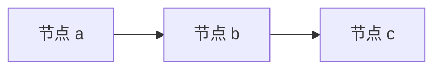
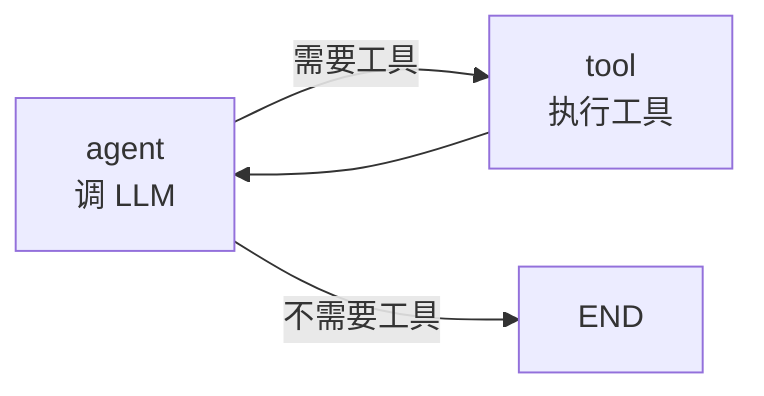

# 图即程序

> **在阶段 1-4 亲手实现。**

## 核心思想

传统写法：把逻辑写成一条线（函数 A 调函数 B 调函数 C）。

```python
def run(input):
    x = a(input)
    y = b(x)
    z = c(y)
    return z
```

LangGraph 的写法：把逻辑画成一张**有向图**，节点是函数，边是跳转。



```python
graph.add_node("a", a)
graph.add_node("b", b)
graph.add_node("c", c)
graph.add_edge("a", "b")
graph.add_edge("b", "c")
graph.set_entry_point("a")
graph.set_finish_point("c")
```

**为什么要换成图？** 因为一旦逻辑变成图，你就获得了：

1. **路由能力**：条件边根据状态决定走哪条路（`if/else` 变成图上的分支）
2. **循环能力**：图允许环，Agent 的"思考→行动→观察"循环就是环
3. **可视化**：图天然可画，能 mermaid 出来看流程
4. **通用执行**：一个引擎跑所有图，不用每种逻辑写一套调度

## 节点（Node）

节点就是一个**可调用对象**，签名固定：

```python
def my_node(state: State) -> StateUpdate:
    ...
    return {"key": new_value}
```

- **输入**：当前状态
- **输出**：状态的**更新片段**（不是完整新状态，只是要改的部分）

!!! note "为什么返回"更新片段"而不是完整状态？"
    这是 LangGraph 的关键设计：节点只声明"我要改什么"，由引擎负责合并。这让多个节点能并行执行后合并结果——这是 Pregel 模型的基础。阶段 5 的 Reducer 会展开讲。

## 边（Edge）

### 静态边

`add_edge("a", "b")`：执行完 `a`，无条件跳 `b`。

### 条件边

`add_conditional_edges("a", router)`：执行完 `a`，调用 `router(state)`，根据返回值决定跳哪个节点。

```python
def router(state) -> str:
    if state["needs_tool"]:
        return "call_tool"
    return "respond"

graph.add_conditional_edges("agent", router, {
    "call_tool": "tool_node",
    "respond": END,
})
```

**这就是 `if/else` 在图里的表达**。条件边的返回值是"路由标签"，映射到目标节点。

## 循环

图允许环。Agent 的 ReAct 循环就是：



**终止靠条件边**：`router` 在某条件下返回 `END`，跳出循环。

!!! warning "循环图的死循环风险"
    引擎必须能检测"没有进展"或"超过最大步数"而终止。阶段 4 会实现 `recursion_limit`。

## 在哪个阶段实现

| 概念 | 阶段 |
|------|:----:|
| 节点 + 静态边 + 拓扑执行 | [阶段 1](../stages/stage_1_dag.md) |
| 条件边 | [阶段 3](../stages/stage_3_conditional.md) |
| 循环 + 终止 | [阶段 4](../stages/stage_4_cycle.md) |

---

👉 下一篇：[状态与 Reducer](state_and_reducer.md)