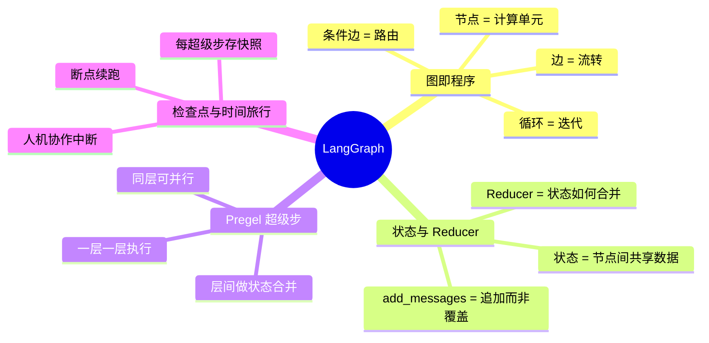
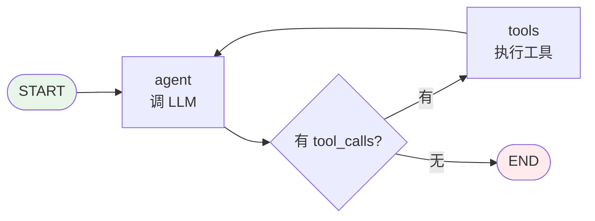
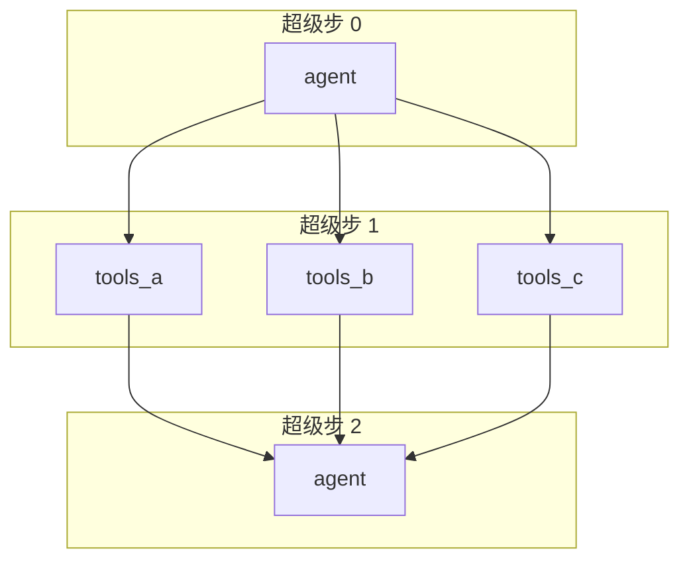
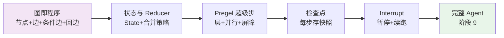
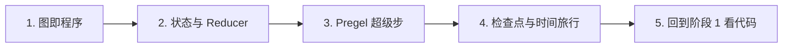
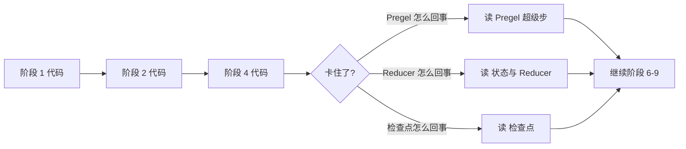

# 核心原理

LangGraph 不是"又一个 Agent 框架"，它是一个**图执行引擎**。理解它要抓住 4 个核心概念，本节逐个讲透。

## 一句话总结

> **把程序画成一张有状态的图，用一个通用引擎跑这张图。**

这句话拆开有 4 个抓手，每个对应一组实现阶段、一篇原理文档：

| 概念 | 一句话 | 对应阶段 | 原理文档 |
|------|--------|:--------:|----------|
| **图即程序** | 节点是函数，边是跳转，程序就是一张图 | 1-4 | [graph_as_program.md](graph_as_program.md) |
| **状态与 Reducer** | 状态在节点间流动，Reducer 决定怎么合并 | 2, 5 | [state_and_reducer.md](state_and_reducer.md) |
| **Pregel 超级步** | 一层一层执行，同层并行，层间合并 | 6 | [pregel.md](pregel.md) |
| **检查点与时间旅行** | 每步存快照，能回放、能中断、能续跑 | 7-8 | [checkpoint.md](checkpoint.md) |

---

## 四个核心概念



下面逐个展开，作为四篇原理文档的导读。

---

## 图即程序：为什么用图来编写 Agent

> 详见 [graph_as_program.md](graph_as_program.md) · 对应阶段 1-4

### 问题：Agent 的控制流为什么难写

写一个最简单的 ReAct Agent——"调 LLM，看它要不要调工具，要调就调，调完再回 LLM"——用普通 Python 你会怎么写？

```python
def run_agent(user_input):
    messages = [{"role": "user", "content": user_input}]
    while True:
        resp = llm(messages)
        messages.append(resp)
        if not resp.tool_calls:
            return resp
        for tc in resp.tool_calls:
            result = execute_tool(tc)
            messages.append(result)
```

这段代码看起来不难，但只要需求稍微一变：

- **多个 Agent 协作**：A 调 B，B 看情况调 C 或回 A——`while` 套 `if` 套 `while`，很快变成意大利面。
- **人机协作**：调工具前要让人审批——在循环里插一个 `input()`？那异步怎么办？那 Web 前端怎么办？
- **断点续跑**：跑到一半进程挂了，想从上次接着跑——`while` 循环的状态怎么序列化？
- **并行**：三个工具可以同时调——在循环里开线程池？那状态怎么合并？

问题的根是：**控制流和数据流混在代码里**。`while` / `if` 是控制流，`messages` 是数据流，它们缠在一起，一改就乱。

### 解法：把控制流抽成图

LangGraph 的回答是：**把控制流从代码里抽出来，变成图的边**。



- 节点 `agent` / `tools` 是**纯计算**（调 LLM、执行工具），不含控制流。
- 边 `agent → tools` / `agent → END` 是**纯路由**（看有没有 `tool_calls`），不含计算。
- 循环 `tools → agent` 是一条**回边**，不是 `while` 关键字。

现在：

- **多 Agent**？多画几个节点、多连几条边，图变大，代码结构不变。
- **人机协作**？在 `tools` 前面打个 `interrupt_before` 标记，引擎自己暂停。
- **断点续跑**？引擎每个超级步存快照，恢复就是读快照。
- **并行**？同一超级步的多个节点天然并行，引擎负责合并。

### 在本项目里怎么实现

| 阶段 | 加了什么 | 关键代码 |
|:----:|----------|----------|
| 1 | 节点 = 函数，边 = 顺序 | `Graph.add_node` / `add_edge` |
| 2 | 节点读共享 State、返回更新片段 | `StateGraph` |
| 3 | 条件边 = `if/else` | `add_conditional_edges` |
| 4 | 回边 = 循环，`stream()` 流式 | `CompiledStateGraph.stream` |

阶段 4 结束时，你已经有一个能跑循环图的引擎——只差接 LLM 就是 Agent 了。

### 图即程序的关键洞察

- **节点是纯函数**：不持有状态、不决定下一步走哪。这让节点可独立测试、可替换。
- **边是纯路由**：不计算、不修改状态。这让控制流可视化、可分析。
- **`if/else` 是条件边，`while` 是回边**：所有结构化控制流都能映射到图的构造。
- **`START` / `END` 是图的边界**：不是节点，是"入口/出口"标记。

---

## 状态与 Reducer：状态在图执行中的角色

> 详见 [state_and_reducer.md](state_and_reducer.md) · 对应阶段 2、5

### 问题：节点之间怎么传数据

阶段 1 的节点是 `Callable[[Any], Any]`——接收上一步输出，返回自己的输出。这只能传**一个值**。但 Agent 需要：

- 传 `messages` 列表（对话历史）
- 传 `intermediate_steps`（中间步骤）
- 传 `user_id`（用户身份，每个节点都要读但都不改）

如果只能传一个值，你得把所有东西塞进一个 dict 然后每次 `**x, "messages": x["messages"] + [new]`——能写，但啰嗦、易错。

### 解法：共享 State + 更新片段

阶段 2 引入 `StateGraph`：节点签名变成 `Callable[[State], StateUpdate]`。

- **输入**：整个 State（节点想读什么就读什么）。
- **输出**：一个**更新片段**（只包含要改的字段）。
- **引擎**：负责把更新片段合并回完整 State。

```python
def agent_node(state: State) -> dict:
    # 读：拿整个 state
    msg = llm(state["messages"])
    # 写：只返回要更新的字段
    return {"messages": [msg]}
    # 引擎负责把 [msg] 合并进 state["messages"]
```

### 问题：怎么合并

最朴素的合并是**覆盖**：`state.update(update_fragment)`。阶段 2 就这么干。

但这不对：`messages` 应该**追加**，不是覆盖。如果节点返回 `{"messages": [new_msg]}`，覆盖会把整个历史丢了。

### 解法：Reducer

阶段 5 引入 Reducer：用 `Annotated[T, reducer]` 声明每个字段**怎么合并**。

```python
from typing import Annotated
from operator import add

class State(TypedDict):
    messages: Annotated[list, add]   # 追加：add(old, new)
    count: int                       # 默认覆盖
```

引擎合并时：

```python
for key, value in update.items():
    if key in reducers:
        state[key] = reducers[key](state.get(key), value)  # 用 Reducer
    else:
        state[key] = value                                 # 覆盖
```

本项目还实现了 `add_messages`——智能合并消息列表：新消息有 `id` 且旧列表有同 `id` 的就**覆盖**（流式更新同一条），否则**追加**。这正是真实 LangGraph 的行为。

### 为什么用 `Annotated` 而不是配置字典

因为 Reducer 是**类型的一部分**，不是运行时配置。`Annotated` 让 `StateGraph(MyState)` 在构造时就能通过 `get_type_hints(MyState, include_extras=True)` 提取出 Reducer——零运行时开销、IDE 友好、和 TypedDict 自然契合。

### Reducer 的关键洞察

- **Reducer 是类型的一部分**，不是运行时配置——挂在 `Annotated` 上。
- **默认是覆盖**：没声明 Reducer 的字段，`state[key] = value`。
- **`add_messages` 的 id 语义**：同 id 覆盖、无 id 追加——这模拟了"流式更新同一条消息"的真实需求。
- **Reducer 让节点保持简单**：节点只返回"我产生的新消息"，引擎负责"追加到历史"。

---

## Pregel 超级步：执行模型的核心

> 详见 [pregel.md](pregel.md) · 对应阶段 6

### 问题：怎么定义"并行"和"快照"

如果用 DFS 跑图——走到哪算哪——那：

- **没法并行**：每走一步状态就变了，没法定义"同一层"。
- **没法存快照**：状态在节点之间是不一致的（A 改了一半，B 还没跑），存哪个时刻？
- **没法对齐**：A 跑了 3 步、B 跑了 5 步，怎么合并？

### 解法：超级步

Pregel（Google 2010 的图计算论文）给了一个优雅的模型：**把执行切成一层一层的"超级步"**。



每个超级步：

1. **读快照**：所有节点读**同一份** state 快照（上一超级步合并后的）。
2. **各自计算**：每个节点独立跑，互不干扰——天然可并行。
3. **统一合并**：所有节点的更新片段收集齐了，一次性合并进 state。

层间有明确的**屏障**（barrier）：上一层的所有节点都跑完、合并完，才进下一层。

这个模型带来三个直接后果：

- **并行**：同一超级步的多个节点可以多线程/多进程跑，结果一样。
- **快照对齐**：每个超级步结束后 state 是一致的，存快照就存这个时刻。
- **可复现**：给定同一份初始 state，超级步序列是确定的（本项目用 `sorted(pending)` 保证节点顺序确定）。

### 在本项目里怎么实现

阶段 6 把执行模型从"单节点遍历"升级为"超级步并行层"：

```python
while pending:
    step_state = dict(state)              # 1. 读快照
    updates = []
    for node in sorted(pending):          # 2. 各自计算
        updates.append(nodes[node](step_state))
    for u in updates:                     # 3. 统一合并
        merge(state, u)
    pending = next_nodes(pending, state)  # 下一层
    step += 1
```

`pending` 是一个 `set[str]`——下一步要执行的节点集合。`next_nodes` 收集所有 pending 节点的后继：

- **条件边**：路由选一个目标。
- **静态边**：所有出边目标都走（**fan-out**——一个节点多条出边 → 多个后继并行）。

### 通道 = 字段 + Reducer

Pregel 论文里用"通道"（channel）这个词。本项目把它落地为：**通道 = State 的一个字段 + 它的 Reducer**。每个通道是一个独立的"数据流"，超级步结束时各通道独立合并。这是概念上的统一，不是新增代码。

### Pregel 的关键洞察

- **超级步是屏障**：上一层全跑完、合并完，才进下一层。这是并行安全的根。
- **读快照、算、合并**：三步分离，让节点之间无副作用干扰。
- **`pending` 是一个集合**：同一超级步可以有多个节点，天然 fan-out。
- **`sorted(pending)` 保确定性**：单线程实现也按固定顺序执行，方便测试和调试。
- **回边不是 `while`**：循环由"条件边返回已访问节点"产生，引擎用 `recursion_limit` 防死循环。

---

## 检查点与时间旅行：持久化和人机协作

> 详见 [checkpoint.md](checkpoint.md) · 对应阶段 7-8

### 问题：怎么让图能"挂起再续跑"

Agent 跑到一半，进程挂了；或者跑到调工具那步，想让人审批一下再继续。这需要：

1. **存住当前状态**——不只是 `state`，还有"下一步要跑哪些节点"（`pending`）。
2. **能恢复**——读回来，接着跑。
3. **能回放**——回到第 N 步的状态，从那里重跑（"时间旅行"）。
4. **能改了再跑**——在暂停点让人写入决策，再续跑。

### 解法：每个超级步存快照

阶段 7 在每个超级步结束后存一个检查点：

```python
checkpointer.put(
    thread_id,    # 哪个对话
    step,         # 第几步
    state,        # 当前完整状态
    pending,      # 下一步要跑的节点集合
)
```

`pending` 是续跑的关键——光有 state 不够，还得知道"接下来该跑谁"。

本项目提供两个 `BaseCheckpointSaver` 实现：

| 实现 | 存哪 | 用途 |
|------|------|------|
| `MemorySaver` | 进程内存 `dict[thread_id, list[cp]]` | 开发调试、单测 |
| `SqliteSaver` | SQLite 文件 | 持久化、跨进程续跑 |

### 续跑的约定

`invoke(None, config)` 是续跑信号：

```python
config = {"configurable": {"thread_id": "user-123"}}

# 第一次跑
app.invoke({"messages": [...]}, config=config)

# 续跑（input=None 表示从检查点恢复）
app.invoke(None, config=config)
```

引擎看到 `input=None` 就去 `checkpointer.get(thread_id)` 取最新快照，恢复 `state` 和 `pending`，接着跑。

### Interrupt：人机协作

阶段 8 在超级步循环里加两个检查点：

- `interrupt_before=["tools"]`：在跑 `tools` 节点**之前**暂停，yield 一个 `{"interrupt": "before"}` 事件，return。
- `interrupt_after=["agent"]`：在跑 `agent` 节点**之后**暂停。

暂停后，调用方可以：

```python
# 1. 看当前状态
state = app.get_state(config)

# 2. 人类写入决策
app.update_state(config, {"approved": True, "comment": "看起来没问题"})

# 3. 续跑
app.invoke(None, config=config)
```

这就是人机协作的完整闭环：**图跑到某个节点 → 暂停 → 人看状态、改状态 → 续跑**。没有 `input()` 阻塞、没有 Web 框架耦合——引擎只管"存快照、恢复快照"，前端怎么交互是调用方的事。

### 时间旅行

`get_state_history(config)` 列出该 thread 的所有检查点（按步数升序）。你可以：

```python
for cp in app.get_state_history(config):
    print(cp["step"], cp["state"])
# 0 {...}
# 1 {...}
# 2 {...}

# 回到第 2 步重跑
cp = app.get_state_history(config)[2]
# （本项目最小实现没暴露 "从指定步重跑" 的 API，但 checkpointer.get_at(thread_id, 2) 拿得到）
```

### 检查点的关键洞察

- **快照存的不只是 state**：还有 `pending`（下一步要跑谁）和 `step`（第几步）。光存 state 没法续跑。
- **`thread_id` 是隔离单位**：不同对话/不同用户的检查点互不干扰。
- **`invoke(None, config)` 是续跑约定**：`input=None` 告诉引擎"从检查点恢复"。
- **Interrupt = 存快照 + yield + return**：暂停不是阻塞，是"存完退出"。续跑是"读回来接着跑"。这让引擎不依赖任何 UI/阻塞机制。
- **`update_state` 是人类写入**：在暂停点，调用方用 `update_state` 把人类决策合并进检查点，再 `invoke(None, config)` 续跑。

---

## 这些原理如何串联成完整的引擎

四个概念不是孤立的，它们**互相支撑**：



| 依赖关系 | 为什么 |
|----------|--------|
| 状态需要图 | 没有图，状态在节点间怎么流？ |
| Pregel 需要状态 + Reducer | 超级步合并就是 Reducer 在起作用 |
| 检查点需要 Pregel | 只有超级步给出"一致的时刻"才能存快照 |
| Interrupt 需要检查点 | 暂停就是存快照 + 退出；续跑就是读快照 + 接着跑 |
| Agent 需要以上全部 | ReAct 循环 = 回边；消息历史 = Reducer；多工具 = fan-out；审批 = interrupt |

阶段 9 的 `create_react_agent` 就是把前 8 阶段的能力全用上：

```python
graph = StateGraph(AgentState)                       # 阶段 2 + 5（AgentState 用 add_messages）
graph.add_node("agent", agent_node)                  # 阶段 1
graph.add_node("tools", tool_node)
graph.add_edge(START, "agent")
graph.add_conditional_edges("agent", should_continue, {...})  # 阶段 3
graph.add_edge("tools", "agent")                     # 阶段 4（回边）
return graph.compile(                                # 阶段 6（Pregel）
    checkpointer=checkpointer,                       # 阶段 7
    interrupt_before=interrupt_before,               # 阶段 8
)
```

每一行都能对到一个阶段、一个原理。这就是"渐进式"的回报：**到阶段 9，没有一行代码是新的，全是前面拼起来的**。

---

## 阅读建议：先看哪个，后看哪个

### 路径 1 · 概念优先（推荐给初学者）



1. 先读 [图即程序](graph_as_program.md)——建立"程序 = 图"的心智模型。这一篇最直觉，读完你能看懂阶段 1-4 的所有代码。
2. 再读 [状态与 Reducer](state_and_reducer.md)——理解状态怎么流、怎么合并。读完你能看懂阶段 2、5。
3. 然后 [Pregel 超级步](pregel.md)——理解引擎怎么调度、为什么一层一层。这一篇最抽象，但也是 LangGraph 的"灵魂"。读完你能看懂阶段 6。
4. 最后 [检查点与时间旅行](checkpoint.md)——理解高级能力从哪来。读完你能看懂阶段 7、8。
5. 回头按 [阶段一览表](../index.md#阶段一览表) 顺序看代码，每阶段先读 `docs/stages/` 再读 `src/`。

### 路径 2 · 代码优先（推荐给有图/分布式经验的人）

反过来，直接从代码入手，遇到看不懂的再回来查原理：



### 路径 3 · 问题驱动（推荐给"我已经会用 LangGraph，想搞懂某一点"的人）

直接跳到对应原理页：

| 你的问题 | 去哪 |
|----------|------|
| 为什么 `add_messages` 能按 id 覆盖？ | [状态与 Reducer](state_and_reducer.md) |
| 为什么同超级步的节点能并行？ | [Pregel 超级步](pregel.md) |
| `invoke(None, config)` 怎么续跑的？ | [检查点与时间旅行](checkpoint.md) |
| 条件边和静态边有什么区别？ | [图即程序](graph_as_program.md) |
| `interrupt_before` 暂停后状态存哪了？ | [检查点与时间旅行](checkpoint.md) |

---

## 与真实 LangGraph 的对应关系

本项目是真实 LangGraph 的**骨架子集**。下表帮你把本项目的概念对到真实源码：

| 本项目 | 真实 LangGraph | 简化了什么 |
|--------|----------------|------------|
| `Graph` / `StateGraph` | `langgraph.graph.StateGraph` | 真实版支持子图、嵌套、async |
| `CompiledStateGraph.stream` | `Pregel.stream` / `Pregel.astream` | 真实版有完整流式协议（`StreamMode`：values/updates/messages...） |
| `add_conditional_edges` | `add_conditional_edges` | 基本一致 |
| `Annotated[T, reducer]` | 同 | 一致 |
| `add_messages` | `langgraph.graph.message.add_messages` | 真实版还处理 AIMessage/ToolMessage 等类型、删除标记 |
| `MemorySaver` / `SqliteSaver` | `langgraph.checkpoint.*` | 真实版有 Postgres/Redis、async、序列化协议 |
| `interrupt_before` / `interrupt_after` | 同 | 一致 |
| `update_state` | `graph.update_state` | 真实版还支持 `as_node` 参数 |
| `create_react_agent` | `langgraph.prebuilt.create_react_agent` | 真实版支持任意模型（不只 OpenAI）、async、结构化输出 |
| 超级步循环 | `PregelLoop` / `PregelProgram` | 真实版有任务调度器、写入协议、通道抽象 |

### 真实源码多了什么

本项目故意**不做**的：

- **pydantic 验证**：真实版用 pydantic v2 验证 State；本项目用 TypedDict，零依赖。
- **async / asyncio**：真实版全 async；本项目同步，看得清。
- **流式 token**：真实版能 stream LLM 的 token；本项目只 stream 超级步事件。
- **分布式**：真实版能跑多进程/多机；本项目单进程。
- **LangChain 生态**：真实版和 LangChain 的 Runnable/Document/Memory 无缝；本项目独立。
- **LangSmith 追踪**：真实版内置可观测；本项目没有。

### 真实源码没多的（本项目复刻对了的）

这些是**引擎本质**，本项目和真实版一致：

- 节点 = 函数，边 = 跳转，条件边 = 路由
- State + Reducer 合并模型
- Pregel 超级步 + 屏障
- 检查点 = `(thread_id, step, state, pending)`
- Interrupt = 存快照 + 退出；续跑 = 读快照 + 接着跑
- `add_messages` 的 id 覆盖语义

!!! tip "读完原理之后"
    每个原理页都会标注"在哪个阶段亲手实现"。读完原理，去对应阶段的 `docs/stages/stage_N_*.md` 看实现笔记，再去看 `src/tiny_langgraph/` 的代码——三对照（原理 → 笔记 → 代码）是本项目设计的学习闭环。

    最后，去翻 [真实 LangGraph 源码](https://github.com/langchain-ai/langgraph)，你会发现自己能看懂了——那些 `PregelLoop`、`ChannelWrite`、`CheckpointSaver` 都有了对应的心智模型。

---

## 常见误解

读这四篇原理时，有几个常见误解值得提前澄清：

??? question "误解 1：图是 LangGraph 的'可视化工具'，不影响执行"
    **错**。图**就是**执行模型本身。节点是函数、边是跳转、超级步是调度单位。LangGraph 没有"先编译成 Python 代码再跑"这一步——它直接遍历图来执行。可视化只是图的副产品。

??? question "误解 2：Pregel 是为了分布式才用的，单机用不上"
    **错**。Pregel 的超级步模型在单机同样有价值：它定义了"什么是并行安全""什么时候存快照""状态什么时候一致"。即使本项目是单进程同步，超级步模型也让执行可复现、可中断、可回放。分布式只是超级步模型的一个**受益者**，不是它的**动机**。

??? question "误解 3：Reducer 就是'追加 vs 覆盖'二选一"
    **不全对**。Reducer 是**任意二元函数** `(old, new) -> merged`。`add` 是追加、`lambda o, n: n` 是覆盖、`add_messages` 是按 id 覆盖否则追加、你甚至可以写 `max`（取较大值）或自定义的 CRDT 合并。真实 LangGraph 还支持 dict 的深合并、集合的并集等。

??? question "误解 4：检查点 = 存 state"
    **不够**。检查点 = `(thread_id, step, state, pending)`。`pending`（下一步要跑的节点集合）是续跑的关键——光存 state，引擎不知道接下来该执行谁。这也是为什么本项目的 `BaseCheckpointSaver.put` 签名有四个参数。

??? question "误解 5：Interrupt 是 `input()` 阻塞"
    **错**。Interrupt 是**存快照 + yield 事件 + return**——引擎退出执行，控制权还给调用方。调用方在任意时间（甚至另一个进程）调 `invoke(None, config)` 续跑。这让 interrupt 能用在 Web 后端、异步任务队列、CLI 等任何场景，不依赖阻塞 IO。

??? question "误解 6：`add_messages` 就是 list.append"
    **不完全**。`add_messages` 的规则是：新消息有 `id` 且旧列表有同 `id` 的就**覆盖**那条，否则**追加**。这模拟了"流式更新同一条消息"——比如 LLM 流式输出时，同一个 `id` 的消息内容会多次更新，应该覆盖而不是追加 N 份。

??? question "误解 7：条件边和静态边是两种不同的边"
    **概念上是，实现上统一**。静态边 = "执行完 source 跳 target"；条件边 = "执行完 source，调 router(state) 选一个 target"。在 `_next_nodes` 里两者都变成"下一步要执行的节点集合"的一个来源。静态边还支持 fan-out（一个节点多条出边 → 多个后继）。

---

## 延伸阅读

### 本项目内

- [快速上手](../getting_started.md) · 装环境、跑示例、切阶段
- [阶段一览表](../index.md#阶段一览表) · 10 个阶段的实现笔记
- [API 参考](../api.md) · 自动生成的 API 文档

### 真实 LangGraph

- [LangGraph 官方文档](https://langchain-ai.github.io/langgraph/) · 概念、教程、API
- [LangGraph 源码](https://github.com/langchain-ai/langgraph) · 重点看 `libs/langgraph/langgraph/graph/` 和 `pregel/`
- [LangGraph Academy](https://academy.langchain.com/) · 官方交互式课程

### 学术背景

- [Pregel: A System for Large-Scale Graph Processing](https://research.google/pubs/pregel-a-system-for-large-scale-graph-processing/) · Google 2010，超级步模型的起源
- [ReAct: Synergizing Reasoning and Acting in Language Models](https://arxiv.org/abs/2210.03629) · ReAct 循环的论文，阶段 9 的 Agent 就是它
- [BSP (Bulk Synchronous Parallel)](https://en.wikipedia.org/wiki/Bulk_synchronous_parallel) · Pregel 的计算模型基础

### 相关项目

- [LangChain](https://github.com/langchain-ai/langchain) · LangGraph 的上层生态
- [LangSmith](https://smith.langchain.com/) · LangGraph 应用的可观测平台
- [Temporal](https://temporal.io/) · 另一个"图 + 检查点 + 人机协作"的引擎（工作流领域，非 LLM）

---

## 小结

四个概念，一句话串起来：

> **把程序画成一张有状态的图**（图即程序），**状态在节点间流动、按 Reducer 合并**（状态与 Reducer），**引擎用超级步一层一层执行**（Pregel），**每步存快照于是能回放、中断、续跑**（检查点）。

这就是 LangGraph 的全部。剩下的是工程化外壳——pydantic、async、流式协议、分布式——它们让引擎能上生产，但不改变引擎的本质。

读完这四篇，你已经准备好去看 [10 个阶段的实现笔记](../stages/stage_0_skeleton.md) 了。
