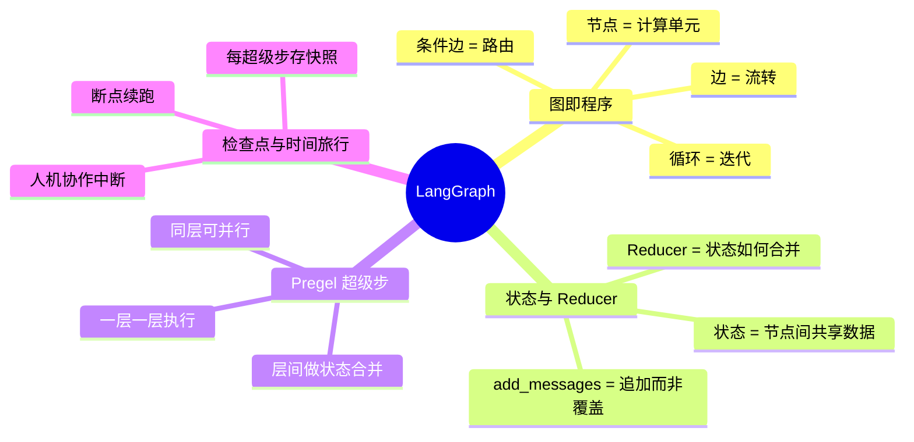

# 核心原理

LangGraph 不是"又一个 Agent 框架"，它是一个**图执行引擎**。理解它要抓住 4 个核心概念，本节逐个讲透。

## 一句话总结

> **把程序画成一张有状态的图，用一个通用引擎跑这张图。**

## 四个核心概念

| 概念 | 一句话 | 对应阶段 |
|------|--------|:--------:|
| [图即程序](graph_as_program.md) | 节点是函数，边是跳转，程序就是一张图 | 1-4 |
| [状态与 Reducer](state_and_reducer.md) | 状态在节点间流动，Reducer 决定怎么合并 | 2, 5 |
| [Pregel 超级步](pregel.md) | 一层一层执行，同层并行，层间合并 | 6 |
| [检查点与时间旅行](checkpoint.md) | 每步存快照，能回放、能中断、能续跑 | 7-8 |

## 阅读建议

1. 先读 [图即程序](graph_as_program.md)——建立"程序=图"的心智模型
2. 再读 [状态与 Reducer](state_and_reducer.md)——理解状态怎么流
3. 然后 [Pregel 超级步](pregel.md)——理解引擎怎么调度
4. 最后 [检查点与时间旅行](checkpoint.md)——理解高级能力从哪来

每个原理页都会标注"在哪个阶段亲手实现"，读完原理就能去看对应阶段的代码。