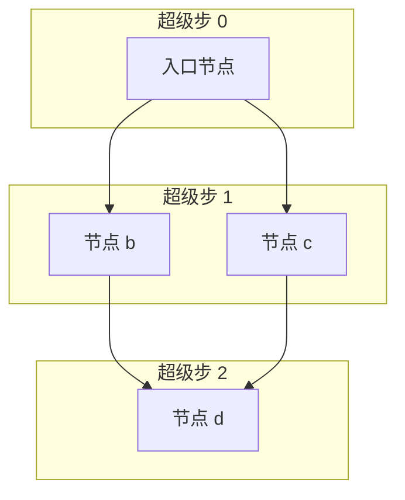

# Pregel 超级步

> **在阶段 6 亲手实现。**

## 从"一条线执行"到"一层一层执行"

朴素跑图：从入口节点开始，执行完跳下一个，DFS 一路走到底。

这有个问题：**同层的多个节点没法并行**，而且**检查点没法对齐**。

LangGraph 借鉴 Google [Pregel](https://research.google/pubs/pregel-a-system-for-large-scale-graph-processing/) 的**超级步（superstep）**模型：



执行规则：

1. **超级步 0**：执行入口节点
2. **超级步 1**：执行所有"上一步激活的"节点（b 和 c **可以并行**）
3. **超级步 2**：合并超级步 1 的所有输出，执行下一层
4. ...直到没有节点要执行

**关键**：同一超级步内的节点并行执行，**超级步之间做状态合并和检查点对齐**。

## 为什么是 Pregel 而不是 DFS

| 需求 | DFS | Pregel 超级步 |
|------|:---:|:------------:|
| 同层并行 | ❌ | ✅ |
| 检查点对齐（每步一个快照） | 难 | 天然 |
| 循环（多轮） | 要特殊处理 | 超级步天然循环 |
| 中断/续跑 | 难 | 快照对齐到超级步 |

## 通道（Channel）

Pregel 里节点间通信用**通道**。可以理解为"带 Reducer 的邮箱"：

- 节点执行完，把更新**写进**通道
- 下一个超级步开始，节点从通道**读**状态
- 通道的 Reducer 决定多次写入怎么合

```
节点 a ──写──▶ [messages 通道, reducer=add] ──读──▶ 节点 b
```

这就是为什么阶段 5 的 Reducer 和阶段 6 的通道是同一件事的两个视角：**Reducer 是通道的合并策略**。

## 简化执行循环

```python
def pregel_loop(graph, initial_state):
    state = initial_state
    step = 0
    pending = {graph.entry_point}   # 本轮要执行的节点

    while pending and step < recursion_limit:
        # 1. 并行执行所有 pending 节点
        updates = parallel_execute(pending, state)

        # 2. 用 Reducer 合并所有更新
        for key, values in group_by_channel(updates):
            state[key] = reduce(state[key], values)

        # 3. 检查点
        checkpoint.save(step, state)

        # 4. 算下一轮要执行哪些节点
        pending = next_nodes(pending, state)
        step += 1

    return state
```

阶段 6 会把这个循环完整实现出来。

## 在哪个阶段实现

| 概念 | 阶段 |
|------|:----:|
| 超级步循环 + 通道 + 并行 | [阶段 6](../stages/stage_6_pregel.md) |

---

👉 上一篇：[状态与 Reducer](state_and_reducer.md) · 下一篇：[检查点与时间旅行](checkpoint.md)