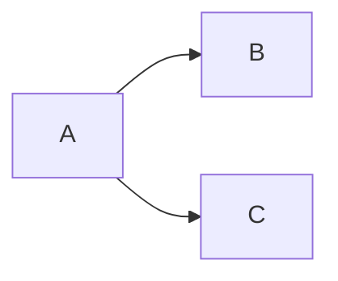
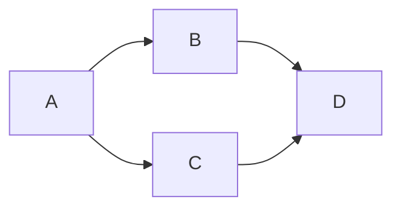
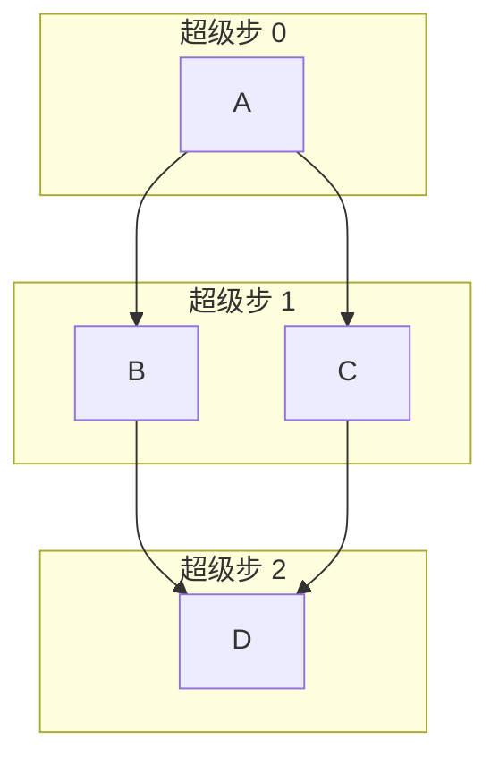
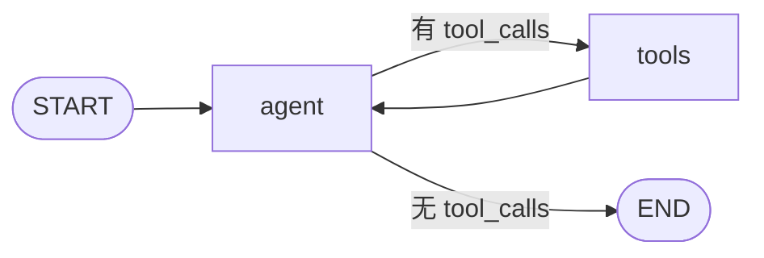
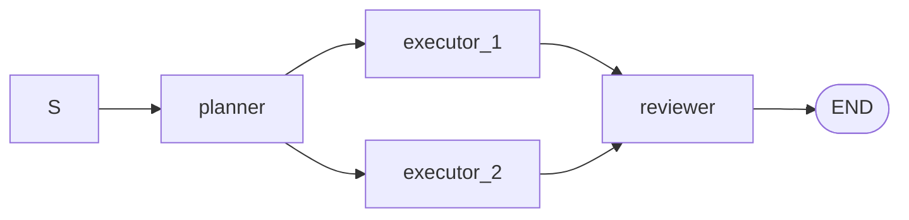

# Pregel 超级步

> **图执行的并行模型。在阶段 6 亲手实现。**

## 概述

本篇讲 tiny-langgraph 的**执行模型**——图是怎么一步步跑的，为什么是这样跑的。

执行模型听起来抽象，但它决定了图能做什么、不能做什么：

- 能不能并行？（Pregel 能，DFS 不能）
- 检查点对齐到哪？（Pregel 对齐到超级步，DFS 难对齐）
- 循环怎么处理？（Pregel 天然循环，DFS 要特殊处理）
- 中断后续跑怎么恢复？（Pregel 快照对齐，DFS 难）

tiny-langgraph 的执行模型叫 **Pregel 超级步**，借鉴自 Google 2010 年的 Pregel 论文。
Pregel 是为大规模图计算设计的，但它的核心思想——**批量同步并行（BSP）**——恰好适合
图执行引擎：同层节点并行、超级步间同步、检查点对齐。

本篇会讲清楚：

1. **Pregel 论文背景**——Google 为什么造 Pregel，解决什么问题。
2. **BSP 模型**——批量同步并行，Pregel 的理论基础。
3. **超级步**——compute → exchange messages → sync，三步循环。
4. **LangGraph 如何借鉴 Pregel**——从图计算到图执行，概念怎么映射。
5. **超级步在 LangGraph 中的具体含义**——pending 集合、状态合并、检查点。
6. **fan-out 和 fan-in**——一个节点多条出边 → 并行；多个节点到一个节点 → 合并。
7. **同层并行 vs 顺序执行**——我们为什么用顺序模拟并行。
8. **通道 = 字段 + Reducer**——Pregel 通道在 LangGraph 的落地。
9. **检查点对齐**——每个超级步后存快照，为什么这样对齐。
10. **从 Pregel 到 Agent**——超级步如何驱动 ReAct 循环。

读完本篇你会理解：**Pregel 不是高深的理论，就是一个 while 循环 + 状态合并 + 检查点。
但它背后的 BSP 模型让并行、循环、持久化、中断统一处理——这是图引擎的核心。**

!!! info "本篇定位"
    本篇是执行模型的原理文档。具体实现看阶段 6 文档。本篇要回答：
    **为什么用 Pregel 超级步而不是 DFS？超级步到底意味着什么？**

---

## 1. Google Pregel 论文背景

### 1.1 论文

**Pregel: A System for Large-Scale Graph Processing**，Google 2010 年发表。
作者 Grzegorz Malewicz 等。论文讲 Google 内部用于大规模图计算的系统 Pregel。

### 1.2 解决什么问题

很多图算法（PageRank、最短路径、连通分量）要在**数十亿节点的图**上跑。单机存不下，
要分布式。但分布式图计算难：

- **图天然不均匀**：有的节点邻居多（热门），有的少。按节点分片，负载不均。
- **消息传递复杂**：节点要给邻居发消息，邻居可能在别的机器。跨机器通信开销大。
- **同步难**：什么时候所有节点都算完了？怎么对齐？

传统 MapReduce 不适合图计算——每轮迭代是一个 MapReduce job，开销大，且不天然表达
"节点给邻居发消息"。

### 1.3 Pregel 的解法

Pregel 用 **BSP（Bulk Synchronous Parallel）** 模型：

1. 把图分片到多台机器。
2. **超级步**循环：
   - 每个活跃节点执行 `compute()`，处理收到的消息，给邻居发新消息。
   - 所有节点 `compute()` 完成后，**同步**（barrier）。
   - 发出的消息在同步后**送达**。
3. 没有活跃节点了，结束。

**关键**：超级步内并行（所有节点同时 compute），超级步间同步（barrier）。这避免了
复杂的锁和一致性——每个超级步是一个"干净的"计算单元。

### 1.4 Pregel 的遗产

Pregel 的 BSP 模型影响了后来很多系统：Apache Giraph、GraphX、Flink Gelly。也影响了
**LangGraph**——虽然 LangGraph 不是分布式图计算，但它借用了 Pregel 的"超级步"概念
作为图执行引擎的执行模型。

---

## 2. BSP（Bulk Synchronous Parallel）模型

### 2.1 BSP 是什么

**BSP = 批量同步并行**，是 Leslie Valiant 1990 年提出的并行计算模型。

BSP 程序的结构：

```
超级步 0: 并行 compute → 同步
超级步 1: 并行 compute → 同步
超级步 2: 并行 compute → 同步
...
```

每个超级步内：

1. **并行 compute**：所有处理器并行执行自己的计算，互不通信。
2. **通信**：compute 结束后，处理器间交换消息（通过通道）。
3. **同步**：所有处理器到达 barrier，消息送达，进入下一超级步。

### 2.2 BSP 的特点

| 特点 | 说明 |
|------|------|
| 超级步内并行 | 处理器同时算，互不干扰 |
| 超级步间同步 | barrier 对齐，消息送达 |
| 通信延迟隐藏 | compute 时不算通信，同步时统一处理 |
| 确定性 | 同样的输入，超级步划分一样 |

### 2.3 BSP vs 其他并行模型

| 模型 | 同步方式 | 通信 | 适合 |
|------|----------|------|------|
| BSP | 超级步 barrier | 批量 | 图计算、图执行 |
| 共享内存 | 锁/原子 | 直接 | 多线程 |
| 消息传递 (MPI) | 点对点 | 显式 | 科学计算 |
| Actor | 异步 | 消息 | 事件驱动 |
| 数据流 | 静态 | 边 | 计算图 (TensorFlow) |

**BSP 的优势**：简单（不用锁）、确定性（超级步划分固定）、易检查点（barrier 处存）。
**BSP 的劣势**：同步开销（barrier 等最慢的）、不灵活（不能细粒度通信）。

对图执行引擎，BSP 的简单和确定性更重要——图执行要可检查点、可中断、可续跑，BSP 天然支持。

---

## 3. 超级步：compute → exchange messages → sync

### 3.1 Pregel 超级步的三步

每个超级步：

```
1. compute: 每个活跃节点执行 compute()，处理上一轮收到的消息，决定给谁发什么
2. exchange: 节点发出的消息路由到目标节点
3. sync: 所有节点到达 barrier，消息送达，进入下一超级步
```

### 3.2 例子：PageRank

PageRank 算法的 Pregel 版：

```python
def compute(self):
    # 处理收到的消息（邻居传来的 rank）
    incoming = sum(self.messages)
    self.value = 0.15 / N + 0.85 * incoming

    # 给邻居发消息
    outgoing = self.value / len(self.neighbors)
    for neighbor in self.neighbors:
        send(neighbor, outgoing)

    # 下一轮还活跃（如果还没收敛）
    if not converged:
        vote_to_halt()  # 没有消息发就停
```

超级步 0：所有节点初始化 rank，发给邻居。
超级步 1：收到邻居的 rank，算新 rank，发给邻居。
...直到收敛。

### 3.3 超级步的"同步"意味着什么

同步 = **所有节点的 compute 都完成了，消息都送达了，才能进下一轮**。

- 如果节点 A 快、节点 B 慢，A 要等 B。
- A 在超级步 N 发的消息，B 在超级步 N+1 才收到（不是 N 内实时）。

这看起来低效（要等最慢的），但**保证确定性**——不管快慢，超级步划分一样，结果一样。
对检查点和调试至关重要。

---

## 4. LangGraph 如何借鉴 Pregel

### 4.1 从图计算到图执行

Pregel 是**图计算**系统——在一张大图上跑算法（PageRank 等），图的节点是数据。
LangGraph 是**图执行**系统——用图描述程序的控制流，图的节点是函数。

两者都是"图"，但含义不同：

| 方面 | Pregel 图计算 | LangGraph 图执行 |
|------|---------------|------------------|
| 图的节点 | 数据节点（如网页） | 函数节点（如 agent_node） |
| 图的边 | 数据关系（如链接） | 控制流（如 agent → tools） |
| 跑什么 | 在每个数据节点上跑 compute | 在函数节点上执行函数 |
| 超级步 | 所有活跃数据节点并行 | 所有 pending 函数节点并行 |
| 终止 | 所有节点 halt | pending 为空 |

### 4.2 借鉴了什么

LangGraph 借鉴 Pregel 的**执行模型**，不是图计算：

1. **超级步**：执行分轮次，每轮一个超级步。
2. **并行**：同一超级步的多个节点并行（概念上）。
3. **同步**：超级步间同步，状态合并后进下一轮。
4. **通道**：节点间通过通道通信，通道有合并策略（Reducer）。
5. **检查点对齐**：每个超级步后存快照。

### 4.3 没借鉴什么

LangGraph **没**借鉴 Pregel 的：

1. **分布式**：Pregel 是多机分布式，LangGraph 是单机（教学）。
2. **图数据**：Pregel 在图数据上跑算法，LangGraph 用图描述程序。
3. **vote_to_halt**：Pregel 节点主动 halt，LangGraph 用 pending 为空判断结束。
4. **消息传递**：Pregel 节点给特定邻居发消息，LangGraph 用共享状态 + Reducer。

**核心借鉴**：超级步 + BSP 同步 + 通道。这三个让 LangGraph 的执行模型有 Pregel 的
好处（并行、确定性、检查点对齐），不需要 Pregel 的复杂（分布式、消息路由）。

---

## 5. 超级步在 LangGraph 中的具体含义

### 5.1 超级步 = 一个 pending 集合的执行

在 LangGraph 里，**超级步 = 执行 pending 集合里的所有节点**。

```python
pending = {entry_point}      # 超级步 0 的 pending
while pending:
    # 执行 pending 里的所有节点（这一轮就是超级步 N）
    updates = [nodes[n](state) for n in pending]
    # 合并
    for u in updates:
        merge(state, u)
    # 算下一轮的 pending
    pending = next_nodes(pending, state)
    step += 1
```

- 超级步 0：`pending = {entry}`，执行入口节点。
- 超级步 1：`pending = next_nodes({entry}, state)`，执行入口的后继。
- ...直到 `pending` 为空。

### 5.2 pending 是什么

**pending = 这一超级步要执行的节点集合。**

```python
pending: set[str]  # 如 {"agent"} 或 {"tool_a", "tool_b"}
```

- 单节点图：`pending` 始终是单元素集。
- fan-out 图：`pending` 可以多元素（一个节点的多个后继）。
- 续跑时：`pending` 从检查点恢复。

### 5.3 next_nodes 怎么算

```python
def next_nodes(pending, state):
    next_set = set()
    for node in pending:
        if node in conditional_edges:
            # 条件边：路由选一个目标
            router, mapping = conditional_edges[node]
            label = router(state)
            target = mapping[label]
            if target != END:
                next_set.add(target)
        else:
            # 静态边：所有出边目标都走（fan-out）
            for target in edges.get(node, []):
                if target != END:
                    next_set.add(target)
    return next_set
```

- 条件边：调 `router(state)` 选一个目标。
- 静态边：所有出边目标都加入（fan-out）。
- `END` 被过滤掉（到了 END 就不进 pending）。

### 5.4 超级步的执行步骤

每个超级步：

```
1. 读快照: step_state = dict(state)
2. 并行执行: updates = [nodes[n](step_state) for n in pending]
3. 合并: for u in updates: merge(state, u)
4. 检查点: checkpoint.save(step, state, pending)
5. 算下一轮: pending = next_nodes(pending, state)
6. step += 1
```

对照 Pregel 的三步：

| Pregel | LangGraph |
|--------|-----------|
| compute | 执行 pending 节点（读快照） |
| exchange messages | 合并 updates 到 state（用 Reducer） |
| sync | 检查点 + 算 next_nodes |

### 5.5 超级步的终止

```python
while pending:  # pending 为空就结束
    ...
```

`pending` 为空的情况：

- 所有节点的后继都是 `END`（正常结束）。
- 条件边路由返回 `END`（Agent 决定不调工具了）。
- 超过 `recursion_limit`（防死循环，抛 `RecursionError`）。

---

## 6. fan-out 和 fan-in

### 6.1 fan-out：一个节点多条出边

```python
graph.add_edge("a", "b")
graph.add_edge("a", "c")  # a 有两条出边
```



执行完 `a`，`next_nodes` 把 `b` 和 `c` 都加入 pending。下一超级步 `b` 和 `c` **并行**执行。

这就是 fan-out——一个节点的结果扇出到多个后继。

### 6.2 fan-out 的例子：并行工具调用

```python
# agent 节点决定调两个工具
graph.add_node("agent", agent_node)
graph.add_node("search", search_tool)
graph.add_node("calculator", calc_tool)
graph.add_conditional_edges("agent", router, {
    "search": "search", "calc": "calculator", "both": "both"
})
# 假设 router 返回 "both"，且 "both" 映射到两个节点
```

（注：当前实现的条件边只选一个目标。真 fan-out 要用静态边或多条条件边。教学简化。）

### 6.3 fan-in：多个节点到一个节点

```python
graph.add_edge("b", "d")
graph.add_edge("c", "d")  # b 和 c 都指向 d
```



`b` 和 `c` 并行执行完，`next_nodes` 把 `d` 加入 pending（`set` 去重，`d` 只出现一次）。
`d` 在下一超级步执行，看到的是 `b` 和 `c` **合并后**的状态。

这就是 fan-in——多个节点的结果扇入到一个后继，由 Reducer 合并。

### 6.4 fan-out + fan-in 的完整流程



| 超级步 | pending | 执行 | 合并 |
|--------|---------|------|------|
| 0 | {a} | a(state) | state += a 的更新 |
| 1 | {b, c} | b(snapshot), c(snapshot) 并行 | state += b 的更新 + c 的更新 |
| 2 | {d} | d(state) | state += d 的更新 |
| 3 | {} | 结束 | - |

**关键**：超级步 1 的 b 和 c 读**同一快照**（超级步 0 后的 state），互不影响。它们的
更新在超级步 1 结束时合并，超级步 2 的 d 才看到合并结果。

### 6.5 fan-in 的合并问题

b 和 c 都写同一字段怎么办？用 Reducer 合并：

```python
# b 返回 {"results": ["b_result"]}
# c 返回 {"results": ["c_result"]}
# 合并（results 用 add Reducer）:
# state["results"] = add(add(old, ["b_result"]), ["c_result"])
# = old + ["b_result", "c_result"]
```

**Reducer 可交换可结合**，所以 b 和 c 的合并顺序无关——并行安全。

---

## 7. 同层并行 vs 顺序执行

### 7.1 概念上的并行

Pregel 模型里，同一超级步的节点**概念上并行**。它们读同一快照、互不通信、独立计算。

### 7.2 我们的实现：顺序执行

```python
# 阶段 6 的实现
step_state = dict(state)
updates = []
for node_name in sorted(pending):          # 顺序执行，不是真并行
    update = self._nodes[node_name](step_state)
    updates.append(update)
for update in updates:
    self._merge(state, update)
```

我们用 `for` 循环顺序执行 pending 里的节点。**不是真并行**。

### 7.3 为什么顺序执行也正确

因为节点读的是 `step_state`（快照），不是实时 state。顺序执行时：

- 节点 b 先执行，读 step_state，返回 update_b。update_b 没合并进 state，state 还是快照。
- 节点 c 后执行，读 step_state（同一份），返回 update_c。
- 最后统一合并 update_b 和 update_c。

**b 和 c 读的是同一快照，执行顺序不影响结果**。所以顺序执行和并行执行结果一样。

### 7.4 为什么不用真并行

**教学简化**。真并行要：

- `asyncio` 或 `threading`——增加复杂度。
- 节点要是 async 函数——改 API。
- 合并要加锁——更复杂。

顺序执行的结果和真并行一样（因为快照隔离），但实现简单。教学优先清晰。

### 7.5 真 LangGraph 的并行

真 LangGraph 支持 `asyncio` 真并行：

```python
# 真 LangGraph
async for event in graph.astream(...):
    ...
```

同超级步的多个 async 节点用 `asyncio.gather` 并行执行。但执行模型（Pregel 超级步）
和我们的完全一样——只是"并行"从顺序模拟变成真 asyncio。

### 7.6 什么时候真并行重要

- **IO 密集**：多个节点调外部 API（如多个工具同时调不同 API）。真并行能省墙钟时间。
- **CPU 密集**：少见（LLM 应用通常 IO 密集）。

对教学，顺序执行够用——理解执行模型比真并行重要。

---

## 8. 通道 = 字段 + Reducer

### 8.1 Pregel 的通道

Pregel 里节点间通信用**通道**。通道是一个"带合并策略的邮箱"：

- 节点 `compute` 时读通道（收消息）。
- `compute` 结束写通道（发消息）。
- 同步时通道用合并策略处理多次写。

### 8.2 LangGraph 的通道

LangGraph 的通道 = **状态的一个字段 + 它的 Reducer**。

```python
class AgentState(TypedDict):
    messages: Annotated[list, add_messages]   # messages 通道
    count: Annotated[int, add]               # count 通道
    user_id: str                              # user_id 通道（覆盖）
```

- `messages` 通道：合并策略是 `add_messages`。
- `count` 通道：合并策略是 `add`。
- `user_id` 通道：合并策略是覆盖（默认）。

### 8.3 通道的读写

**写通道**：节点返回更新片段。

```python
def agent_node(state):
    return {"messages": [new_msg]}  # 写 messages 通道
```

引擎用 Reducer 合并：`state["messages"] = add_messages(state["messages"], [new_msg])`。

**读通道**：节点读 state 的字段。

```python
def agent_node(state):
    msgs = state["messages"]  # 读 messages 通道
    ...
```

读的是超级步开始时的快照（不是其他节点实时写的）。

### 8.4 通道的合并

同一超级步多个节点写同一通道：

```python
# 超级步 N: 节点 a 和 b 都写 messages 通道
update_a = {"messages": [msg_a]}
update_b = {"messages": [msg_b]}

# 合并（顺序无关，因为 add_messages 可交换）
state["messages"] = add_messages(state["messages"], [msg_a])
state["messages"] = add_messages(state["messages"], [msg_b])
```

**Reducer 可交换可结合** → 合并顺序无关 → 并行安全。

### 8.5 通道 vs 字段

为什么不直接叫"字段"？因为"字段"没合并语义，"通道"有。通道是 Pregel 的抽象，
字段是 Python 的抽象。LangGraph 用"字段 + Reducer"落地 Pregel 的通道——
**字段是通道的存储，Reducer 是通道的合并策略**。

---

## 9. 检查点对齐：每个超级步后存快照

### 9.1 对齐到超级步

```python
while pending:
    # 执行超级步
    ...
    # 检查点（超级步结束后存）
    checkpoint.put(thread_id, step, state, pending)
    yield {"nodes": pending, "state": state, "step": step}
    # 算下一轮
    pending = next_nodes(pending, state)
    step += 1
```

每个超级步执行完、状态合并后、算下一轮 pending 之前，存检查点。

### 9.2 为什么对齐到超级步

**超级步后状态是"干净的"**——所有同层节点已合并，state 是一致的全局状态。
这时存快照最自然。

对比：如果在节点执行中途存快照，状态是"半成品"（部分节点已合并、部分没有），
恢复时要处理半成品，复杂。

### 9.3 检查点的内容

```python
{
    "thread_id": "t1",       # 会话标识
    "step": 5,               # 超级步编号
    "state": {...},          # 超级步 5 后的完整状态
    "pending": {"agent"},    # 超级步 6 要执行的节点
}
```

- `state`：超级步 5 后的状态（干净的全局状态）。
- `pending`：超级步 6 要执行的节点（恢复时从这开始）。
- `step`：超级步编号（时间旅行用）。

### 9.4 续跑时恢复

```python
if input is None and checkpointer and thread_id:
    cp = checkpointer.get(thread_id)
    state = dict(cp["state"])           # 恢复状态
    pending = set(cp["pending"])        # 恢复 pending
    step = cp["step"] + 1               # 从下一超级步开始
```

从检查点恢复 state 和 pending，继续 while 循环。**因为检查点对齐到超级步**，
恢复后 state 是干净的，直接接着跑就行——不用处理半成品。

### 9.5 时间旅行

```python
for cp in get_state_history(config):
    print(cp["step"], cp["state"])
```

每个超级步一个检查点，按步数升序。想"回到第 3 步"——加载 `step=3` 的检查点，
从那接着跑。

**因为对齐到超级步**，任何一步的检查点都是"干净的"恢复点——不用找"最近的一致状态"。

---

## 10. 为什么不是真并行：教学简化

### 10.1 真 Pregel 的并行

Pregel 是多机分布式，同超级步的节点在不同机器上真并行。同步用 distributed barrier。

### 10.2 真 LangGraph 的并行

真 LangGraph 单机用 `asyncio`——同超级步的 async 节点用 `asyncio.gather` 并行。
不是多机，但是真协程并行（IO 密集场景能省墙钟时间）。

### 10.3 我们的实现

```python
for node_name in sorted(pending):      # 顺序 for 循环
    update = self._nodes[node_name](step_state)
    updates.append(update)
```

顺序执行。**结果和真并行一样**（因为快照隔离），但墙钟时间没省。

### 10.4 为什么简化

1. **教学聚焦**：讲执行模型（Pregel 超级步），不是讲 asyncio。
2. **API 简单**：节点是普通函数，不是 async 函数。
3. **结果一致**：顺序执行和真并行结果一样（快照隔离保证），只是慢。
4. **可扩展**：要加真并行，把 for 循环改成 `asyncio.gather`，执行模型不变。

### 10.5 怎么加真并行

如果要加真并行（教学进阶）：

```python
async def stream_async(self, ...):
    while pending:
        step_state = dict(state)
        # 真并行：asyncio.gather
        updates = await asyncio.gather(*[
            self._nodes[n](step_state) for n in pending
        ])
        for u in updates:
            self._merge(state, u)
        ...
```

节点要是 async 函数，调用方要用 `async for`。执行模型（超级步、快照、合并）不变。

---

## 11. 对照真 LangGraph 的 Pregel 实现

### 11.1 相同点

| 概念 | 真 LangGraph | tiny-langgraph |
|------|--------------|----------------|
| 超级步 | ✅ | ✅ |
| pending 集合 | ✅ | ✅ |
| 快照隔离 | ✅ | ✅ |
| Reducer 合并 | ✅ | ✅ |
| 检查点对齐 | ✅ | ✅ |
| recursion_limit | ✅ | ✅ |
| fan-out (静态边) | ✅ | ✅ |

### 11.2 不同点

| 方面 | 真 LangGraph | tiny-langgraph |
|------|--------------|----------------|
| 并行 | asyncio 真并行 | 顺序执行 |
| 通道实现 | Channel 类层次 | 字段 + Reducer 函数 |
| 调度 | PregelScheduler 类 | while 循环 |
| 错误处理 | 丰富（重试、降级） | 异常传播 |
| 子图 | 支持 | 不支持（阶段 10） |

### 11.3 真 LangGraph 的 PregelScheduler

真 LangGraph 内部有 `Pregel` 类和 `PregelScheduler`，更抽象。它的超级步循环和我们的
`while pending` 结构一样，但多了：

- 通道版本管理（每个通道有版本号，支持时间旅行到任意版本）。
- 优先级调度（高优先级节点先执行）。
- 中断的细粒度控制（可以在通道级别中断）。

这些是工程优化，不是执行模型差异。**核心的超级步循环和我们的完全一样**。

---

## 12. 从 Pregel 到 Agent：超级步如何驱动 ReAct 循环

### 12.1 ReAct 图



### 12.2 超级步视角

ReAct 循环用超级步看：

| 超级步 | pending | 执行 | next_pending | 说明 |
|--------|---------|------|--------------|------|
| 0 | {agent} | agent_node | {tools} 或 {} | 调 LLM |
| 1 | {tools} | tool_node | {agent} | 执行工具 |
| 2 | {agent} | agent_node | {tools} 或 {} | 再调 LLM |
| 3 | {tools} | tool_node | {agent} | 再执行工具 |
| 4 | {agent} | agent_node | {} | LLM 不调工具，结束 |

每轮 ReAct（agent → tools）是 2 个超级步。N 轮 ReAct 是 2N+1 个超级步（最后多一个 agent 决定结束）。

### 12.3 ReAct 是线性的

注意：ReAct 图里**每超级步只有一个节点**（pending 始终单元素）。所以 Pregel 的并行能力
**没用上**——Agent 是线性的。

但执行模型是 Pregel——统一的 while pending 循环。Agent 只是 Pregel 的一个特例
（每超级步单节点）。

### 12.4 什么时候用上并行

并行在**多 Agent** 或**并行工具调用**时用上：



- 超级步 1: {planner}
- 超级步 2: {executor_1, executor_2}  ← 并行！
- 超级步 3: {reviewer}

这里 Pregel 的并行有意义——两个 executor 真并行（概念上）。

### 12.5 超级步如何驱动循环

ReAct 的循环是 `tools → agent` 的回边。Pregel 怎么处理回边？

**回边不影响超级步模型**——`next_nodes` 算下一轮 pending 时，回边和普通边一样处理：

```python
# tools 节点的静态边: {"tools": ["agent"]}
# next_nodes({tools}, state) = {agent}
```

所以 `tools` 执行完，pending 变成 `{agent}`，下一超级步执行 agent。循环自然形成。

**终止靠条件边返回 END**：

```python
# agent 的条件边: should_continue 返回 END
# next_nodes({agent}, state) = {}  (END 被过滤)
# pending 为空，while 循环结束
```

Pregel 不需要特殊处理循环——回边是边，条件边返回 END 终止，while pending 自然循环。

---

## 13. 实际代码示例

### 13.1 最简单的超级步

```python
from tiny_langgraph.graph import StateGraph, START, END
from typing import TypedDict

class State(TypedDict):
    x: int

def double(state):
    return {"x": state["x"] * 2}

graph = StateGraph(State)
graph.add_node("double", double)
graph.add_edge(START, "double")
graph.add_edge("double", END)
app = graph.compile()

for event in app.stream({"x": 3}):
    print(f"超级步 {event['step']}: pending={event['nodes']}, state={event['state']}")
# 超级步 0: pending={'double'}, state={'x': 6}
```

一个超级步，执行 double，结束。

### 13.2 fan-out 超级步

```python
class State(TypedDict):
    x: int
    y: int

def init(state):
    return {"x": 1, "y": 1}

def add_x(state):
    return {"x": state["x"] + 10}

def add_y(state):
    return {"y": state["y"] + 100}

graph = StateGraph(State)
graph.add_node("init", init)
graph.add_node("add_x", add_x)
graph.add_node("add_y", add_y)
graph.add_edge(START, "init")
graph.add_edge("init", "add_x")   # fan-out: init → add_x 和 add_y
graph.add_edge("init", "add_y")
graph.add_edge("add_x", END)
graph.add_edge("add_y", END)
app = graph.compile()

for event in app.stream({"x": 0, "y": 0}):
    print(f"超级步 {event['step']}: pending={event['nodes']}, state={event['state']}")
# 超级步 0: pending={'init'}, state={'x': 1, 'y': 1}
# 超级步 1: pending={'add_x', 'add_y'}, state={'x': 11, 'y': 101}
```

超级步 1 的 `add_x` 和 `add_y` 并行（概念上），读同一快照（x=1, y=1），各自更新。

### 13.3 循环超级步

```python
class State(TypedDict):
    count: int

def inc(state):
    return {"count": state["count"] + 1}

def router(state):
    return "inc" if state["count"] < 3 else "end"

graph = StateGraph(State)
graph.add_node("inc", inc)
graph.add_edge(START, "inc")
graph.add_conditional_edges("inc", router, {"inc": "inc", "end": END})
app = graph.compile()

for event in app.stream({"count": 0}):
    print(f"超级步 {event['step']}: pending={event['nodes']}, state={event['state']}")
# 超级步 0: pending={'inc'}, state={'count': 1}
# 超级步 1: pending={'inc'}, state={'count': 2}
# 超级步 2: pending={'inc'}, state={'count': 3}
```

3 个超级步，每步 count 加 1，到 3 时 router 返回 "end"，pending 变空，结束。

### 13.4 带检查点的超级步

```python
from tiny_langgraph import MemorySaver

app = graph.compile(checkpointer=MemorySaver())
config = {"configurable": {"thread_id": "t1"}}

list(app.stream({"count": 0}, config=config))
# 存了 3 个检查点（step 0, 1, 2）

history = app.get_state_history(config)
for cp in history:
    print(f"step {cp['step']}: state={cp['state']}, pending={cp['pending']}")
# step 0: state={'count': 1}, pending={'inc'}
# step 1: state={'count': 2}, pending={'inc'}
# step 2: state={'count': 3}, pending={'inc'}
```

每个超级步一个检查点，对齐到超级步边界。

### 13.5 续跑

```python
# 假设上次执行到 step 1 挂了
# 续跑
result = app.invoke(None, config=config)
# 从最新检查点（step 2）恢复，继续执行
```

`input=None` 表示续跑，引擎从检查点恢复 state 和 pending，接着 while 循环。

---

## 14. 超级步的常见误解

### 14.1 误解 1：超级步 = 一个节点

**错**。超级步 = **一个 pending 集合的执行**。pending 可以多元素（fan-out 时）。
单节点图每超级步一个节点，但那是特例。

### 14.2 误解 2：超级步 = 一次 LLM 调用

**错**。超级步和 LLM 无关。超级步是图执行的概念，节点里干什么（调 LLM、查数据库、
算数学）引擎不关心。Agent 的 agent 节点调 LLM，但那是节点逻辑，不是超级步的定义。

### 14.3 误解 3：超级步内节点能互相看到结果

**错**。超级步内节点读**同一快照**，互不看到对方的写。对方的写在超级步结束时合并，
下一超级步才看到。这是 BSP 的核心。

### 14.4 误解 4：超级步越多越慢

**不一定**。超级步的开销是快照拷贝 + 合并 + 检查点。如果节点执行时间长（如调 LLM 几秒），
超级步开销（毫秒级）可忽略。如果节点是纯计算（微秒级），超级步开销可能显著。

### 14.5 误解 5：Pregel 要分布式

**不**。Pregel 是执行**模型**（BSP 超级步），不是部署方式。单机也能用 Pregel 模型——
我们的实现就是单机 Pregel。分布式是 Pregel 论文的场景，不是模型的要求。

---

## 15. 在哪个阶段实现

| 概念 | 阶段 |
|------|:----:|
| 拓扑排序执行（DAG） | [阶段 1](../stages/stage_1_dag.md) |
| while 循环动态遍历 | [阶段 3-4](../stages/stage_4_cycle.md) |
| 超级步 + pending + 快照 | [阶段 6](../stages/stage_6_pregel.md) |
| 检查点对齐到超级步 | [阶段 7](../stages/stage_7_checkpoint.md) |
| 超级步边界中断 | [阶段 8](../stages/stage_8_interrupt.md) |
| Agent 的超级步视角 | [阶段 9](../stages/stage_9_agent.md) |

---

## 16. Pregel 在其他系统的应用

Pregel 的 BSP 模型不只 LangGraph 用。理解其他系统怎么用 Pregel，能加深对超级步的理解。

### 16.1 Apache Giraph

Giraph 是 Apache 基金会的开源 Pregel 实现，用于大规模图计算（如 Facebook 的图分析）。

- **场景**：在数十亿节点的社交图上跑 PageRank、连通分量等。
- **超级步**：每个节点 `compute()`，处理消息、发新消息。
- **分布式**：多机分片，超级步间用 ZooKeeper 同步。
- **和 LangGraph 的区别**：Giraph 是图**计算**（在图数据上跑算法），LangGraph 是图**执行**
  （用图描述程序）。但都用 BSP 超级步。

### 16.2 Spark GraphX

GraphX 是 Spark 的图计算库，用 Pregel API。

```python
# Spark GraphX 的 Pregel API
graph.pregel(
    initialMsg,
    activeDirection=EdgeDirection.Out,
    maxIter=10,
)(
    vprog,    # 节点更新函数
    sendMsg,  # 发消息函数
    mergeMsg  # 合并消息函数
)
```

- `vprog` = Pregel 的 `compute`。
- `sendMsg` = 给邻居发消息。
- `mergeMsg` = 合并多条消息（类似 Reducer！）。

**GraphX 的 `mergeMsg` 就是 LangGraph 的 Reducer**——都是"合并多次写入"的策略。
这印证了 Pregel 通道 + 合并策略是通用抽象。

### 16.3 Flink Gelly

Flink 的图计算库 Gelly 也用 Pregel 模型。和 Giraph/GraphX 类似，都是图计算。
Flink 的优势是流式处理——能增量跑 Pregel（新数据来了接着跑）。

### 16.4 LangGraph 的独特之处

LangGraph 和这些图计算系统都不同：

| 方面 | 图计算 (Giraph/GraphX/Gelly) | 图执行 (LangGraph) |
|------|------------------------------|---------------------|
| 图的含义 | 数据关系 | 控制流 |
| 节点 | 数据节点 | 函数节点 |
| 跑什么 | 算法（PageRank...） | 程序（Agent...） |
| 终止 | 收敛/halt | pending 空 |
| 检查点 | 少（计算完就行） | 核心（要续跑/中断） |
| 人机协作 | 无 | 核心特性 |

**LangGraph 借鉴的是 Pregel 的执行模型（BSP 超级步），不是图计算的应用场景。**
超级步 + 通道 + 合并策略是通用的执行抽象，图计算和图执行都能用。

---

## 17. 超级步的数学视角

### 17.1 超级步作为不动点

图执行可以看作**状态变换函数的迭代**：

```
state_{n+1} = F(state_n)
```

其中 `F` 是"执行一个超级步"的函数：读 state、执行 pending 节点、合并更新。

执行终止 = `F` 的**不动点**：`state* = F(state*)`，即 `pending` 为空，不再变化。

这和 PageRank 的不动点迭代一样——都是"反复变换直到收敛"。区别是 PageRank 收敛到
**数值**，图执行收敛到**pending 空**（控制流终止）。

### 17.2 超级步作为代数

每个超级步的合并是**代数运算**：

```
state_{n+1} = state_n ⊕ update_1 ⊕ update_2 ⊕ ... ⊕ update_k
```

其中 `⊕` 是 Reducer 定义的合并运算。

- `⊕` 可交换：`a ⊕ b = b ⊕ a`（并行顺序无关）。
- `⊕` 可结合：`(a ⊕ b) ⊕ c = a ⊕ (b ⊕ c)`（分组无关）。
- `⊕` 有幺元：`state ⊕ {} = state`（空更新不变）。

这构成一个**交换幺半群**（Commutative Monoid）。Pregel 的并行安全有数学基础——
合并运算构成交换幺半群，所以并行合并顺序无关。

### 17.3 超级步作为偏序

超级步定义了节点执行的**偏序**：

- 超级步 N 的节点 < 超级步 N+1 的节点。
- 同超级步的节点**不可比较**（并行，无先后）。

这个偏序就是图的"拓扑层"（对 DAG）或"动态层"（对有环图）。Pregel 执行就是按这个偏序
一层一层执行。

---

## 18. 超级步的工程考量

### 18.1 超级步粒度

超级步粒度 = 每超级步执行多少节点。

- **细粒度**（每超级步少节点）：检查点多、恢复快、并行度低。
- **粗粒度**（每超级步多节点）：检查点少、恢复慢、并行度高。

LangGraph 的粒度由图结构决定——fan-out 多就粗，线性就细。Agent 通常是细粒度
（每超级步一个节点）。

### 18.2 超级步开销

每个超级步的开销：

1. **快照拷贝**：`dict(state)`，O(|state|)。
2. **节点执行**：节点逻辑，O(节点复杂度)。
3. **状态合并**：每字段 Reducer，O(|update|)。
4. **检查点存储**：序列化 + 存储，O(|state|)。
5. **yield 事件**：构造事件 dict，O(|state|)。

对 Agent（节点是调 LLM，几秒），开销 1-5（毫秒级）可忽略。
对纯计算图（节点微秒级），开销可能显著——这时要减少检查点频率。

### 18.3 超级步和流式

LangGraph 的 `stream` 每超级步 yield 一个事件。这是"**超级步级流式**"——不是 token 级。

```python
for event in graph.stream(...):
    print(event["step"], event["state"])
    # 每个超级步一个 event
```

真 LangGraph 还支持 token 级流式（`astream_events`），能看到 LLM 逐 token 输出。
那是更细的粒度，需要改节点 API（async + yield）。教学用超级步级，够用。

### 18.4 超级步和错误处理

当前实现：节点抛异常 → 整个执行终止。没有"超级步级重试"。

可能的改进：

- **节点级重试**：节点失败重试 N 次。
- **超级步级降级**：超级步失败，跳过该超级步继续。
- **检查点恢复**：失败后从上一个检查点续跑。

这些是工程优化，不影响执行模型。教学用最简单的"异常传播"。

---

## 19. 超级步的边界情况

### 19.1 空图

```python
graph = StateGraph(State)
# 没加节点
app = graph.compile()  # 报错：未设置入口节点
```

空图编译就报错——要有入口才能编译。

### 19.2 单节点图

```python
graph.add_node("only", only_node)
graph.add_edge(START, "only")
graph.add_edge("only", END)
```

执行：超级步 0 执行 `only`，`pending = {}`，结束。一个超级步。

### 19.3 死循环图

```python
def router(state): return "loop"  # 永远返回 loop

graph.add_node("loop", loop_node)
graph.add_edge(START, "loop")
graph.add_conditional_edges("loop", router, {"loop": "loop"})
```

`loop → loop` 永远循环。`recursion_limit` 兜底——超过 25 步抛 `RecursionError`。

### 19.4 中断后续跑的 resuming 标志

```python
if not resuming and self._interrupt_before and (pending & self._interrupt_before):
    # 中断
```

`resuming` 标志的作用：续跑时**跳过第一个超级步的中断检查**。为什么？

续跑时，检查点的 pending 就是中断点（如 `{"tools"}`）。如果不跳过，续跑第一步就又
中断——死循环。`resuming = True` 让续跑第一步直接执行 pending，不检查中断。
执行完一步后 `resuming = False`，后续步骤正常检查中断。

### 19.5 fan-out 后的 fan-in 合并


超级步 1：`{b, c}` 并行。超级步 2：`{d}`（set 去重，d 只出现一次）。

d 看到 b 和 c **合并后**的状态。如果 b 和 c 都写同一字段，用 Reducer 合并——d 看到合并结果。

### 19.6 条件边返回未定义标签

```python
def router(state): return "unknown"  # mapping 里没 "unknown"

graph.add_conditional_edges("x", router, {"a": "node_a"})
```

执行时 `next_nodes` 检查 `label not in mapping`，抛 `ValueError`。这是图定义错误，
编译时不检查（因为 router 是运行时函数），运行时才报。

---

## 20. 超级步的调试技巧

### 20.1 用 stream 看每步

```python
for event in graph.stream(input, config=config):
    print(f"step {event['step']}: pending={event['nodes']}")
    print(f"  state: {event['state']}")
    if event.get("interrupt"):
        print(f"  ⚠ 中断: {event['interrupt']}")
```

`stream` 每超级步 yield 一个事件，能看到执行轨迹。

### 20.2 用 get_state_history 看历史

```python
for cp in graph.get_state_history(config):
    print(f"step {cp['step']}: state={cp['state']}, pending={cp['pending']}")
```

检查点就是执行历史的"存档"，能回看每一步。

### 20.3 用 recursion_limit 防死循环

```python
try:
    graph.invoke(input, recursion_limit=10)
except RecursionError:
    print("超过 10 步，疑似死循环")
```

调试时设小 limit，快速发现死循环。

### 20.4 检查图结构

```python
print(graph._nodes)           # 所有节点
print(graph._edges)           # 静态边
print(graph._conditional_edges)  # 条件边
```

编译前检查图结构，确保边指向存在的节点。

---

## 21. 常见问题

??? question "为什么不用 DFS 执行？"
    DFS（深度优先）也能执行图——从入口一路走到底。但 DFS 有问题：
    - 同层节点不能并行（DFS 是一路走到底）。
    - 检查点难对齐（DFS 中途状态是"半路径"）。
    - 循环要特殊处理（DFS 遇到环要标记已访问）。
    Pregel 超级步解决所有——同层并行、检查点对齐到超级步、循环靠 pending 自然处理。

??? question "超级步和"层"什么关系？"
    对 DAG，超级步就是拓扑层——同层的无依赖节点一轮。对有环图，超级步是"动态层"——
    每轮的 pending 由上一轮的路由决定，不是预编译的。所以超级步是"层"的推广。

??? question "recursion_limit 是限制什么？"
    限制**超级步数**，不是节点执行次数。`while pending` 循环超过 recursion_limit 就抛
    `RecursionError`。默认 25，对 Agent 够用（很少超过 25 轮工具调用）。

??? question "能跳过超级步吗（一次执行多层）？"
    当前实现不能——每超级步都要走完（执行、合并、检查点、yield）。真 LangGraph 有"批处理"
    模式能跳过中间检查点。教学用每步检查点，便于调试和续跑。

??? question "超级步的 sorted(pending) 为什么排序？"
    为了**确定性**——pending 是 set，遍历顺序不定。排序后顺序固定，同样输入同样执行顺序。
    对调试和测试重要（结果可复现）。真并行时排序不影响（并行结果一样），但顺序执行时
    排序让结果确定。

??? question "Pregel 和 MapReduce 什么区别？"
    MapReduce 是"map → reduce"两阶段，每轮迭代是一个 job，开销大。Pregel 是"超级步"
    循环，状态在节点间保持，迭代开销小。对图算法（多轮迭代），Pregel 比 MapReduce 高效。
    LangGraph 借鉴 Pregel 是因为图执行也是多轮迭代（Agent 循环）。

---

## 17. 小结

Pregel 超级步是 tiny-langgraph 的执行模型。核心：

1. **超级步 = 一个 pending 集合的执行**。每轮执行 pending 里的所有节点。
2. **BSP 模型**：超级步内并行（读同一快照）、超级步间同步（合并后进下一轮）。
3. **fan-out + fan-in**：一个节点多出边 → 并行；多节点到一个节点 → Reducer 合并。
4. **通道 = 字段 + Reducer**：Pregel 通道在 LangGraph 的落地。
5. **检查点对齐**：每超级步后存快照，state 是"干净的"全局状态。
6. **循环自然处理**：回边是边，条件边返回 END 终止，while pending 循环。
7. **顺序执行模拟并行**：快照隔离保证结果和真并行一样，实现简单。

**核心洞察**：Pregel 不是高深的分布式理论，就是一个 **while pending 循环 + 快照 + 合并 + 检查点**。
但背后的 BSP 模型让并行、循环、持久化、中断**统一处理**——这是图引擎的核心。

---

## 相关链接

- 上一篇：[状态与 Reducer](state_and_reducer.md)
- 下一篇：[检查点与时间旅行](checkpoint.md)
- 阶段 6：[Pregel 超级步](../stages/stage_6_pregel.md)
- 阶段 9：[Agent 的超级步视角](../stages/stage_9_agent.md)
- Pregel 论文：[Pregel: A System for Large-Scale Graph Processing](https://research.google/pubs/pregel-a-system-for-large-scale-graph-processing/)
- 源码：[`src/tiny_langgraph/graph.py`](https://github.com/your-repo/blob/main/src/tiny_langgraph/graph.py)
