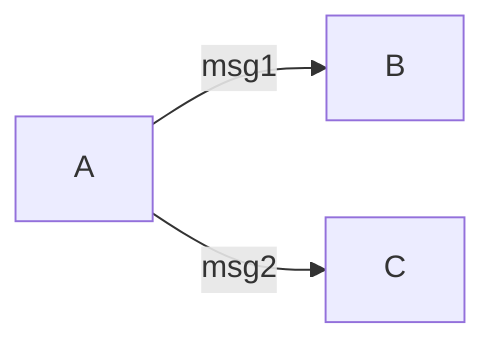
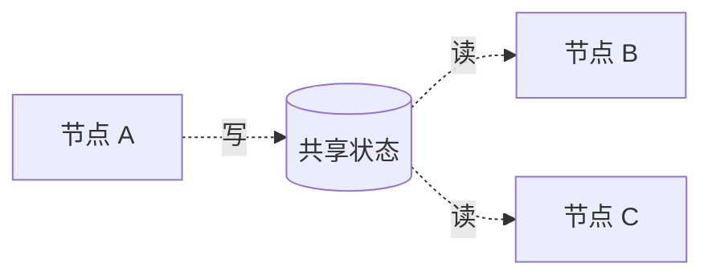
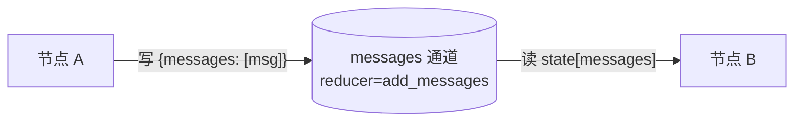
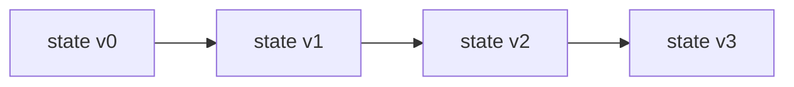

# 状态与 Reducer

> **图执行的核心数据结构。在阶段 2、5 亲手实现。**

## 概述

本篇讲 tiny-langgraph 的**状态管理**——图执行时数据怎么在节点间流动、怎么合并、怎么持久化。

状态是图执行的"血液"。节点是"器官"，边是"血管"，状态在血管里流动、被器官读写。理解状态
管理，就理解了图的执行本质——因为**图执行就是状态的逐步变换**。

本篇会讲清楚几个关键问题：

1. **状态是什么**——共享数据 vs 消息传递，两种模型。
2. **更新片段**——节点为什么不返回完整状态，只返回要改的部分。
3. **合并策略**——覆盖 vs Reducer，为什么默认覆盖对 Agent 是错的。
4. **`Annotated[T, reducer]` 语法**——怎么用类型注解声明合并策略。
5. **`add_messages` 的设计**——按 id 覆盖、否则追加，为什么这么设计。
6. **通道概念**——字段 + Reducer = 通道，Pregel 的视角。
7. **状态快照**——同层节点读同一快照，为什么重要。
8. **状态持久化**——检查点里的 state，怎么存怎么恢复。
9. **状态与人机协作**——`update_state` 怎么让人类改状态。

读完本篇你会理解：**状态管理不是"存个变量"那么简单，它要解决并行合并、持久化、人机协作
三个问题，LangGraph 用 Reducer 机制统一解决。**

!!! info "本篇定位"
    本篇是原理文档，讲"为什么这么设计"。具体 API 在阶段 2 和阶段 5 文档里。本篇要回答：
    **为什么 LangGraph 的状态管理长这样，不长那样？**

---

## 1. 状态在图执行中的角色

### 1.1 什么是状态

**状态 = 图执行中在节点间流动的共享数据。**

```python
from typing import TypedDict

class AgentState(TypedDict):
    messages: list       # 消息历史
    tool_calls: int      # 工具调用次数
    user_id: str         # 用户标识
```

每个节点：

1. **读**状态：`msgs = state["messages"]`。
2. **算**新值：`new_msg = call_llm(msgs)`。
3. **返回更新片段**：`return {"messages": [new_msg]}`。
4. 引擎**合并**更新片段进状态。

### 1.2 状态 vs 局部变量

传统函数的局部变量在函数内部，函数返回就消失。图的状态是**图级的**，跨节点存在，
引擎管理其生命周期。

| 方面 | 局部变量 | 图状态 |
|------|----------|--------|
| 作用域 | 函数内 | 图内（跨节点） |
| 生命周期 | 函数调用期间 | 整个图执行期间 |
| 持久化 | 不持久化 | 可检查点 |
| 可观测 | 调试器才能看 | 每步事件能看到 |
| 人机协作 | 人类改不了 | `update_state` 可改 |

### 1.3 状态是"内存"还是"数据库"？

两者都像，但都不是。

- **像内存**：节点读写很快，在进程里。
- **像数据库**：可持久化（检查点）、可查询（`get_state_history`）、可事务（超级步合并）。
- **不是内存**：有合并策略（Reducer），不是随便读写。
- **不是数据库**：不持久查询，不跨会话（除非检查点）。

**状态是图执行的"工作内存"**——当前这一轮执行的数据，可被检查点持久化。

---

## 2. 共享状态 vs 消息传递

有两种节点间通信模型。LangGraph 选了**共享状态**。

### 2.1 消息传递模型

每个节点有输入端口和输出端口，边连端口。节点把消息**发给**特定后继。



- A 给 B 发 `msg1`，给 C 发 `msg2`。
- B 只看到 `msg1`，C 只看到 `msg2`。
- 节点间**显式传递**数据。

代表：Actor 模型（Akka）、数据流图（TensorFlow）。

### 2.2 共享状态模型

所有节点读写**同一份状态**。节点不直接通信，通过状态间接通信。



- A 写状态，B 和 C 读状态。
- B 和 C 看到的是**同一份状态**（A 写之后的）。
- 节点间**通过状态隐式通信**。

代表：Redux、LangGraph、多数工作流引擎。

### 2.3 为什么 LangGraph 选共享状态

| 方面 | 消息传递 | 共享状态 |
|------|----------|----------|
| 节点耦合 | 高（要知道端口） | 低（只读写状态） |
| 可观测 | 难（消息在边上） | 易（看状态） |
| 持久化 | 难（消息易失） | 易（存状态） |
| 人机协作 | 难（人类改哪条消息？） | 易（改状态） |
| 合并 | 自然（消息就是合并） | 要定义（Reducer） |
| 灵活路由 | 难（端口固定） | 易（条件边看状态） |

**对 LLM 应用，共享状态更合适**：

- Agent 的"状态"就是消息历史，天然是共享数据。
- 人机协作要人类改状态，共享状态直接改。
- 检查点要存"执行到哪了"，共享状态就是答案。
- 路由要"看当前情况决定下一步"，看状态最自然。

消息传递适合**数据流固定**的场景（如 TensorFlow 的计算图）；共享状态适合**控制流动态**
的场景（如 Agent）。

### 2.4 共享状态的代价

共享状态要解决**合并**问题——多个节点同时写同一字段，怎么合？这是下一节的主题。

---

## 3. 更新片段概念

### 3.1 节点返回什么

**节点不返回完整状态，只返回"更新片段"——要改的部分。**

```python
def my_node(state: AgentState) -> dict:
    # 读完整状态
    msgs = state["messages"]
    count = state["tool_calls"]

    # 算
    new_msg = call_llm(msgs)

    # 只返回要改的
    return {"messages": [new_msg], "tool_calls": count + 1}
    # 不返回 user_id（不想改）
```

### 3.2 为什么不返回完整状态

三个原因：

#### 原因 1：并行合并

如果节点返回完整状态，两个并行节点合并时"谁覆盖谁"没法定义：

```python
# 节点 A 返回完整状态
{"messages": [...], "tool_calls": 5, "user_id": "u1"}
# 节点 B 返回完整状态
{"messages": [...], "tool_calls": 3, "user_id": "u1"}
# 合并？tool_calls 是 5 还是 3？
```

更新片段只返回"我改的"，没改的不返回。引擎只合并返回的部分：

```python
# 节点 A 只改 messages
{"messages": [msg_a]}
# 节点 B 只改 tool_calls
{"tool_calls": 5}
# 合并：messages 用 A 的，tool_calls 用 B 的，user_id 不变
```

#### 原因 2：节点不关心全状态

节点只关心自己要改的字段。让它返回完整状态，它得读所有字段、原样返回没改的——啰嗦且易错。

#### 原因 3：Reducer 需要"增量"

Reducer 的语义是 `new_state = reducer(old, update)`。`update` 是**增量**（要加的部分），
不是**全量**（新状态）。`add_messages(old, new)` 把 `new` 追加到 `old`——`new` 是要加的
消息，不是完整消息列表。

### 3.3 更新片段的合并

引擎收到更新片段后，逐字段合并：

```python
def merge(state, update):
    for key, value in update.items():
        if key in reducers:
            state[key] = reducers[key](state.get(key), value)  # 用 Reducer
        else:
            state[key] = value                                  # 默认覆盖
```

- 有 Reducer 的字段：`state[key] = reducer(old, new)`。
- 没 Reducer 的字段：`state[key] = new`（覆盖）。

---

## 4. 合并策略：覆盖 vs Reducer

### 4.1 默认行为：覆盖

最朴素的合并——直接覆盖：

```python
state["messages"] = update["messages"]
```

阶段 2 的实现就是覆盖。这对**标量字段**合适（`user_id`、`count`），但对**列表字段**错。

### 4.2 覆盖对 Agent 是错的

Agent 的 `messages` 应该**追加**，不是覆盖：

```python
# 第一轮：agent 节点返回 {"messages": [assistant_msg_1]}
# 覆盖后：state["messages"] = [user_msg, assistant_msg_1]  ← user_msg 丢了！
```

如果覆盖，每轮 LLM 调用都把上一轮的消息丢了——Agent 失忆。

### 4.3 Reducer：声明合并策略

LangGraph 的解法：**给字段声明一个 Reducer 函数**，告诉引擎怎么合并。

```python
from typing import Annotated
from operator import add

class AgentState(TypedDict):
    messages: Annotated[list, add]      # 用 add 合并：old + new
    tool_calls: Annotated[int, add]     # 用 add 合并：old + new
    user_id: str                        # 没 Reducer：覆盖
```

`Annotated[list, add]` 的意思：`messages` 字段用 `add` 函数合并。

引擎合并时：

```python
state["messages"] = add(state["messages"], update["messages"])
# = state["messages"] + update["messages"]
# = 旧列表 + 新列表 = 追加
```

### 4.4 Reducer 的签名

Reducer 是一个**二元函数**：

```python
def reducer(old: T, new: T) -> T:
    """给定旧值和更新值，返回合并后的值。"""
    ...
```

- `old`：字段当前值（可能 None，首次写入）。
- `new`：节点返回的更新值。
- 返回：合并后的新值。

### 4.5 常见 Reducer

| Reducer | 行为 | 典型用途 |
|---------|------|----------|
| 覆盖（默认） | `new` | 标量字段（user_id、status） |
| `operator.add` | `old + new` | 列表追加、计数累加、字典合并 |
| `add_messages` | 按 id 覆盖、否则追加 | LLM 消息列表 |
| 自定义 | 任意 | 去重、取最大、取最新... |

### 4.6 自定义 Reducer 例子

**取最大值**（如"最高得分"）：

```python
def max_reducer(old, new):
    return max(old or new, new)

class State(TypedDict):
    best_score: Annotated[float, max_reducer]
```

**去重追加**（如"已访问节点集合"）：

```python
def append_unique(old, new):
    result = list(old or [])
    for item in new:
        if item not in result:
            result.append(item)
    return result

class State(TypedDict):
    visited: Annotated[list, append_unique]
```

**保留最新 N 条**（如"最近 10 条消息"）：

```python
def last_n(n):
    def reducer(old, new):
        return (old or [] + new)[-n:]
    return reducer

class State(TypedDict):
    recent: Annotated[list, last_n(10)]
```

---

## 5. `Annotated[T, reducer]` 语法详解

### 5.1 Annotated 是什么

`Annotated` 是 Python 3.9+ 的类型工具，给类型**附加元数据**：

```python
from typing import Annotated

x: Annotated[int, "positive"] = 5  # 类型是 int，元数据是 "positive"
```

运行时 `Annotated[int, "positive"]` 的类型是 `int`，元数据 `"positive"` 不影响运行——
除非有人主动去读它。

### 5.2 LangGraph 怎么用 Annotated

LangGraph 用 Annotated 的元数据位置存 Reducer：

```python
class AgentState(TypedDict):
    messages: Annotated[list, add_messages]   # 元数据是 add_messages 函数
    count: int                                 # 没元数据，默认覆盖
```

引擎在编译时用 `extract_reducers` 读出元数据：

```python
def extract_reducers(state_type):
    reducers = {}
    hints = get_type_hints(state_type, include_extras=True)
    for key, hint in hints.items():
        if get_origin(hint) is Annotated:
            _base, *metadata = get_args(hint)
            if metadata and callable(metadata[0]):
                reducers[key] = metadata[0]   # 元数据的第一个元素是 Reducer
    return reducers
```

`extract_reducers(AgentState)` 返回 `{"messages": add_messages}`。

### 5.3 为什么用 Annotated 而不是单独参数

**设计选择 1：Annotated（LangGraph 的方式）**

```python
class AgentState(TypedDict):
    messages: Annotated[list, add_messages]
```

优点：合并策略和字段类型在一起，声明式。
缺点：要懂 Annotated。

**设计选择 2：单独传 reducers 参数**

```python
graph = StateGraph(State, reducers={"messages": add_messages})
```

优点：不用 Annotated。
缺点：合并策略和字段定义分离，易漏。

**设计选择 3：字段类**

```python
class MessagesField(Field, reducer=add_messages): pass
class AgentState(TypedDict):
    messages: MessagesField
```

优点：面向对象。
缺点：啰嗦。

LangGraph 选 1，因为**合并策略是字段类型的一部分**——"这个字段是追加型的列表"是类型信息，
不是配置。Annotated 让类型信息集中。

### 5.4 Annotated 的元数据可以是多个

```python
x: Annotated[int, "positive", "large"] = 100
```

LangGraph 只用第一个（`metadata[0]`）当 Reducer。后面的忽略（或留给其他工具用）。

### 5.5 没有 Reducer 的字段

```python
class State(TypedDict):
    count: int          # 没 Annotated，没 Reducer
    name: str           # 没 Annotated，没 Reducer
```

`extract_reducers(State)` 返回 `{}`。合并时这两个字段都覆盖。

---

## 6. `add_messages` 的设计

`add_messages` 是 LangGraph 最重要的内置 Reducer。它智能合并消息列表。

### 6.1 规则

```
add_messages(old, new):
    对 new 里的每条消息：
        - 如果 msg 有 "id" 且 old 里有同 id 的消息：覆盖那条
        - 否则：追加到末尾
```

### 6.2 为什么不直接用 `+`

`+`（`operator.add`）是纯追加：

```python
old = [{"id": "a", "content": "你"}, {"id": "b", "content": "好"}]
new = [{"id": "a", "content": "你好"}]
old + new
# = [{"id": "a", "content": "你"}, {"id": "b", "content": "好"}, {"id": "a", "content": "你好"}]
# 两条 id=a 的消息！
```

`add_messages` 按 id 覆盖：

```python
add_messages(old, new)
# = [{"id": "a", "content": "你好"}, {"id": "b", "content": "好"}]
# id=a 的消息被更新，不是追加
```

### 6.3 为什么需要按 id 覆盖

**场景：流式补全**。LLM 流式返回时，同一条消息会被多次更新（每次内容更长）：

```
chunk 1: {"id": "a", "content": "你"}
chunk 2: {"id": "a", "content": "你好"}
chunk 3: {"id": "a", "content": "你好世"}
chunk 4: {"id": "a", "content": "你好世界"}
```

如果用 `+`，消息列表会有 4 条半成品。`add_messages` 按 id 覆盖，只有 1 条不断增长的：

```
add_messages([], [chunk1]) = [{"id": "a", "content": "你"}]
add_messages(..., [chunk2]) = [{"id": "a", "content": "你好"}]
add_messages(..., [chunk3]) = [{"id": "a", "content": "你好世"}]
add_messages(..., [chunk4]) = [{"id": "a", "content": "你好世界"}]
```

**场景：消息编辑**。用户编辑了之前的消息，应该更新而不是追加：

```python
update_state(config, {"messages": [{"id": "msg-3", "content": "编辑后的内容"}]})
# add_messages 按 id="msg-3" 覆盖那条消息
```

### 6.4 没有 id 的消息

如果消息没 `id`，`add_messages` 退化为纯追加（和 `+` 一样）：

```python
old = [{"role": "user", "content": "hi"}]
new = [{"role": "assistant", "content": "hello"}]
add_messages(old, new)
# = [{"role": "user", "content": "hi"}, {"role": "assistant", "content": "hello"}]
```

非流式场景通常没 id，`add_messages` 就当 `+` 用。

### 6.5 实现逐行解读

```python
def add_messages(old, new):
    if not old:
        return list(new) if new else []      # old 空，直接返回 new 的拷贝
    if not new:
        return list(old)                      # new 空，返回 old 的拷贝

    result = list(old)                        # 拷贝 old（不修改输入）
    id_to_index = {}                          # 建 id → 索引映射
    for i, msg in enumerate(result):
        if isinstance(msg, dict) and "id" in msg:
            id_to_index[msg["id"]] = i

    for msg in new:                           # 遍历新消息
        msg_id = msg.get("id") if isinstance(msg, dict) else None
        if msg_id is not None and msg_id in id_to_index:
            result[id_to_index[msg_id]] = msg # 有同 id：覆盖
        else:
            result.append(msg)                # 无 id 或新 id：追加
            if msg_id is not None:
                id_to_index[msg_id] = len(result) - 1  # 更新索引映射
    return result
```

要点：

1. **不修改输入**：`result = list(old)` 拷贝，原 old 不动。
2. **建索引映射**：`id_to_index` 让覆盖是 O(1) 查找，不是 O(n) 扫描。
3. **新 id 也记索引**：如果 new 里有新 id 的消息，追加后也记索引——万一 new 里
   后面又有同 id 的消息（虽然少见），能正确覆盖刚追加的那条。

### 6.6 复杂度

- 时间：O(|old| + |new|)——建索引 O(|old|)，遍历 new O(|new|)。
- 空间：O(|old| + |new|)——结果列表 + 索引映射。

对 Agent 的消息列表（通常几十到几百条），完全够快。

---

## 7. 通道概念：字段 + Reducer = 通道

### 7.1 什么是通道

**通道 = 一个字段 + 它的 Reducer**。它是 Pregel 模型里节点间通信的抽象。



- 节点 A 写通道：返回 `{"messages": [msg]}`。
- 通道用 Reducer 合并：`state["messages"] = add_messages(old, [msg])`。
- 节点 B 读通道：`state["messages"]`。

### 7.2 通道的语义

通道是一个"**带合并策略的邮箱**"：

- **写**：节点返回更新片段，引擎把每个字段写进对应通道。
- **合并**：通道用 Reducer 合并多次写。
- **读**：节点从通道读当前值（超级步开始时的快照）。
- **快照**：每个超级步后，通道的值是"干净的"（所有写已合并）。

### 7.3 通道 vs 字段

为什么不直接叫"字段"？因为"字段"没有合并语义，"通道"有。

| 概念 | 字段 | 通道 |
|------|------|------|
| 数据 | ✅ | ✅ |
| 合并策略 | ❌ | ✅ (Reducer) |
| 写语义 | 赋值 | 增量合并 |
| 读语义 | 当前值 | 超级步开始时的快照 |
| Pregel 对应 | 无 | Pregel 的 channel |

在 Pregel 论文里，节点间通信用"channel"。LangGraph 的通道就是"字段 + Reducer"——
这是把 Pregel 的抽象落地到 Python 的 TypedDict。

### 7.4 通道的并行安全

同一超级步的多个节点可能同时写同一通道。通道的 Reducer 决定怎么合：

```python
# 超级步 N：节点 A 和 B 并行，都写 messages 通道
update_a = {"messages": [msg_a]}    # A 写
update_b = {"messages": [msg_b]}    # B 写

# 合并：add_messages(add_messages(old, [msg_a]), [msg_b])
# 或：add_messages(add_messages(old, [msg_b]), [msg_a])
# add_messages 可交换（对无 id 消息），所以顺序无关
```

**Reducer 天然可交换可结合**（`add` 和 `add_messages` 都是），所以并行写通道的合并
顺序不影响结果。这是 Pregel 并行的数学基础。

### 7.5 通道的例子

```python
class AgentState(TypedDict):
    messages: Annotated[list, add_messages]   # messages 通道：智能追加
    tool_calls: Annotated[int, add]           # tool_calls 通道：累加
    user_id: str                              # user_id 通道：覆盖
    memory: Annotated[dict, lambda o, n: {**o, **n}]  # memory 通道：字典合并
```

四个通道，四种合并策略。节点只管"我要改什么"，通道管"怎么合"。

---

## 8. Pregel 中的通道语义

### 8.1 Pregel 的执行循环

```python
pending = {entry}
while pending:
    # 1. 所有 pending 节点读同一状态快照（通道的当前值）
    snapshot = dict(state)
    updates = [nodes[n](snapshot) for n in pending]

    # 2. 把所有更新写进通道（用 Reducer 合并）
    for u in updates:
        for key, value in u.items():
            channel[key].write(value)  # = reducer(state[key], value)

    # 3. 超级步结束，通道值"固化"，下一超级步的节点读到新值
    checkpoint.save(step, state)

    # 4. 算下一轮
    pending = next_nodes(pending, state)
    step += 1
```

### 8.2 通道的"读"

节点读通道 = 读 `state[key]`。但**读的是超级步开始时的快照**，不是其他节点实时写的值。

```python
# 超级步 N：节点 A 和 B 并行
snapshot = dict(state)           # 快照
update_a = node_a(snapshot)      # A 读快照
update_b = node_b(snapshot)      # B 读快照（同一份）
# A 和 B 互不影响——读的是快照，不是对方的写
```

这是 BSP 模型的核心：**批量同步并行**。超级步内并行、互不干扰；超级步间同步、看到上一轮结果。

### 8.3 通道的"写"

节点写通道 = 返回更新片段。引擎用 Reducer 合并：

```python
# 超级步 N：A 和 B 都写 messages 通道
update_a = {"messages": [msg_a]}
update_b = {"messages": [msg_b]}

# 合并（顺序无关，因为 Reducer 可交换）
state["messages"] = add_messages(state["messages"], [msg_a])
state["messages"] = add_messages(state["messages"], [msg_b])
# = old + [msg_a, msg_b]
```

### 8.4 通道的"同步"

超级步结束时，所有写已合并，通道值"干净"。下一超级步的节点读到这个干净值。

这就是"同步"——不是多线程同步（锁），是**超级步边界的值固化**。

---

## 9. 状态快照：同层节点读同一快照

### 9.1 什么是快照

**快照 = 超级步开始时的状态拷贝。** 同一超级步的所有节点读这个快照，互不影响。

```python
# 阶段 6 的实现
step_state = dict(state)              # 快照
updates = []
for node_name in sorted(pending):
    update = self._nodes[node_name](step_state)  # 所有节点读同一快照
    updates.append(update)
for update in updates:
    self._merge(state, update)        # 合并到真实 state（不是快照）
```

### 9.2 为什么需要快照

**没有快照的问题**：节点 A 改了 state，节点 B 读到 A 改后的 state——B 的行为依赖 A 先执行。
这破坏了并行性（A 和 B 不能并行，因为有隐式依赖）。

**有快照**：A 和 B 都读超级步开始时的 state，互不影响。A 的写在超级步结束时才合并进 state，
B 看不到。A 和 B 真并行，顺序无关。

### 9.3 快照的代价

快照是 `dict(state)`——浅拷贝。对大状态（如长消息列表），每超级步拷一次有开销。

优化：

- **浅拷贝**：只拷字典，不拷值。值（如 list）是共享的——只要节点不原地改值（而是返回新值），就安全。
- **写时复制**：更高级的优化，只在写时拷。教学不用。

### 9.4 快照和 Reducer 的关系

快照保证**读**隔离，Reducer 保证**写**合并。两者一起让并行安全：

- 读：所有节点读同一快照，互不影响。
- 写：所有节点的更新用 Reducer 合并，顺序无关。

---

## 10. 状态持久化：检查点中的 state

### 10.1 检查点存什么

每个超级步后，存一个检查点：

```python
checkpoint = {
    "thread_id": "t1",       # 会话标识
    "step": 5,               # 超级步编号
    "state": {...},          # 完整状态
    "pending": {"agent"},    # 下一步要执行的节点
}
```

`state` 是完整状态（不是更新片段）。检查点要能独立恢复执行，所以存全量。

### 10.2 state 怎么存

**MemorySaver**：直接存 dict 引用（进程内）。

```python
def put(self, thread_id, step, state, pending):
    history = self._storage.setdefault(thread_id, [])
    history.append({"thread_id": thread_id, "step": step,
                    "state": state, "pending": pending})
```

**SqliteSaver**：JSON 序列化后存数据库。

```python
def put(self, thread_id, step, state, pending):
    self._conn.execute(
        "INSERT OR REPLACE INTO checkpoints VALUES (?, ?, ?, ?)",
        (thread_id, step,
         json.dumps(state, ensure_ascii=False),          # state → JSON
         json.dumps(sorted(pending), ensure_ascii=False)),  # pending → JSON
    )
```

### 10.3 state 的序列化

JSON 序列化要求 state 是 **JSON 兼容的**——dict、list、str、int、float、bool、None。
不能有自定义对象（除非有 `model_dump` / `to_dict`）。

这就是为什么 `AgentState` 用 `dict[str, Any]` 而不是自定义类——dict 天然 JSON 兼容。
如果用 Pydantic model，要确保它能 `model_dump` 出 JSON 兼容的 dict。

### 10.4 state 的恢复

续跑时从检查点恢复 state：

```python
cp = checkpointer.get(thread_id)
state = dict(cp["state"])      # 恢复 state（拷贝，避免改检查点）
pending = set(cp["pending"])   # 恢复 pending
step = cp["step"] + 1          # 从下一步开始
```

`dict(cp["state"])` 浅拷贝——恢复后执行会改 state，不能改检查点里的原值。

### 10.5 状态复制问题：引用 vs 值

**陷阱**：如果 state 里有可变对象（如 list），`dict(state)` 浅拷贝——新 dict 的值
还是指向原 list。改新 dict 的 list 会改原 list。

```python
state = {"messages": [1, 2, 3]}
snapshot = dict(state)
snapshot["messages"].append(4)  # 改了 snapshot 的 list
# state["messages"] 也变成 [1, 2, 3, 4]！因为共享同一个 list
```

**当前实现的保护**：节点不原地改 state 的值，而是返回新值让引擎合并。引擎合并时
`state[key] = reducer(old, new)`——`reducer` 返回新对象（如 `add_messages` 的 `list(old)`），
不原地改。所以浅拷贝够用。

**如果要原地改**：要深拷贝 `copy.deepcopy(state)`，但开销大。教学用浅拷贝 + 约定"不原地改"。

---

## 11. 状态与人机协作：`update_state`

### 11.1 场景

Agent 在工具执行前暂停（`interrupt_before=["tools"]`）。人类看了 LLM 的提议，想修改状态
（比如加一条"用户拒绝"的消息），再续跑。

### 11.2 `update_state` 的语义

```python
def update_state(self, config, values):
    """把 values 合并进最新检查点的 state（用 Reducer 合并）。"""
    cp = checkpointer.get(thread_id)
    new_state = dict(cp["state"])
    self._merge(new_state, values)          # 用 Reducer 合并
    checkpointer.put(thread_id, cp["step"], new_state, cp["pending"])
```

- 取最新检查点。
- 把 `values` 用 Reducer 合并进 state。
- 存回检查点（覆盖最新）。

### 11.3 用法

```python
# 暂停后，人类加一条消息
agent.update_state(config, {
    "messages": [{"role": "user", "content": "不要发这封邮件"}]
})
# add_messages 把这条 user 消息追加到历史

# 续跑
result = agent.invoke(None, config=config)
# agent 节点看到这条新消息，重新决策
```

### 11.4 `update_state` 和 Reducer

`update_state` 用 `_merge`，所以走 Reducer：

- `messages` 字段：`add_messages` 追加。
- `count` 字段（如果传了）：`add` 累加。
- `user_id` 字段（如果传了）：覆盖。

**人类不需要懂 Reducer**——`update_state` 自动用对应 Reducer 合并。人类只管"我要改什么"。

### 11.5 `update_state` 的限制

`update_state` 只能改 state，不能改 pending（下一步要执行什么）。如果想"不执行 tools 了，
直接跳到 agent"，当前实现做不到——要改 pending。真 LangGraph 的 `update_state` 有更多选项。

---

## 12. 对照真实 LangGraph 的状态管理

### 12.1 相同点

| 概念 | 真 LangGraph | tiny-langgraph |
|------|--------------|----------------|
| 共享状态 | ✅ | ✅ |
| 更新片段 | ✅ | ✅ |
| `Annotated[T, reducer]` | ✅ | ✅ |
| `add_messages` | ✅ | ✅ |
| 通道概念 | ✅ | ✅ |
| 超级步快照 | ✅ | ✅ |
| 检查点存 state | ✅ | ✅ |
| `update_state` | ✅ | ✅ |

### 12.2 不同点

| 方面 | 真 LangGraph | tiny-langgraph |
|------|--------------|----------------|
| 状态类型 | TypedDict / Pydantic | dict 子类 |
| 消息类型 | BaseMessage 体系 | 原生 dict |
| Reducer 验证 | 类型检查 | 无 |
| 通道实现 | Channel 类 | 字段 + Reducer 函数 |
| 深拷贝 | 可配置 | 浅拷贝 |
| `update_state` 选项 | 丰富（可改 pending、as_node） | 基础 |

### 12.3 真 LangGraph 的 Channel 类

真 LangGraph 内部有 `Channel` 类层次（`BinaryOperatorAggregateChannel` 等），更抽象。
我们的"字段 + Reducer"是它的简化版——概念一致，实现更直接。

---

## 13. 实际代码示例

### 13.1 基础：覆盖合并（阶段 2）

```python
from tiny_langgraph.graph import StateGraph, START, END
from typing import TypedDict

class State(TypedDict):
    count: int

def inc(state):
    return {"count": state["count"] + 1}   # 返回更新片段

graph = StateGraph(State)
graph.add_node("inc", inc)
graph.add_edge(START, "inc")
graph.add_edge("inc", END)
app = graph.compile()

result = app.invoke({"count": 0})
print(result)  # {'count': 1}
```

`count` 没 Reducer，覆盖合并。`inc` 返回 `{"count": 1}`，引擎 `state["count"] = 1`。

### 13.2 Reducer：追加合并（阶段 5）

```python
from typing import Annotated
from operator import add

class State(TypedDict):
    messages: Annotated[list, add]    # 追加
    count: int                        # 覆盖

def add_msg(state):
    return {"messages": ["hello"]}    # 只返回新消息

def inc(state):
    return {"count": state["count"] + 1}

graph = StateGraph(State)
graph.add_node("add_msg", add_msg)
graph.add_node("inc", inc)
graph.add_edge(START, "add_msg")
graph.add_edge("add_msg", "inc")
graph.add_edge("inc", END)
app = graph.compile()

result = app.invoke({"messages": [], "count": 0})
print(result)  # {'messages': ['hello'], 'count': 1}
```

`messages` 用 `add`，追加。`add_msg` 返回 `{"messages": ["hello"]}`，引擎
`state["messages"] = state["messages"] + ["hello"] = ["hello"]`。

### 13.3 `add_messages`：按 id 覆盖

```python
from tiny_langgraph.reducers import add_messages

old = [{"id": "a", "content": "你"}, {"id": "b", "content": "好"}]
new = [{"id": "a", "content": "你好"}, {"id": "c", "content": "世界"}]
result = add_messages(old, new)
print(result)
# [{'id': 'a', 'content': '你好'}, {'id': 'b', 'content': '好'}, {'id': 'c', 'content': '世界'}]
# id=a 被覆盖，id=c 被追加
```

### 13.4 多节点并行写同一通道

```python
class State(TypedDict):
    values: Annotated[list, add]    # 多个节点都写 values

def node_a(state):
    return {"values": ["a"]}

def node_b(state):
    return {"values": ["b"]}

graph = StateGraph(State)
graph.add_node("a", node_a)
graph.add_node("b", node_b)
graph.add_edge(START, "a")          # fan-out: START → a 和 b
# 注意：阶段 6 的 fan-out 要从一个节点多条出边
# 这里简化演示

app = graph.compile()
result = app.invoke({"values": []})
# 如果 a 和 b 并行，values = [] + ["a"] + ["b"] = ["a", "b"]
```

### 13.5 状态持久化

```python
from tiny_langgraph import MemorySaver

saver = MemorySaver()
app = graph.compile(checkpointer=saver)
config = {"configurable": {"thread_id": "t1"}}

# 第一次执行
result = app.invoke({"count": 0}, config=config)
# 检查点存了 {thread_id: "t1", step: 0, state: {count: 1}, pending: ...}

# 看历史
history = app.get_state_history(config)
for cp in history:
    print(cp["step"], cp["state"])
# 0 {'count': 1}
```

### 13.6 `update_state` 人机协作

```python
class State(TypedDict):
    messages: Annotated[list, add_messages]

# ... 构建带 interrupt 的图 ...
app = graph.compile(checkpointer=MemorySaver(), interrupt_before=["review"])
config = {"configurable": {"thread_id": "t1"}}

# 执行到 review 前暂停
events = list(app.stream({"messages": [...]}, config=config))
# events[-1]["interrupt"] == "before"

# 人类改状态
app.update_state(config, {"messages": [{"role": "user", "content": "我改主意了"}]})

# 续跑
result = app.invoke(None, config=config)
```

---

## 14. 状态管理的常见陷阱

### 14.1 陷阱 1：原地改 state

```python
# 错误
def bad_node(state):
    state["messages"].append("new")  # 原地改！
    return {}                         # 返回空更新

# 正确
def good_node(state):
    return {"messages": ["new"]}      # 返回更新片段，让引擎合并
```

原地改破坏快照隔离（其他并行节点会看到改后的值）和 Reducer 语义（Reducer 没机会合并）。

### 14.2 陷阱 2：返回完整状态

```python
# 错误（啰嗦且易错）
def bad_node(state):
    new_msg = call_llm(state["messages"])
    return {"messages": state["messages"] + [new_msg]}  # 返回完整列表

# 正确
def good_node(state):
    new_msg = call_llm(state["messages"])
    return {"messages": [new_msg]}    # 只返回新消息，Reducer 会追加
```

返回完整状态时，如果字段有 Reducer，会**双重合并**——`add_messages(old, complete_list)`
把完整列表又追加一遍。

### 14.3 陷阱 3：Reducer 不可交换

```python
# 错误的 Reducer（不可交换）
def subtract(old, new):
    return (old or 0) - new

# 节点 A 返回 {x: 3}，节点 B 返回 {x: 5}
# 合并顺序 A→B: (0 - 3) - 5 = -8
# 合并顺序 B→A: (0 - 5) - 3 = -8  ← 这个碰巧一样
# 但 old=10 时：A→B: (10-3)-5=2, B→A: (10-5)-3=2  ← 一样
# 减法碰巧可结合，但 old=10, A=3, B=5, C=2:
# A→B→C: ((10-3)-5)-2=0
# C→B→A: ((10-2)-5)-3=0  ← 一样
# 实际上减法可结合，但不可交换：A→B: 10-3-5=2, B→A: 10-5-3=2 ← 一样
# 算了，减法可交换可结合（对 old 固定时）。换个例子：
def prepend(old, new):
    return new + (old or [])  # new 放前面

# A 返回 [1], B 返回 [2]
# A→B: [2] + ([1]) = [2, 1]
# B→A: [1] + ([2]) = [1, 2]
# 不一样！prepend 不可交换
```

不可交换的 Reducer 让并行合并顺序依赖——结果不确定。**Reducer 必须可交换可结合**。

### 14.4 陷阱 4：状态里有不可序列化对象

```python
class State(TypedDict):
    llm: Any  # 存了 OpenAI 客户端对象

# SqliteSaver 存检查点时 json.dumps(state) → 报错（OpenAI 对象不可 JSON 序列化）
```

状态里只放 **JSON 兼容的数据**。客户端、连接池等不可序列化对象不放状态，放闭包或全局。

---

## 15. 在哪个阶段实现

| 概念 | 阶段 |
|------|:----:|
| 共享状态（覆盖合并） | [阶段 2](../stages/stage_2_state.md) |
| `Annotated` + Reducer 机制 | [阶段 5](../stages/stage_5_reducer.md) |
| `add_messages` 智能合并 | [阶段 5](../stages/stage_5_reducer.md) |
| 通道 + 超级步快照 | [阶段 6](../stages/stage_6_pregel.md) |
| 检查点存 state | [阶段 7](../stages/stage_7_checkpoint.md) |
| `update_state` 人机协作 | [阶段 8](../stages/stage_8_interrupt.md) |

---

## 16. 状态的历史脉络

### 16.1 从全局变量到共享状态

状态管理的历史演变：

- **1950s**：全局变量——所有函数共享。简单但耦合高。
- **1970s**：参数传递——函数间显式传数据。解耦但啰嗦。
- **1990s**：对象状态——OOP 把状态封装在对象里。模块化但对象间耦合。
- **2000s**：Redux/Flux——前端的状态管理，单一状态树 + Reducer。
- **2020s**：LangGraph——图级共享状态 + Reducer。

**LangGraph 的状态管理最像 Redux**——都是"单一状态 + Reducer 合并"。区别是 Redux 的
Reducer 是**全局的**（一个 reducer 处理所有 action），LangGraph 的 Reducer 是**字段级的**
（每个字段自己的 reducer）。

### 16.2 Redux 对照

Redux：

```javascript
// Redux
function reducer(state, action) {
    switch (action.type) {
        case 'ADD_MESSAGE':
            return {...state, messages: [...state.messages, action.message]};
        case 'SET_USER':
            return {...state, user: action.user};
        default:
            return state;
    }
}
```

LangGraph：

```python
# LangGraph
class State(TypedDict):
    messages: Annotated[list, add]    # 字段级 reducer
    user: str                          # 覆盖

# 节点返回"action"
def node(state):
    return {"messages": [new_msg]}    # 像 dispatch ADD_MESSAGE
```

**对应关系**：

| Redux | LangGraph |
|-------|-----------|
| action | 更新片段 |
| reducer | 字段 Reducer |
| dispatch | 节点返回 |
| store | state |
| subscribe | stream 事件 |

Redux 是"**全局 reducer 处理 action**"，LangGraph 是"**字段 reducer 处理更新**"。
LangGraph 更细粒度——每个字段独立合并，不用写大 switch。

### 16.3 和数据库事务的对照

数据库事务和图执行的状态合并有相似之处：

| 数据库 | 图执行 |
|--------|--------|
| 事务 | 超级步 |
| BEGIN | 超级步开始 |
| 写操作 | 节点返回更新 |
| COMMIT | 超级步合并 |
| ACID | 快照隔离 + Reducer 合并 |

图执行的超级步像"**自动提交的微事务**"——每个超级步是一个事务，自动提交（合并）。
快照隔离 = 事务隔离级别中的 "Snapshot Isolation"。

---

## 17. Reducer 的设计模式

### 17.1 常见 Reducer 模式

**模式 1：追加（Accumulate）**

```python
messages: Annotated[list, add]  # 不断追加
```

适合：消息历史、日志、事件流。

**模式 2：覆盖（Latest）**

```python
user_id: str  # 默认覆盖
```

适合：当前用户、配置、状态标记。

**模式 3：累加（Sum）**

```python
count: Annotated[int, add]  # 数值累加
```

适合：计数器、统计。

**模式 4：合并（Merge）**

```python
memory: Annotated[dict, lambda o, n: {**o, **n}]  # 字典合并
```

适合：键值存储、记忆。

**模式 5：取最大/最小（Max/Min）**

```python
best: Annotated[float, max_reducer]  # 保留最大
```

适合：最高分、最新版本。

**模式 6：去重（Unique）**

```python
visited: Annotated[list, append_unique]  # 去重追加
```

适合：已访问节点、已处理项。

**模式 7：固定容量（Bounded）**

```python
recent: Annotated[list, last_n(10)]  # 只保留最近 10 条
```

适合：滑动窗口、最近消息。

### 17.2 Reducer 组合

Reducer 可以组合——"先去重再追加"、"先追加再截断"：

```python
def compose(*reducers):
    def composed(old, new):
        result = new
        for r in reducers:
            result = r(old, result)
        return result
    return composed

# 先去重再追加
dedup_add = compose(append_unique, add)
```

（注意：组合的语义要仔细想，不是所有组合都有意义。）

### 17.3 Reducer 的数学性质

好的 Reducer 要满足：

1. **可交换**：`r(a, b) == r(b, a)`——并行合并顺序无关。
2. **可结合**：`r(r(a, b), c) == r(a, r(b, c))`——分组无关。
3. **有幺元**：存在 `e` 使 `r(e, a) == a`——空更新不变。

满足这三条的 Reducer 构成**交换幺半群**，并行安全。

`add`（列表追加）、`add_messages`（消息合并）、`max`、字典合并都满足。
`prepend`（前插）不满足可交换——不能用于并行。

---

## 18. 状态的版本管理

### 18.1 状态的"版本"

每次超级步合并后，state 是一个"版本"。检查点存的就是这些版本。



- v0：初始状态。
- v1：超级步 0 后的状态。
- v2：超级步 1 后的状态。
- ...

时间旅行 = 回到某个版本。

### 18.2 字段级版本

真 LangGraph 每个通道（字段）有**独立版本号**。这支持"回到某字段的某版本"：

```
messages: v0 → v1 → v2 → v3
count:    v0 → v1 → v1 → v2  (count 在超级步 1 没变)
```

能回到"messages 在 v2 的值"，不管 count。我们的实现存整个 state，没有字段级版本——
时间旅行粒度是超级步，不是字段。

### 18.3 状态的不可变性

如果 state 是**不可变的**（如 pyrsistent 的 PMap），每次合并产生新版本，旧版本不变：

```python
from pyrsistent import pmap

state_v0 = pmap({"count": 0})
state_v1 = state_v0.set("count", 1)  # 新版本，v0 不变
state_v2 = state_v1.set("count", 2)  # 新版本，v1 不变

# 所有版本都还在，天然时间旅行
```

不可变数据结构让时间旅行天然支持——旧版本不会被新版本覆盖。教学用可变 dict + 检查点
拷贝，效果一样，但要手动拷贝。

---

## 19. 常见问题

??? question "为什么不用 immutable 数据结构？"
    可以用（如 pyrsistent）。好处是天然无原地改问题。坏处是要引入库、改习惯。教学用
    普通 dict + 约定"不原地改"更简单。生产可以用 immutable。

??? question "Reducer 能访问整个 state 吗（不只 old 和 new）？"
    当前实现不能——Reducer 签名是 `(old, new) -> merged`，只看字段自己的旧值和新值。
    真 LangGraph 的某些 Reducer 能看更多上下文。如果需要，可以自定义"伪 Reducer"
    在节点里读全 state、返回想要的值——但那就不是 Reducer 了，是节点逻辑。

??? question "一个字段能有多个 Reducer 吗？"
    不能。一个字段一个 Reducer。如果要"先去重再追加"，写一个组合 Reducer：
    ```python
    def dedup_add(old, new):
        return append_unique(old, new)  # 先去重再追加
    ```

??? question "状态能动态加字段吗（运行时加新 key）？"
    能——dict 可以随时加 key。但新 key 没 Reducer（`extract_reducers` 在编译时提取，
    运行时加的 key 不在里面），所以新字段覆盖合并。如果要 Reducer，要在 StateType 里声明。

??? question "add_messages 能处理非 dict 消息吗（如字符串）？"
    能——非 dict 消息没 id，直接追加。但 LangGraph 的消息通常是 dict，有 role/content。
    纯字符串消息不常见。

??? question "为什么 update_state 用 Reducer 合并，不直接覆盖？"
    因为人类改的也可能是"增量"。比如人类加一条消息，应该追加（`add_messages`），不是
    覆盖整个消息列表。用 Reducer 合并让人类的输入和节点的输出用同一套合并语义——一致。

---

## 17. 小结

状态管理是图执行的"血液系统"。LangGraph 的设计：

1. **共享状态**：所有节点读写同一状态（不是消息传递）。
2. **更新片段**：节点只返回要改的部分，不返回完整状态。
3. **Reducer 声明合并**：`Annotated[T, reducer]` 告诉引擎怎么合并。
4. **`add_messages`**：智能合并消息（按 id 覆盖、否则追加）。
5. **通道 = 字段 + Reducer**：Pregel 的通信抽象。
6. **快照隔离**：同层节点读同一快照，并行安全。
7. **检查点存全量**：state 完整存，能独立恢复。
8. **`update_state` 走 Reducer**：人类改状态用同一套合并语义。

**核心洞察**：状态管理不是"存个变量"，是"**解决并行合并、持久化、人机协作三个问题**"。
LangGraph 用 Reducer 机制统一解决——声明合并策略，引擎自动处理并行、持久化、人机协作。

---

## 相关链接

- 上一篇：[图即程序](graph_as_program.md)
- 下一篇：[Pregel 超级步](pregel.md)
- 阶段 2：[共享状态](../stages/stage_2_state.md)
- 阶段 5：[Reducer](../stages/stage_5_reducer.md)
- 阶段 6：[Pregel](../stages/stage_6_pregel.md)
- 源码：[`src/tiny_langgraph/reducers.py`](https://github.com/your-repo/blob/main/src/tiny_langgraph/reducers.py)
- 源码：[`src/tiny_langgraph/graph.py`](https://github.com/your-repo/blob/main/src/tiny_langgraph/graph.py)
