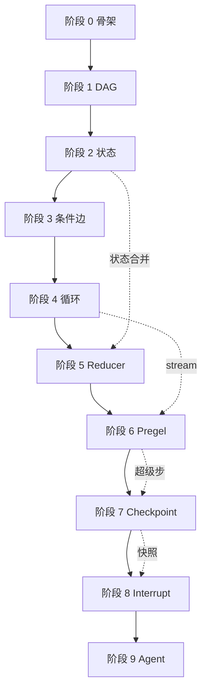

# 阶段 0：项目骨架

> **本阶段目标**：搭好项目骨架、文档站点、测试框架、CI/CD，让后续 9 个阶段能在稳固的地基上逐层加概念。
>
> **前置条件**：会基本的 Python 包管理（`pip`）、会用终端跑命令、对 `pyproject.toml` 有概念性了解即可。
>
> **git tag**：`stage-0` · **本阶段产出**：可安装的空包 + 可构建的文档站 + 可跑的 CI 流水线。

---

## 阶段目标与定位

本阶段**不写一行引擎代码**。它要做的是把"工地"搭好：脚手架、工具链、文档站、CI。很多人写教学项目喜欢直接 `main.py` 开干，写到第三周就乱成一锅粥——找不到测试、文档散落、新概念没地方放、旧代码没法对照。本阶段就是避免这件事。

!!! info "为什么阶段 0 也要单独成章"
    不少人觉得"骨架"不值得花一个阶段。但真实工程里，**骨架决定了后续 9 个阶段能不能干净地叠加**。`src/` 布局、测试镜像、CI 矩阵、文档导航——这些一旦定下来，后面每个阶段就是"加一个文件 + 加一篇文档 + 加一组测试"的机械动作。骨架没搭好，每加一个概念都要回头改结构，越改越乱。

本阶段读完你应该能回答：

- 为什么用 `src/` 布局而不是根目录平铺？
- `pyproject.toml` 里 `[project.optional-dependencies]` 的 `dev` / `docs` / `llm` 三个 extras 各自给谁用？
- `mkdocs.yml` 里 `navigation.instant` 是干嘛的？为什么搜索要配 `ja` + `en` 两个语言？
- CI 矩阵为什么跑 4 个 Python 版本？`mypy || true` 为什么加 `|| true`？
- `git tag stage-0` 之后，怎么用 `git diff stage-0..stage-1` 看每一层加了什么？

---

## 项目动机：为什么从零造 LangGraph

### LangGraph 是什么

LangGraph 是 LangChain 团队推出的**基于图的有状态执行引擎**，受 Google 2010 年的 Pregel 论文启发。它的核心洞察是：

> **把"写 Agent"从一坨 prompt 拼接，变成"画一张状态机"，再用一个通用引擎去跑这张图。**

这张图不是装饰——它是**执行模型本身**。节点是计算单元，边是控制流，状态在节点间流动，引擎负责调度、合并、检查点、中断恢复。

### 市面教程的缺口

市面 LangGraph 教程分两类：

| 教程类型 | 内容 | 缺什么 |
|----------|------|--------|
| 入门类 | "5 行代码写个 ReAct Agent" | 不讲 `StateGraph` 内部怎么跑 |
| 源码类 | 贴 `pregel/__init__.py` 几百行 | 一上来就全量代码，没有渐进路径 |

本项目要填的缺口是：**从空文件开始，一层层把它造出来，每层都能跑、都有测试、都能对照真实源码**。读完你不仅会用，还能回答"它到底怎么做到的"。

### 为什么"渐进式"是关键

!!! tip "渐进式 = 每一步都可独立验证"
    每个阶段引入**一个**新概念，配一组测试、一个示例、一篇文档。你可以：
    
    - `git checkout stage-1` 看最小 DAG 长啥样
    - `git diff stage-1..stage-2` 看状态是怎么加进来的
    - 跑 `pytest -m stage1` 只测阶段 1 的行为
    
    这比"一坨最终代码 + 一篇万字解读"好懂 10 倍。

### 为什么纯标准库

阶段 1-8 **只用 Python 标准库**（`typing`、`collections`、`sqlite3` 等），阶段 9 才接 OpenAI。理由：

1. **底层原理不被框架噪音淹没**——不引入 LangChain、pydantic、asyncio，引擎逻辑裸露在外
2. **可读**——读者不需要先懂一堆第三方库
3. **可对照**——真实 LangGraph 用了 pydantic v2、orjson、asyncio，把这些剥掉后剩下的就是 Pregel 的骨架
4. **可跑**——`pip install -e .` 不下任何依赖（除了 dev/docs 工具）

---

## 项目结构详解

### 全貌

```
langgraph/
├── pyproject.toml              # 项目配置（hatchling 构建 + 工具链）
├── mkdocs.yml                  # 文档站点配置（Material 主题）
├── README.md                   # 项目门面
├── LICENSE                     # MIT
├── .env.example                # 环境变量样例（OPENAI_API_KEY 等）
├── .gitignore                  # 忽略规则
├── src/
│   └── tiny_langgraph/         # 我们的实现（逐阶段演进）
│       ├── __init__.py         # 包入口，导出公开 API
│       ├── graph.py            # 图引擎核心（阶段 1 起填充）
│       ├── reducers.py         # Reducer 机制（阶段 5）
│       ├── checkpoint.py       # 检查点存储（阶段 7）
│       ├── prebuilt.py         # 预制组件 Tool/Agent（阶段 9）
│       └── py.typed            # PEP 561 类型标记（空文件）
├── tests/
│   └── tiny_langgraph/         # 测试，镜像 src 结构
│       ├── test_graph.py
│       ├── test_state_graph.py
│       ├── test_reducers.py
│       └── ...
├── docs/                       # MkDocs 文档源
│   ├── index.md                # 首页
│   ├── getting_started.md      # 快速上手
│   ├── api.md                  # API 参考（mkdocstrings 自动生成）
│   ├── principles/             # 核心原理（4 篇）
│   └── stages/                 # 阶段文档（10 篇，本文是其一）
├── examples/                   # 每阶段可运行示例
│   ├── stage_1_dag/run.py
│   ├── stage_2_state/run.py
│   └── ...
└── .github/workflows/          # CI + Pages 部署
    ├── ci.yml                  # 测试 + lint + 类型检查
    └── docs.yml                # 文档构建 + gh-deploy
```

### 每个目录和文件的作用

#### `src/tiny_langgraph/` —— 实现包

!!! info "为什么叫 `tiny_langgraph` 而不是 `langgraph`"
    1. 避免和真实 `langgraph` 包撞名，可以同时装在同一个环境里对照
    2. `tiny` 前缀表明这是教学版，砍掉了生产级噪音
    3. PyPI 上 `tiny-langgraph` 是个可发布的名字（虽然我们不发）

| 文件 | 阶段引入 | 作用 |
|------|----------|------|
| `__init__.py` | 0 | 包入口，导出公开 API（`Graph`、`StateGraph`、`START`、`END`...） |
| `graph.py` | 1 | 图引擎核心：`Graph` / `StateGraph` / `CompiledGraph` / `CompiledStateGraph` |
| `reducers.py` | 5 | `add_messages` 智能合并、`extract_reducers` 从 `Annotated` 提取 reducer |
| `checkpoint.py` | 7 | `BaseCheckpointSaver` / `MemorySaver` / `SqliteSaver` |
| `prebuilt.py` | 9 | `Tool`、`AgentState`、`create_react_agent` 预制组件 |
| `py.typed` | 0 | 空文件，PEP 561 标记"本包提供类型信息"，让 mypy 能查 |

#### `tests/tiny_langgraph/` —— 测试，镜像 src

测试文件和源码文件**一一对应**：

```
src/tiny_langgraph/graph.py     ←→   tests/tiny_langgraph/test_graph.py
src/tiny_langgraph/reducers.py  ←→   tests/tiny_langgraph/test_reducers.py
src/tiny_langgraph/checkpoint.py ←→  tests/tiny_langgraph/test_checkpoint.py
```

!!! tip "镜像结构的好处"
    - 找测试不会迷路：要看 `graph.py` 的测试，直接去 `test_graph.py`
    - 后续模块多了不会乱：新增 `checkpoint.py` 就新增 `test_checkpoint.py`，机械动作
    - 符合企业级项目的测试组织规范（pytest 官方推荐）

#### `docs/` —— MkDocs 文档源

```
docs/
├── index.md                # 首页：项目介绍 + 路线图
├── getting_started.md      # 安装、跑示例、跑测试
├── api.md                  # API 参考（用 mkdocstrings 自动从 docstring 生成）
├── principles/             # 核心原理（不随阶段变，讲"为什么这么设计"）
│   ├── index.md
│   ├── graph_as_program.md
│   ├── state_and_reducer.md
│   ├── pregel.md
│   └── checkpoint.md
└── stages/                 # 阶段文档（本文所在位置）
    ├── stage_0_skeleton.md
    ├── stage_1_dag.md
    └── ...
```

`principles/` 和 `stages/` 的分工：

| 目录 | 视角 | 内容 |
|------|------|------|
| `principles/` | 横截面 | 讲概念：什么是 Pregel、为什么用 Reducer、检查点怎么实现时间旅行 |
| `stages/` | 纵截面 | 讲实现：这一阶段加了什么代码、为什么这么加、对照真实源码哪几行 |

#### `examples/` —— 可运行示例

每个阶段一个目录，里面一个 `run.py`：

```
examples/
├── stage_1_dag/run.py        # 3 个 DAG 示例
├── stage_2_state/run.py      # 带状态的管线
└── ...
```

设计原则：**每个示例 `python -m examples.stage_N_xxx.run` 就能跑，输出贴在阶段文档里**。读者不用猜"这段代码跑出来是啥"。

#### `.github/workflows/` —— CI/CD

| 文件 | 触发 | 作用 |
|------|------|------|
| `ci.yml` | push/PR 到 main | 跑 ruff + mypy + pytest，矩阵 4 个 Python 版本 |
| `docs.yml` | push 到 main | `mkdocs gh-deploy` 把文档站发到 GitHub Pages |

---

## `pyproject.toml` 配置详解

整个文件 81 行，分 6 个段。逐段拆。

### 1. 构建系统声明

```toml
[build-system]
requires = ["hatchling"]
build-backend = "hatchling.build"
```

!!! question "为什么用 hatchling 而不是 setuptools"
    - `setuptools` 需要 `setup.py` / `setup.cfg`，配置分散
    - `hatchling` 是当前最简洁的纯 Python 构建后端，**所有配置都在 `pyproject.toml` 一个文件**
    - `flit` 也简洁，但不支持 src 布局的开箱即用
    - `poetry` 功能全但锁文件机制争议大，教学项目不需要
    
    hatchling 由 PyPA 维护，是 PyPI 官方推荐的构建后端之一。

`requires = ["hatchling"]` 表示构建时需要 hatchling；`build-backend = "hatchling.build"` 表示用 hatchling 的 build 入口。`pip install -e .` 时 pip 会自动装 hatchling 并调它。

### 2. 项目元数据

```toml
[project]
name = "tiny-langgraph"
version = "0.0.0"
description = "从零渐进式实现 LangGraph，理解图执行引擎的底层原理与设计原则"
readme = "README.md"
requires-python = ">=3.10"
license = "MIT"
authors = [{ name = "tiny-langgraph" }]
keywords = ["langgraph", "agent", "graph", "llm", "tutorial", "pregel"]
classifiers = [...]
dependencies = []
```

| 字段 | 值 | 说明 |
|------|----|------|
| `name` | `tiny-langgraph` | PyPI 包名（连字符），import 名是 `tiny_langgraph`（下划线） |
| `version` | `0.0.0` | 阶段 0 的版本；阶段 9 是 `0.9.0`，每阶段 bump |
| `requires-python` | `>=3.10` | 用了 `match` 语法、`X \| Y` 类型联合，最低 3.10 |
| `license` | `MIT` | SPDX 标识 |
| `dependencies` | `[]` | **空**——纯标准库承诺的体现 |
| `classifiers` | ... | PyPI 分类，帮用户搜到 |

!!! warning "version 为什么不动态"
    真实项目常用 `version = { source = "code" }` 从 `__init__.py` 读版本。这里写死是为了**每个 git tag 对应一个固定版本号**，`git checkout stage-3` 时 `pyproject.toml` 的版本就是 `0.3.0`，一目了然。

### 3. 可选依赖（extras）

```toml
[project.optional-dependencies]
llm = ["openai>=1.0.0"]
dev = ["pytest>=8.0", "pytest-cov>=4.0", "ruff>=0.6", "mypy>=1.10"]
docs = ["mkdocs>=1.6", "mkdocs-material>=9.5", "mkdocstrings[python]>=0.26", "pymdown-extensions>=10.7"]
```

三个 extras，**三套人**：

| extra | 谁用 | 命令 | 装啥 |
|-------|------|------|------|
| `llm` | 阶段 9 才需要 | `pip install -e ".[llm]"` | openai |
| `dev` | 贡献者 | `pip install -e ".[dev]"` | pytest、ruff、mypy |
| `docs` | 写文档的人 | `pip install -e ".[docs]"` | mkdocs 全家桶 |

!!! tip "为什么分开"
    - 普通读者 `pip install -e .` 就够跑阶段 1-8，不下载 openai/mkdocs
    - CI 的 `ci.yml` 只装 `[dev]`，不装 `[docs]`，省时间
    - CI 的 `docs.yml` 只装 `[docs]`，不装 `[dev]`
    - 阶段 9 的 Agent 测试需要 `[llm]`，但 CI 默认不跑（要 API key）

组合安装：`pip install -e ".[dev,docs]"` 同时装开发和文档工具。

### 4. 项目 URL

```toml
[project.urls]
Documentation = "https://wanglh39.github.io/langgraph/"
Source = "https://github.com/wanglh39/langgraph"
```

PyPI 页面会显示这两个链接。`Documentation` 指向 GitHub Pages 站点，`Source` 指向仓库。

### 5. hatchling 构建目标

```toml
[tool.hatch.build.targets.wheel]
packages = ["src/tiny_langgraph"]
```

告诉 hatchling：打 wheel 时把 `src/tiny_langgraph` 作为包根。这是 **src 布局的关键配置**——没有它，hatchling 会在根目录找 `tiny_langgraph/`，找不到。

### 6. 工具配置

#### pytest

```toml
[tool.pytest.ini_options]
testpaths = ["tests"]
addopts = "-ra --strict-markers"
markers = [
    "stage1: 阶段 1 - DAG 执行器",
    "stage2: 阶段 2 - 共享状态",
    ...
]
```

| 配置 | 作用 |
|------|------|
| `testpaths` | 只在 `tests/` 下找测试 |
| `addopts = "-ra"` | 显示所有跳过/失败原因的摘要 |
| `--strict-markers` | 用未注册的 marker 会报错（防拼写错误） |
| `markers` | 注册 9 个阶段标记，可 `pytest -m stage1` 只跑阶段 1 测试 |

!!! example "marker 用法"
    ```bash
    pytest -m stage1          # 只跑阶段 1 的测试
    pytest -m "stage1 or stage2"  # 跑阶段 1+2
    pytest -m "not stage9"    # 跳过阶段 9（需要 API key）
    ```

#### ruff

```toml
[tool.ruff]
line-length = 100
target-version = "py310"
src = ["src", "tests"]

[tool.ruff.lint]
select = ["E", "F", "I", "N", "UP", "B", "SIM"]
```

| 规则集 | 含义 |
|--------|------|
| `E` | pycodestyle 错误（空格、缩进） |
| `F` | pyflakes（未用变量、未用 import） |
| `I` | isort（import 排序） |
| `N` | pep8-naming（命名规范） |
| `UP` | pyupgrade（自动升级新语法，如 `Optional[X]` → `X \| None`） |
| `B` | bugbear（常见 bug 模式） |
| `SIM` | simplify（简化代码，如 `if x: return True else: return False` → `return x`） |

`line-length = 100` 比 80 宽，比 120 窄，平衡可读性和屏幕利用率。

#### mypy

```toml
[tool.mypy]
python_version = "3.10"
strict = true
warn_return_type = true
warn_unused_configs = true
```

`strict = true` 开启所有严格检查（disallow untyped defs、disallow any expr 等）。这是**类型安全承诺**——引擎代码要经得起 mypy strict。

---

## MkDocs Material 配置详解

`mkdocs.yml` 127 行，分 8 个段。

### 1. 站点元数据

```yaml
site_name: 从零实现 LangGraph
site_description: 渐进式理解图执行引擎的底层原理与设计原则
site_url: https://wanglh39.github.io/langgraph/
repo_url: https://github.com/wanglh39/langgraph
repo_name: wanglh39/langgraph
docs_dir: docs
site_dir: site
```

| 字段 | 作用 |
|------|------|
| `site_name` | 浏览器标题、左上角 logo 旁的文字 |
| `site_description` | SEO meta description |
| `site_url` | 站点绝对 URL，用于 sitemap |
| `repo_url` / `repo_name` | 右上角 GitHub 链接 |
| `docs_dir` / `site_dir` | 源目录 / 构建输出目录 |

### 2. 主题

```yaml
theme:
  name: material
  language: zh
  features:
    - navigation.instant
    - navigation.tabs
    - navigation.sections
    - navigation.expand
    - navigation.indexes
    - navigation.top
    - search.suggest
    - search.highlight
    - content.code.copy
    - content.code.annotate
    - content.tabs.link
    - toc.follow
```

逐条解释 `features`：

| feature | 作用 |
|---------|------|
| `navigation.instant` | 点击链接不刷新整页，只换内容（SPA 模式），快 |
| `navigation.tabs` | 顶部用 tab 分一级导航 |
| `navigation.sections` | 侧边栏按 section 分组 |
| `navigation.expand` | 默认展开所有子项（不折叠） |
| `navigation.indexes` | section 的 `index.md` 作为该 section 首页 |
| `navigation.top` | 滚动时出现"回到顶部"按钮 |
| `search.suggest` | 搜索框自动补全 |
| `search.highlight` | 搜索结果高亮匹配词 |
| `content.code.copy` | 代码块右上角加"复制"按钮 |
| `content.code.annotate` | 代码块支持 `# (1)` 注释标注 |
| `content.tabs.link` | 同步 tab 切换（多个 tab 块联动） |
| `toc.follow` | 滚动时右侧目录高亮当前章节 |

### 3. 调色板（深浅切换）

```yaml
palette:
  - media: "(prefers-color-scheme: light)"
    scheme: default
    primary: deep purple
    accent: indigo
    toggle:
      icon: material/brightness-7
      name: 切换到深色模式
  - media: "(prefers-color-scheme: dark)"
    scheme: slate
    primary: deep purple
    accent: indigo
    toggle:
      icon: material/brightness-4
      name: 切换到浅色模式
```

两套配色，根据系统偏好自动选，并提供切换按钮。`primary: deep purple` 是主色（紫），`accent: indigo` 是强调色（靛蓝）。

### 4. 字体

```yaml
font:
  text: Noto Sans SC
  code: JetBrains Mono
```

- `Noto Sans SC`：思源黑体简体中文，覆盖中文字符
- `JetBrains Mono`：等宽编程字体，代码块用

!!! warning "字体加载需要联网"
    Material 主题从 Google Fonts 拉字体。离线环境会 fallback 到系统字体，不影响功能但中文字形会变。

### 5. 图标

```yaml
icon:
  logo: material/graph-outline
```

左上角 logo 用 Material 内置的"图"图标（三个节点连线），呼应"图执行引擎"主题。

### 6. 导航结构

```yaml
nav:
  - 首页: index.md
  - 快速上手: getting_started.md
  - 核心原理:
      - 概览: principles/index.md
      - 图即程序: principles/graph_as_program.md
      - 状态与 Reducer: principles/state_and_reducer.md
      - Pregel 超级步: principles/pregel.md
      - 检查点与时间旅行: principles/checkpoint.md
  - 渐进式实现:
      - 阶段 0 - 项目骨架: stages/stage_0_skeleton.md
      - 阶段 1 - DAG 执行器: stages/stage_1_dag.md
      ...
      - 阶段 9 - 完整 Agent: stages/stage_9_agent.md
  - API 参考: api.md
```

!!! info "为什么显式列 nav 而不自动发现"
    自动发现（不写 `nav`）会按文件名字母排序，阶段顺序会乱（`stage_10` 排在 `stage_2` 前面）。显式列出保证顺序正确，也能控制分组层级。

### 7. 插件

```yaml
plugins:
  - search:
      lang:
        - ja
        - en
  - mkdocstrings:
      handlers:
        python:
          paths: [src]
          options:
            show_source: true
            show_root_heading: true
            heading_level: 2
```

| 插件 | 作用 |
|------|------|
| `search` | 全文搜索，`lang: [ja, en]` 用日语+英语分词器（中文搜索效果最好的折中方案，因为 Material 不内置中文分词器） |
| `mkdocstrings` | 从 docstring 自动生成 API 文档，`paths: [src]` 告诉它源码在哪 |

!!! question "为什么搜索 lang 用 ja + en"
    MkDocs Material 的搜索基于 Lunr.js，不内置中文分词。中文分词器（jieba）需要额外集成。**日语分词器对中文有奇效**——日语和中文都用 CJK 字符，Lunr 的日语模式按字符切分，对中文搜索的召回率比英语模式好得多。加 `en` 是为了同时支持英文术语搜索（如 "Pregel"）。

### 8. Markdown 扩展

```yaml
markdown_extensions:
  - admonition                    # !!! note/warning/tip 框
  - attr_list                     # {.class} 给元素加 CSS
  - def_list                      # 定义列表
  - footnotes                     # 脚注 [^1]
  - md_in_html                    # HTML 里嵌 markdown
  - tables                        # GFM 表格
  - toc:
      permalink: true             # 标题旁的 ¶ 锚点链接
  - pymdownx.arithmatex           # 数学公式 $...$
  - pymdownx.betterem             # **加粗**/_斜体_ 智能识别
  - pymdownx.caret                # ^^下划线^^
  - pymdownx.details              # ??? question 折叠块
  - pymdownx.emoji                # :smile: emoji
  - pymdownx.highlight            # 代码高亮（带行号）
  - pymdownx.inlinehilite         # 行内代码高亮 `#!python foo()`
  - pymdownx.keys                 # 键盘按键 ++ctrl+c++
  - pymdownx.mark                 # ==高亮==
  - pymdownx.smartsymbols         # (c) (tm) -> 等智能符号
  - pymdownx.snippets             # include 其他文件
  - pymdownx.superfences:         # 代码块增强
      custom_fences:
        - name: mermaid           # mermaid 图表
          class: mermaid
          format: !!python/name:pymdownx.superfences.fence_code_format
  - pymdownx.tabbed               # === "Tab 1" 标签页
  - pymdownx.tasklist:            # - [x] 任务列表
      custom_checkbox: true
  - pymdownx.tilde                # ~~删除线~~
```

最常用的几个：

- `admonition`：`!!! tip "提示"` 生成彩色提示框
- `pymdownx.details`：`??? question "折叠"` 生成可折叠区域
- `pymdownx.superfences` + mermaid：画流程图
- `pymdownx.tabbed`：`=== "Graph"` / `=== "StateGraph"` 对比代码
- `pymdownx.highlight`：代码块带行号、锚点

### 9. 额外资源

```yaml
extra:
  social:
    - icon: fontawesome/brands/github
      link: https://github.com/wanglh39/langgraph

extra_javascript:
  - https://unpkg.com/mermaid@10/dist/mermaid.min.js
```

`extra.social` 在页脚加 GitHub 图标链接。`extra_javascript` 加载 mermaid.js——`pymdownx.superfences` 只负责把 ` ```mermaid ` 代码块标记成 mermaid 容器，真正画图靠这个 JS 在浏览器端渲染。

---

## GitHub Actions CI/CD 详解

### `ci.yml`：测试流水线

```yaml
name: CI

on:
  push:
    branches: [main]
  pull_request:
    branches: [main]

permissions:
  contents: read

jobs:
  test:
    runs-on: ubuntu-latest
    strategy:
      fail-fast: false
      matrix:
        python-version: ["3.10", "3.11", "3.12", "3.13"]

    steps:
      - uses: actions/checkout@v4

      - name: Set up Python ${{ matrix.python-version }}
        uses: actions/setup-python@v5
        with:
          python-version: ${{ matrix.python-version }}
          cache: pip

      - name: Install
        run: pip install -e ".[dev]"

      - name: Lint (ruff)
        run: ruff check src tests

      - name: Type check (mypy)
        run: mypy src || true

      - name: Test
        run: pytest --tb=short
```

逐行拆：

#### 触发条件

```yaml
on:
  push:
    branches: [main]
  pull_request:
    branches: [main]
```

- push 到 main：合并后跑
- PR 到 main：开 PR 时跑

#### 权限

```yaml
permissions:
  contents: read
```

最小权限原则——只读仓库内容，不能写。`docs.yml` 才需要 `contents: write`（要 push 文档到 gh-pages 分支）。

#### 矩阵

```yaml
strategy:
  fail-fast: false
  matrix:
    python-version: ["3.10", "3.11", "3.12", "3.13"]
```

4 个 Python 版本并行跑。`fail-fast: false` 表示一个版本挂了不取消其他版本——方便看是哪个版本的问题。

!!! question "为什么从 3.10 起"
    `requires-python = ">=3.10"`。3.10 引入了 `match` 语句、`X | Y` 类型联合、参数化 `dict[str, int]`，这些在引擎代码里大量使用。3.9 不支持。

#### 步骤

| 步骤 | 作用 |
|------|------|
| `actions/checkout@v4` | 拉代码 |
| `actions/setup-python@v5` | 装 Python，`cache: pip` 缓存 pip 下载 |
| `pip install -e ".[dev]"` | 可编辑安装 + dev 依赖（pytest/ruff/mypy） |
| `ruff check src tests` | lint |
| `mypy src || true` | 类型检查，**挂了不阻断 CI** |
| `pytest --tb=short` | 跑测试，失败时只显示短 traceback |

!!! warning "为什么 `mypy || true`"
    `|| true` 让这一步永远成功。原因：
    
    1. 教学项目早期类型可能不全，不想 mypy 卡住 CI
    2. mypy strict 对第三方库（如 openai）的 stub 要求高，容易误报
    3. 真实 LangGraph 的 mypy 也不是 0 错误
    
    生产项目应该去掉 `|| true`，让 mypy 真正把关。教学项目先松后紧。

### `docs.yml`：文档部署

```yaml
name: Docs

on:
  push:
    branches: [main]
  workflow_dispatch:

permissions:
  contents: write

jobs:
  deploy:
    runs-on: ubuntu-latest

    steps:
      - uses: actions/checkout@v4
        with:
          fetch-depth: 0

      - name: Set up Python
        uses: actions/setup-python@v5
        with:
          python-version: "3.13"
          cache: pip

      - name: Install
        run: pip install -e ".[docs]"

      - name: Build and deploy
        run: mkdocs gh-deploy --force
```

和 `ci.yml` 的差异：

| 差异点 | ci.yml | docs.yml |
|--------|--------|----------|
| 触发 | push + PR | push + 手动 (`workflow_dispatch`) |
| 权限 | `contents: read` | `contents: write`（要 push gh-pages） |
| Python 版本 | 矩阵 4 个 | 单个 3.13 |
| 装的 extras | `[dev]` | `[docs]` |
| `fetch-depth` | 默认 1 | `0`（全历史，mkdocs 需要） |
| 最后一步 | pytest | `mkdocs gh-deploy --force` |

`mkdocs gh-deploy` 做的事：

1. `mkdocs build` 把 `docs/` 编译成静态站到 `site/`
2. 把 `site/` 推到 `gh-pages` 分支
3. GitHub Pages 自动部署 `gh-pages` 分支

`--force` 强制覆盖 gh-pages 历史（每次部署是全新 commit，不保留历史）。教学项目不需要文档 git 历史。

---

## `.gitignore` 设计

74 行，分 9 段：

```gitignore
# Python          - __pycache__、*.pyc、build/、dist/、*.egg-info/
# Virtual envs    - .venv/ venv/ env/
# Testing         - .pytest_cache/、.coverage、htmlcov/
# Type checking   - .mypy_cache/、.ruff_cache/
# IDE             - .vscode/、.idea/、*.swp
# OS              - .DS_Store、Thumbs.db
# MkDocs          - site/（构建输出）
# Env / secrets   - .env、*.key、*.pem（但保留 .env.example）
# Jupyter         - .ipynb_checkpoints/
# Tooling         - .codeartsdoer/、.codegraph/（IDE 内部）
```

几个关键设计：

!!! tip "`.env.example` 不被忽略"
    ```gitignore
    .env
    .env.*
    !.env.example    # ← ! 表示不忽略
    ```
    `.env` 含真实密钥必须忽略。但 `.env.example`（样例文件）要进仓库，让新人知道需要哪些环境变量。`!` 是 gitignore 的取反规则。

!!! tip "为什么要忽略 `.codeartsdoer/` 和 `.codegraph/`"
    这是 IDE/工具的内部缓存，不该进仓库。但它们对开发有用，所以本地保留、仓库忽略。

---

## 渐进式路线总览

10 个阶段，每阶段一个 git tag、一个新概念、一组测试、一个示例、一篇文档。

| 阶段 | git tag | 内容 | 新增概念 | 代码量级 |
|------|---------|------|----------|----------|
| 0 | `stage-0` | 项目骨架 + 文档站 + CI | MkDocs Material、hatchling、src 布局 | 0 行引擎 |
| 1 | `stage-1` | 最小 DAG 执行器 | `Graph`、`CompiledGraph`、`START`/`END`、线性链 | ~80 行 |
| 2 | `stage-2` | 共享状态 | `StateGraph`、更新片段、覆盖合并、`TypedDict` | ~60 行新增 |
| 3 | `stage-3` | 条件边 | `add_conditional_edges`、路由函数、运行时遍历 | ~40 行新增 |
| 4 | `stage-4` | 循环图 + stream | 回边、`while` 循环、`stream` yield 事件 | ~50 行新增 |
| 5 | `stage-5` | Reducer | `Annotated[T, reducer]`、`add_messages`、`_merge` | ~80 行新增 |
| 6 | `stage-6` | Pregel 超级步 | 并行层、fan-out、通道=字段+Reducer | ~60 行重构 |
| 7 | `stage-7` | Checkpoint | `BaseCheckpointSaver`、`MemorySaver`、`SqliteSaver` | ~100 行新增 |
| 8 | `stage-8` | Interrupt + 流式 | `interrupt_before/after`、人机协作、续跑 | ~60 行新增 |
| 9 | `stage-9` | 完整 Tool Agent | `Tool`、`create_react_agent`、接 OpenAI、对照真版 | ~120 行新增 |

### 概念依赖图



实线 = 代码直接依赖；虚线 = 概念复用。

### 每阶段读法

1. `git checkout stage-N` 切到该阶段代码
2. 读 `docs/stages/stage_N_xxx.md` 看这一阶段做了啥
3. 跑 `python -m examples.stage_N_xxx.run` 看效果
4. 跑 `pytest -m stageN` 看测试
5. `git diff stage-(N-1)..stage-N` 看具体加了哪些代码

---

## 设计原则深度阐述

### 原则 1：纯标准库优先

阶段 1-8 只用 Python 标准库。理由前面说过——剥离框架噪音。但有几个具体决策：

!!! example "具体决策"
    - **不用 pydantic**：状态用 `TypedDict` + `dict`，类型检查靠 mypy 而非运行时校验
    - **不用 asyncio**：执行引擎是同步的，async 是真实 LangGraph 的复杂度大头
    - **不用 orjson**：用标准 `json`，性能差但可读
    - **不用 networkx**：图结构用 `dict` 自己存，让读者看到邻接表长啥样
    - **不用 tenacity**：重试逻辑（阶段 9）手写一个简单的

### 原则 2：每个概念只做一件事

每阶段**只引入一个新概念**。不是"加状态 + 加条件边 + 加循环"一锅端，而是：

- 阶段 2 只加状态，边还是静态的、还是线性
- 阶段 3 只加条件边，状态合还是覆盖、还是无循环
- 阶段 4 才加循环

这样每阶段的 diff 都很小（< 100 行），能完整读完。

### 原则 3：对照真实源码

每阶段文档有"对照真实 LangGraph"表格，指出：

- 真实版对应文件在 `langgraph/` 的哪个路径
- 我们的实现和真实版的语义一致点
- 我们砍掉了真实版的哪些生产级噪音
- 哪些阶段才会补上某个能力

!!! info "为什么对照"
    读完这个项目，你应该能打开真实 LangGraph 源码，认出"哦这是 Pregel 超级步循环"、"哦这是 `add_messages` reducer"、"哦这是检查点 put"。**教学版是真实版的索引**。

### 原则 4：可运行 > 可读 > 完备

优先级：

1. **可运行**：所有代码 `python -m` 能跑，输出贴在文档里
2. **可读**：代码有 docstring、类型注解、注释
3. **完备**：覆盖所有边界情况（但允许某些罕见 case 不处理）

举例：阶段 1 的 `Graph` 不支持 DAG（只支持线性链），这是"不完备"但"可运行可读"。完备的 DAG 支持在阶段 6 Pregel 才补。

### 原则 5：测试镜像源码结构

`tests/tiny_langgraph/test_graph.py` 对应 `src/tiny_langgraph/graph.py`。测试类名对应功能分组：

```
TestAddNode        ←  Graph.add_node
TestAddEdge        ←  Graph.add_edge
TestCompile        ←  Graph.compile
TestInvoke         ←  CompiledGraph.invoke
```

找测试不会迷路。

### 原则 6：文档随代码演进

每阶段代码 + 测试 + 示例 + 文档**一起提交**。不会出现"代码到阶段 9 了，文档还停在阶段 3"。`git tag stage-N` 是个完整快照。

---

## 如何本地预览文档

### 安装文档工具

```bash
pip install -e ".[docs]"
```

这会装：`mkdocs`、`mkdocs-material`、`mkdocstrings[python]`、`pymdown-extensions`。

### 实时预览

```bash
mkdocs serve
```

输出：

```
INFO    -  Building documentation...
INFO    -  Cleaning site directory
INFO    -  Documentation built in 0.5 seconds
INFO    -  [15:00:00] Watching paths for changes: 'docs', 'mkdocs.yml'
INFO    -  [15:00:00] Serving on http://127.0.0.1:8000/
```

浏览器打开 `http://127.0.0.1:8000`。**改 `docs/` 下任何 `.md` 文件，浏览器自动刷新**。

### 构建静态站

```bash
mkdocs build
```

把 `docs/` 编译成 `site/` 目录（纯 HTML/CSS/JS）。可以直接 `python -m http.server -d site` 起一个静态服务器看。

### 部署到 GitHub Pages

```bash
mkdocs gh-deploy
```

自动 `build` + 推到 `gh-pages` 分支。GitHub Pages 配好后，访问 `https://<user>.github.io/<repo>/` 就能看到。

!!! warning "gh-deploy 不会推 main"
    `mkdocs gh-deploy` 只推 `site/` 到 `gh-pages` 分支，**不会 commit 你的 main 改动**。先 `git commit && git push` 再 `gh-deploy`。

### 严格构建（CI 用）

```bash
mkdocs build --strict
```

`--strict` 把警告升级成错误——如果有未解析的链接、缺图片、mkdocstrings 找不到符号，直接挂。CI 应该用这个，本地预览不用（太烦）。

---

## 如何切到某个阶段看代码

### 查看所有阶段标签

```bash
git tag
# stage-0
# stage-1
# stage-2
# ...
# stage-9
```

### 切到某阶段

```bash
git checkout stage-1
```

现在 `src/tiny_langgraph/graph.py` 就是阶段 1 的版本（只有 `Graph` + `CompiledGraph`，没有 `StateGraph`）。

### 看某阶段加了什么

```bash
git diff stage-0..stage-1
```

输出阶段 0 到阶段 1 的所有改动。

### 只看某个文件的历史

```bash
git log --oneline --follow src/tiny_langgraph/graph.py
```

### 在某阶段跑测试

```bash
git checkout stage-2
pip install -e ".[dev]"
pytest -m stage2
```

!!! tip "checkout 后记得重装"
    `pip install -e .` 是可编辑安装，改代码不用重装。但 `pyproject.toml` 的 `version` 或 `optional-dependencies` 变了要重装，让 metadata 更新。

### 回到最新

```bash
git checkout main
```

---

## 对照真实 LangGraph 的项目结构

真实 LangGraph 是 monorepo（`libs/` 下多个包），我们单包。对比如下：

| 真实 LangGraph | 我们 | 说明 |
|----------------|------|------|
| `libs/langgraph/langgraph/graph/graph.py` | `src/tiny_langgraph/graph.py` | `Graph` 类（无状态） |
| `libs/langgraph/langgraph/graph/state.py` | `src/tiny_langgraph/graph.py` | `StateGraph` 类（合并到一个文件） |
| `libs/langgraph/langgraph/pregel/__init__.py` | `src/tiny_langgraph/graph.py` | Pregel 执行循环（`CompiledStateGraph.stream`） |
| `libs/langgraph/langgraph/pregel/read.py` | （砍掉） | 通道读取，我们用 `state[key]` 直接读 |
| `libs/langgraph/langgraph/pregel/write.py` | （砍掉） | 通道写入，我们用 `state.update` |
| `libs/langgraph/langgraph/checkpoint/base.py` | `src/tiny_langgraph/checkpoint.py` | `BaseCheckpointSaver` |
| `libs/langgraph/langgraph/checkpoint/memory.py` | `src/tiny_langgraph/checkpoint.py` | `MemorySaver` |
| `libs/langgraph/langgraph/checkpoint/sqlite.py` | `src/tiny_langgraph/checkpoint.py` | `SqliteSaver` |
| `libs/langgraph/langgraph/types/` | （砍掉） | 类型定义，我们用 `TypedDict` |
| `libs/langgraph/langgraph/prebuilt/` | `src/tiny_langgraph/prebuilt.py` | `create_react_agent` |
| `docs/` (Markdown) | `docs/` (MkDocs) | 文档 |
| `.github/workflows/` | `.github/workflows/` | CI |

### 真实版结构（简化）

```
langgraph/
├── libs/
│   ├── langgraph/              # 核心包
│   │   ├── langgraph/
│   │   │   ├── graph/
│   │   │   │   ├── graph.py    # Graph
│   │   │   │   └── state.py    # StateGraph
│   │   │   ├── pregel/
│   │   │   │   ├── __init__.py # Pregel 循环
│   │   │   │   ├── read.py     # 通道读
│   │   │   │   └── write.py    # 通道写
│   │   │   ├── checkpoint/
│   │   │   │   ├── base.py
│   │   │   │   ├── memory.py
│   │   │   │   └── sqlite.py
│   │   │   ├── prebuilt/
│   │   │   └── types/
│   │   └── pyproject.toml
│   └── langgraph-sdk/          # SDK 包
└── docs/
```

### 我们砍掉了什么

| 砍掉的 | 原因 |
|--------|------|
| monorepo / `libs/` | 单包够用 |
| `pregel/read.py` + `write.py` | 通道抽象太重，直接 `state[key]` |
| `types/` 一堆 TypedDict | 内联到使用处 |
| asyncio 全套 | 同步引擎够讲清原理 |
| pydantic v2 校验 | `TypedDict` + mypy 够 |
| LangChain 生态兼容 | 教学项目不需要 |
| 流式协议细节（event 类型、metadata） | 阶段 4 的 stream 只 yield 简单 dict |
| 分布式 / 远程检查点 | 单机 `MemorySaver` + `SqliteSaver` 够 |
| 错误恢复 / 重试 | 阶段 9 简单处理 |

### 我们保留了什么（核心骨架）

| 保留的 | 体现于 |
|--------|--------|
| `compile()` 分离校验和执行 | 阶段 1 `Graph.compile` |
| `START`/`END` 虚拟节点 | 阶段 1 |
| 邻接表存图 | 阶段 1 `_edges` |
| 更新片段 + 引擎合并 | 阶段 2 `_merge` |
| 条件边 = 路由函数 | 阶段 3 `add_conditional_edges` |
| 运行时 while 遍历（非预编译顺序） | 阶段 3 起 |
| `stream` yield 事件 | 阶段 4 |
| Reducer = `Annotated[T, fn]` | 阶段 5 |
| Pregel 超级步 = 并行层 | 阶段 6 `pending: set[str]` |
| 检查点 = 快照 + 续跑 | 阶段 7 |
| Interrupt = 暂停 + 人类输入 | 阶段 8 |
| ReAct = 循环图 + 工具节点 | 阶段 9 |

---

## 验证骨架

阶段 0 完成后，以下命令应该全部成功：

```bash
# 1. 安装（开发 + 文档）
pip install -e ".[dev,docs]"

# 2. 包可导入
python -c "import tiny_langgraph; print(tiny_langgraph.__version__)"
# 输出: 0.0.0

# 3. 测试通过
pytest
# 输出: no tests ran（阶段 0 没有实质测试，正常）

# 4. Lint 通过
ruff check src tests
# 输出: All checks passed!

# 5. 文档可构建
mkdocs build
# 输出: Documentation built in X seconds

# 6. 文档可预览
mkdocs serve
# 浏览器打开 http://127.0.0.1:8000
```

!!! warning "阶段 0 的 `pytest` 输出"
    `no tests ran, no tests collected` 不是错误——阶段 0 没写测试。阶段 1 起 `tests/` 才有内容。

---

## 常见问题

??? question "为什么不用 Poetry / PDM"
    Poetry 和 PDM 都是好工具，但对教学项目：
    
    - Poetry 的 `poetry.lock` 会进仓库，增加噪音
    - PDM 的 PEP 621 支持还在完善
    - hatchling 是 PyPA 官方推荐、配置最简、`pip install -e .` 开箱即用
    
    选 hatchling 不是因为它最好，是因为它**最简单且够用**。

??? question "为什么不用 Sphinx 而用 MkDocs"
    - Sphinx 是 Python 文档事实标准，但用 reStructuredText，语法门槛高
    - MkDocs 用 Markdown，门槛低，和 README/issue/PR 的 Markdown 一致
    - Material 主题开箱即用，比 Sphinx 主题调参省心
    - 真实 LangGraph 也用 MkDocs Material（`langchain-ai/langgraph` 的 `docs/`）

??? question "为什么 `requires-python = ">=3.10"` 而不是 `>=3.8`"
    3.10 引入了：
    
    - `match` 语句（阶段 9 用）
    - `X | Y` 类型联合（引擎代码到处用 `str | None`）
    - 参数化泛型 `dict[str, int]`（不用 `Dict[str, int]`）
    
    3.8/3.9 不支持这些，强行支持要写一堆 `from __future__ import annotations` + `Optional[X]`，代码丑。

??? question "为什么 CI 跑 4 个 Python 版本"
    `requires-python = ">=3.10"` 承诺支持 3.10/3.11/3.12/3.13。CI 矩阵确保每个版本都能装、能跑测试。教学项目用户可能用任意版本，不能假设大家都用 3.12。

??? question "`py.typed` 是什么"
    PEP 561 规定：一个包要在根目录放一个名为 `py.typed` 的空文件，标记"本包提供类型信息"。这样 mypy 在别的项目里 import 本包时，会读本包的类型注解做检查。没有这个文件，mypy 会把本包的函数全当成 `Any`。

??? question "为什么 `.env.example` 进仓库但 `.env` 不进"
    `.env` 含真实密钥（`OPENAI_API_KEY=sk-xxx`），泄露了完蛋。`.env.example` 是样例（`OPENAI_API_KEY=your-key-here`），给新人看需要配什么变量。`.gitignore` 里 `.env` 被忽略，`.env.example` 用 `!.env.example` 取反保留。

??? question "为什么 `mkdocs.yml` 里 `search.lang` 用日语"
    MkDocs Material 的搜索基于 Lunr.js，不内置中文分词。Lunr 的日语分词器按 CJK 字符切分，对中文有奇效（中文没有空格分词，按字符切反而召回率高）。加 `en` 是为了同时支持英文术语（如 "Pregel"）。

---

## 阶段 0 的产出清单

阶段 0 完成时，仓库应该有：

- [x] `pyproject.toml`（81 行，6 段配置）
- [x] `mkdocs.yml`（127 行，8 段配置）
- [x] `README.md`（项目门面）
- [x] `LICENSE`（MIT）
- [x] `.gitignore`（74 行，9 段）
- [x] `.env.example`
- [x] `src/tiny_langgraph/__init__.py`（导出公开 API，但阶段 0 还没东西可导）
- [x] `src/tiny_langgraph/py.typed`（空文件）
- [x] `tests/` 目录（空，阶段 1 起填充）
- [x] `docs/` 完整文档站（index、getting_started、principles、stages、api）
- [x] `examples/` 目录（空，阶段 1 起填充）
- [x] `.github/workflows/ci.yml`
- [x] `.github/workflows/docs.yml`
- [x] `git tag stage-0`

**没有**：

- 引擎代码（`graph.py` 是空文件或不存在）
- 任何测试
- 任何示例
- 任何依赖（`dependencies = []`）

---

## 从阶段 0 到阶段 1 会发生什么

阶段 1 将：

1. 创建 `src/tiny_langgraph/graph.py`，写 `Graph` + `CompiledGraph` 两个类（~80 行）
2. 创建 `tests/tiny_langgraph/test_graph.py`，写 4 组测试（~160 行）
3. 创建 `examples/stage_1_dag/run.py`，3 个示例
4. 在 `__init__.py` 导出 `Graph`、`CompiledGraph`、`START`、`END`
5. bump `pyproject.toml` 的 `version` 到 `0.1.0`
6. 写 `docs/stages/stage_1_dag.md`
7. `git tag stage-1`

diff 规模：约 +300 行代码 + 测试 + 文档。

---

## 设计哲学总结

阶段 0 看似没写引擎，但它定下了**整个项目的气质**：

- **简洁**：hatchling 而非 poetry，MkDocs 而非 Sphinx，标准库而非 pydantic
- **可对照**：每个文件都能在真实 LangGraph 里找到对应
- **可演进**：src 布局 + 测试镜像 + 文档导航，加 9 个阶段不乱
- **可验证**：CI 矩阵 + ruff + mypy + pytest，每次 push 自动检查
- **可读**：Material 主题 + mermaid + admonition + 中文，文档像书不像 README

!!! info "一句话总结阶段 0"
    **先把工地搭好，再开始砌墙。** 后续 9 个阶段都是在这套骨架上机械叠加——加一个文件、加一组测试、加一篇文档、bump 一个版本号、打一个 tag。

---

## 下一阶段

👉 [阶段 1：最小 DAG 执行器](stage_1_dag.md) —— 从空文件开始写第一个能跑的图引擎：`Graph` + `CompiledGraph`，无状态函数链，线性执行。
