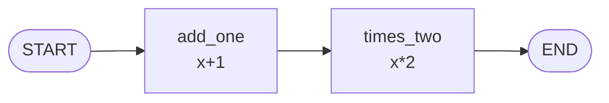

# 阶段 1：最小 DAG 执行器

> **目标**：从空文件开始，写一个能跑的图引擎。节点=函数，边=静态跳转，按顺序执行。
>
> **git tag**：`stage-1` · **代码**：`src/tiny_langgraph/graph.py`

## 这一阶段做了什么

实现了 LangGraph 最朴素的形态——**无状态函数链**：

```python
from tiny_langgraph import END, START, Graph

graph = Graph()
graph.add_node("add_one", lambda x: x + 1)
graph.add_node("times_two", lambda x: x * 2)
graph.add_edge(START, "add_one")
graph.add_edge("add_one", "times_two")
graph.add_edge("times_two", END)

app = graph.compile()
app.invoke(3)  # 3 -> 4 -> 8
```



## 核心设计决策

### 1. 为什么从"线性链"开始，而不是直接上 DAG

真实 LangGraph 的 `Graph`（非 `StateGraph`）就是线性链语义：节点签名 `Callable[[Any], Any]`，接收**上一步的输出值**，返回自己的输出值。

为什么不上真正的 DAG（一个节点多个前驱）？因为"多个前驱的输出怎么聚合"这个问题，**需要状态**——而状态是阶段 2 才引入的。阶段 1 把"图怎么存、怎么校验、怎么编译"这套骨架立起来，不被状态的合并逻辑干扰。

### 2. 图怎么存

```python
class Graph:
    _nodes: dict[str, Callable]   # 节点名 -> 函数
    _edges: dict[str, str]        # 源节点 -> 目标节点
    _entry_point: str | None      # 入口
```

用**邻接表**（`dict[str, str]`）存边。线性链下每个节点最多一条出边，所以 `source -> target` 一对一，用 dict 最直接。

阶段 4 引入循环后，边会变成 `dict[str, list[str]]`（一个节点多条出边），但那是后话。

### 3. `compile()` 做了什么——为什么不是直接跑

```python
app = graph.compile()   # 校验 + 构建执行顺序
app.invoke(3)           # 真正执行
```

`compile` 做两件事：

1. **校验**：有入口吗？边指向的节点存在吗？有环吗？
2. **构建执行顺序**：从入口顺着边走，收集节点序列 `[add_one, times_two]`

为什么分离？因为**校验是一次性的，执行是多次的**。你 compile 一次，invoke 很多次（不同输入）。如果每次 invoke 都重新校验，浪费。这也是真实 LangGraph 的模式：`graph.compile()` 返回一个 `CompiledGraph` / `Runnable`。

### 4. 环检测

```python
def _build_execution_order(self) -> list[str]:
    order: list[str] = []
    current: str | None = self._entry_point
    while current is not None and current != END:
        if current in order:               # ← 二次访问 = 有环
            raise ValueError(f"检测到环：节点 '{current}' 被二次访问")
        order.append(current)
        current = self._edges.get(current)
    return order
```

线性链的环检测很简单：顺着走，如果走到一个**已经走过的节点**，就是环。真正的 DAG 需要拓扑排序 + 三色标记，但线性链下这个朴素检测就够了。

阶段 4 引入循环图后，**环变成合法的**（Agent 的 ReAct 循环就是环），到时检测逻辑会改成"靠条件边 + recursion_limit 终止"。

### 5. `START` 和 `END` 是什么

```python
START = "__start__"
END   = "__end__"
```

它们是**虚拟节点**，不是真的函数节点：

- `add_edge(START, "a")`：设置入口为 `a`（`START` 没有函数体，只是个标记）
- `add_edge("c", END)`：设置 `c` 为结束节点（执行完 `c` 就返回，`END` 不执行）

这统一了 API——入口和出口都用 `add_edge` 表达，不用单独的 `set_entry_point`（虽然我们也保留了它作为语法糖）。

## 代码走读

=== "`Graph.add_node`"
    ```python
    def add_node(self, name: str, func: Callable[[Any], Any]) -> None:
        if name in (START, END):
            raise ValueError(f"节点名 '{name}' 是保留字")
        if name in self._nodes:
            raise ValueError(f"节点 '{name}' 已存在")
        self._nodes[name] = func
    ```
    存进 `_nodes` 字典。两个校验：不能和 `START`/`END` 撞名、不能重名。

=== "`Graph.add_edge`"
    ```python
    def add_edge(self, source: str, target: str) -> None:
        if source == START:
            self._entry_point = target    # START->a 即设置入口
            return
        if source in self._edges:
            raise ValueError("已有出边")  # 线性链限制
        self._edges[source] = target
    ```
    `START` 边特殊处理（设入口）。普通边存进 `_edges`，限制每节点一条出边。

=== "`CompiledGraph.invoke`"
    ```python
    def invoke(self, input: Any) -> Any:
        result = input
        for name in self._order:
            result = self._nodes[name](result)
        return result
    ```
    核心就这 3 行：顺着编译好的顺序，把上一步的输出喂给下一个节点。

## 运行示例

```bash
python -m examples.stage_1_dag.run
```

输出：

```
示例 1：数字管线
  1 -> +1 -> *2 -> ^2 = 16
  2 -> +1 -> *2 -> ^2 = 36
  3 -> +1 -> *2 -> ^2 = 64
  5 -> +1 -> *2 -> ^2 = 144

示例 2：文本管线
  '  Hello World  ' -> strip -> lower -> reverse =
  'dlrow olleh'

示例 3：单节点图
  negate(42) = -42
```

## 对照真实 LangGraph

真实 LangGraph 的 `Graph` 在 [`langgraph/graph/graph.py`](https://github.com/langchain-ai/langgraph/blob/main/libs/langgraph/langgraph/graph/graph.py)：

| 真实 LangGraph | 我们的阶段 1 | 说明 |
|----------------|-------------|------|
| `Graph` 继承 `StateGraph` | `Graph` 独立 | 真实版复用 StateGraph 逻辑，我们阶段 1 还没有 StateGraph |
| 节点 `Callable[[Any], Any]` | 同 | 语义一致 |
| `compile()` 返回 `CompiledStateGraph` | 返回 `CompiledGraph` | 同模式 |
| 支持 `add_conditional_edges` | ❌ 阶段 3 | |
| 支持循环 | ❌ 阶段 4 | |

**关键一致点**：`compile()` 分离校验和执行、`START`/`END` 虚拟节点、邻接表存图——这套骨架和真实版完全同构。

## 这一阶段的局限

| 局限 | 谁来解决 |
|------|----------|
| 节点只能接收"上一步的输出"，不能读共享状态 | 阶段 2 `StateGraph` |
| 不能 `if/else` 分支 | 阶段 3 条件边 |
| 不能循环（Agent 的 ReAct） | 阶段 4 循环图 |
| 多个节点不能并行 | 阶段 6 Pregel |

---

👉 下一阶段：[阶段 2 - 共享状态](stage_2_state.md)——让节点能读写一个共享的 `state` 字典。
