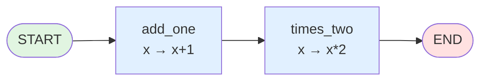
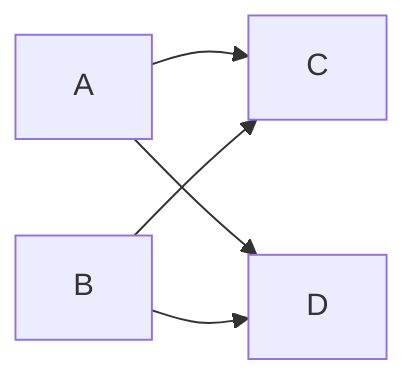
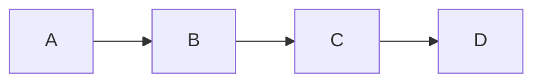
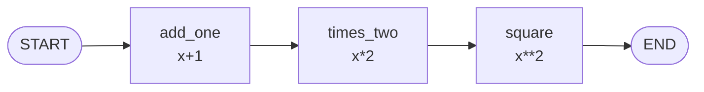
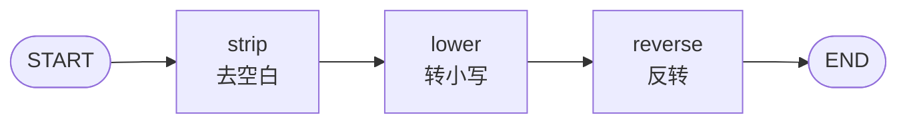
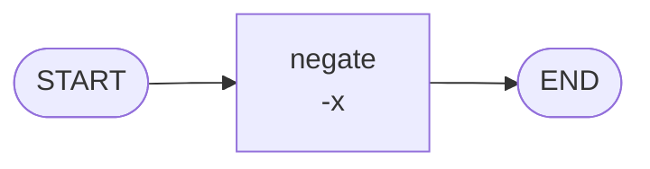

# 阶段 1：最小 DAG 执行器

> **本阶段目标**：从空文件开始，写一个能跑的图引擎。节点=函数，边=静态跳转，按顺序执行。
>
> **前置条件**：读完 [阶段 0 项目骨架](stage_0_skeleton.md)，理解 `src/` 布局、`pyproject.toml` extras、测试镜像结构。
>
> **git tag**：`stage-1` · **代码**：`src/tiny_langgraph/graph.py`（约 80 行）· **测试**：`tests/tiny_langgraph/test_graph.py`（约 160 行）

---

## 阶段目标与定位

阶段 0 搭好了骨架，但 `src/tiny_langgraph/graph.py` 还是空的。阶段 1 要往里写**第一段引擎代码**——一个最小的图执行器。

"最小"意味着：

- 节点是普通函数 `Callable[[Any], Any]`，接收上一步的输出，返回自己的输出
- 边是静态的：执行完 A 就跳 B，没有条件分支
- 图是线性链：每个节点最多一条出边，没有分叉、没有循环
- 没有状态：节点之间只传"上一步的返回值"，不共享字典

读完本阶段你应该能回答：

- `Graph` 的三个内部字段 `_nodes` / `_edges` / `_entry_point` 各存什么？
- `add_edge(START, "a")` 和 `set_entry_point("a")` 有什么区别？
- `compile()` 为什么不直接跑，而要返回一个 `CompiledGraph`？
- `_build_execution_order` 怎么检测环？
- `START` 和 `END` 为什么是字符串常量而不是类？

---

## 这一阶段做了什么

实现了 LangGraph 最朴素的形态——**无状态函数链**：

```python
from tiny_langgraph import END, START, Graph

graph = Graph()
graph.add_node("add_one", lambda x: x + 1)
graph.add_node("times_two", lambda x: x * 2)
graph.add_edge(START, "add_one")
graph.add_edge("add_one", "times_two")
graph.add_edge("times_two", END)

app = graph.compile()
app.invoke(3)  # 3 -> 4 -> 8
```

对应的图：



执行流程：`invoke(3)` 把 3 喂给 `add_one` 得 4，4 喂给 `times_two` 得 8，到 END 返回 8。

---

## 设计思路：为什么从无状态函数链开始

### 三条路可选，选最窄的

实现一个"图执行器"，第一反应可能是直接上最通用的形态：DAG + 拓扑排序 + 多前驱聚合。但这条路一上来就要回答：

1. 一个节点有多个前驱，前驱的输出怎么聚合？`list`？`dict`？自定义函数？
2. 聚合需要"等所有前驱都完成"——这隐含了并行/等待语义
3. 节点之间传什么？一个值？多个值？带标签的值？

**这些问题都需要"状态"概念**——而状态是阶段 2 才引入的。阶段 1 如果硬上 DAG，要么把状态提前引入（破坏渐进式），要么用一堆 hack 绕过（代码丑）。

!!! tip "渐进式的核心策略"
    **每阶段只引入一个新概念。** 阶段 1 的概念是"图怎么存、怎么校验、怎么编译、怎么执行"。把这套骨架立起来，不被状态的合并逻辑干扰。阶段 2 再在稳固的骨架上加状态。

### 为什么线性链而不是真 DAG

线性链（每节点最多一条出边）的特殊性：

| 问题 | 线性链 | 真 DAG |
|------|--------|--------|
| 多前驱聚合 | 不存在（每节点最多一个前驱） | 必须定义聚合策略 |
| 执行顺序 | 顺着边走就行 | 需要拓扑排序 |
| 环检测 | 走到重复节点就是环 | 需要三色标记 / Kahn 算法 |
| 数据传递 | 上一步输出直接喂下一步 | 多个前驱的输出要合并 |

线性链把所有"聚合"问题都绕开了，让阶段 1 的代码能集中在"图结构 + 执行骨架"上。

### 真实 LangGraph 的 `Graph` 也是线性链语义

这不是我们偷工减料——**真实 LangGraph 的 `Graph`（非 `StateGraph`）就是线性链语义**。它的节点签名是 `Callable[[Any], Any]`，接收上一步的输出值，返回自己的输出值。要做分叉/聚合，得用 `StateGraph`。

所以阶段 1 的 `Graph` 和真实版的 `Graph` 在语义上**完全一致**，只是砍掉了真实版继承 `StateGraph` 的实现复用。

---

## `Graph` 类详解

`Graph` 是**构建器**——你用 `add_node` / `add_edge` 往里加东西，最后 `compile()` 出一个可执行物。它本身不执行。

### 内部状态

```python
class Graph:
    def __init__(self) -> None:
        self._nodes: dict[str, Callable[[Any], Any]] = {}
        self._edges: dict[str, str] = {}
        self._entry_point: str | None = None
```

三个字段：

| 字段 | 类型 | 作用 |
|------|------|------|
| `_nodes` | `dict[str, Callable]` | 节点名 → 函数。`{"add_one": <lambda>}` |
| `_edges` | `dict[str, str]` | 源节点 → 目标节点。`{"add_one": "times_two"}` |
| `_entry_point` | `str \| None` | 入口节点名。`"add_one"` |

!!! info "为什么 `_edges` 是 `dict[str, str]` 而不是 `dict[str, list[str]]`"
    线性链下每节点**最多一条出边**，用 `dict[str, str]` 一对一最直接。阶段 2 的 `StateGraph` 会改成 `dict[str, list[str]]` 支持一个节点多条出边（fan-out）。
    
    用 dict 存边 = **邻接表**。比邻接矩阵省空间，比边列表好查"某节点的后继是谁"。

### `add_node`：加节点

```python
def add_node(self, name: str, func: Callable[[Any], Any]) -> None:
    if name in (START, END):
        raise ValueError(f"节点名 '{name}' 是保留字，不能用作节点名")
    if name in self._nodes:
        raise ValueError(f"节点 '{name}' 已存在")
    self._nodes[name] = func
```

两个校验：

1. **保留字校验**：节点名不能是 `"__start__"` 或 `"__end__"`（`START`/`END` 的值）。否则 `add_edge(START, ...)` 会分不清"指向入口"还是"指向名为 `__start__` 的节点"。
2. **重名校验**：同名节点会覆盖，隐式覆盖是 bug 源泉，直接报错。

!!! warning "为什么节点名是 str 而不是任意 hashable"
    真实 LangGraph 也要求 str。原因：
    
    - 序列化友好（检查点存 JSON，key 必须 str）
    - 错误信息可读（`"节点 'add_one' 已存在"` 比 `"节点 <function <lambda> at 0x...> 已存在"` 好懂）
    - 和 `START`/`END`（str 常量）类型一致

### `add_edge`：加边

```python
def add_edge(self, source: str, target: str) -> None:
    if source == START:
        if target not in self._nodes:
            raise ValueError(f"目标节点 '{target}' 不存在")
        self._entry_point = target
        return
    if source not in self._nodes:
        raise ValueError(f"源节点 '{source}' 不存在")
    if target != END and target not in self._nodes:
        raise ValueError(f"目标节点 '{target}' 不存在")
    if source in self._edges:
        raise ValueError(
            f"节点 '{source}' 已有出边（阶段 1 为线性链：每节点最多一条出边）"
        )
    self._edges[source] = target
```

四个分支，逐个拆：

#### 分支 1：`source == START`（设置入口）

```python
if source == START:
    if target not in self._nodes:
        raise ValueError(f"目标节点 '{target}' 不存在")
    self._entry_point = target
    return
```

`add_edge(START, "a")` 的语义是"入口是 a"。`START` 不是真节点（没有函数体），所以这条边不存进 `_edges`，而是设置 `_entry_point`。

`return` 提前退出——`START` 边不走后面的逻辑。

#### 分支 2：源节点不存在

```python
if source not in self._nodes:
    raise ValueError(f"源节点 '{source}' 不存在")
```

`add_edge("ghost", "a")` 报错。**必须先 `add_node` 再 `add_edge`**。

#### 分支 3：目标节点不存在（且不是 END）

```python
if target != END and target not in self._nodes:
    raise ValueError(f"目标节点 '{target}' 不存在")
```

`add_edge("a", "ghost")` 报错。但 `add_edge("a", END)` 合法——`END` 是虚拟终点，不需要在 `_nodes` 里。

`target != END` 这个条件让 `END` 成为唯一一个"可以作目标但不在 `_nodes` 里"的特殊值。

#### 分支 4：已有出边（线性链限制）

```python
if source in self._edges:
    raise ValueError(
        f"节点 '{source}' 已有出边（阶段 1 为线性链：每节点最多一条出边）"
    )
self._edges[source] = target
```

`add_edge("a", "b")` 之后再 `add_edge("a", "c")` 报错。线性链要求每节点最多一条出边。

!!! question "为什么这么严格"
    如果允许 `add_edge("a", "b")` + `add_edge("a", "c")`，那执行完 `a` 后跳 `b` 还是 `c`？
    
    - 无条件都跳？那是 fan-out，需要并行 + 聚合（阶段 6 Pregel）
    - 二选一？那是条件边（阶段 3）
    
    阶段 1 都不支持，所以直接报错。**报错比隐式行为好**——用户看到错误能立刻知道"这个阶段不支持，要去阶段 3/6"。

### `set_entry_point` 和 `set_finish_point`：语法糖

```python
def set_entry_point(self, name: str) -> None:
    if name not in self._nodes:
        raise ValueError(f"节点 '{name}' 不存在")
    self._entry_point = name

def set_finish_point(self, name: str) -> None:
    self.add_edge(name, END)
```

`set_entry_point("a")` 等价于 `add_edge(START, "a")`。
`set_finish_point("a")` 等价于 `add_edge("a", END)`。

!!! info "为什么保留两套 API"
    `add_edge(START, ...)` 统一用边表达入口，API 更一致。`set_entry_point` 是早期 LangGraph 的 API，保留它是为了**和真实 LangGraph 的 API 兼容**，让读者对照时不会困惑。

### `compile`：编译

```python
def compile(self) -> CompiledGraph:
    if self._entry_point is None:
        raise ValueError(
            "未设置入口节点（用 add_edge(START, ...) 或 set_entry_point(...)）"
        )
    order = self._build_execution_order()
    return CompiledGraph(nodes=self._nodes, order=order)
```

两步：

1. **校验有入口**：没入口没法跑
2. **构建执行顺序**：调 `_build_execution_order` 顺着边走，收集节点序列

返回一个 `CompiledGraph`，它持有 `_nodes` 和 `order`，能 `invoke`。

### `_build_execution_order`：构建执行顺序 + 环检测

```python
def _build_execution_order(self) -> list[str]:
    order: list[str] = []
    current: str | None = self._entry_point
    while current is not None and current != END:
        if current not in self._nodes:
            raise ValueError(f"边指向不存在的节点 '{current}'")
        if current in order:
            raise ValueError(f"检测到环：节点 '{current}' 被二次访问")
        order.append(current)
        current = self._edges.get(current)
    return order
```

逐行：

| 行 | 作用 |
|----|------|
| `order = []` | 收集节点序列 |
| `current = self._entry_point` | 从入口开始 |
| `while current is not None and current != END:` | 走到 END 或没出边就停 |
| `if current not in self._nodes:` | 边指向的节点不存在（dangling edge） |
| `if current in order:` | **二次访问 = 有环** |
| `order.append(current)` | 收集 |
| `current = self._edges.get(current)` | 顺着边走到下一个 |

!!! tip "线性链的环检测为什么这么简单"
    线性链每节点最多一条出边，从入口顺着走是一条**单链**。如果走到一个已经走过的节点，必定是环。
    
    真 DAG 的环检测需要拓扑排序（Kahn 算法）或三色标记 DFS，因为一个节点可能有多个前驱，"二次访问"不一定是环（可能是钻石形 DAG 的汇合点）。但线性链没有多前驱，朴素检测就够。

---

## `CompiledGraph` 类详解

`CompiledGraph` 是**可执行物**——`Graph.compile()` 的返回值。它持有编译好的节点序列，能多次 `invoke`。

```python
class CompiledGraph:
    def __init__(
        self, nodes: dict[str, Callable[[Any], Any]], order: list[str]
    ) -> None:
        self._nodes = nodes
        self._order = order

    def invoke(self, input: Any) -> Any:
        result = input
        for name in self._order:
            result = self._nodes[name](result)
        return result
```

### `invoke` 的执行流程

```python
def invoke(self, input: Any) -> Any:
    result = input
    for name in self._order:
        result = self._nodes[name](result)
    return result
```

核心就这 3 行：

1. `result = input`：把输入作为初始 result
2. 顺着 `_order`（编译时构建的节点序列），把上一步的 `result` 喂给当前节点
3. 返回最后的 `result`

执行 `app.invoke(3)`，`_order = ["add_one", "times_two"]`：

```
result = 3
result = add_one(3) = 4
result = times_two(4) = 8
return 8
```

!!! info "为什么 `invoke` 这么简单"
    因为所有复杂度都在 `compile` 时解决了——校验、构建顺序、环检测。`invoke` 只负责顺着顺序跑。
    
    这是 `compile` 分离校验和执行的核心收益：**校验一次，执行多次**。

---

## `START` / `END` 虚拟节点的设计理由

```python
START = "__start__"
END = "__end__"
```

它们是**字符串常量**，不是类、不是枚举、不是 Sentinel 对象。

### 为什么需要虚拟节点

没有 `START`/`END` 的话，入口和出口怎么表达？

| 方案 | 问题 |
|------|------|
| `Graph` 构造时传 `entry="a"` | 入口要在构造时就定死，不能后加 |
| `set_entry_point("a")` 单独 API | 入口和普通边用不同 API，不一致 |
| `add_edge(START, "a")` | **统一用边表达**，API 一致 |

`add_edge(START, "a")` 让"入口是 a"和"a 后面跳 b"用同一个 API（`add_edge`）。这是 LangGraph 的 API 设计精髓——**一切都是边**。

### 为什么是字符串而不是 Sentinel 对象

```python
# 方案 A：字符串常量（我们采用）
START = "__start__"

# 方案 B：Sentinel 对象
class _START: ...
START = _START()
```

字符串的理由：

1. **序列化友好**——检查点存 JSON，key 必须 str。Sentinel 对象不能直接 JSON 化
2. **可读**——错误信息 `"节点 '__start__' 是保留字"` 比 `"节点 <START object> 是保留字"` 好懂
3. **和节点名类型一致**——`add_edge` 的参数都是 str，类型统一

!!! warning "字符串方案的缺点"
    用户可能不小心把节点命名为 `"__start__"`，撞上保留字。所以 `add_node` 要校验 `name in (START, END)` 并报错。这是用字符串的代价——多一个校验。

### `START` 和 `END` 不在 `_nodes` 里

`START` 没有函数体（它不执行，只是入口标记），`END` 也没有（它不执行，只是终止标记）。所以它们不存进 `_nodes`。

`_build_execution_order` 的 `while current != END` 条件让遍历到 `END` 就停，不会试图 `self._nodes[END]`。

---

## 拓扑排序 vs 线性链

### 真 DAG 需要拓扑排序

真 DAG（有向无环图）的节点可能有多个前驱：



执行 C 之前要等 A 和 B 都完成。执行顺序不能简单"顺着边走"，需要**拓扑排序**：

1. 计算每个节点的入度
2. 入度为 0 的节点先执行
3. 执行完一个节点，把它的后继的入度减 1
4. 重复

### 阶段 1 为什么不需要

线性链每节点**最多一个前驱**（因为每节点最多一条出边，反过来也成立）。从入口顺着走就是唯一可能的执行顺序，不需要排序。



执行顺序就是 `[A, B, C, D]`，`_build_execution_order` 顺着边走一遍就得到。

### 阶段 6 会怎么处理 DAG

阶段 6 引入 Pregel 超级步后，执行模型变成"按层并行"：


- 超级步 0：执行 A、B（都没前驱，并行）
- 超级步 1：执行 C、D（前驱都完成了，并行）

这比拓扑排序更激进——不仅排序了，还把同层的节点并行跑。但这是阶段 6 的事，阶段 1 不背这个复杂度。

---

## `compile` 分离校验与执行的设计意义

### 两个职责分开

```python
# Graph（构建器）：负责校验 + 构建顺序
app = graph.compile()   # 一次性

# CompiledGraph（执行器）：负责跑
app.invoke(3)           # 多次
app.invoke(10)          # 不同输入
app.invoke(100)         # 复用编译结果
```

### 收益 1：校验只做一次

校验（有入口吗、边指向的节点存在吗、有环吗）是**图结构属性**，和输入无关。每次 `invoke` 都重新校验是浪费。

```python
# 不好：每次 invoke 都校验
def invoke(self, input):
    self._validate()  # 浪费
    ...

# 好：compile 时校验一次
def compile(self):
    self._validate()
    return CompiledGraph(...)

def invoke(self, input):
    ...  # 直接跑，不校验
```

### 收益 2：错误前置

`compile` 时报错，比 `invoke` 时报错好：

- `compile` 是构建阶段，开发者看到错误能立刻修图结构
- `invoke` 是运行阶段，可能在生产环境跑，错误代价高

"**fail fast**"——错误越早暴露越好。

### 收益 3：和真实 LangGraph 同构

真实 LangGraph 的 `graph.compile()` 返回一个 `CompiledStateGraph`（或 `Runnable`），也是这个模式。我们的 `CompiledGraph` 是它的简化版。

!!! info "真实 LangGraph 的 compile 还做什么"
    真实版 `compile` 还会：
    
    - 把图编译成 Pregel 的通道读写图
    - 设置 debug 信息
    - 处理 interrupt 配置
    - 绑定 checkpointer
    
    我们阶段 1 只做"校验 + 构建顺序"，后续阶段会往 `compile` 里加东西。

---

## 完整代码逐行解读

下面是 `src/tiny_langgraph/graph.py` 阶段 1 部分的完整代码（去掉阶段 2-6 的内容），带行号解读。

### 模块头

```python
# graph.py:1-32（模块 docstring，描述 6 个阶段）
"""图执行引擎核心 - 阶段 1-6：DAG + 状态 + 条件边 + 循环 + Reducer + Pregel。

阶段 1：无状态函数链
    - 节点 = ``Callable[[Any], Any]``，接收上一步输出，返回自己的输出
    - :class:`Graph` / :class:`CompiledGraph`
...
"""

# graph.py:34-37（导入）
from __future__ import annotations

from collections.abc import Callable, Generator
from typing import Any
```

`from __future__ import annotations` 让所有注解变成字符串（PEP 563），这样 `Callable[[Any], Any]` 在 3.10 也能用 `|` 联合类型。

### 常量

```python
# graph.py:42-49（__all__）
__all__ = [
    "START",
    "END",
    "Graph",
    "CompiledGraph",
    "StateGraph",
    "CompiledStateGraph",
]

# graph.py:51-54（虚拟节点 + 递归限制）
START = "__start__"
END = "__end__"

DEFAULT_RECURSION_LIMIT = 25
```

`__all__` 控制 `from tiny_langgraph.graph import *` 导出哪些。`DEFAULT_RECURSION_LIMIT = 25` 是阶段 4 循环图的递归限制，阶段 1 不用。

### `Graph` 类

```python
# graph.py:57-73（类 docstring + 用法示例）
class Graph:
    """有向无环图（线性链形态） - 阶段 1。

    无状态函数链：节点签名 ``Callable[[Any], Any]``...

    用法::

        graph = Graph()
        graph.add_node("a", lambda x: x + 1)
        ...
        app = graph.compile()
        app.invoke(3)  # 3 -> a:4 -> b:8
    """

    # graph.py:75-78（构造）
    def __init__(self) -> None:
        self._nodes: dict[str, Callable[[Any], Any]] = {}
        self._edges: dict[str, str] = {}
        self._entry_point: str | None = None
```

docstring 里有可运行的用法示例——mkdocstrings 会把它渲染进 API 文档。

### `add_node`

```python
    # graph.py:80-85
    def add_node(self, name: str, func: Callable[[Any], Any]) -> None:
        if name in (START, END):
            raise ValueError(f"节点名 '{name}' 是保留字，不能用作节点名")
        if name in self._nodes:
            raise ValueError(f"节点 '{name}' 已存在")
        self._nodes[name] = func
```

3 行校验 + 1 行赋值。校验失败抛 `ValueError`（不是 `Exception` 或 `RuntimeError`），因为这是"调用方传错参数"的语义。

### `add_edge`

```python
    # graph.py:87-101
    def add_edge(self, source: str, target: str) -> None:
        if source == START:
            if target not in self._nodes:
                raise ValueError(f"目标节点 '{target}' 不存在")
            self._entry_point = target
            return
        if source not in self._nodes:
            raise ValueError(f"源节点 '{source}' 不存在")
        if target != END and target not in self._nodes:
            raise ValueError(f"目标节点 '{target}' 不存在")
        if source in self._edges:
            raise ValueError(
                f"节点 '{source}' 已有出边（阶段 1 为线性链：每节点最多一条出边）"
            )
        self._edges[source] = target
```

四个分支前面拆过，这里看整体：**校验在前、赋值在后**，所有校验通过才赋值。这是防御式编程。

### `set_entry_point` / `set_finish_point`

```python
    # graph.py:103-109
    def set_entry_point(self, name: str) -> None:
        if name not in self._nodes:
            raise ValueError(f"节点 '{name}' 不存在")
        self._entry_point = name

    def set_finish_point(self, name: str) -> None:
        self.add_edge(name, END)
```

语法糖。`set_finish_point` 直接委托给 `add_edge`，复用校验逻辑。

### `compile` + `_build_execution_order`

```python
    # graph.py:111-117
    def compile(self) -> CompiledGraph:
        if self._entry_point is None:
            raise ValueError(
                "未设置入口节点（用 add_edge(START, ...) 或 set_entry_point(...)）"
            )
        order = self._build_execution_order()
        return CompiledGraph(nodes=self._nodes, order=order)

    # graph.py:119-129
    def _build_execution_order(self) -> list[str]:
        order: list[str] = []
        current: str | None = self._entry_point
        while current is not None and current != END:
            if current not in self._nodes:
                raise ValueError(f"边指向不存在的节点 '{current}'")
            if current in order:
                raise ValueError(f"检测到环：节点 '{current}' 被二次访问")
            order.append(current)
            current = self._edges.get(current)
        return order
```

`compile` 校验入口后调 `_build_execution_order`。后者顺着边走，收集节点，检测环和 dangling edge。

### `CompiledGraph`

```python
# graph.py:132-145
class CompiledGraph:
    """编译后的可执行图（无状态）。"""

    def __init__(
        self, nodes: dict[str, Callable[[Any], Any]], order: list[str]
    ) -> None:
        self._nodes = nodes
        self._order = order

    def invoke(self, input: Any) -> Any:
        result = input
        for name in self._order:
            result = self._nodes[name](result)
        return result
```

整个类就 14 行。`invoke` 3 行核心逻辑。**简单是阶段 1 的追求**。

---

## 可运行示例

### 示例代码

`examples/stage_1_dag/run.py`：

```python
from tiny_langgraph import END, START, Graph


def main() -> None:
    # 示例 1：数字管线
    graph = Graph()
    graph.add_node("add_one", lambda x: x + 1)
    graph.add_node("times_two", lambda x: x * 2)
    graph.add_node("square", lambda x: x**2)
    graph.add_edge(START, "add_one")
    graph.add_edge("add_one", "times_two")
    graph.add_edge("times_two", "square")
    graph.add_edge("square", END)

    app = graph.compile()
    for n in (1, 2, 3, 5):
        result = app.invoke(n)
        print(f"  {n} -> +1 -> *2 -> ^2 = {result}")

    # 示例 2：文本管线
    text_graph = Graph()
    text_graph.add_node("strip", str.strip)
    text_graph.add_node("lower", str.lower)
    text_graph.add_node("reverse", lambda s: s[::-1])
    text_graph.add_edge(START, "strip")
    text_graph.add_edge("strip", "lower")
    text_graph.add_edge("lower", "reverse")
    text_graph.add_edge("reverse", END)

    text_app = text_graph.compile()
    print(f"  '{text_app.invoke('  Hello World  ')}'")

    # 示例 3：单节点图
    single = Graph()
    single.add_node("negate", lambda x: -x)
    single.add_edge(START, "negate")
    single.add_edge("negate", END)
    print(f"  negate(42) = {single.compile().invoke(42)}")
```

### 运行

```bash
python -m examples.stage_1_dag.run
```

### 输出

```
============================================================
示例 1：数字管线
============================================================
  1 -> +1 -> *2 -> ^2 = 16
  2 -> +1 -> *2 -> ^2 = 36
  3 -> +1 -> *2 -> ^2 = 64
  5 -> +1 -> *2 -> ^2 = 144

============================================================
示例 2：文本管线
============================================================
  '  Hello World  ' -> strip -> lower -> reverse =
  'dlrow olleh'

============================================================
示例 3：单节点图
============================================================
  negate(42) = -42
```

### 逐个示例解读

#### 示例 1：数字管线

三个节点串成链：`add_one → times_two → square`。



`invoke(5)` 的执行：

```
5 → add_one → 6 → times_two → 12 → square → 144
```

`compile` 一次，`invoke` 四次（不同输入）。体现"校验一次，执行多次"。

#### 示例 2：文本管线

三个字符串方法串成链：`strip → lower → reverse`。



`invoke('  Hello World  ')`：

```
'  Hello World  ' → strip → 'Hello World' → lower → 'hello world' → reverse → 'dlrow olleh'
```

!!! tip "节点可以是任何 Callable"
    `str.strip`、`str.lower` 是内置方法，`lambda s: s[::-1]` 是 lambda。只要 `Callable[[Any], Any]` 都能当节点。甚至：
    
    ```python
    def my_node(x):
        ...
    graph.add_node("mine", my_node)
    ```
    
    普通函数也行。

#### 示例 3：单节点图

只有一个节点 `negate`。



`invoke(42)`：

```
42 → negate → -42
```

单节点图是合法的——`_build_execution_order` 返回 `["negate"]`，`invoke` 跑一个节点就返回。

---

## 测试解读

`tests/tiny_langgraph/test_graph.py` 161 行，4 个测试类，对应 `Graph` 的 4 个功能组。

### 测试结构

```python
class TestAddNode:
    """add_node 的行为。"""
    ...

class TestAddEdge:
    """add_edge 的行为。"""
    ...

class TestCompile:
    """compile 的校验逻辑。"""
    ...

class TestInvoke:
    """invoke 的执行逻辑。"""
    ...
```

类名 `TestXxx` 对应被测功能 `Xxx`。pytest 自动发现 `Test*` 类里的 `test_*` 方法。

### `TestAddNode`：加节点

```python
class TestAddNode:
    def test_add_node_succeeds(self) -> None:
        graph = Graph()
        graph.add_node("a", lambda x: x)
        assert "a" in graph._nodes

    def test_duplicate_node_raises(self) -> None:
        graph = Graph()
        graph.add_node("a", lambda x: x)
        with pytest.raises(ValueError, match="已存在"):
            graph.add_node("a", lambda x: x)

    @pytest.mark.parametrize("reserved", [START, END])
    def test_reserved_name_raises(self, reserved: str) -> None:
        graph = Graph()
        with pytest.raises(ValueError, match="保留字"):
            graph.add_node(reserved, lambda x: x)
```

| 测试 | 在测什么 |
|------|----------|
| `test_add_node_succeeds` | 正常加节点，节点进 `_nodes` |
| `test_duplicate_node_raises` | 重名报错，错误信息含"已存在" |
| `test_reserved_name_raises` | `START`/`END` 作节点名报错（参数化跑两次） |

!!! info "`pytest.raises(ValueError, match="已存在")`"
    `match` 参数用 `re.search` 匹配错误信息。不写 `match` 只检查异常类型，写了还检查信息含某子串。这能防止"抛了 ValueError 但信息不对"的假绿。

### `TestAddEdge`：加边

```python
class TestAddEdge:
    def test_start_edge_sets_entry_point(self) -> None:
        graph = Graph()
        graph.add_node("a", lambda x: x)
        graph.add_edge(START, "a")
        assert graph._entry_point == "a"

    def test_edge_to_end_succeeds(self) -> None:
        graph = Graph()
        graph.add_node("a", lambda x: x)
        graph.add_edge("a", END)  # 不报错就过

    def test_edge_to_unknown_target_raises(self) -> None:
        graph = Graph()
        graph.add_node("a", lambda x: x)
        with pytest.raises(ValueError, match="不存在"):
            graph.add_edge("a", "b")

    def test_edge_from_unknown_source_raises(self) -> None:
        graph = Graph()
        graph.add_node("a", lambda x: x)
        with pytest.raises(ValueError, match="不存在"):
            graph.add_edge("b", "a")

    def test_duplicate_outgoing_edge_raises(self) -> None:
        graph = Graph()
        graph.add_node("a", lambda x: x)
        graph.add_node("b", lambda x: x)
        graph.add_node("c", lambda x: x)
        graph.add_edge("a", "b")
        with pytest.raises(ValueError, match="已有出边"):
            graph.add_edge("a", "c")

    def test_start_edge_to_unknown_raises(self) -> None:
        graph = Graph()
        with pytest.raises(ValueError, match="不存在"):
            graph.add_edge(START, "a")
```

| 测试 | 在测什么 |
|------|----------|
| `test_start_edge_sets_entry_point` | `add_edge(START, "a")` 设置 `_entry_point` |
| `test_edge_to_end_succeeds` | `add_edge("a", END)` 合法 |
| `test_edge_to_unknown_target_raises` | 边指向不存在的节点报错 |
| `test_edge_from_unknown_source_raises` | 边从不存在的节点出发报错 |
| `test_duplicate_outgoing_edge_raises` | 同一节点加第二条出边报错（线性链限制） |
| `test_start_edge_to_unknown_raises` | `add_edge(START, "ghost")` 报错 |

### `TestCompile`：编译校验

```python
class TestCompile:
    def test_compile_without_entry_raises(self) -> None:
        graph = Graph()
        graph.add_node("a", lambda x: x)
        with pytest.raises(ValueError, match="入口"):
            graph.compile()

    def test_compile_detects_cycle(self) -> None:
        graph = Graph()
        graph.add_node("a", lambda x: x)
        graph.add_node("b", lambda x: x)
        graph.set_entry_point("a")
        graph._edges["a"] = "b"   # 绕过 add_edge 的出边校验
        graph._edges["b"] = "a"   # 直接塞，制造环
        with pytest.raises(ValueError, match="环"):
            graph.compile()

    def test_compile_detects_dangling_edge(self) -> None:
        graph = Graph()
        graph.add_node("a", lambda x: x)
        graph.set_entry_point("a")
        graph._edges["a"] = "ghost"  # 边指向不存在的节点
        with pytest.raises(ValueError, match="不存在"):
            graph.compile()
```

| 测试 | 在测什么 |
|------|----------|
| `test_compile_without_entry_raises` | 没入口报错 |
| `test_compile_detects_cycle` | 环检测（绕过 `add_edge` 直接塞 `_edges` 制造环） |
| `test_compile_detects_dangling_edge` | dangling edge 检测 |

!!! warning "为什么测试要绕过 `add_edge` 直接塞 `_edges`"
    `add_edge` 本身会阻止环（"已有出边"校验）。要测 `compile` 的环检测，得绕过 `add_edge`，直接操作 `_edges`。这是白盒测试——知道内部结构，故意制造 `add_edge` 不让造的情况。
    
    真实 LangGraph 的 `add_edge` 也阻止环（线性链下），但 `compile` 仍要检测，因为可能有 bug 让非法状态漏到 `compile`。**防御式设计**——每层都校验。

### `TestInvoke`：执行

```python
class TestInvoke:
    def test_single_node(self) -> None:
        graph = Graph()
        graph.add_node("double", lambda x: x * 2)
        graph.add_edge(START, "double")
        graph.add_edge("double", END)
        assert graph.compile().invoke(5) == 10

    def test_linear_chain(self) -> None:
        graph = Graph()
        graph.add_node("add_one", lambda x: x + 1)
        graph.add_node("times_two", lambda x: x * 2)
        graph.add_node("minus_three", lambda x: x - 3)
        graph.add_edge(START, "add_one")
        graph.add_edge("add_one", "times_two")
        graph.add_edge("times_two", "minus_three")
        graph.add_edge("minus_three", END)
        # 3 -> 4 -> 8 -> 5
        assert graph.compile().invoke(3) == 5

    def test_chain_preserves_order(self) -> None:
        calls: list[str] = []
        graph = Graph()
        graph.add_node("a", lambda x: (calls.append("a"), x + 1)[1])
        graph.add_node("b", lambda x: (calls.append("b"), x + 1)[1])
        graph.add_node("c", lambda x: (calls.append("c"), x + 1)[1])
        graph.add_edge(START, "a")
        graph.add_edge("a", "b")
        graph.add_edge("b", "c")
        graph.add_edge("c", END)
        graph.compile().invoke(0)
        assert calls == ["a", "b", "c"]

    def test_entry_directly_to_end(self) -> None:
        graph = Graph()
        graph.add_node("a", lambda x: x * 10)
        graph.add_edge(START, "a")
        graph.add_edge("a", END)
        assert graph.compile().invoke(7) == 70

    def test_set_entry_and_finish_point(self) -> None:
        graph = Graph()
        graph.add_node("a", lambda x: x + 100)
        graph.add_node("b", lambda x: x + 1)
        graph.set_entry_point("a")
        graph.add_edge("a", "b")
        graph.set_finish_point("b")
        assert graph.compile().invoke(0) == 101

    def test_string_pipeline(self) -> None:
        graph = Graph()
        graph.add_node("upper", str.upper)
        graph.add_node("reverse", lambda s: s[::-1])
        graph.add_edge(START, "upper")
        graph.add_edge("upper", "reverse")
        graph.add_edge("reverse", END)
        assert graph.compile().invoke("abc") == "CBA"
```

| 测试 | 在测什么 |
|------|----------|
| `test_single_node` | 单节点图能跑 |
| `test_linear_chain` | 三节点链，数值正确 |
| `test_chain_preserves_order` | **执行顺序** = 编译顺序（用 `calls` 列表记录） |
| `test_entry_directly_to_end` | 单节点 + 直接到 END |
| `test_set_entry_and_finish_point` | 语法糖 API 能跑 |
| `test_string_pipeline` | 字符串类型输入输出 |

!!! tip "`test_chain_preserves_order` 的技巧"
    ```python
    graph.add_node("a", lambda x: (calls.append("a"), x + 1)[1])
    ```
    lambda 里塞 `calls.append("a")` 副作用，返回 `(calls.append("a"), x + 1)` 元组的第二个元素。这样执行完能从 `calls` 看节点调用顺序。
    
    丑但有效——测试里允许丑，生产代码不要这么写。

---

## 对照真实 LangGraph 的 `Graph` 类

真实 LangGraph 的 `Graph` 在 [`langgraph/graph/graph.py`](https://github.com/langchain-ai/langgraph/blob/main/libs/langgraph/langgraph/graph/graph.py)。

### 实现差异

| 真实 LangGraph | 我们的阶段 1 | 说明 |
|----------------|-------------|------|
| `Graph` 继承 `StateGraph` | `Graph` 独立 | 真实版复用 StateGraph 逻辑，我们阶段 1 还没有 StateGraph |
| 节点 `Callable[[Any], Any]` | 同 | 语义一致 |
| `compile()` 返回 `CompiledStateGraph` | 返回 `CompiledGraph` | 同模式，不同类名 |
| 支持 `add_conditional_edges` | ❌ 阶段 3 | |
| 支持循环 | ❌ 阶段 4 | |
| 用 pydantic 校验 | 用 `if` + `raise` | 我们不用 pydantic |
| 异步 `ainvoke` | 只有同步 `invoke` | 我们不引入 asyncio |

### 关键一致点

| 设计点 | 真实版 | 我们 |
|--------|--------|------|
| `compile()` 分离校验和执行 | ✓ | ✓ |
| `START`/`END` 虚拟节点 | ✓ | ✓ |
| 邻接表存图 | ✓ | ✓ |
| `add_edge(START, ...)` 设入口 | ✓ | ✓ |
| 节点名是 str | ✓ | ✓ |
| 重名报错 | ✓ | ✓ |

**这套骨架和真实版完全同构**。阶段 1 的 80 行代码是真实版的"骨架提取"。

### 真实版 `Graph` 简化结构

```python
# 真实 LangGraph（简化）
class Graph(StateGraph):
    def __init__(self):
        super().__init__(dict)  # 用 dict 作状态类型
    
    def add_node(self, key, action):
        # 校验 + 存
        ...
```

真实版 `Graph` 继承 `StateGraph`，用 `dict` 作状态类型——本质上是"状态是单个值"的特例。我们阶段 1 不继承，独立实现，因为还没有 `StateGraph`。阶段 2 引入 `StateGraph` 后，理论上可以重构 `Graph` 继承它，但为了教学清晰我们保持独立。

---

## 常见错误和校验逻辑

### 错误 1：未设入口

```python
graph = Graph()
graph.add_node("a", lambda x: x)
graph.add_edge("a", END)  # 忘了 add_edge(START, "a")
graph.compile()  # ValueError: 未设置入口节点
```

**校验位置**：`compile` 的 `if self._entry_point is None`。

### 错误 2：节点不存在

```python
graph = Graph()
graph.add_edge("a", "b")  # ValueError: 源节点 'a' 不存在
```

**校验位置**：`add_edge` 的 `if source not in self._nodes`。

### 错误 3：保留字作节点名

```python
graph = Graph()
graph.add_node("__start__", lambda x: x)  # ValueError: 保留字
graph.add_node(START, lambda x: x)        # 同上
```

**校验位置**：`add_node` 的 `if name in (START, END)`。

### 错误 4：重复出边

```python
graph = Graph()
graph.add_node("a", lambda x: x)
graph.add_node("b", lambda x: x)
graph.add_node("c", lambda x: x)
graph.add_edge("a", "b")
graph.add_edge("a", "c")  # ValueError: 已有出边
```

**校验位置**：`add_edge` 的 `if source in self._edges`。

!!! question "想分叉怎么办"
    阶段 1 不支持。两个选择：
    
    - **无条件分叉**（fan-out，a → b 和 a → c 都走）：阶段 6 Pregel
    - **条件分叉**（a → b 或 a → c 二选一）：阶段 3 条件边

### 错误 5：环

```python
graph = Graph()
graph.add_node("a", lambda x: x)
graph.add_node("b", lambda x: x)
graph.set_entry_point("a")
graph._edges["a"] = "b"  # 绕过 add_edge
graph._edges["b"] = "a"  # 制造环
graph.compile()  # ValueError: 检测到环
```

**校验位置**：`_build_execution_order` 的 `if current in order`。

!!! info "正常途径造不出环"
    `add_edge` 的"已有出边"校验阻止了 `a → b` 之后再 `a → c`。要造环得绕过 `add_edge` 直接塞 `_edges`。但 `compile` 仍要检测——防御式设计，万一内部 bug 让非法状态漏过来。

### 错误 6：dangling edge

```python
graph = Graph()
graph.add_node("a", lambda x: x)
graph.set_entry_point("a")
graph._edges["a"] = "ghost"  # 边指向不存在的节点
graph.compile()  # ValueError: 边指向不存在的节点 'ghost'
```

**校验位置**：`_build_execution_order` 的 `if current not in self._nodes`。

---

## 从阶段 0 到阶段 1 的 diff 解读

`git diff stage-0..stage-1` 的关键改动：

### 新增文件

```
+ src/tiny_langgraph/graph.py              # ~80 行引擎代码
+ tests/tiny_langgraph/test_graph.py       # ~160 行测试
+ examples/stage_1_dag/run.py              # 3 个示例
+ docs/stages/stage_1_dag.md               # 本文档
```

### 修改文件

```diff
# pyproject.toml
- version = "0.0.0"
+ version = "0.1.0"

# src/tiny_langgraph/__init__.py
+ from tiny_langgraph.graph import END, START, CompiledGraph, Graph
+ __all__ = ["START", "END", "Graph", "CompiledGraph", ...]

# mkdocs.yml（阶段 1 文档进 nav）
  - 渐进式实现:
      - 阶段 0 - 项目骨架: stages/stage_0_skeleton.md
+     - 阶段 1 - DAG 执行器: stages/stage_1_dag.md
```

### 代码量

| 文件 | 行数 |
|------|------|
| `src/tiny_langgraph/graph.py`（阶段 1 部分） | ~80 |
| `tests/tiny_langgraph/test_graph.py` | ~160 |
| `examples/stage_1_dag/run.py` | ~60 |
| `docs/stages/stage_1_dag.md` | ~本篇 |

测试比代码多——这是健康的比例。教学项目尤其要测试充分，让读者通过测试理解预期行为。

---

## 设计思考

### 为什么 `CompiledGraph` 不直接是 `Graph`

可以把 `compile` 和 `invoke` 都塞进 `Graph`：

```python
# 不好：构建和执行混在一起
class Graph:
    def add_node(self, ...): ...
    def add_edge(self, ...): ...
    def invoke(self, input):
        # 每次都要校验 + 构建顺序
        self._validate()
        order = self._build_order()
        ...
```

为什么不这样？三个理由：

1. **校验浪费**：每次 `invoke` 都重新校验，但图结构没变
2. **职责不清**：`Graph` 既是构建器又是执行器，API 混乱（`add_node` 和 `invoke` 在同一个类上）
3. **不可变收益**：`CompiledGraph` 持有不变的 `order`，可以安全地被多个线程/协程共享

### 为什么 `invoke` 不返回中间结果

```python
# 当前：只返回最终结果
result = app.invoke(3)  # 8

# 假设：返回所有中间结果
results = app.invoke(3)  # [4, 8]？
```

不返回中间结果的理由：

1. **API 简洁**：`invoke` 返回一个值，语义清晰
2. **要中间结果用 `stream`**：阶段 4 会加 `stream` 方法，yield 每步事件
3. **类型简单**：`invoke: Any -> Any`，不是 `invoke: Any -> list[Any]`

### 为什么不用 `__call__` 代替 `invoke`

```python
# 可以让 CompiledGraph 可调用
app = graph.compile()
app(3)  # 等价于 app.invoke(3)
```

不这样做的理由：

1. **和真实 LangGraph 一致**：真实版用 `invoke`
2. **可扩展**：后续会加 `stream`、`ainvoke`、`astream`，`invoke` 是其中之一，不是唯一入口
3. **可读**：`app.invoke(3)` 比 `app(3)` 明确

---

## 阶段 1 的局限

| 局限 | 谁来解决 |
|------|----------|
| 节点只能接收"上一步的输出"，不能读共享状态 | 阶段 2 `StateGraph` |
| 不能 `if/else` 分支 | 阶段 3 条件边 |
| 不能循环（Agent 的 ReAct） | 阶段 4 循环图 |
| 一个节点不能有多个出边 | 阶段 3（条件） / 阶段 6（fan-out） |
| 多个节点不能并行 | 阶段 6 Pregel |
| 没有检查点 / 中断 | 阶段 7-8 |

---

## 一句话总结

!!! info "阶段 1 的核心"
    **80 行代码立起图执行引擎的骨架**：`Graph` 构建 + 校验，`CompiledGraph` 执行，`START`/`END` 统一入口出口表达。后续 8 个阶段都在这套骨架上加概念——状态、条件、循环、Reducer、Pregel、检查点、中断、Agent。

---

## 下一阶段

👉 [阶段 2：共享状态](stage_2_state.md) —— 让节点能读写一个共享的 `state` 字典，而不只是接收上一步的输出。引入 `StateGraph`、更新片段、覆盖合并。
