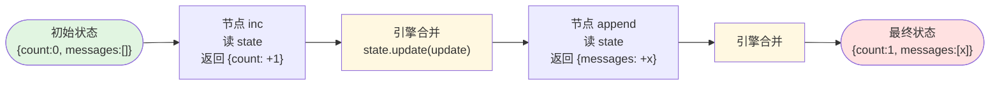
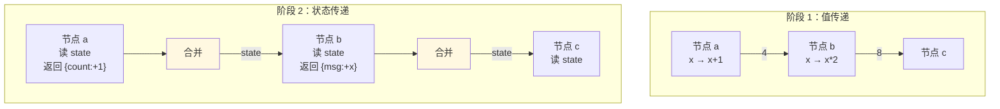

# 阶段 2：共享状态

> **本阶段目标**：让节点能读写一个共享的 `state` 字典，而不只是接收上一步的输出。
>
> **前置条件**：读完 [阶段 1 DAG 执行器](stage_1_dag.md)，理解 `Graph` / `CompiledGraph`、`START`/`END`、`compile` 分离校验与执行。
>
> **git tag**：`stage-2` · **代码**：`src/tiny_langgraph/graph.py` 中的 `StateGraph` / `CompiledStateGraph`（约 60 行新增）· **测试**：`tests/tiny_langgraph/test_state_graph.py`（约 107 行）

---

## 阶段目标与定位

阶段 1 的节点只能接收"上一步的输出值"——一个裸值（int、str、dict...）。这对真实 Agent 远远不够：

- Agent 节点要读"对话历史"（messages 列表）
- Agent 节点要读"当前工具调用次数"（计数器）
- 多个节点要共享"用户输入"（原始 query）

这些都需要一个**共享状态**——所有节点都能读、都能（部分）写。阶段 2 引入 `StateGraph`，让节点签名从 `Callable[[Any], Any]` 变成 `Callable[[State], StateUpdate]`。

读完本阶段你应该能回答：

- `StateGraph` 和 `Graph` 的节点签名有什么不同？
- 为什么节点返回"更新片段"而不是完整状态？
- `state.update(update)` 的覆盖语义是什么？为什么对消息列表是错的？
- `TypedDict` 在这里起什么作用？
- 为什么 `invoke` 要 `dict(input)` 复制一份？

---

## 这一阶段做了什么

引入 `StateGraph`：节点签名从 `Callable[[Any], Any]` 变成 `Callable[[State], StateUpdate]`。

```python
from typing import TypedDict
from tiny_langgraph import END, START, StateGraph

class State(TypedDict):
    count: int
    messages: list[str]

graph = StateGraph(State)
graph.add_node("inc", lambda s: {"count": s["count"] + 1})
graph.add_node("append", lambda s: {"messages": s["messages"] + ["x"]})
graph.add_edge(START, "inc")
graph.add_edge("inc", "append")
graph.add_edge("append", END)

result = graph.compile().invoke({"count": 0, "messages": []})
# {"count": 1, "messages": ["x"]}
```

对应的执行流程：



---

## 为什么需要状态：从无状态到有状态的动机

### 阶段 1 的局限

阶段 1 的节点签名是 `Callable[[Any], Any]`——接收上一步的输出，返回自己的输出。节点之间只传**一个值**。

```python
# 阶段 1：节点只看到一个值
def add_one(x): return x + 1       # 只知道 x
def times_two(x): return x * 2     # 只知道上一步的输出
```

这对"管线"够用（数据处理流水线），但对"Agent"不够：

```python
# Agent 节点需要同时读多个东西
def call_llm(???):
    messages = ???["messages"]        # 对话历史
    tool_count = ???["tool_count"]    # 工具调用次数
    query = ???["query"]              # 原始用户输入
    ...
```

??? question "能不能用 dict 当那个 'Any'"
    可以！阶段 1 的节点能接收 dict：
    
    ```python
    graph.add_node("a", lambda d: {"count": d["count"] + 1, "messages": d["messages"]})
    ```
    
    但有两个问题：
    
    1. **节点要返回完整 dict**——改一个字段也得把所有字段都返回，啰嗦且易错
    2. **没有类型**——`d` 是 `Any`，mypy 帮不上忙，写 `d["cont"]`（拼错）运行时才炸
    
    阶段 2 的 `StateGraph` 解决这两点：节点返回**更新片段**（只含要改的字段），状态用 `TypedDict` 声明类型。

### 共享状态的需求清单

真实 Agent 需要的状态：

| 字段 | 类型 | 谁读 | 谁写 |
|------|------|------|------|
| `messages` | `list[Message]` | LLM 节点、工具节点 | 每个节点都追加 |
| `query` | `str` | 所有节点 | 只入口设一次 |
| `tool_count` | `int` | 工具节点（判断是否超限） | 工具节点递增 |
| `intermediate` | `dict` | 多个节点 | 多个节点写不同子键 |

这些字段要在**多个节点间共享**，每个节点可能读几个、写几个。这就是"共享状态"。

---

## `StateGraph` vs `Graph` 的区别

### API 层面

| | 阶段 1 `Graph` | 阶段 2 `StateGraph` |
|---|---|---|
| 构造 | `Graph()` | `StateGraph(StateType)` |
| 节点签名 | `Callable[[Any], Any]` | `Callable[[State], StateUpdate]` |
| `invoke` 接收 | 初始值（任意类型） | 初始状态（dict） |
| `invoke` 返回 | 最终输出值 | 最终状态（dict） |
| 边 | `dict[str, str]`（一对一） | `dict[str, list[str]]`（一对多，为后续 fan-out 铺路） |

### 节点签名变化

```python
# 阶段 1：接收上一步输出，返回自己的输出
def add_one(x: int) -> int:
    return x + 1

# 阶段 2：接收整个状态，返回更新片段
def increment(state: State) -> dict:
    return {"count": state["count"] + 1}
```

关键变化：

1. **入参**：从"上一步的输出值"变成"整个状态字典"
2. **返回**：从"自己的输出值"变成"要改的字段"（更新片段）
3. **类型**：`state` 是 `State`（TypedDict），不是 `Any`

### 执行模型变化



阶段 1：节点间传**一个值**。
阶段 2：节点间传**整个状态**，每个节点返回**更新片段**，引擎合并。

---

## "更新片段"概念

### 节点返回部分状态，引擎合并

```python
class State(TypedDict):
    count: int
    messages: list[str]
    total: int

def increment(state: State) -> dict:
    return {"count": state["count"] + 1}   # 只返回要改的字段
```

`increment` 只返回 `{"count": ...}`，不返回 `messages` / `total`。**没返回的字段保持不变**。

引擎的合并逻辑：

```python
update = node(state)        # 节点返回更新片段
state.update(update)        # dict.update 覆盖合并
```

`dict.update` 的语义：`update` 里的字段覆盖 `state` 里的同名字段，没在 `update` 里的字段不动。

### 为什么不返回完整状态

```python
# 不好：返回完整状态
def increment(state: State) -> State:
    return {
        "count": state["count"] + 1,
        "messages": state["messages"],   # 没改也要返回
        "total": state["total"],          # 没改也要返回
    }

# 好：返回更新片段
def increment(state: State) -> dict:
    return {"count": state["count"] + 1}   # 只返回要改的
```

返回完整状态的坏处：

1. **啰嗦**：每个节点都要把所有字段列一遍
2. **易错**：漏一个字段就丢了（`return {"count": ...}` 会把 `messages` 丢了）
3. **耦合**：节点要知道所有字段，加一个字段要改所有节点
4. **无法并行**：并行执行时多个节点都返回完整状态，怎么合并？冲突

返回更新片段的好处：

1. **简洁**：只声明"我要改什么"
2. **安全**：没碰的字段自动保留
3. **解耦**：节点只关心自己碰的字段
4. **可并行**：多个节点各返回自己的更新片段，引擎合并（阶段 6 Pregel）

!!! tip "更新片段 = 声明式副作用"
    传统写法：
    
    ```python
    def increment(state):
        state["count"] += 1    # 直接改 state（副作用）
    ```
    
    更新片段写法：
    
    ```python
    def increment(state):
        return {"count": state["count"] + 1}   # 声明要改什么
    ```
    
    后者是**函数式**风格——不修改输入，返回一个描述变更的 dict。引擎负责应用变更。这让节点变成纯函数（除了读 state），可测试、可并行、可重放。

### 更新片段的合并语义

```python
# 初始
state = {"count": 0, "messages": [], "total": 0}

# 节点 a 返回
update_a = {"count": 1}
state.update(update_a)
# state = {"count": 1, "messages": [], "total": 0}

# 节点 b 返回
update_b = {"messages": ["x"]}
state.update(update_b)
# state = {"count": 1, "messages": ["x"], "total": 0}

# 节点 c 返回
update_c = {"total": 10, "count": 99}   # 改两个字段
state.update(update_c)
# state = {"count": 99, "messages": ["x"], "total": 10}
```

`dict.update` 是**覆盖**——新值替换旧值。这是阶段 2 的合并策略。阶段 5 会引入 Reducer，让某些字段用其他策略合并（如消息列表追加）。

---

## 覆盖合并策略：`state.update(update)` 的语义

### 覆盖 = 新值替换旧值

```python
state = {"messages": ["a"]}
update = {"messages": ["b"]}
state.update(update)
# state["messages"] == ["b"]   ← "a" 被覆盖丢了
```

`dict.update` 不做深合并、不做追加，就是**键级覆盖**：`update` 里有 `messages` 键，就用 `update` 的值替换 `state` 的值。

### 覆盖对消息列表是错的

对 Agent 来说，消息应该**追加**：

```python
# 期望
state = {"messages": ["user: hi"]}
node returns {"messages": ["assistant: hello"]}
# 期望 state["messages"] == ["user: hi", "assistant: hello"]

# 实际（覆盖）
state["messages"] == ["assistant: hello"]   # ← "user: hi" 丢了
```

这是阶段 2 的**已知局限**。阶段 5 的 Reducer 会解决：给 `messages` 字段声明 `Annotated[list, add]`，引擎改用 `add(old, new)` 合并。

!!! warning "阶段 2 的测试明确测了这个局限"
    ```python
    def test_overwrite_semantics(self) -> None:
        graph.add_node("a", lambda s: {"messages": ["a"]})
        graph.add_node("b", lambda s: {"messages": ["b"]})
        result = graph.compile().invoke(...)
        assert result["messages"] == ["b"]  # 覆盖，不是追加
    ```
    
    测试名叫 `test_overwrite_semantics`，明确断言"覆盖"。这是**记录设计决策**——让读者知道"这是有意为之，阶段 5 会改"。

### 为什么阶段 2 用覆盖

1. **简单**：`dict.update` 一行搞定，不需要 Reducer 机制
2. **够用**：阶段 2 的示例只改 `count` / `number` 这种标量，覆盖是对的
3. **渐进式**：Reducer 是阶段 5 的概念，提前引入会污染阶段 2

阶段 2 的覆盖是"**默认合并策略**"。阶段 5 的 Reducer 是"**自定义合并策略**"。覆盖是 Reducer 的特例——`overwrite(old, new) = new`。

---

## `TypedDict` 作为状态类型

### 什么是 TypedDict

`TypedDict` 是 PEP 589，让 dict 有类型注解：

```python
from typing import TypedDict

class State(TypedDict):
    count: int
    messages: list[str]
```

这声明：`State` 是一个 dict，有 `count`（int）和 `messages`（list[str]）两个键。

```python
s: State = {"count": 0, "messages": []}  # OK
s: State = {"count": "x"}                 # mypy 报错：messages 缺失、count 类型错
```

### `StateGraph` 怎么用 TypedDict

```python
graph = StateGraph(State)
```

`StateGraph.__init__` 接收一个 `TypedDict` 子类，存为 `self._state_type`。

阶段 2 里 `_state_type` **只用于文档**——让读者知道状态长啥样。阶段 5 会从它的 `Annotated` 注解里提取 Reducer：

```python
class State(TypedDict):
    messages: Annotated[list, add]   # ← 阶段 5 从这里提取 add 作为 reducer
    count: int
```

### 为什么用 TypedDict 而不是 dataclass / pydantic

| 方案 | 优点 | 缺点 |
|------|------|------|
| `TypedDict` | 是 dict，`update` 直接用；类型注解；零依赖 | 运行时不校验 |
| `dataclass` | 类型注解；运行时属性访问 | 不是 dict，要手动转；`update` 不直接用 |
| `pydantic` | 运行时校验；序列化 | 引入依赖；校验开销 |

选 `TypedDict` 的理由：

1. **是 dict**——`state.update(update)` 直接用，不用转
2. **零依赖**——`typing.TypedDict` 是标准库
3. **和真实 LangGraph 一致**——真实版也用 TypedDict
4. **类型注解够用**——mypy 能查，运行时不校验但教学项目不需要

!!! info "运行时不校验是优点"
    教学项目要暴露底层原理。pydantic 的运行时校验会插入一堆隐式逻辑，遮蔽"引擎在干什么"。TypedDict 让 `state` 就是个普通 dict，`state.update` 就是 dict 的 update，没有任何魔法。

### TypedDict 的 not-required 变体

```python
from typing import NotRequired, TypedDict

class State(TypedDict):
    count: int
    messages: list[str]
    intermediate: NotRequired[dict]   # 可选字段
```

`NotRequired` 标记"这个键可以不存在"。阶段 2 不用，但阶段 5 的 `AgentState` 会用——某些字段（如 `intermediate`）不是每个图都有。

---

## 完整代码逐行解读

阶段 2 在 `graph.py` 里新增 `StateGraph` 和 `CompiledStateGraph` 两个类。下面是阶段 2 部分的代码（去掉阶段 3-8 的条件边/循环/Reducer/检查点/中断），带行号解读。

### `StateGraph` 类

```python
# graph.py:148-177（类 docstring）
class StateGraph:
    """有状态的有向图 - 阶段 2-3。

    节点签名 ``Callable[[State], StateUpdate]``：接收整个状态，返回更新片段。
    引擎用覆盖合并：``state.update(update)``。

    用法::

        from typing import TypedDict

        class State(TypedDict):
            count: int

        graph = StateGraph(State)
        graph.add_node("inc", lambda s: {"count": s["count"] + 1})
        ...
        app = graph.compile()
        app.invoke({"count": 0})
    """

    # graph.py:179-191（构造）
    def __init__(self, state_type: type) -> None:
        self._state_type = state_type
        self._reducers = extract_reducers(state_type)   # 阶段 5 才有内容
        self._nodes: dict[str, Callable[[dict[str, Any]], dict[str, Any]]] = {}
        self._edges: dict[str, list[str]] = {}           # ← list[str]，不是 str
        self._conditional_edges: dict[...] = {}          # 阶段 3 才用
        self._entry_point: str | None = None
```

和 `Graph.__init__` 的差异：

| 字段 | `Graph` | `StateGraph` | 原因 |
|------|---------|--------------|------|
| `_state_type` | 无 | `type` | 存 TypedDict，阶段 5 提取 reducer |
| `_reducers` | 无 | `dict` | 阶段 5 才有内容，阶段 2 是空 dict |
| `_nodes` | `dict[str, Callable[[Any], Any]]` | `dict[str, Callable[[dict], dict]]` | 节点签名变了 |
| `_edges` | `dict[str, str]` | `dict[str, list[str]]` | 为 fan-out 铺路 |
| `_conditional_edges` | 无 | `dict` | 阶段 3 才用，阶段 2 是空 dict |

!!! question "为什么 `_edges` 改成 `dict[str, list[str]]`"
    阶段 2 仍是线性链，每节点最多一条出边。但用 `list[str]` 而非 `str` 是为阶段 6 Pregel 的 fan-out 铺路——一个节点多条出边 → 多个后继并行。
    
    阶段 2 的 `add_edge` 用 `setdefault(source, []).append(target)`，每节点的出边是个 list（阶段 2 里 list 长度始终 ≤ 1）。

### `add_node`

```python
    # graph.py:193-206
    def add_node(
        self, name: str, func: Callable[[dict[str, Any]], dict[str, Any]]
    ) -> None:
        """添加一个节点。

        Args:
            name: 节点名。
            func: ``func(state) -> update``，返回**更新片段**。
        """
        if name in (START, END):
            raise ValueError(f"节点名 '{name}' 是保留字，不能用作节点名")
        if name in self._nodes:
            raise ValueError(f"节点 '{name}' 已存在")
        self._nodes[name] = func
```

和 `Graph.add_node` 几乎一样，只有 `func` 的类型注解变了：`Callable[[dict], dict]`（接收状态 dict，返回更新片段 dict）。校验逻辑完全复用。

### `add_edge`

```python
    # graph.py:208-221
    def add_edge(self, source: str, target: str) -> None:
        """添加一条静态边：执行完 ``source`` 后无条件跳 ``target``。"""
        if source == START:
            if target not in self._nodes:
                raise ValueError(f"目标节点 '{target}' 不存在")
            self._entry_point = target
            return
        if source not in self._nodes:
            raise ValueError(f"源节点 '{source}' 不存在")
        if target != END and target not in self._nodes:
            raise ValueError(f"目标节点 '{target}' 不存在")
        if source in self._conditional_edges:
            raise ValueError(f"节点 '{source}' 已有条件出边，不能再加静态边")
        self._edges.setdefault(source, []).append(target)
```

和 `Graph.add_edge` 的差异：

1. **没有"已有出边"校验**：`StateGraph` 允许一个节点多条出边（fan-out），用 `setdefault(source, []).append(target)` 追加
2. **多了"已有条件出边"校验**：阶段 3 的条件边和静态边互斥，不能同时有

阶段 2 里每节点实际上还是一条出边（因为没有 fan-out 执行逻辑），但**数据结构允许了多条**，为阶段 6 铺路。

### `compile`

```python
    # graph.py:258-285
    def compile(
        self,
        checkpointer: BaseCheckpointSaver | None = None,
        *,
        interrupt_before: list[str] | None = None,
        interrupt_after: list[str] | None = None,
    ) -> CompiledStateGraph:
        """校验图结构并编译为可执行物。

        Args:
            checkpointer: 检查点存储（阶段 7）。
            interrupt_before: 在这些节点**之前**暂停（阶段 8）。
            interrupt_after: 在这些节点**之后**暂停（阶段 8）。
        """
        if self._entry_point is None:
            raise ValueError(
                "未设置入口节点（用 add_edge(START, ...) 或 set_entry_point(...)）"
            )
        return CompiledStateGraph(
            nodes=self._nodes,
            edges=self._edges,
            conditional_edges=self._conditional_edges,
            entry_point=self._entry_point,
            reducers=self._reducers,
            checkpointer=checkpointer,
            interrupt_before=set(interrupt_before or []),
            interrupt_after=set(interrupt_after or []),
        )
```

和 `Graph.compile` 的差异：

1. **接收 `checkpointer` / `interrupt_before` / `interrupt_after`**：阶段 7-8 的参数，阶段 2 传 None / 空集
2. **不构建 `order`**：阶段 2 的执行模型是运行时遍历（while 循环），不需要预编译顺序
3. **返回 `CompiledStateGraph`**：持有更多状态（edges、conditional_edges、reducers...）

!!! info "为什么 `StateGraph.compile` 不构建 order"
    阶段 1 的 `Graph` 是线性链，执行顺序固定，compile 时构建 `order` 列表。
    
    阶段 2 的 `StateGraph` 虽然阶段 2 本身还是线性，但**数据结构已经支持多出边**（`dict[str, list[str]]`），为阶段 3-6 的动态遍历铺路。所以执行模型改成运行时 while 循环（在 `CompiledStateGraph.stream` 里），compile 不构建 order。
    
    阶段 2 的 `stream` 实现里，`pending` 集合从 `{entry_point}` 开始，每步取后继——本质还是线性走，但用 while 表达，为阶段 3 的条件边留扩展点。

### `CompiledStateGraph` 类

```python
# graph.py:288-316（构造）
class CompiledStateGraph:
    """编译后的有状态可执行图。

    执行模型（阶段 3 起）：从入口节点开始，while 循环动态遍历——
    每步执行当前节点、合并状态、决定下一个节点（静态边 or 条件边）。
    """

    def __init__(
        self,
        nodes: dict[str, Callable[[dict[str, Any]], dict[str, Any]]],
        edges: dict[str, list[str]],
        conditional_edges: dict[...],
        entry_point: str,
        reducers: dict[str, Callable[[Any, Any], Any]] | None = None,
        checkpointer: BaseCheckpointSaver | None = None,
        interrupt_before: set[str] | None = None,
        interrupt_after: set[str] | None = None,
    ) -> None:
        self._nodes = nodes
        self._edges = edges
        self._conditional_edges = conditional_edges
        self._entry_point = entry_point
        self._reducers = reducers or {}
        self._checkpointer = checkpointer
        self._interrupt_before = interrupt_before or set()
        self._interrupt_after = interrupt_after or set()
```

持有图结构 + 执行配置。阶段 2 只用 `_nodes` / `_edges` / `_entry_point`，其他字段是 None / 空集。

### `_merge`：合并逻辑

```python
    # graph.py:318-324
    def _merge(self, state: dict[str, Any], update: dict[str, Any]) -> None:
        """把更新片段合并进状态：有 Reducer 用 Reducer，否则覆盖。"""
        for key, value in update.items():
            if key in self._reducers:
                state[key] = self._reducers[key](state.get(key), value)
            else:
                state[key] = value
```

逐行：

1. 遍历 `update` 的每个键值
2. 如果该键有 Reducer（阶段 5）：用 Reducer 合并 `reducer(old, new)`
3. 否则：覆盖 `state[key] = value`

阶段 2 的 `_reducers` 是空 dict，所以**永远走覆盖分支**。阶段 5 才会有 Reducer。

!!! tip "_merge 是阶段 5 的钩子"
    阶段 2 写 `_merge` 而不是直接 `state.update(update)`，是为阶段 5 铺路。阶段 5 只需往 `_reducers` 里塞东西，`_merge` 自动用 Reducer，不用改 `stream` 逻辑。**提前留扩展点**。

### `stream`：执行核心

`stream` 是阶段 4 引入的，但阶段 2 的 `invoke` 已经委托给它。阶段 2 视角下简化版：

```python
    # graph.py:326-410（stream，简化为阶段 2 视角）
    def stream(self, input, *, recursion_limit=25, config=None):
        # 阶段 7-8 的检查点/中断逻辑，阶段 2 跳过
        state = dict(input) if input else {}
        pending = {self._entry_point}   # 从入口开始
        step = 0

        while pending:
            if step >= recursion_limit:
                raise RecursionError(...)
            
            # 执行所有 pending 节点（阶段 2 只有一个）
            step_state = dict(state)
            updates = []
            for node_name in sorted(pending):
                update = self._nodes[node_name](step_state)
                updates.append(update)
            for update in updates:
                self._merge(state, update)   # 合并
            
            yield {"nodes": pending, "state": dict(state), "step": step}
            pending = self._next_nodes(pending, state)   # 下一批
            step += 1
```

阶段 2 视角下：

1. `pending = {entry_point}`：从入口开始，是个集合（为阶段 6 并行铺路）
2. `while pending`：还有节点就继续
3. `sorted(pending)`：排序确保确定性（集合无序，排序后固定顺序）
4. 每个节点读 `step_state`（**快照**，不是 live state），返回 update
5. 收集所有 update，再统一合并——这保证同超级步的节点读的是同一个快照（阶段 6 Pregel 的关键）
6. yield 事件
7. `_next_nodes` 算下一批节点

!!! info "为什么先全部执行再统一合并"
    ```python
    for node_name in sorted(pending):
        update = self._nodes[node_name](step_state)   # 读 step_state（快照）
        updates.append(update)
    for update in updates:
        self._merge(state, update)   # 合并到 state
    ```
    
    两阶段：先全部节点基于快照 `step_state` 算出 update，再统一合并到 `state`。
    
    阶段 2 只有一个节点，看不出区别。但阶段 6 Pregel 有多个节点并行，**必须让它们读同一个快照**，否则先执行的节点的更新会影响后执行的节点读到的状态，破坏并行语义。
    
    阶段 2 就埋下这个两阶段结构，阶段 6 不用改执行逻辑。

### `invoke`：委托 stream

```python
    # graph.py:412-434
    def invoke(self, input, *, recursion_limit=25, config=None):
        """从初始状态 ``input`` 开始执行图，返回最终状态。"""
        final_state = dict(input) if input else {}
        for event in self.stream(input, recursion_limit=recursion_limit, config=config):
            final_state = event["state"]
        return final_state
```

`invoke` 就是 `stream` 的"取最后一个事件的 state"。阶段 4 引入 `stream` 后，`invoke` 委托给它，避免逻辑重复。

### `_next_nodes`：算下一批

```python
    # graph.py:480-503
    def _next_nodes(self, pending: set[str], state: dict[str, Any]) -> set[str]:
        """收集所有 pending 节点的后继，构成下一个超级步。

        - 条件边：路由选一个目标
        - 静态边：所有出边目标都走（fan-out）
        - END 被过滤掉
        """
        next_set: set[str] = set()
        for node in pending:
            if node in self._conditional_edges:
                # 阶段 3 的条件边，阶段 2 跳过
                router, mapping = self._conditional_edges[node]
                label = router(state)
                target = mapping[label]
                if target != END:
                    next_set.add(target)
            else:
                # 静态边：所有出边目标
                for target in self._edges.get(node, []):
                    if target != END:
                        next_set.add(target)
        return next_set
```

阶段 2 视角下只走 `else` 分支：遍历当前节点的所有出边（`list[str]`），加进 `next_set`，过滤掉 `END`。

阶段 2 每节点最多一条出边，所以 `next_set` 最多一个元素。走到 `END` 时 `next_set` 为空，`while pending` 结束。

---

## 可运行示例

### 示例代码

`examples/stage_2_state/run.py`：

```python
from typing import TypedDict
from tiny_langgraph import END, START, StateGraph


class PipelineState(TypedDict):
    number: int
    history: list[str]
    squared: int


def main() -> None:
    def increment(state: PipelineState) -> dict:
        n = state["number"] + 1
        return {"number": n, "history": state["history"] + [f"inc->{n}"]}

    def square(state: PipelineState) -> dict:
        n = state["number"] ** 2
        return {"squared": n, "history": state["history"] + [f"sq->{n}"]}

    def label(state: PipelineState) -> dict:
        return {"history": state["history"] + [f"final={state['squared']}"]}

    graph = StateGraph(PipelineState)
    graph.add_node("increment", increment)
    graph.add_node("square", square)
    graph.add_node("label", label)
    graph.add_edge(START, "increment")
    graph.add_edge("increment", "square")
    graph.add_edge("square", "label")
    graph.add_edge("label", END)

    app = graph.compile()
    for start in (2, 5, 10):
        result = app.invoke({"number": start, "history": [], "squared": 0})
        print(f"  起始 {start}: number={result['number']} squared={result['squared']}")
        print(f"    history={result['history']}")
```

### 运行

```bash
python -m examples.stage_2_state.run
```

### 输出

```
============================================================
示例：带共享状态的数字管线
============================================================
  起始 2: number=3 squared=9
    history=['inc->3', 'sq->9', 'final=9']
  起始 5: number=6 squared=36
    history=['inc->6', 'sq->36', 'final=36']
  起始 10: number=11 squared=121
    history=['inc->11', 'sq->121', 'final=121']

============================================================
关键观察：节点能读整个 state，但只返回要改的字段
============================================================
  - increment 改了 number 和 history，没碰 squared
  - square 改了 squared 和 history，number 保持不变
  - 合并是覆盖：history 每次被整体替换（阶段 5 会用 Reducer 改成追加）
```

### 逐节点解读

#### `increment` 节点

```python
def increment(state: PipelineState) -> dict:
    n = state["number"] + 1
    return {"number": n, "history": state["history"] + [f"inc->{n}"]}
```

- **读**：`state["number"]`、`state["history"]`
- **写**：`number`、`history`
- **不碰**：`squared`（保持不变）

返回更新片段 `{"number": ..., "history": ...}`。引擎合并后 `squared` 还是原值。

#### `square` 节点

```python
def square(state: PipelineState) -> dict:
    n = state["number"] ** 2
    return {"squared": n, "history": state["history"] + [f"sq->{n}"]}
```

- **读**：`state["number"]`（increment 改后的值）、`state["history"]`
- **写**：`squared`、`history`
- **不碰**：`number`（保持 increment 后的值）

#### `label` 节点

```python
def label(state: PipelineState) -> dict:
    return {"history": state["history"] + [f"final={state['squared']}"]}
```

- **读**：`state["history"]`、`state["squared"]`
- **写**：`history`
- **不碰**：`number`、`squared`

### 关键观察

!!! tip "节点能读整个 state，但只返回要改的字段"
    - `increment` 改了 `number` 和 `history`，没碰 `squared` → `squared` 保持 0
    - `square` 改了 `squared` 和 `history`，`number` 保持不变 → `number` 保持 increment 后的值
    - `history` 每次被**整体替换**（`state["history"] + [...]` 算出新 list，覆盖旧 list）

`history` 的"追加"是节点**手动**算的：`state["history"] + [新元素]` 返回一个新 list，覆盖旧 list。这不是 Reducer 的追加，是节点自己拼。阶段 5 的 Reducer 会让节点只返回 `{"history": [新元素]}`，引擎用 `add` 合并。

---

## 测试解读

`tests/tiny_langgraph/test_state_graph.py` 107 行，2 个测试类。

### 测试结构

```python
class State(TypedDict):
    count: int
    messages: list[str]
    total: int


class TestStateGraphBasic:
    """StateGraph 基本结构。"""
    ...

class TestStateInvoke:
    """invoke 的状态传递与合并。"""
    ...
```

`State` TypedDict 在模块级定义，所有测试共用。

### `TestStateGraphBasic`：基本结构

```python
class TestStateGraphBasic:
    def test_add_node_succeeds(self) -> None:
        graph = StateGraph(State)
        graph.add_node("a", lambda s: {})
        assert "a" in graph._nodes

    def test_duplicate_node_raises(self) -> None:
        graph = StateGraph(State)
        graph.add_node("a", lambda s: {})
        with pytest.raises(ValueError, match="已存在"):
            graph.add_node("a", lambda s: {})

    def test_compile_without_entry_raises(self) -> None:
        graph = StateGraph(State)
        graph.add_node("a", lambda s: {})
        with pytest.raises(ValueError, match="入口"):
            graph.compile()
```

| 测试 | 在测什么 |
|------|----------|
| `test_add_node_succeeds` | 加节点成功 |
| `test_duplicate_node_raises` | 重名报错 |
| `test_compile_without_entry_raises` | 没入口报错 |

和 `Graph` 的对应测试一样——校验逻辑复用。

### `TestStateInvoke`：状态传递与合并

```python
class TestStateInvoke:
    def test_single_node_update(self) -> None:
        graph = StateGraph(State)
        graph.add_node("inc", lambda s: {"count": s["count"] + 1})
        graph.add_edge(START, "inc")
        graph.add_edge("inc", END)
        result = graph.compile().invoke({"count": 0, "messages": [], "total": 0})
        assert result["count"] == 1
```

单节点更新 `count`，其他字段保持。

```python
    def test_state_flows_between_nodes(self) -> None:
        graph = StateGraph(State)
        graph.add_node("inc", lambda s: {"count": s["count"] + 1})
        graph.add_node("double", lambda s: {"count": s["count"] * 2})
        graph.add_edge(START, "inc")
        graph.add_edge("inc", "double")
        graph.add_edge("double", END)
        result = graph.compile().invoke({"count": 3, "messages": [], "total": 0})
        assert result["count"] == 8  # 3 -> 4 -> 8
```

状态在节点间流动：`inc` 改 `count` 为 4，`double` 读到 4 改为 8。**第二个节点读到的是第一个节点改后的状态**。

```python
    def test_partial_update_preserves_other_fields(self) -> None:
        graph = StateGraph(State)
        graph.add_node("a", lambda s: {"count": 99})
        graph.add_edge(START, "a")
        graph.add_edge("a", END)
        result = graph.compile().invoke({"count": 0, "messages": ["x"], "total": 5})
        assert result["count"] == 99
        assert result["messages"] == ["x"]
        assert result["total"] == 5
```

**核心测试**：节点只返回 `{"count": 99}`，`messages` 和 `total` 保持不变。这是"更新片段"语义的断言。

```python
    def test_nodes_can_read_full_state(self) -> None:
        graph = StateGraph(State)
        graph.add_node("set_total", lambda s: {"total": s["count"] * 10})
        graph.add_edge(START, "set_total")
        graph.add_edge("set_total", END)
        result = graph.compile().invoke({"count": 7, "messages": [], "total": 0})
        assert result["total"] == 70
        assert result["count"] == 7
```

节点能读**整个 state**：`set_total` 读 `count` 算 `total`，`count` 保持不变。

```python
    def test_overwrite_semantics(self) -> None:
        graph = StateGraph(State)
        graph.add_node("a", lambda s: {"messages": ["a"]})
        graph.add_node("b", lambda s: {"messages": ["b"]})
        graph.add_edge(START, "a")
        graph.add_edge("a", "b")
        graph.add_edge("b", END)
        result = graph.compile().invoke({"count": 0, "messages": [], "total": 0})
        assert result["messages"] == ["b"]  # 覆盖，不是追加
```

**记录覆盖语义**：`a` 设 `messages=["a"]`，`b` 设 `messages=["b"]`，最终是 `["b"]`——`["a"]` 被覆盖。

!!! warning "这个测试是设计决策的记录"
    `test_overwrite_semantics` 不是"测试覆盖是对的"，而是"测试当前是覆盖语义"。阶段 5 引入 Reducer 后，这个测试会改成 `Annotated[list, add]` 然后断言 `["a", "b"]`。
    
    现在的断言 `["b"]` 是**有意为之**——让读者知道"阶段 2 是覆盖，阶段 5 才是追加"。

```python
    def test_invoke_does_not_mutate_input(self) -> None:
        graph = StateGraph(State)
        graph.add_node("inc", lambda s: {"count": s["count"] + 1})
        graph.add_edge(START, "inc")
        graph.add_edge("inc", END)
        initial = {"count": 0, "messages": [], "total": 0}
        graph.compile().invoke(initial)
        assert initial["count"] == 0  # 原 dict 未被修改
```

**不修改输入**：`invoke(initial)` 后 `initial` 还是原值。因为 `invoke` 里 `state = dict(input)` 复制了一份。

```python
    def test_empty_update(self) -> None:
        graph = StateGraph(State)
        graph.add_node("noop", lambda s: {})
        graph.add_edge(START, "noop")
        graph.add_edge("noop", END)
        result = graph.compile().invoke({"count": 5, "messages": [], "total": 0})
        assert result["count"] == 5
```

**空更新**：节点返回 `{}`，状态不变。这是"更新片段"的边界 case——什么都不改也是合法的。

---

## 对照真实 LangGraph 的 `StateGraph`

真实 `StateGraph` 在 [`langgraph/graph/state.py`](https://github.com/langchain-ai/langgraph/blob/main/libs/langgraph/langgraph/graph/state.py)。

### 实现差异

| 真实 LangGraph | 我们的阶段 2 | 说明 |
|----------------|-------------|------|
| `StateGraph(StateType)` | 同 | 接收 TypedDict |
| 节点 `Callable[[State], StateUpdate]` | 同 | 语义一致 |
| 覆盖合并（无 Reducer 时） | 同 | 默认行为一致 |
| `Annotated[list, add]` Reducer | ❌ 阶段 5 | |
| 条件边 | ❌ 阶段 3 | |
| 循环 | ❌ 阶段 4 | |
| 异步 `ainvoke` | 只有同步 | |
| pydantic 校验 | 无 | TypedDict + mypy 够 |
| 通道抽象（pregel/read.py） | 直接 `state[key]` | 砍掉通道抽象 |

### 关键一致点

| 设计点 | 真实版 | 我们 |
|--------|--------|------|
| 节点返回更新片段 | ✓ | ✓ |
| 引擎合并（默认覆盖） | ✓ | ✓ |
| `TypedDict` 作状态类型 | ✓ | ✓ |
| `Annotated[T, reducer]` 声明 Reducer | ✓（阶段 5） | ✓（阶段 5） |
| 不修改输入 dict | ✓ | ✓ |

### 真实版 `StateGraph` 简化结构

```python
# 真实 LangGraph（简化）
class StateGraph:
    def __init__(self, state_type):
        self.schema = state_type  # TypedDict
        self.nodes = {}
        self.edges = {}           # dict[str, list[str]]
        ...
    
    def add_node(self, key, action):
        # 校验 action 签名
        ...
    
    def compile(self, ...):
        # 编译成 Pregel 通道图
        return CompiledStateGraph(...)
```

真实版 `compile` 会把图编译成 Pregel 的**通道读写图**（每个字段是一个通道，节点是通道的读写器）。我们阶段 2 不引入通道抽象，直接 `state[key]` 读写——通道是阶段 6 Pregel 的概念。

---

## 从阶段 1 到阶段 2 的 diff 解读

`git diff stage-1..stage-2` 的关键改动：

### 新增

```
+ src/tiny_langgraph/graph.py 里的 StateGraph + CompiledStateGraph（~60 行）
+ tests/tiny_langgraph/test_state_graph.py（~107 行）
+ examples/stage_2_state/run.py
+ docs/stages/stage_2_state.md
```

### 修改

```diff
# pyproject.toml
- version = "0.1.0"
+ version = "0.2.0"

# src/tiny_langgraph/__init__.py
+ from tiny_langgraph.graph import StateGraph, CompiledStateGraph
+ __all__ += ["StateGraph", "CompiledStateGraph"]

# mkdocs.yml
+     - 阶段 2 - 共享状态: stages/stage_2_state.md
```

### 代码层面

| 改动 | 说明 |
|------|------|
| 新增 `StateGraph` 类 | 构建器，接收 TypedDict |
| 新增 `CompiledStateGraph` 类 | 执行器，持有状态合并逻辑 |
| `_edges` 从 `dict[str, str]` 改为 `dict[str, list[str]]` | 为 fan-out 铺路 |
| 节点签名从 `Callable[[Any], Any]` 改为 `Callable[[dict], dict]` | 接收状态，返回更新片段 |
| 新增 `_merge` 方法 | 合并逻辑（阶段 2 全覆盖，阶段 5 用 Reducer） |
| `invoke` 委托给 `stream` | 阶段 4 引入 stream，invoke 复用 |

### 没改的

- `START` / `END` 常量
- `Graph` / `CompiledGraph`（阶段 1 的代码原封不动）
- `add_node` 的校验逻辑（重名、保留字）
- `add_edge` 的 START/END 处理

阶段 2 是**纯新增**——`Graph` 还在，没动。读者可以对照 `Graph` 和 `StateGraph` 看状态是怎么加进来的。

---

## 设计思考：为什么不让节点返回完整状态

### 假设：节点返回完整状态

```python
def increment(state: State) -> State:
    return {
        "count": state["count"] + 1,
        "messages": state["messages"],   # 没改也要返回
        "total": state["total"],          # 没改也要返回
    }
```

### 问题 1：啰嗦

每个节点都要把所有字段列一遍。状态有 10 个字段，每个节点都要写 10 行 return。改一个字段也要返回全部。

### 问题 2：易错

```python
def increment(state: State) -> State:
    return {
        "count": state["count"] + 1,
        "messages": state["messages"],
        # 漏了 total！
    }
```

漏一个字段就丢了。运行时不会报错（dict 没那个键），但下游节点读 `state["total"]` 会 KeyError 或拿到默认值。

### 问题 3：耦合

加一个字段（如 `tool_count`）要改**所有节点**——每个节点的 return 都要加 `"tool_count": state["tool_count"]`。改一个字段，动 N 个节点。

更新片段方案下，加字段不用动现有节点——它们不返回这个字段，引擎保留原值（或默认值）。

### 问题 4：无法并行

```python
# 并行执行 a 和 b，都返回完整状态
update_a = a(state)  # {"count": 1, "messages": [...], "total": ...}
update_b = b(state)  # {"count": 2, "messages": [...], "total": ...}

# 合并？冲突！count 该是 1 还是 2？
```

两个节点都返回完整状态，合并时每个字段都可能冲突。引擎不知道用哪个。

更新片段方案下，每个节点只返回自己改的字段，**天然不冲突**（除非两个节点改同一个字段，那是设计错误）。

### 问题 5：无法表达"不改"

```python
def noop(state: State) -> State:
    return state  # 返回整个 state 表示"不改"？
```

返回完整状态时，"不改"和"改成原值"无法区分。更新片段方案下，返回 `{}` 就是"什么都不改"，语义清晰。

### 结论

更新片段 + 引擎合并是**函数式状态管理**——节点不修改输入，返回一个描述变更的 dict，引擎应用变更。这比"节点直接改 state"的命令式风格更安全、更可组合、更可并行。

!!! info "真实 LangGraph 也是更新片段"
    真实 LangGraph 的节点签名就是 `Callable[[State], StateUpdate]`，返回更新片段。这是 LangGraph 的核心设计决策之一，我们阶段 2 完全继承。

---

## 阶段 2 的局限

| 局限 | 谁来解决 |
|------|----------|
| 不能 `if/else` 分支 | 阶段 3 条件边 |
| 不能循环 | 阶段 4 循环图 |
| 消息列表被覆盖而非追加 | 阶段 5 Reducer |
| 多个节点不能并行 | 阶段 6 Pregel |
| 没有检查点 | 阶段 7 |
| 没有中断 | 阶段 8 |

---

## 一句话总结

!!! info "阶段 2 的核心"
    **节点签名从 `Callable[[Any], Any]` 变成 `Callable[[State], StateUpdate]`**——节点读整个状态，返回更新片段，引擎覆盖合并。这把"管线"变成"状态机"，让节点能共享数据。后续阶段 5 的 Reducer 会把"覆盖"升级为"自定义合并"，但"更新片段 + 引擎合并"的骨架在阶段 2 就立好了。

---

## 下一阶段

👉 [阶段 3：条件边](stage_3_conditional.md) —— 让图能根据状态做 `if/else` 路由。引入 `add_conditional_edges`、路由函数，执行模型从"预编译顺序"改为"运行时动态遍历"。
