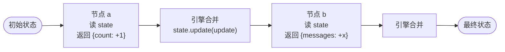

# 阶段 2：共享状态

> **目标**：让节点能读写一个共享的 `state` 字典，而不只是接收上一步的输出。
>
> **git tag**：`stage-2` · **代码**：`src/tiny_langgraph/graph.py` 中的 `StateGraph`

## 这一阶段做了什么

引入 `StateGraph`：节点签名从 `Callable[[Any], Any]` 变成 `Callable[[State], StateUpdate]`。

```python
from typing import TypedDict
from tiny_langgraph import END, START, StateGraph

class State(TypedDict):
    count: int
    messages: list[str]

graph = StateGraph(State)
graph.add_node("inc", lambda s: {"count": s["count"] + 1})
graph.add_node("append", lambda s: {"messages": s["messages"] + ["x"]})
graph.add_edge(START, "inc")
graph.add_edge("inc", "append")
graph.add_edge("append", END)

result = graph.compile().invoke({"count": 0, "messages": []})
# {"count": 1, "messages": ["x"]}
```

## 核心变化：节点签名

| | 阶段 1 `Graph` | 阶段 2 `StateGraph` |
|---|---|---|
| 节点接收 | 上一步的输出值 | **整个状态字典** |
| 节点返回 | 自己的输出值 | **更新片段**（只含要改的字段） |
| `invoke` 接收 | 初始值 | 初始状态字典 |
| `invoke` 返回 | 最终输出值 | 最终状态字典 |



## 核心设计：更新片段 + 覆盖合并

### 节点返回"更新片段"而非完整状态

```python
def inc(state: State) -> dict:
    return {"count": state["count"] + 1}   # 只返回要改的字段
```

为什么？因为节点只声明"我要改什么"，**引擎负责合并**。这让节点：

- 不用关心其他字段（没碰的字段保持不变）
- 为后续并行执行铺路（多个节点同时返回更新，引擎合并——阶段 6）

### 引擎怎么合并：覆盖

```python
def invoke(self, input: dict) -> dict:
    state = dict(input)              # 复制，不修改原 dict
    for name in self._order:
        update = self._nodes[name](state)
        state.update(update)         # ← 覆盖合并
    return state
```

`state.update(update)` 就是 Python dict 的覆盖：`update` 里的字段覆盖 `state` 里的同名字段。

### 覆盖的局限（引出阶段 5）

```python
graph.add_node("a", lambda s: {"messages": ["a"]})
graph.add_node("b", lambda s: {"messages": ["b"]})
# 执行完：messages == ["b"]   ← "a" 被覆盖丢了！
```

对 Agent 来说这是**错的**——消息应该追加。阶段 5 的 Reducer 会解决：给字段声明 `Annotated[list, add]`，引擎改用 `add(old, new)` 合并。

## 代码走读

=== "`StateGraph.__init__`"
    ```python
    def __init__(self, state_type: type) -> None:
        self._state_type = state_type   # TypedDict 类，用于校验/文档
        self._nodes = {}
        self._edges = {}
        self._entry_point = None
    ```
    接收一个 `TypedDict` 子类作为状态类型。本阶段只用于文档，阶段 5 会从它的 `Annotated` 注解里提取 Reducer。

=== "`CompiledStateGraph.invoke`"
    ```python
    def invoke(self, input: dict) -> dict:
        state = dict(input)              # 复制初始状态
        for name in self._order:
            update = self._nodes[name](state)  # 节点读 state，返回更新片段
            state.update(update)               # 覆盖合并
        return state
    ```
    核心就这 4 行。`dict(input)` 是为了不修改调用方的原 dict。

## 运行示例

```bash
python -m examples.stage_2_state.run
```

输出：
```
示例：带共享状态的数字管线
  起始 2: number=3 squared=9
    history=['inc->3', 'sq->9', 'final=9']
  起始 5: number=6 squared=36
    history=['inc->6', 'sq->36', 'final=36']

关键观察：节点能读整个 state，但只返回要改的字段
  - increment 改了 number 和 history，没碰 squared
  - square 改了 squared 和 history，number 保持不变
  - 合并是覆盖：history 每次被整体替换（阶段 5 会用 Reducer 改成追加）
```

## 对照真实 LangGraph

真实 `StateGraph` 在 [`langgraph/graph/state.py`](https://github.com/langchain-ai/langgraph/blob/main/libs/langgraph/langgraph/graph/state.py)：

| 真实 LangGraph | 我们的阶段 2 | 说明 |
|----------------|-------------|------|
| `StateGraph(StateType)` | 同 | 接收 TypedDict |
| 节点 `Callable[[State], StateUpdate]` | 同 | 语义一致 |
| 覆盖合并（无 Reducer 时） | 同 | 默认行为一致 |
| `Annotated[list, add]` Reducer | ❌ 阶段 5 | |
| 条件边 | ❌ 阶段 3 | |
| 循环 | ❌ 阶段 4 | |

## 这一阶段的局限

| 局限 | 谁来解决 |
|------|----------|
| 不能 `if/else` 分支 | 阶段 3 条件边 |
| 不能循环 | 阶段 4 循环图 |
| 消息列表被覆盖而非追加 | 阶段 5 Reducer |

---

👉 下一阶段：[阶段 3 - 条件边](stage_3_conditional.md)——让图能根据状态做 `if/else` 路由。
