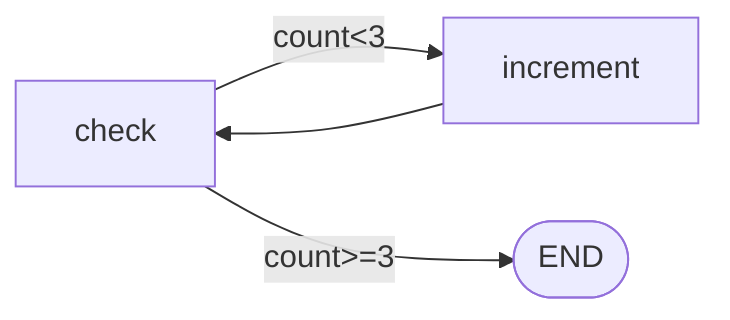
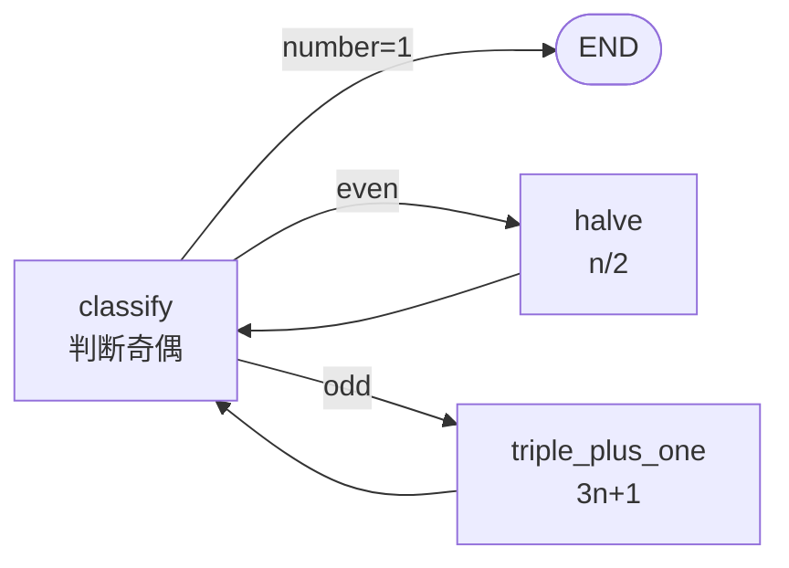

# 阶段 3：条件边与路由

> **目标**：让图能根据状态做 `if/else` 分支——执行完一个节点后，由路由函数决定下一个节点。
>
> **git tag**：`stage-3` · **代码**：`StateGraph.add_conditional_edges`

## 这一阶段做了什么

引入条件边。这是 `if/else` 在图里的表达：

```python
graph.add_conditional_edges(
    "check",                       # 源节点
    lambda s: "loop" if s["count"] < 3 else "done",  # 路由函数
    {"loop": "increment", "done": END},              # 标签 -> 目标
)
```



## 核心变化：执行模型从"预编译"到"动态遍历"

这是本阶段最重要的架构变化。

| | 阶段 1-2 | 阶段 3 |
|---|---|---|
| 执行顺序 | compile 时**预构建**固定 order | invoke 时**运行时动态决定** |
| invoke 实现 | `for name in order` | `while current != END` |
| 为什么 | 线性链顺序固定 | 条件边让顺序依赖运行时状态 |

阶段 1-2 的 invoke：

```python
for name in self._order:          # 顺序在 compile 时定死
    result = self._nodes[name](result)
```

阶段 3 的 invoke：

```python
current = self._entry_point
while current != END:             # 运行时动态遍历
    update = self._nodes[current](state)
    state.update(update)
    current = self._next_node(current, state)   # ← 每步决定下一个
```

`_next_node` 优先看条件边，否则走静态边：

```python
def _next_node(self, current, state):
    if current in self._conditional_edges:
        router, mapping = self._conditional_edges[current]
        return mapping[router(state)]   # 路由函数决定
    return self._edges.get(current, END)  # 静态边
```

## 条件边的三要素

```python
graph.add_conditional_edges(source, router, mapping)
```

| 参数 | 作用 |
|------|------|
| `source` | 源节点名 |
| `router` | `router(state) -> label`，根据状态返回路由标签 |
| `mapping` | `{label: target}`，标签映射到目标节点（或 `END`） |

**为什么用标签映射而不是直接返回节点名？**

因为路由函数返回的是**语义标签**（`"loop"` / `"done"`），不是节点名。这让路由逻辑和图结构解耦——你可以重命名节点而不改 router。这也和真实 LangGraph 的 API 一致。

## recursion_limit：防止死循环

动态遍历用 `while` 循环，如果图里有环（回边），就可能死循环。所以加了步数上限：

```python
def invoke(self, input, *, recursion_limit=25):
    step = 0
    while current != END:
        if step >= recursion_limit:
            raise RecursionError(...)
        ...
        step += 1
```

默认 25 步。阶段 4 会把循环图作为正式能力展开讲。

## 运行示例：Collatz 猜想

```bash
python -m examples.stage_3_conditional.run
```

Collatz 猜想：偶数除 2，奇数乘 3 加 1，最终到 1。这是条件边 + 循环的完美例子：



输出：
```
Collatz(6) -> 1, 共 17 步
Collatz(11) -> 1, 共 29 步
Collatz(27) -> 1, 共 223 步
```

## 对照真实 LangGraph

真实 `add_conditional_edges` 在 [`langgraph/graph/graph.py`](https://github.com/langchain-ai/langgraph/blob/main/libs/langgraph/langgraph/graph/graph.py)：

| 真实 LangGraph | 我们的阶段 3 | 说明 |
|----------------|-------------|------|
| `add_conditional_edges(src, router, mapping)` | 同 | API 一致 |
| router 返回标签，mapping 映射 | 同 | 语义一致 |
| `recursion_limit` 默认 25 | 同 | |
| 支持 `pydantic` / `Path` 路由 | ❌ | 我们只支持 dict mapping |

## 这一阶段的局限

| 局限 | 谁来解决 |
|------|----------|
| 循环图只是"能用"，没有正式 API 和文档 | 阶段 4 循环图 |
| 消息列表被覆盖而非追加 | 阶段 5 Reducer |

---

👉 下一阶段：[阶段 4 - 循环图](stage_4_cycle.md)——正式引入回边，跑出 ReAct 雏形。
