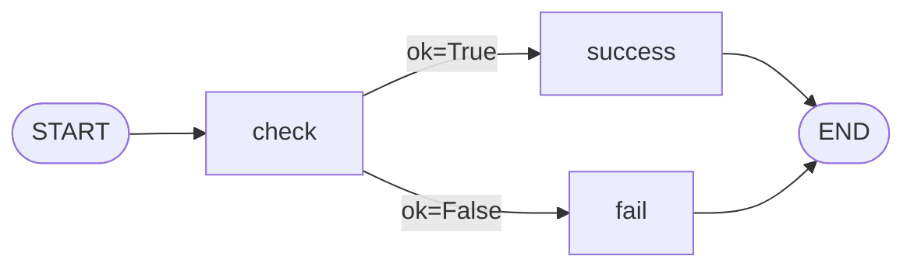
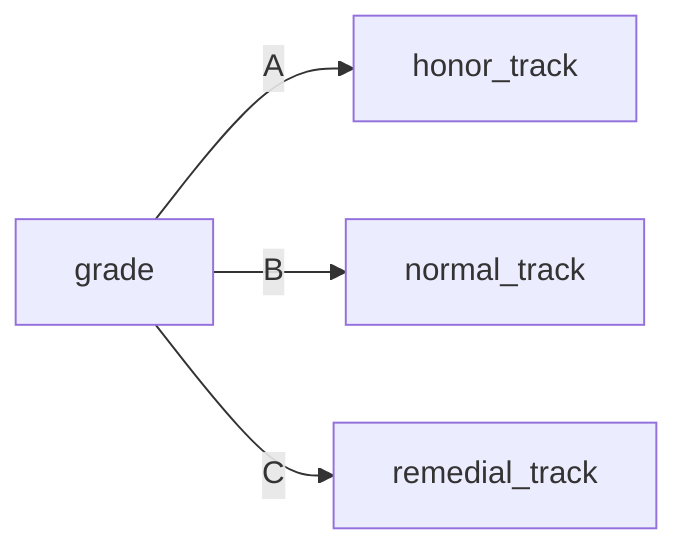
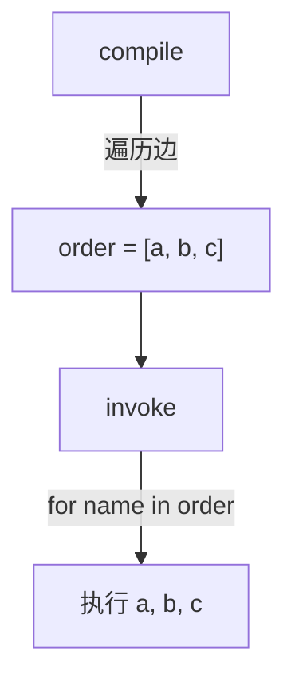
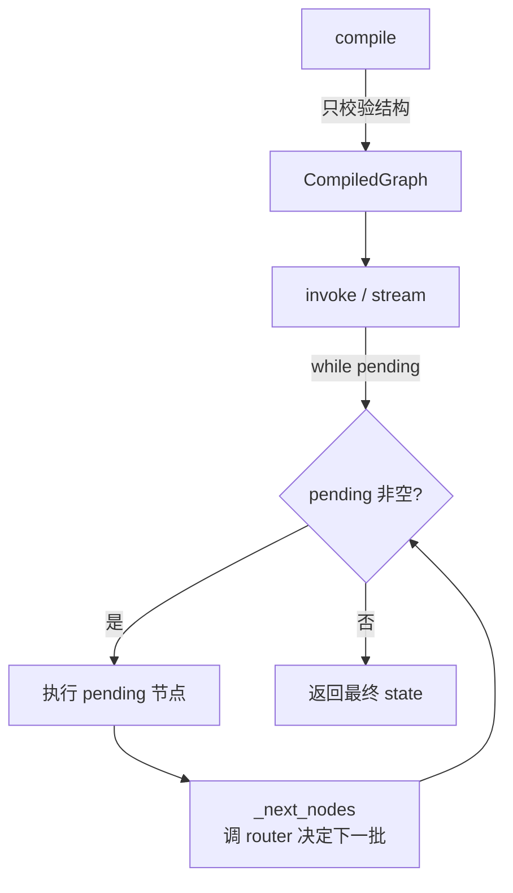
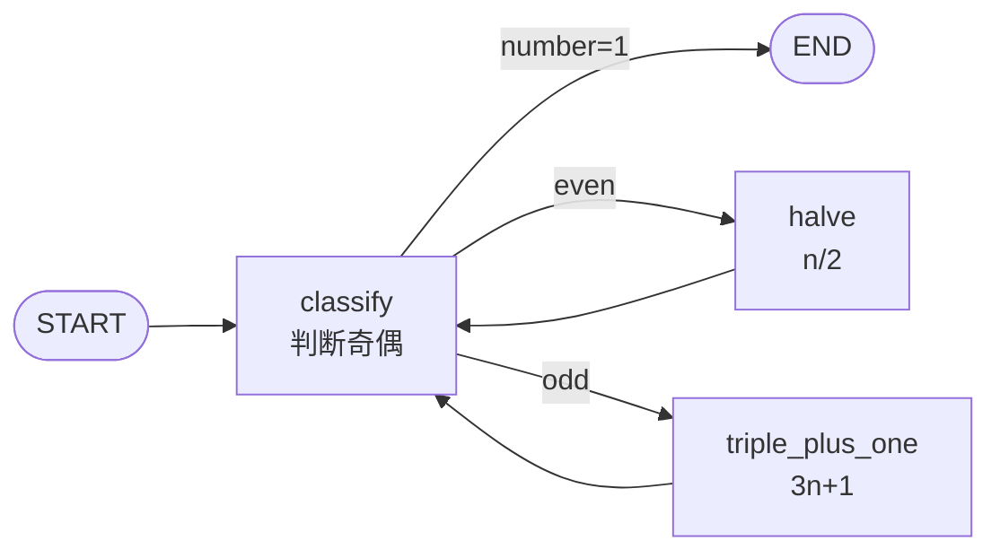
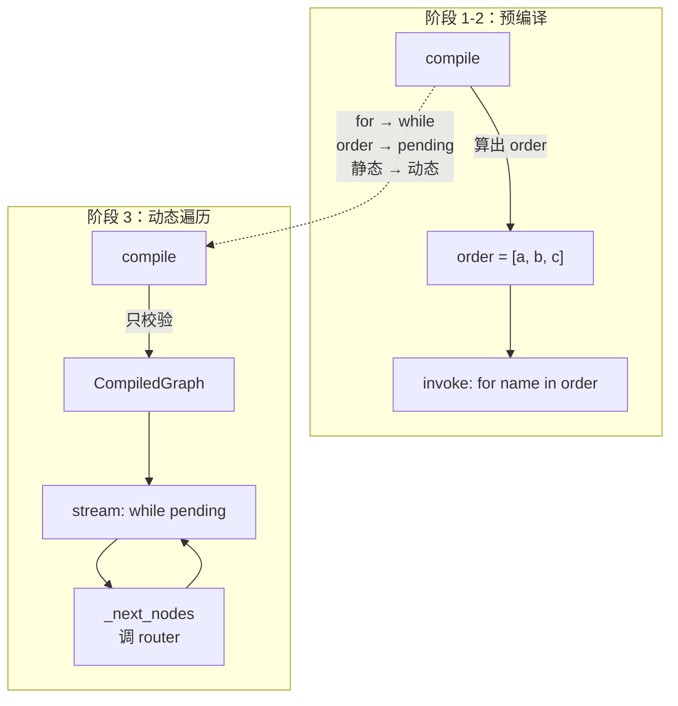

# 阶段 3：条件边与路由

> **阶段目标**：让图能根据**运行时状态**做 `if/else` 分支——执行完一个节点后，由一个路由函数读取当前状态，决定下一个该跳到哪个节点。
>
> **前置条件**：已读完 [阶段 2 - 共享状态](stage_2_state.md)，理解 `StateGraph`、`add_node`、`add_edge`、`compile`、`invoke` 的基本用法，以及"节点返回更新片段、引擎覆盖合并"的执行模型。
>
> **git tag**：`stage-3` · **核心代码**：`src/tiny_langgraph/graph.py` 中的 `StateGraph.add_conditional_edges` 与 `CompiledStateGraph.stream`
>
> **新增 API**：
>
> - `StateGraph.add_conditional_edges(source, router, mapping)`
> - `CompiledStateGraph.invoke(input, *, recursion_limit=25)`
>
> **执行模型变化**：从"compile 时预编译固定顺序列表"升级为"invoke 时运行时 while 循环动态遍历"。这是本系列**最根本的一次架构转折**。

---

## 目录

- [1. 为什么需要条件边](#1-为什么需要条件边)
- [2. if/else 在图里的表达](#2-ifelse-在图里的表达)
- [3. add_conditional_edges 详解](#3-add_conditional_edges-详解)
- [4. 执行模型变化：从预编译到动态遍历](#4-执行模型变化从预编译到动态遍历)
- [5. 为什么这个变化是根本性的](#5-为什么这个变化是根本性的)
- [6. 静态边 vs 条件边的互斥校验](#6-静态边-vs-条件边的互斥校验)
- [7. recursion_limit 的引入和作用](#7-recursion_limit-的引入和作用)
- [8. 完整代码逐行解读](#8-完整代码逐行解读)
- [9. 可运行示例：Collatz 猜想](#9-可运行示例collatz-猜想)
- [10. 测试解读](#10-测试解读)
- [11. 对照真实 LangGraph](#11-对照真实-langgraph)
- [12. 从阶段 2 到阶段 3 的 diff 解读](#12-从阶段-2-到阶段-3-的-diff-解读)
- [13. 设计思考：为什么 router 返回标签](#13-设计思考为什么-router-返回标签)
- [14. 常见误区与 FAQ](#14-常见误区与-faq)
- [15. 这一阶段的局限](#15-这一阶段的局限)

---

## 1. 为什么需要条件边

### 1.1 阶段 2 的天花板

阶段 2 的 `StateGraph` 只有静态边：`add_edge(source, target)` 表示"执行完 `source` 后**无条件**跳到 `target`"。整张图的执行顺序在 `compile()` 时就被**完全确定**为一个节点列表 `order`，`invoke` 只是按这个列表顺序跑一遍：

```python
# 阶段 2 的 CompiledStateGraph.invoke（伪代码）
def invoke(self, input):
    state = dict(input)
    for name in self._order:          # ← 顺序在 compile 时定死
        update = self._nodes[name](state)
        state.update(update)
    return state
```

这意味着图**只能描述"无论输入是什么都按同一顺序执行"的逻辑**。但现实世界几乎没有这么简单的业务：

| 业务场景 | 需要的分支逻辑 |
|---------|---------------|
| 表单校验 | 字段为空 → 走校验失败分支；非空 → 走正常分支 |
| 用户登录 | 密码正确 → 进首页；错误 → 回登录页带错误信息 |
| Agent 决策 | LLM 说要调工具 → 走工具节点；说不需要 → 结束 |
| 数值处理 | 偶数 → 除以 2；奇数 → 乘 3 加 1（Collatz） |
| 审批流 | 金额 < 1000 自动通过；否则人工审批 |

这些场景的共同点是：**下一步去哪取决于当前状态**。静态边表达不了。

### 1.2 用静态边硬凑会怎样

!!! warning "不要试图用静态边模拟分支"
    有人会想：能不能让节点内部用 `if/else` 决定执行什么逻辑，从而绕过"图结构需要分支"的需求？例如：

    ```python
    def branch_node(state):
        if state["count"] < 5:
            return do_left(state)
        else:
            return do_right(state)
    ```

    这在**简单二选一**时勉强能用，但有几个致命问题：

    1. **分支逻辑藏在节点里，图结构看不见**。看图只能看到一个节点 `branch_node`，不知道它内部还有两条路径。可视化、调试、审计都失去意义。
    2. **无法复用节点**。`do_left` 和 `do_right` 如果本身是复杂子流程，你被迫把它们内联进 `branch_node`，没法让它们参与其他图。
    3. **无法表达"分支后还要走不同后继"**。如果 left 分支后要走节点 A、B、C，right 分支后要走 D、E，把分支塞进一个节点里就完全没法表达这种"分叉后各自走不同路径"。
    4. **和图的哲学冲突**。LangGraph 的核心思想是**把控制流显式化为图结构**，让"下一步去哪"成为图的一等公民。把 if/else 藏进节点是开倒车。

    所以正确做法是：**让图本身能表达分支**。这就是条件边。

### 1.3 条件边的一句话定义

> **条件边**（conditional edge）：执行完源节点后，调用一个路由函数 `router(state) -> label`，根据返回的标签 `label` 在一个映射表 `mapping = {label: target}` 里查出下一个节点。

它和静态边的唯一区别是：**目标节点不是写死的，而是运行时根据状态算出来的**。

---

## 2. if/else 在图里的表达

### 2.1 从代码到图

考虑这样一段命令式代码：

```python
def process(state):
    state = check(state)
    if state["ok"]:
        state = success(state)
    else:
        state = fail(state)
    return state
```

用条件边把它翻译成图：



对应代码：

```python
graph.add_edge(START, "check")
graph.add_conditional_edges(
    "check",
    lambda s: "yes" if s["ok"] else "no",   # router
    {"yes": "success", "no": "fail"},        # mapping
)
graph.add_edge("success", END)
graph.add_edge("fail", END)
```

### 2.2 三路分支、多路分支

`if/elif/else` 一样自然，只是 `mapping` 多几个键：

```python
def route(state) -> str:
    if state["score"] >= 90:
        return "A"
    elif state["score"] >= 60:
        return "B"
    else:
        return "C"

graph.add_conditional_edges(
    "grade",
    route,
    {"A": "honor_track", "B": "normal_track", "C": "remedial_track"},
)
```



!!! tip "条件边能表达任意有限分支"
    只要 `router` 是个纯函数、返回值是有限个标签之一，条件边就能表达任意 `switch/case` 结构。这比 `if/else` 更通用，因为标签可以多于两个。

### 2.3 和静态边的对比

| 维度 | 静态边 `add_edge` | 条件边 `add_conditional_edges` |
|------|-------------------|-------------------------------|
| 目标节点 | 编译时固定 | 运行时由 `router(state)` 决定 |
| 出边数量 | 每个源节点可有多条（阶段 6 fan-out） | 每个源节点最多一组（一组里 mapping 多个标签） |
| 是否读状态 | 否 | 是（router 读 state） |
| 表达能力 | 顺序、固定流水线 | 分支、循环、任意有限状态机 |
| 典型用途 | 串联步骤 | if/else、while 循环、Agent 路由 |

---

## 3. add_conditional_edges 详解

### 3.1 签名

```python
def add_conditional_edges(
    self,
    source: str,
    router: Callable[[dict[str, Any]], str],
    mapping: dict[str, str],
) -> None:
```

三个参数，三要素：

| 参数 | 类型 | 作用 |
|------|------|------|
| `source` | `str` | 源节点名。执行完这个节点后，由路由决定下一步 |
| `router` | `(state) -> label` | 路由函数：读当前状态，返回一个**标签字符串** |
| `mapping` | `{label: target}` | 标签到目标节点的映射。目标可以是节点名或 `END` |

### 3.2 router 函数

`router` 是一个**纯函数**，签名 `(state: dict) -> str`。它：

- **只读** state，**不修改** state（修改 state 是节点的事）
- 返回一个字符串标签，该标签必须是 `mapping` 的某个键
- 不允许返回 `mapping` 里没有的标签，否则执行时抛 `ValueError("未知标签")`

```python
def should_continue(state) -> str:
    last_msg = state["messages"][-1]
    if "需要查" in last_msg:
        return "tools"      # 标签 "tools"
    return "end"            # 标签 "end"

graph.add_conditional_edges(
    "agent",
    should_continue,
    {"tools": "tools_node", "end": END},
)
```

!!! info "router 是纯函数的好处"
    - 可测试：不用启动整张图，直接 `assert should_continue({"messages": ["需要查"]}) == "tools"`
    - 可复用：同一个 router 可以挂到不同源节点
    - 可推理：给定状态，下一步去哪完全确定，没有副作用

### 3.3 mapping 字典

`mapping` 是标签到目标节点的**静态查表**：

```python
mapping = {
    "tools": "tools_node",   # 标签 "tools" → 节点 "tools_node"
    "end": END,              # 标签 "end" → 结束
}
```

- 键是 router 可能返回的标签
- 值是目标节点名，或保留字 `END`
- 编译时会校验：每个值（除了 `END`）必须是已 `add_node` 注册过的节点

为什么需要 `mapping` 而不是让 router 直接返回节点名？见 [§13 设计思考](#13-设计思考为什么-router-返回标签)。

### 3.4 完整调用示例

```python
from typing import TypedDict
from tiny_langgraph import END, START, StateGraph

class State(TypedDict):
    count: int
    branch: str

graph = StateGraph(State)
graph.add_node("start", lambda s: {"branch": "left" if s["count"] < 5 else "right"})
graph.add_node("left",  lambda s: {"count": -1})
graph.add_node("right", lambda s: {"count": 99})
graph.add_edge(START, "start")
graph.add_conditional_edges(
    "start",
    lambda s: s["branch"],          # router：返回 state["branch"]
    {"left": "left", "right": "right"},
)
graph.add_edge("left", END)
graph.add_edge("right", END)

app = graph.compile()
assert app.invoke({"count": 0, "branch": ""})["count"] == -1   # 走 left
assert app.invoke({"count": 10, "branch": ""})["count"] == 99  # 走 right
```

---

## 4. 执行模型变化：从预编译到动态遍历

这是本阶段**最重要的架构变化**。理解它，就理解了为什么条件边是一次范式跃迁。

### 4.1 阶段 1-2：预编译顺序

阶段 1-2 的 `compile()` 会调用 `_build_execution_order()` 把整张图展平成一个节点名列表 `order`：

```python
# 阶段 1-2 的 Graph._build_execution_order
def _build_execution_order(self) -> list[str]:
    order: list[str] = []
    current: str | None = self._entry_point
    while current is not None and current != END:
        if current in order:
            raise ValueError(f"检测到环：节点 '{current}' 被二次访问")
        order.append(current)
        current = self._edges.get(current)
    return order
```

`invoke` 只是按这个列表 for 循环：

```python
def invoke(self, input):
    result = input
    for name in self._order:          # ← 顺序在 compile 时定死
        result = self._nodes[name](result)
    return result
```

**特点**：

- 执行顺序在 `compile()` 时**一次性算好**
- `invoke` 不需要做任何"决定下一步"的逻辑
- 因为顺序固定，可以在编译时检测环（`if current in order: raise`）
- 整张图本质是一个**线性链**

### 4.2 阶段 3：运行时动态遍历

一旦引入条件边，"下一步去哪"就**依赖运行时状态**，compile 时根本无法确定顺序。于是执行模型必须改成：

```python
# 阶段 3 的 CompiledStateGraph.stream（简化版，省略检查点/中断）
def stream(self, input, *, recursion_limit=25):
    state = dict(input)
    pending = {self._entry_point}      # 当前要执行的节点集合
    step = 0
    while pending:                     # ← 运行时动态遍历
        if step >= recursion_limit:
            raise RecursionError(...)
        # 执行所有 pending 节点
        for node_name in sorted(pending):
            update = self._nodes[node_name](state)
            self._merge(state, update)
        yield {"nodes": pending, "state": dict(state), "step": step}
        pending = self._next_nodes(pending, state)   # ← 每步决定下一批
        step += 1
```

`_next_nodes` 是"决定下一步"的核心：

```python
def _next_nodes(self, pending, state):
    next_set = set()
    for node in pending:
        if node in self._conditional_edges:          # 条件边
            router, mapping = self._conditional_edges[node]
            label = router(state)
            if label not in mapping:
                raise ValueError(f"未知标签 '{label}'")
            target = mapping[label]
            if target != END:
                next_set.add(target)
        else:                                        # 静态边
            for target in self._edges.get(node, []):
                if target != END:
                    next_set.add(target)
    return next_set
```

### 4.3 对比表

| 维度 | 阶段 1-2 | 阶段 3 |
|------|---------|--------|
| 顺序何时确定 | `compile()` 时 | `invoke()`/`stream()` 运行时 |
| invoke 实现 | `for name in self._order` | `while pending:` |
| 环检测 | 编译时（`if current in order`） | 运行时（`recursion_limit`） |
| 数据结构 | `order: list[str]` | `pending: set[str]` + `_next_nodes` |
| 表达能力 | 线性链 | 任意有限状态机（含分支、循环） |
| 每步开销 | 直接取下一个 | 调 `_next_nodes`（可能调 router） |

### 4.4 用 mermaid 看两种模型

**阶段 1-2：预编译顺序**



**阶段 3：运行时动态遍历**



---

## 5. 为什么这个变化是根本性的

!!! question "为什么说从预编译到动态遍历是根本性变化？"
    表面上只是把 `for` 换成 `while`，但语义层面的变化是质变。

### 5.1 从"数据"到"控制流"

阶段 1-2 的 `order` 是一个**数据**（节点名列表），执行只是遍历这个数据。阶段 3 的执行循环里，"下一步去哪"是**控制流**——它由 `_next_nodes` 函数计算，而这个函数会调用用户提供的 `router`。

这意味着：**图的执行轨迹不再是图的属性，而是图 × 输入的属性**。同一张图，不同输入可能走完全不同的路径。

### 5.2 从"可静态分析"到"不可静态分析"

阶段 1-2 的图可以在编译时回答："这张图会执行哪些节点？"——就是 `order`。

阶段 3 的图**无法**在编译时回答这个问题。你只能问："给定输入 X，这张图会执行哪些节点？"——必须实际跑一遍才知道。这是 Rice 定理的体现：图变成了通用计算，非平凡性质都不可判定。

### 5.3 从"无环"到"可能有环"

阶段 1-2 编译时检测环，有环直接拒绝编译。阶段 3 的动态遍历**允许环**（回边），因为：

- 环在动态遍历里是自然存在的（`while` 循环本来就会反复访问同一节点）
- 环是循环的基础（阶段 4 主题）
- 防死循环靠运行时的 `recursion_limit`，而不是编译时禁环

### 5.4 从"批处理"到"流式"

`while` 循环每步 `yield` 一个事件，自然支持流式。`for` 循环也可以 yield，但"顺序固定"时流式意义不大（调用方早就知道会执行哪些节点）。动态遍历的流式才有价值——调用方**不知道**下一步会去哪，所以每步的事件都是新信息。这是阶段 4 `stream` 方法的铺垫。

### 5.5 一句话总结

> 阶段 1-2 的图是**被数据驱动**的（执行一个写死的列表）；阶段 3 的图是**被状态驱动**的（执行一个随状态变化的轨迹）。这是从"配置"到"程序"的跃迁。

---

## 6. 静态边 vs 条件边的互斥校验

### 6.1 互斥规则

源码里有这样几条校验：

```python
# add_edge 里：
if source in self._conditional_edges:
    raise ValueError(f"节点 '{source}' 已有条件出边，不能再加静态边")

# add_conditional_edges 里：
if source in self._edges:
    raise ValueError(f"节点 '{source}' 已有静态出边，不能再加条件边")
if source in self._conditional_edges:
    raise ValueError(f"节点 '{source}' 已有条件出边")
```

规则：**同一个源节点，要么只有静态出边，要么只有一组条件出边，不能混用，也不能有两组条件出边。**

### 6.2 为什么互斥

!!! info "互斥的原因：避免歧义"
    如果允许同一个节点既有静态边又有条件边，执行完该节点后，引擎该走哪条？两条都走？那条件边的"根据状态选择"就失去意义。只走条件边？那静态边是干什么的？语义混乱。

    真实 LangGraph 也是互斥的：一个节点的出边要么是静态的（`add_edge`），要么是条件的（`add_conditional_edges`），不能同时存在。

### 6.3 互斥校验的四种情况

| 情况 | 操作 | 结果 |
|------|------|------|
| 1 | 先 `add_edge("a", "b")`，再 `add_conditional_edges("a", ...)` | 报错："已有静态出边" |
| 2 | 先 `add_conditional_edges("a", ...)`，再 `add_edge("a", "b")` | 报错："已有条件出边" |
| 3 | 两次 `add_conditional_edges("a", ...)` | 报错："已有条件出边" |
| 4 | `add_conditional_edges("a", ...)` 指向不存在的节点 | 报错："指向不存在的节点" |

对应测试（`test_conditional_edges.py`）：

```python
def test_cannot_mix_static_and_conditional(self):
    graph.add_edge("a", "b")
    with pytest.raises(ValueError, match="静态出边"):
        graph.add_conditional_edges("a", lambda s: "x", {"x": END})

def test_conditional_then_static_blocks_edge(self):
    graph.add_conditional_edges("a", lambda s: "x", {"x": "b"})
    with pytest.raises(ValueError, match="条件出边"):
        graph.add_edge("a", END)

def test_conditional_target_must_exist(self):
    with pytest.raises(ValueError, match="不存在"):
        graph.add_conditional_edges("a", lambda s: "x", {"x": "ghost"})
```

### 6.4 一个节点可以有多条静态出边

注意：互斥是"静态 vs 条件"，不是"一条 vs 多条"。阶段 6 会允许一个节点有多条静态出边（fan-out 并行）：

```python
# 阶段 6 合法：
graph.add_edge("a", "b")
graph.add_edge("a", "c")   # a 有两条静态出边，执行完 a 后 b、c 都走
```

但条件边一个节点只能有一组（一组里 mapping 多个标签）：

```python
# 合法：
graph.add_conditional_edges("a", router, {"x": "b", "y": "c", "z": END})

# 不合法（第二次会报"已有条件出边"）：
graph.add_conditional_edges("a", router1, {"x": "b"})
graph.add_conditional_edges("a", router2, {"y": "c"})  # 报错
```

---

## 7. recursion_limit 的引入和作用

### 7.1 为什么需要

阶段 1-2 编译时检测环，有环直接拒绝。阶段 3 改成运行时动态遍历，环**不再被禁止**——因为循环图是有用的（阶段 4 主题）。但环带来死循环风险：

```python
# 死循环图
graph.add_node("loop", lambda s: {"count": s["count"] + 1})
graph.add_edge(START, "loop")
graph.add_conditional_edges("loop", lambda s: "again", {"again": "loop"})
# loop 永远跳回 loop，count 无限增长
```

没有保护的话，`invoke` 会无限循环。所以引入 `recursion_limit`：执行步数上限，超过就抛 `RecursionError`。

### 7.2 实现位置

在 `stream` 的 while 循环开头：

```python
while pending:
    if step >= recursion_limit:
        raise RecursionError(
            f"执行超过 recursion_limit ({recursion_limit}) 步，疑似死循环"
        )
    ...
    step += 1
```

### 7.3 默认值 25

```python
DEFAULT_RECURSION_LIMIT = 25
```

为什么是 25？

- **和真实 LangGraph 一致**：真实 LangGraph 默认也是 25
- **经验值**：大多数 Agent 任务在 25 步内完成；超过通常意味着 LLM 陷入循环（反复调同一个工具不收敛）
- **一轮 ReAct = 2 步**（agent + tools），所以 25 步约 12 轮 ReAct，够用

### 7.4 自定义

```python
# 知道要跑很多步，放宽
app.invoke(initial, recursion_limit=500)

# 调试时想早点发现死循环，收紧
app.invoke(initial, recursion_limit=5)
```

### 7.5 计的是"超级步"不是"轮数"

!!! warning "recursion_limit 计的是超级步数"
    每次执行完 `pending` 里所有节点、yield 一个事件、算出下一批 `pending`，算**一步**（一个超级步）。

    - 阶段 3-5：`pending` 通常只有一个节点，所以一步 = 一个节点执行
    - 阶段 6 起：`pending` 可能有多个节点（同层并行），一步 = 多个节点同时执行

    所以 `recursion_limit=25` 在阶段 6 是"25 个超级步"，不是"25 个节点执行"。

### 7.6 和 Python 递归限制的区别

Python 自身有 `sys.setrecursionlimit`，那是**函数调用栈**深度限制。我们的 `recursion_limit` 是**图执行步数**限制，两者无关。我们的执行循环是 `while` 不是递归调用，所以不会撑爆 Python 栈。

---

## 8. 完整代码逐行解读

### 8.1 add_conditional_edges 方法

```python
def add_conditional_edges(
    self,
    source: str,
    router: Callable[[dict[str, Any]], str],
    mapping: dict[str, str],
) -> None:
    """添加条件边：执行完 ``source`` 后，调用 ``router(state)`` 决定跳哪。"""
    # ① 源节点必须存在
    if source not in self._nodes:
        raise ValueError(f"源节点 '{source}' 不存在")
    # ② 不能和已有静态边混用
    if source in self._edges:
        raise ValueError(f"节点 '{source}' 已有静态出边，不能再加条件边")
    # ③ 不能重复加条件边
    if source in self._conditional_edges:
        raise ValueError(f"节点 '{source}' 已有条件出边")
    # ④ mapping 里每个目标必须是已注册节点（或 END）
    for label, target in mapping.items():
        if target != END and target not in self._nodes:
            raise ValueError(
                f"条件边标签 '{label}' 指向不存在的节点 '{target}'"
            )
    # ⑤ 存储：{source: (router, mapping)}
    self._conditional_edges[source] = (router, mapping)
```

逐行：

- **①**：防止给不存在的节点加条件边（比如拼写错误 `sorce` 而非 `source`）
- **②**：互斥校验，见 §6
- **③**：防止同一节点加两组条件边（语义混乱：两组 router 该听谁的？）
- **④**：mapping 的值必须是合法目标。这条校验在**编译前**（add 时）就做，而不是等到运行时才发现 `mapping[label]` 是个不存在的节点
- **⑤**：存进 `self._conditional_edges` 字典，键是源节点名，值是 `(router, mapping)` 元组

### 8.2 compile 方法

```python
def compile(self, checkpointer=None, *, interrupt_before=None, interrupt_after=None):
    if self._entry_point is None:
        raise ValueError("未设置入口节点...")
    return CompiledStateGraph(
        nodes=self._nodes,
        edges=self._edges,
        conditional_edges=self._conditional_edges,
        entry_point=self._entry_point,
        reducers=self._reducers,
        checkpointer=checkpointer,
        interrupt_before=set(interrupt_before or []),
        interrupt_after=set(interrupt_after or []),
    )
```

**关键变化**：阶段 1-2 的 `compile` 会调 `_build_execution_order()` 算出 `order` 列表。阶段 3 **不再算 order**——因为顺序运行时才能定。`compile` 只做结构校验（入口存在），把图原样塞进 `CompiledStateGraph`。

### 8.3 stream 方法的 while 循环

这是阶段 3 的执行核心（阶段 4 会正式介绍 stream，但代码在阶段 3 就已经长这样）：

```python
def stream(self, input, *, recursion_limit=DEFAULT_RECURSION_LIMIT, config=None):
    thread_id = self._get_thread_id(config)

    # ① 初始化状态或从检查点续跑
    if input is None and self._checkpointer and thread_id:
        cp = self._checkpointer.get(thread_id)
        if cp is None:
            raise ValueError(f"thread '{thread_id}' 没有检查点，无法续跑")
        state = dict(cp["state"])
        pending = set(cp["pending"])
        step = cp["step"] + 1
        resuming = True
    else:
        state = dict(input) if input else {}
        pending = {self._entry_point}      # ← 从入口开始
        step = 0
        resuming = False

    # ② 主循环
    while pending:
        # ②-a 步数上限
        if step >= recursion_limit:
            raise RecursionError(
                f"执行超过 recursion_limit ({recursion_limit}) 步，疑似死循环"
            )

        # ②-b interrupt_before 暂停（阶段 8）
        if not resuming and self._interrupt_before and (pending & self._interrupt_before):
            if self._checkpointer and thread_id:
                self._checkpointer.put(thread_id, step, dict(state), pending)
            yield {"nodes": pending, "state": dict(state), "step": step, "interrupt": "before"}
            return
        resuming = False

        # ②-c 执行所有 pending 节点（阶段 3 通常只有一个）
        step_state = dict(state)            # 节点读的是本步开始时的快照
        updates = []
        for node_name in sorted(pending):   # sorted 保证确定性
            update = self._nodes[node_name](step_state)
            updates.append(update)
        for update in updates:
            self._merge(state, update)      # 合并回 state

        # ②-d interrupt_after 暂停（阶段 8）
        if self._interrupt_after and (pending & self._interrupt_after):
            next_pending = self._next_nodes(pending, state)
            if self._checkpointer and thread_id:
                self._checkpointer.put(thread_id, step, dict(state), next_pending)
            yield {"nodes": pending, "state": dict(state), "step": step, "interrupt": "after"}
            return

        # ②-e 存检查点 + yield 事件
        if self._checkpointer and thread_id:
            self._checkpointer.put(thread_id, step, dict(state), pending)
        yield {"nodes": pending, "state": dict(state), "step": step}

        # ②-f 决定下一步
        pending = self._next_nodes(pending, state)
        step += 1
```

逐段解读：

**① 初始化**：要么从 `input` 新开始（`pending = {entry_point}`），要么从检查点续跑（`pending = cp["pending"]`）。阶段 3 用不到检查点，看 else 分支即可。

**② 主循环 `while pending:`**：只要还有节点要执行就继续。`pending` 是个 `set`，空集合表示结束。

**②-a 步数上限**：`step >= recursion_limit` 就抛 `RecursionError`。这是死循环的唯一防线。

**②-b interrupt_before**：阶段 8 的功能，阶段 3 可忽略。

**②-c 执行 pending 节点**：

- `step_state = dict(state)`：节点读的是**本步开始时**的状态快照，不是别的节点改过的。阶段 6 并行的基础。
- `sorted(pending)`：排序保证确定性（同一批节点按名字字典序执行）。
- 先收集所有 update，再统一合并：避免节点 A 的更新影响同批节点 B 读到的 state（Pregel 语义）。

**②-d interrupt_after**：阶段 8，可忽略。

**②-e yield 事件**：每个超级步 yield 一个 `{"nodes", "state", "step"}`。这是 stream 的核心——逐步暴露执行过程。

**②-f 决定下一步**：调 `_next_nodes(pending, state)` 算出下一批要执行的节点。`step += 1`。

### 8.4 _next_nodes 方法

```python
def _next_nodes(self, pending, state):
    next_set = set()
    for node in pending:
        if node in self._conditional_edges:          # ① 条件边
            router, mapping = self._conditional_edges[node]
            label = router(state)                    # ② 调路由函数
            if label not in mapping:
                raise ValueError(f"未知标签 '{label}'")
            target = mapping[label]                  # ③ 查表
            if target != END:
                next_set.add(target)
        else:                                        # ④ 静态边
            for target in self._edges.get(node, []):
                if target != END:
                    next_set.add(target)
    return next_set
```

逐行：

- **①**：先看这个节点有没有条件出边
- **②**：调 `router(state)` 拿到标签。这一步是"运行时决策"的体现
- **③**：`mapping[label]` 查出目标节点。如果 router 返回了 mapping 里没有的标签，抛 `ValueError`
- **④**：没有条件边就走静态边。`self._edges.get(node, [])` 是个列表（阶段 6 fan-out），遍历所有静态出边目标
- `END` 被过滤掉（`if target != END`），因为 END 不是真节点，遇到 END 表示这条路径结束

### 8.5 invoke 委托给 stream

```python
def invoke(self, input, *, recursion_limit=DEFAULT_RECURSION_LIMIT, config=None):
    final_state = dict(input) if input else {}
    for event in self.stream(input, recursion_limit=recursion_limit, config=config):
        final_state = event["state"]
    return final_state
```

`invoke` 只是 `stream` 的聚合：跑完所有事件，返回最后一个事件的 state。这个设计的好处：

- **单一执行路径**：所有执行逻辑只在 `stream` 里写一遍，`invoke` 不重复
- **API 兼容**：`invoke` 签名和返回值不变，老代码不用改
- **可观测**：想看过程用 `stream`，只想要结果用 `invoke`

---

## 9. 可运行示例：Collatz 猜想

### 9.1 什么是 Collatz 猜想

取任意正整数 `n`：

- 若 `n` 为偶数：`n = n / 2`
- 若 `n` 为奇数：`n = 3n + 1`
- 反复，最终会到 1（猜想：对所有正整数都成立，未证明）

这是条件边 + 循环的完美例子：**每步根据奇偶性路由到不同节点**，且**有回边构成循环**。

### 9.2 图结构



- `classify` 节点判断奇偶，写入 `state["parity"]`
- 条件边：`number == 1` → END；`even` → halve；`odd` → triple_plus_one
- 回边：`halve → classify`、`triple_plus_one → classify`（构成循环，阶段 4 主题）

### 9.3 完整代码

```python
# examples/stage_3_conditional/run.py
from typing import TypedDict
from tiny_langgraph import END, START, StateGraph

class State(TypedDict):
    number: int
    parity: str
    steps: list[str]

def classify(state):
    parity = "even" if state["number"] % 2 == 0 else "odd"
    return {"parity": parity, "steps": state["steps"] + [f"classify->{parity}"]}

def halve(state):
    n = state["number"] // 2
    return {"number": n, "steps": state["steps"] + [f"halve->{n}"]}

def triple_plus_one(state):
    n = state["number"] * 3 + 1
    return {"number": n, "steps": state["steps"] + [f"3n+1->{n}"]}

graph = StateGraph(State)
graph.add_node("classify", classify)
graph.add_node("halve", halve)
graph.add_node("triple_plus_one", triple_plus_one)
graph.add_edge(START, "classify")
graph.add_conditional_edges(
    "classify",
    lambda s: "done" if s["number"] == 1 else s["parity"],
    {"even": "halve", "odd": "triple_plus_one", "done": END},
)
graph.add_edge("halve", "classify")
graph.add_edge("triple_plus_one", "classify")

app = graph.compile()
for start in (6, 11, 27):
    result = app.invoke(
        {"number": start, "parity": "", "steps": []},
        recursion_limit=500,   # Collatz(27) 要 100+ 步
    )
    print(f"  Collatz({start}) -> 1, 共 {len(result['steps'])} 步")
```

### 9.4 运行命令

```bash
python -m examples.stage_3_conditional.run
```

### 9.5 输出

```
============================================================
示例：Collatz 猜想 —— 根据奇偶性路由
============================================================
  Collatz(6) -> 1, 共 17 步
  Collatz(11) -> 1, 共 29 步
  Collatz(27) -> 1, 共 223 步

============================================================
关键观察：条件边让图能根据状态做 if/else 分支
============================================================
  - classify 用条件边路由到 halve / triple_plus_one / END
  - 回边 halve->classify 构成循环（阶段 4 重点）
  - recursion_limit 防止死循环
```

### 9.6 手动追踪 Collatz(6)

让我们手动追踪 `number=6` 的执行轨迹，理解动态遍历：

| step | pending | number | parity | 执行节点 | router 返回 | 下一批 |
|------|---------|--------|--------|---------|------------|--------|
| 0 | {classify} | 6 | "" | classify | "even"（6≠1，偶） | {halve} |
| 1 | {halve} | 6 | even | halve | — | {classify} |
| 2 | {classify} | 3 | even | classify | "odd"（3≠1，奇） | {triple_plus_one} |
| 3 | {triple_plus_one} | 3 | odd | triple_plus_one | — | {classify} |
| 4 | {classify} | 10 | odd | classify | "even" | {halve} |
| 5 | {halve} | 10 | even | halve | — | {classify} |
| 6 | {classify} | 5 | even | classify | "odd" | {triple_plus_one} |
| 7 | {triple_plus_one} | 5 | odd | triple_plus_one | — | {classify} |
| 8 | {classify} | 16 | odd | classify | "even" | {halve} |
| ... | ... | ... | ... | ... | ... | ... |
| 终 | {} | 1 | ... | — | "done" | {} (END) |

注意 **step 2**：同一个节点 `classify` 被第二次访问。这在阶段 1-2 会触发"检测到环"报错，但阶段 3 的动态遍历允许它——这正是循环的基础。

---

## 10. 测试解读

测试文件：`tests/tiny_langgraph/test_conditional_edges.py`

### 10.1 TestConditionalEdges 类

#### test_router_selects_branch

```python
def test_router_selects_branch(self):
    graph.add_node("start", lambda s: {"branch": "left" if s["count"] < 5 else "right"})
    graph.add_node("left",  lambda s: {"count": -1})
    graph.add_node("right", lambda s: {"count": 99})
    graph.add_edge(START, "start")
    graph.add_conditional_edges("start", lambda s: s["branch"], {"left": "left", "right": "right"})
    graph.add_edge("left", END)
    graph.add_edge("right", END)

    app = graph.compile()
    assert app.invoke({"count": 0, "branch": ""})["count"] == -1   # count<5 → left
    assert app.invoke({"count": 10, "branch": ""})["count"] == 99  # count>=5 → right
```

**测的是什么**：同一个图，不同输入走不同分支。`count=0` 走 left（结果 -1），`count=10` 走 right（结果 99）。这是条件边最核心的能力——**执行轨迹依赖输入**。

#### test_router_to_end

```python
def test_router_to_end(self):
    graph.add_node("check", lambda s: {})
    graph.add_edge(START, "check")
    graph.add_conditional_edges("check", lambda s: "stop" if s["count"] >= 3 else "go",
                                {"stop": END, "go": "check"})
    result = graph.compile().invoke({"count": 3, "branch": ""})
    assert result["count"] == 3
```

**测的是什么**：router 直接返回标签 `"stop"`，mapping 把它映到 `END`。条件边可以**直接结束图**，不必经过一个"终止节点"。

#### test_unknown_label_raises

```python
def test_unknown_label_raises(self):
    graph.add_conditional_edges("a", lambda s: "unknown", {"known": END})
    with pytest.raises(ValueError, match="未知标签"):
        graph.compile().invoke({"count": 0, "branch": ""})
```

**测的是什么**：router 返回了 mapping 里没有的标签 `"unknown"`，运行时抛 `ValueError("未知标签")`。这条错误在 `_next_nodes` 里触发。注意是**运行时**错误不是编译时——因为 router 返回什么只有跑起来才知道。

#### test_cannot_mix_static_and_conditional / test_conditional_then_static_blocks_edge

```python
def test_cannot_mix_static_and_conditional(self):
    graph.add_edge("a", "b")
    with pytest.raises(ValueError, match="静态出边"):
        graph.add_conditional_edges("a", lambda s: "x", {"x": END})

def test_conditional_then_static_blocks_edge(self):
    graph.add_conditional_edges("a", lambda s: "x", {"x": "b"})
    with pytest.raises(ValueError, match="条件出边"):
        graph.add_edge("a", END)
```

**测的是什么**：互斥校验，见 §6。两个方向都测：先静态后条件、先条件后静态。

#### test_conditional_target_must_exist

```python
def test_conditional_target_must_exist(self):
    with pytest.raises(ValueError, match="不存在"):
        graph.add_conditional_edges("a", lambda s: "x", {"x": "ghost"})
```

**测的是什么**：mapping 指向不存在的节点 `"ghost"`，**add 时**就报错（不是等到运行）。这是编译前校验。

### 10.2 TestRecursionLimit 类

#### test_recursion_limit_raises

```python
def test_recursion_limit_raises(self):
    graph.add_node("loop", lambda s: {"count": s["count"] + 1})
    graph.add_edge(START, "loop")
    graph.add_conditional_edges("loop", lambda s: "again", {"again": "loop"})  # 永远跳回
    with pytest.raises(RecursionError, match="recursion_limit"):
        graph.compile().invoke({"count": 0, "branch": ""}, recursion_limit=10)
```

**测的是什么**：构造一个死循环图（router 永远返回 `"again"`），`recursion_limit=10`，跑 10 步后抛 `RecursionError`。这是 `recursion_limit` 的核心保护。

#### test_custom_recursion_limit

```python
def test_custom_recursion_limit(self):
    graph.add_conditional_edges("loop",
        lambda s: "again" if s["count"] < 5 else "stop",
        {"again": "loop", "stop": END})
    result = graph.compile().invoke({"count": 0, "branch": ""}, recursion_limit=100)
    assert result["count"] == 5
```

**测的是什么**：`recursion_limit=100` 放宽上限，图在 count=5 时正常结束（router 返回 "stop"）。验证 `recursion_limit` 不会误杀正常执行的图。

### 10.3 测试覆盖矩阵

| 测试 | 覆盖点 |
|------|--------|
| test_router_selects_branch | 条件边基本功能、多输入不同路径 |
| test_router_to_end | 条件边直接路由到 END |
| test_unknown_label_raises | router 返回未知标签的运行时错误 |
| test_cannot_mix_static_and_conditional | 互斥校验（先静态后条件） |
| test_conditional_then_static_blocks_edge | 互斥校验（先条件后静态） |
| test_conditional_target_must_exist | mapping 目标必须存在 |
| test_recursion_limit_raises | 死循环被 recursion_limit 拦截 |
| test_custom_recursion_limit | recursion_limit 可自定义且不误杀 |

---

## 11. 对照真实 LangGraph

真实 LangGraph 的 `add_conditional_edges` 在 [`langgraph/graph/graph.py`](https://github.com/langchain-ai/langgraph/blob/main/libs/langgraph/langgraph/graph/graph.py)。

### 11.1 API 对比

| 维度 | 真实 LangGraph | 我们的阶段 3 | 说明 |
|------|----------------|-------------|------|
| 方法名 | `add_conditional_edges` | 同 | API 一致 |
| 参数 | `(source, router, mapping)` | 同 | 三要素一致 |
| router 返回 | 标签字符串 | 同 | 语义一致 |
| mapping | `{label: target}` | 同 | |
| 目标可以是 END | 是 | 是 | |
| recursion_limit 默认 | 25 | 25 | |
| 互斥校验 | 静态/条件不能混 | 同 | |

### 11.2 真实版多出来的能力

| 能力 | 真实版 | 我们 |
|------|--------|------|
| `Path` 路由 | 支持 `pydantic` 模型做 router 返回值，mapping 用 `Path(path)` | ❌ 只支持字符串标签 |
| `add_conditional_edges` 不传 mapping | router 直接返回节点名 | ❌ 必须传 mapping |
| 编译时静态分析 | 能列出所有可能的目标 | ❌ 只能运行时发现 |
| 检查点集成 | 深度集成 | 阶段 7 才有 |
| StreamMode | values/updates/debug/messages 等 | 阶段 8 才有 |

### 11.3 真实版的 Path 路由

真实 LangGraph 支持用 `pydantic` 模型做 router 返回值，让路由更类型安全：

```python
# 真实 LangGraph
from pydantic import BaseModel
from langgraph.graph import StateGraph, add_conditional_edges, END

class Route(BaseModel):
    next: str

def router(state) -> Route:
    return Route(next="tools" if state["needs_tool"] else "end")

add_conditional_edges("agent", router, {"tools": "tools", "end": END})
```

我们阶段 3 不支持这个——router 只能返回字符串。这是有意的简化，避免引入 pydantic 依赖。教学上字符串标签已经足够说明概念。

### 11.4 真实版的执行模型

真实 LangGraph 的执行模型也是"运行时动态遍历"，但更复杂：

- 基于 Pregel 超级步（我们阶段 6 才到）
- 支持并行（同层多节点）
- 支持中断恢复（检查点）
- 支持多种 stream mode

我们阶段 3 是真实版的"单节点、无检查点、单 stream mode"子集。

---

## 12. 从阶段 2 到阶段 3 的 diff 解读

### 12.1 数据结构变化

```diff
 class StateGraph:
     def __init__(self, state_type):
         self._state_type = state_type
         self._reducers = extract_reducers(state_type)
         self._nodes = {}
-        self._edges: dict[str, str] = {}          # 每节点最多一条出边
+        self._edges: dict[str, list[str]] = {}    # 出边列表（为 fan-out 铺路）
+        self._conditional_edges: dict[
+            str,
+            tuple[Callable, dict[str, str]],
+        ] = {}                                    # 新增：条件边
         self._entry_point = None
```

**变化**：

1. `_edges` 的值从 `str` 变成 `list[str]`：为阶段 6 fan-out 铺路（一个节点多条静态出边）
2. 新增 `_conditional_edges` 字典：存条件边

### 12.2 add_edge 变化

```diff
 def add_edge(self, source, target):
     if source == START:
         ...
-    if source in self._edges:
-        raise ValueError("已有出边")
-    self._edges[source] = target
+    if source in self._conditional_edges:
+        raise ValueError("已有条件出边，不能再加静态边")
+    self._edges.setdefault(source, []).append(target)
```

**变化**：

1. 去掉"每节点最多一条出边"的限制（改成 append）
2. 新增互斥校验：有条件边就不能加静态边

### 12.3 compile 变化

```diff
 def compile(self):
     if self._entry_point is None:
         raise ValueError("未设置入口节点")
-    order = self._build_execution_order()    # 阶段 2：预编译顺序
-    return CompiledStateGraph(nodes, order)
+    return CompiledStateGraph(               # 阶段 3：不预编译
+        nodes=self._nodes,
+        edges=self._edges,
+        conditional_edges=self._conditional_edges,
+        entry_point=self._entry_point,
+        reducers=self._reducers,
+    )
```

**变化**：不再调 `_build_execution_order()`。`_build_execution_order` 这个方法在 `StateGraph` 上被**删除**（阶段 1 的 `Graph` 类还保留它，因为 `Graph` 仍是线性链）。

### 12.4 invoke 变化

```diff
-# 阶段 2：CompiledStateGraph.invoke
-def invoke(self, input):
-    state = dict(input)
-    for name in self._order:                  # for 循环
-        update = self._nodes[name](state)
-        state.update(update)
-    return state
+# 阶段 3：CompiledStateGraph.stream + invoke
+def stream(self, input, *, recursion_limit=25):
+    state = dict(input) if input else {}
+    pending = {self._entry_point}
+    step = 0
+    while pending:                            # while 循环
+        if step >= recursion_limit:
+            raise RecursionError(...)
+        for node_name in sorted(pending):
+            update = self._nodes[node_name](state)
+            self._merge(state, update)
+        yield {"nodes": pending, "state": dict(state), "step": step}
+        pending = self._next_nodes(pending, state)
+        step += 1
+
+def invoke(self, input, *, recursion_limit=25):
+    final_state = dict(input) if input else {}
+    for event in self.stream(input, recursion_limit=recursion_limit):
+        final_state = event["state"]
+    return final_state
```

**变化**：

1. `for name in self._order` → `while pending`：从预编译顺序到动态遍历
2. 新增 `stream` 生成器，`invoke` 委托给它
3. 新增 `recursion_limit` 参数
4. `state.update(update)` → `self._merge(state, update)`：为阶段 5 Reducer 铺路（阶段 3 的 `_merge` 仍是覆盖）

### 12.5 新增方法

```diff
+def add_conditional_edges(self, source, router, mapping):
+    ...  # 见 §8.1
+
+def _next_nodes(self, pending, state):
+    ...  # 见 §8.4
+
+def _merge(self, state, update):
+    for key, value in update.items():
+        if key in self._reducers:
+            state[key] = self._reducers[key](state.get(key), value)
+        else:
+            state[key] = value
```

### 12.6 删除的方法

```diff
-# 阶段 2 的 StateGraph._build_execution_order 被删除
-# （Graph 类还保留，因为 Graph 仍是线性链）
```

### 12.7 diff 总结

| 变化类型 | 内容 |
|---------|------|
| 新增数据结构 | `_conditional_edges`、`_edges` 改为 list |
| 新增 API | `add_conditional_edges`、`stream`、`recursion_limit` |
| 新增内部方法 | `_next_nodes`、`_merge` |
| 删除 | `StateGraph._build_execution_order` |
| 核心语义 | `for` → `while`，预编译 → 动态遍历 |

---

## 13. 设计思考：为什么 router 返回标签

### 13.1 两种设计

**设计 A（我们采用的）**：router 返回标签，mapping 把标签映到节点名

```python
def router(state) -> str:
    return "tools" if state["needs_tool"] else "end"

graph.add_conditional_edges("agent", router, {"tools": "tools_node", "end": END})
```

**设计 B（备选）**：router 直接返回节点名

```python
def router(state) -> str:
    return "tools_node" if state["needs_tool"] else END

graph.add_conditional_edges("agent", router)   # 不需要 mapping
```

设计 B 更简洁，为什么选设计 A？

### 13.2 理由 1：解耦路由逻辑和图结构

设计 A 里，router 返回的是**语义标签**（"tools" / "end"），不是图的具体节点名（"tools_node"）。这让 router 和图结构解耦：

```python
# router 可以不变，图结构随便改
def router(state):
    return "tools" if state["needs_tool"] else "end"

# 版本 1：tools 标签 → "tools_node"
graph1.add_conditional_edges("agent", router, {"tools": "tools_node", "end": END})

# 版本 2：tools 标签 → "search_tool"（重命名了节点）
graph2.add_conditional_edges("agent", router, {"tools": "search_tool", "end": END})
```

设计 B 里 router 直接返回 `"tools_node"`，节点一改名 router 就得改。

### 13.3 理由 2：和真实 LangGraph 一致

真实 LangGraph 就是设计 A。保持 API 一致让我们的教学代码能直接迁移到真实 LangGraph。

### 13.4 理由 3：mapping 是显式的"路由表"

mapping 把"所有可能去哪"显式列出来，便于：

- **可视化**：画图时能直接从 mapping 画出所有出边
- **静态分析**：编译时能检查 mapping 里所有目标是否存在
- **审计**：一眼看出这个节点可能跳到哪些地方

设计 B 里 router 可能返回任何字符串，不读 router 源码就不知道可能去哪。

### 13.5 理由 4：避免 router 误返回 END

设计 B 里 router 要返回 `END` 这个保留字。如果 router 写错返回了 `"end"`（小写）而不是 `END`（常量），运行时才发现。设计 A 里 mapping 用 `END` 常量，编译时就校验。

### 13.6 理由 5：为 Path 路由铺路

真实 LangGraph 的 Path 路由（pydantic 模型）依赖 mapping 做类型分发。我们虽然不支持 Path，但保留 mapping 让未来扩展更容易。

### 13.7 代价

设计 A 的代价是**多一个 mapping 参数**，API 略繁琐。但相比解耦、可分析、可迁移的好处，这点繁琐值得。

??? question "什么时候设计 B 更合适？"
    如果你的图**永远只在一个地方用**、节点名**永远不会改**、router **永远只返回几个固定字符串**，设计 B 更简洁。但教学项目要和真实 LangGraph 对齐，所以选设计 A。

---

## 14. 常见误区与 FAQ

### 14.1 误区：条件边可以替代 if/else 在节点内部

!!! warning "条件边表达的是节点之间的分支，不是节点内部的分支"
    条件边决定**下一个节点是谁**，不是**当前节点内部走哪条代码路径**。节点内部的 if/else 还是普通 Python if/else。两者正交：

    ```python
    def node(state):
        # 节点内部的 if/else：决定返回什么 update
        if state["x"] > 0:
            return {"y": 1}
        else:
            return {"y": -1}

    # 条件边的 router：决定下一个节点
    def router(state):
        return "next" if state["y"] > 0 else "back"
    ```

### 14.2 误区：recursion_limit 是 Python 递归限制

!!! warning "recursion_limit 和 sys.setrecursionlimit 无关"
    我们的 `recursion_limit` 是**图执行步数**上限，不是 Python 函数调用栈深度。执行循环是 `while` 不是递归，不会撑爆 Python 栈。

### 14.3 误区：router 可以修改 state

!!! warning "router 必须是纯函数"
    router 只读 state，不能改。改 state 是节点的事。如果 router 改了 state，这个改动**不会被保留**（router 返回的标签被使用，state 改动被丢弃），而且会让执行轨迹不可推理。

### 14.4 FAQ：一个节点可以同时有入边和条件出边吗

可以。入边（别人跳到它）和出边（它跳到别人）是独立的。一个节点完全可以有多条入边 + 一组条件出边。

### 14.5 FAQ：条件边可以指向 START 吗

不可以。`START` 是保留字，只能作为 `add_edge(START, ...)` 的 source。条件边的 mapping 目标必须是已注册节点或 `END`。

### 14.6 FAQ：router 返回 None 会怎样

`None` 不是 mapping 的键（mapping 的键是字符串），会触发 `ValueError("未知标签 'None'")`。router 必须返回 mapping 里存在的标签。

### 14.7 FAQ：为什么 _next_nodes 里要 sorted(pending)

```python
for node_name in sorted(pending):
```

`pending` 是 `set`，迭代顺序不确定。`sorted` 保证**同一批节点按名字字典序执行**，让执行结果可复现。阶段 6 并行时这个排序也保证确定性。

---

## 15. 这一阶段的局限

| 局限 | 影响 | 谁来解决 |
|------|------|----------|
| 循环图只是"能用"，没有正式 API 和文档 | 循环图是阶段 3 的副产品，阶段 4 才正式展开 | 阶段 4 循环图 |
| 消息列表被覆盖而非追加 | Agent 的 messages 每次要手动 `state["messages"] + [new]` | 阶段 5 Reducer |
| 同层多节点不能并行 | `_next_nodes` 返回 set 但执行是 for 循环串行 | 阶段 6 Pregel |
| 没有检查点 | 挂了不能续跑 | 阶段 7 Checkpoint |
| 没有 interrupt | 不能暂停等人介入 | 阶段 8 Interrupt |
| router 只支持字符串标签 | 不能用 pydantic 模型做类型安全路由 | 不解决（教学简化） |

---

## 本阶段心智模型



**一句话**：阶段 3 把图从"按写死的顺序跑"升级为"按状态决定下一步跑哪"，这是从配置到程序的跃迁，也是后续所有阶段（循环、Reducer、并行、检查点）的基础。

---

👉 **下一阶段**：[阶段 4 - 循环图 + stream](stage_4_cycle.md)——正式引入回边，把循环图作为一等能力，跑出 ReAct 雏形（Agent 的思考-行动-观察循环）。
