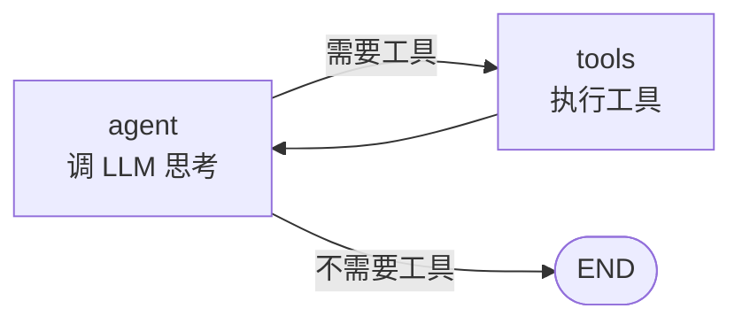

# 阶段 4：循环图 + stream

> **目标**：正式引入循环图，跑出 ReAct 雏形；提取 `stream` 方法为流式/检查点铺路。
>
> **git tag**：`stage-4` · **代码**：`CompiledStateGraph.stream`

## 这一阶段做了什么

### 1. 循环图成为正式能力

阶段 3 已经能跑循环（Collatz 示例就用了回边），但那是"顺带能用"。阶段 4 把循环图作为正式主题，并跑出 **ReAct 雏形**——Agent 的"思考→行动→观察"循环。

### 2. 提取 `stream` 方法

把 `invoke` 的执行循环提取成 `stream` 生成器，`invoke` 委托给它：

```python
def stream(self, input, *, recursion_limit=25):
    state = dict(input)
    current = self._entry_point
    step = 0
    while current != END:
        ...
        yield {"node": current, "state": dict(state), "step": step}  # 逐步 yield
        current = self._next_node(current, state)
        step += 1

def invoke(self, input, *, recursion_limit=25):
    final_state = dict(input)
    for event in self.stream(input, recursion_limit=recursion_limit):
        final_state = event["state"]
    return final_state
```

**为什么提取 stream？**

- **调试**：能逐步看执行到哪了、状态长什么样
- **前端流式**：前端能实时展示 Agent 的每步思考（阶段 8）
- **检查点**：每个 yield 点就是天然的检查点保存时机（阶段 7）
- **invoke 不变**：invoke 只是 stream 的聚合，API 兼容

## ReAct 循环怎么映射到图

ReAct = **Re**ason + **Act**，Agent 的经典循环：



| ReAct 概念 | 图里的表达 |
|-----------|-----------|
| 思考（Reason） | `agent` 节点：调 LLM 决定下一步 |
| 行动（Act） | `tools` 节点：执行工具 |
| 观察（Observe） | `tools` 的输出写回 state，`agent` 下一轮能读到 |
| 继续循环 | 回边 `tools -> agent` |
| 终止 | 条件边 `agent -> END`（LLM 说不需要工具了） |

示例（mock LLM）：

```python
def agent_node(state):
    if state["tool_calls"] < 2:
        msg = "AI: 我需要查一下资料"
    else:
        msg = "AI: 最终答案是 42"
    return {"messages": state["messages"] + [msg]}

def should_continue(state):
    return "tools" if "需要查" in state["messages"][-1] else "end"

graph.add_edge(START, "agent")
graph.add_conditional_edges("agent", should_continue, {"tools": "tools", "end": END})
graph.add_edge("tools", "agent")  # ← 回边，构成循环
```

运行 `python -m examples.stage_4_cycle.run` 能看到 stream 逐步输出每轮思考-行动-观察。

## recursion_limit 的设计

循环图的核心风险是**死循环**。`recursion_limit` 是安全阀：

```python
app.invoke(initial, recursion_limit=25)  # 默认 25 步
```

为什么默认 25？真实 LangGraph 也是 25。这是经验值：大多数 Agent 任务在 25 步内完成；超过通常意味着 LLM 陷入循环（反复调同一个工具不收敛）。

**注意**：`recursion_limit` 计的是**节点执行次数**，不是"轮数"。一轮 ReAct = agent + tools = 2 次节点执行，所以 `recursion_limit=25` 大约能跑 12 轮 ReAct。

## 对照真实 LangGraph

| 真实 LangGraph | 我们的阶段 4 | 说明 |
|----------------|-------------|------|
| `graph.stream()` | 同 | API 一致 |
| `graph.invoke()` | 同 | |
| `recursion_limit=25` | 同 | |
| 事件含 `node` / `state` | 同 | 我们用 dict，真实版用更复杂的 StreamMode |
| 真实版支持多种 stream mode（values/updates/debug） | ❌ 阶段 8 | |

## 这一阶段的局限

| 局限 | 谁来解决 |
|------|----------|
| 消息列表 `messages` 每次要手动 `state["messages"] + [new]`，覆盖合并没法直接追加 | 阶段 5 Reducer |
| 没有检查点，挂了不能续跑 | 阶段 7 Checkpoint |

---

👉 下一阶段：[阶段 5 - Reducer](stage_5_reducer.md)——让 `messages` 字段能自动追加，不用每次手动拼。
