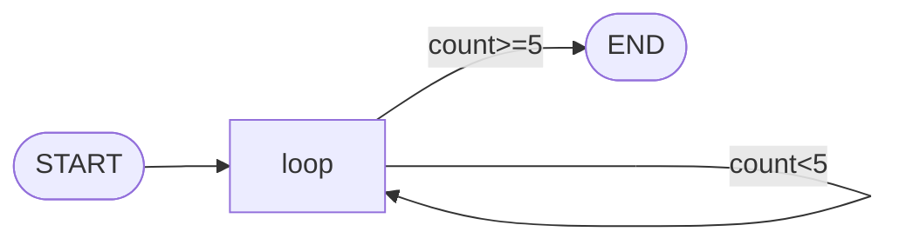
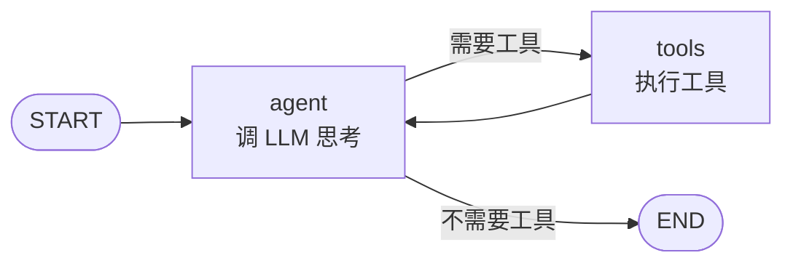
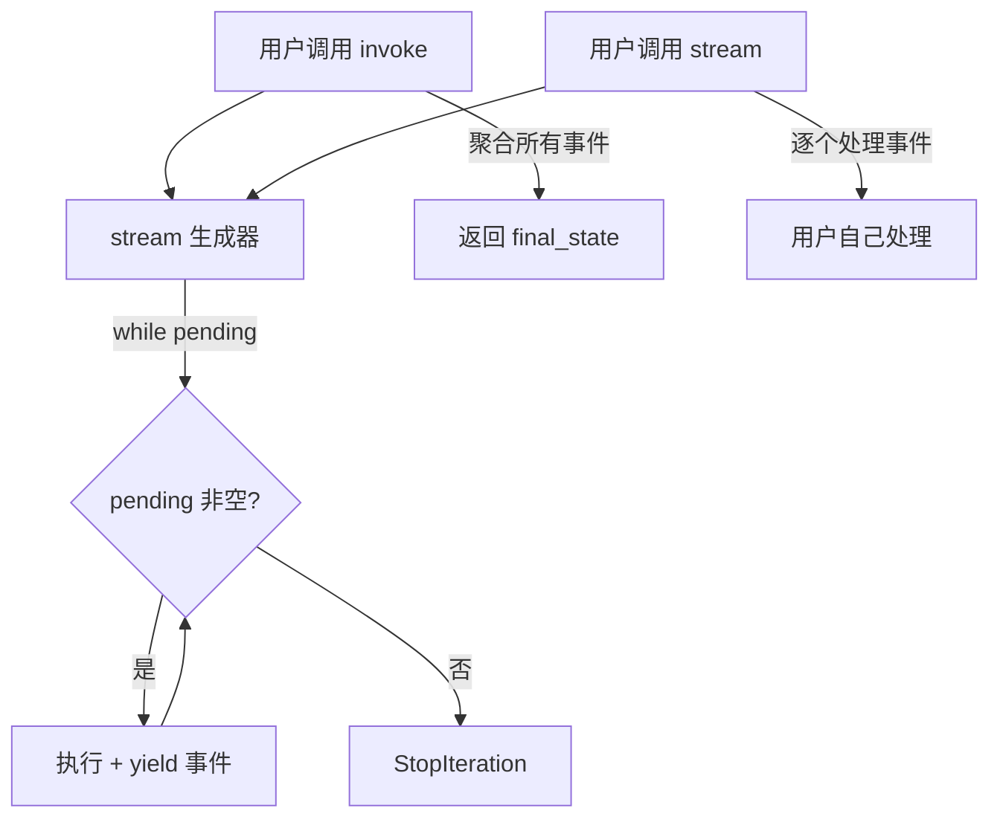
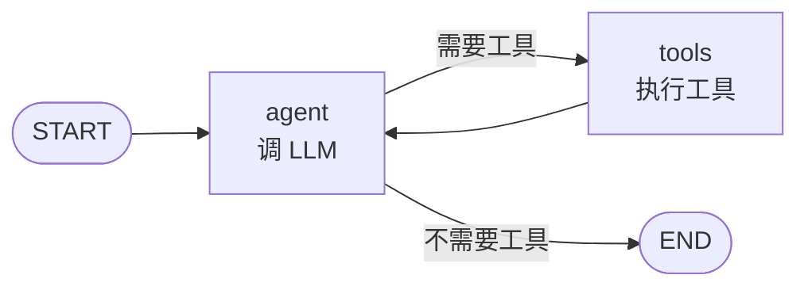
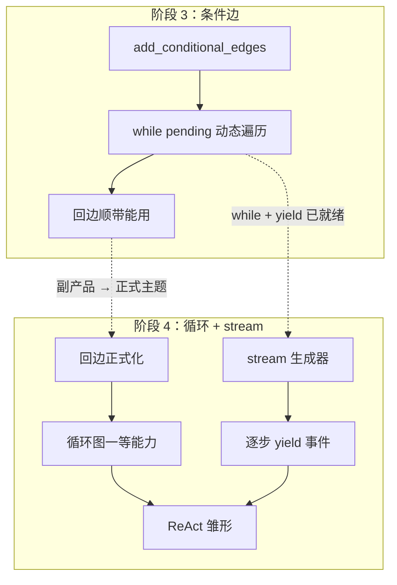

# 阶段 4：循环图 + stream

> **阶段目标**：正式引入**循环图**（回边）作为一等能力，跑出 **ReAct 雏形**（Agent 的"思考→行动→观察"循环）；把执行循环提取成 `stream` 生成器，为流式输出和检查点铺路。
>
> **前置条件**：已读完 [阶段 3 - 条件边与路由](stage_3_conditional.md)，理解 `add_conditional_edges`、`while pending` 动态遍历、`recursion_limit` 的作用。
>
> **git tag**：`stage-4` · **核心代码**：`CompiledStateGraph.stream` 与 `CompiledStateGraph.invoke`
>
> **新增 API**：
>
> - `CompiledStateGraph.stream(input, *, recursion_limit=25)` → 生成器，逐步 yield 事件
> - `CompiledStateGraph.invoke` 委托给 `stream`
>
> **核心思想**：回边 + 条件边 = 循环。循环是 Agent 的基础（ReAct）。`stream` 让循环可观测。

---

## 目录

- [1. 阶段目标拆解](#1-阶段目标拆解)
- [2. 回边的概念](#2-回边的概念)
- [3. 条件边 + 回边 = 循环](#3-条件边--回边--循环)
- [4. stream 方法详解](#4-stream-方法详解)
- [5. invoke 委托给 stream 的设计](#5-invoke-委托给-stream-的设计)
- [6. 事件格式](#6-事件格式)
- [7. RecursionError 防死循环](#7-recursionerror-防死循环)
- [8. ReAct 雏形示例](#8-react-雏形示例)
- [9. 完整代码逐行解读](#9-完整代码逐行解读)
- [10. 可运行示例（含输出）](#10-可运行示例含输出)
- [11. 测试解读](#11-测试解读)
- [12. 对照真实 LangGraph 的 stream](#12-对照真实-langgraph-的-stream)
- [13. 从阶段 3 到阶段 4 的 diff 解读](#13-从阶段-3-到阶段-4-的-diff-解读)
- [14. 设计思考：为什么用 generator](#14-设计思考为什么用-generator)
- [15. 常见误区与 FAQ](#15-常见误区与-faq)
- [16. 这一阶段的局限](#16-这一阶段的局限)

---

## 1. 阶段目标拆解

阶段 4 有两个交织的主题：

### 1.1 循环图成为正式能力

阶段 3 已经能跑循环（Collatz 示例就用了回边 `halve → classify`），但那是"顺带能用"——阶段 3 的主题是条件边，循环是副产品。阶段 4 把循环图**作为正式主题**展开：

- 明确"回边"是一等概念
- 明确"循环图 + 条件边 = 任意有限状态机"
- 跑出 **ReAct 雏形**——Agent 的经典循环

### 1.2 提取 stream 方法

阶段 3 的执行循环已经长成 `while pending` 的样子，但 `invoke` 还是直接跑完返回最终状态。阶段 4 把这个循环**提取成 `stream` 生成器**，逐步 yield 事件，`invoke` 委托给 `stream`。

这个提取看似只是重构，实则是为后续阶段铺路：

| 后续阶段 | 依赖 stream 的什么 |
|---------|-------------------|
| 阶段 7 检查点 | 每个 yield 点是天然的存检查点时机 |
| 阶段 8 中断 | interrupt 就是在 yield 之前 return |
| 阶段 9 真实 Agent | 前端流式展示 Agent 每步思考 |
| 调试 | 逐步看执行到哪、状态长什么样 |

---

## 2. 回边的概念

### 2.1 什么是回边

**回边**（back edge）：一条从节点 A 指向节点 B 的边，且 B 在图里**先于** A 出现（按某种拓扑序）。直观说就是"往回跳"的边，构成环。

```mermaid
graph LR
    A --> B
    B --> C
    C --> A   # ← 这条就是回边，构成环 A→B→C→A
```

### 2.2 为什么阶段 1-2 不能有回边

阶段 1-2 的 `Graph` 类在 `compile()` 时调 `_build_execution_order()`，里面有环检测：

```python
def _build_execution_order(self):
    order = []
    current = self._entry_point
    while current is not None and current != END:
        if current in order:
            raise ValueError(f"检测到环：节点 '{current}' 被二次访问")  # ← 拒绝环
        order.append(current)
        current = self._edges.get(current)
    return order
```

**为什么拒绝**：阶段 1-2 的执行是 `for name in order`，`order` 是个**有限列表**。如果图有环，`_build_execution_order` 的 while 循环会**无限循环**（current 永远不等于 END，且永远在 order 里出现过的节点之间转）。所以必须在编译时拒绝环。

### 2.3 阶段 3 怎么解锁了回边

阶段 3 改成 `while pending` 动态遍历，**不再预编译 order**，所以编译时不再检测环。运行时同一个节点被多次访问是正常的——`while` 循环本来就会反复执行。

```python
# 阶段 3 的 stream（简化）
while pending:
    ...
    pending = self._next_nodes(pending, state)  # 可能返回已经执行过的节点
    step += 1
```

防死循环靠运行时的 `recursion_limit`，而不是编译时禁环。

### 2.4 回边 vs 前向边

| 维度 | 前向边（forward edge） | 回边（back edge） |
|------|----------------------|------------------|
| 方向 | 沿执行方向往前 | 往回跳 |
| 是否构成环 | 否 | 是 |
| 阶段 1-2 | 允许 | 禁止（编译时报错） |
| 阶段 3+ | 允许 | 允许 |
| 用途 | 串联步骤 | 循环、迭代、ReAct |
| 风险 | 无 | 死循环（靠 recursion_limit 防） |

### 2.5 回边单独不够，需要条件边配合

!!! warning "只有回边没有条件边 = 必然死循环"
    ```python
    graph.add_edge("a", "b")
    graph.add_edge("b", "a")   # 回边，但 a 永远跳 b，b 永远跳 a
    ```
    这是个**无条件环**，必然死循环，`recursion_limit` 一定会触发。

    **有用的循环必须有退出条件**——这就是条件边的作用。回边 + 条件边 = 可控循环。

---

## 3. 条件边 + 回边 = 循环

### 3.1 最简单的循环



```python
graph.add_node("loop", lambda s: {"count": s["count"] + 1})
graph.add_edge(START, "loop")
graph.add_conditional_edges(
    "loop",
    lambda s: "again" if s["count"] < 5 else "done",
    {"again": "loop", "done": END},
)
```

- `loop → loop` 是回边（条件边 `"again"` 映到 `"loop"`）
- 退出条件是 `count >= 5`（条件边 `"done"` 映到 `END`）
- 这等价于 `while count < 5: count += 1`

### 3.2 翻译对照：命令式循环 vs 图循环

| 命令式 Python | 图表达 |
|---------------|--------|
| `while cond(state): state = step(state)` | `loop` 节点 + 条件边 `cond ? loop : END` |
| `for i in range(n): ...` | `loop` 节点 + 条件边 `i < n ? loop : END` |
| `while True: if done: break` | `loop` 节点 + 条件边 `done ? END : loop` |
| `do ... while cond` | `body` → `check` → 条件边 `cond ? body : END` |

### 3.3 ReAct 循环：两节点环

ReAct 是 Agent 的经典循环，涉及两个节点：



- `agent` 节点：调 LLM，决定下一步
- `tools` 节点：执行工具
- 条件边 `agent → tools / END`：LLM 说要工具就调，说不要就结束
- 回边 `tools → agent`：工具执行完回到 agent 继续思考

这是**两节点环** `agent → tools → agent`，比单节点自环更通用，是真实 Agent 的标准结构。

### 3.4 任意有限状态机

!!! info "条件边 + 回边 = 任意有限状态机"
    理论上，任何有限状态机（FSM）都能翻译成"节点 + 条件边 + 回边"的图：

    - FSM 的状态 → 图的节点
    - FSM 的转移函数 → 条件边的 router
    - FSM 的循环 → 回边

    所以阶段 4 的图是图灵完备的（在有限状态意义上）。这就是为什么 LangGraph 能表达任意 Agent 逻辑。

---

## 4. stream 方法详解

### 4.1 签名

```python
def stream(
    self,
    input: dict[str, Any] | None,
    *,
    recursion_limit: int = DEFAULT_RECURSION_LIMIT,
    config: dict[str, Any] | None = None,
) -> Generator[dict[str, Any], None, None]:
```

| 参数 | 类型 | 作用 |
|------|------|------|
| `input` | `dict \| None` | 初始状态；`None` 表示从检查点续跑（阶段 7） |
| `recursion_limit` | `int` | 最大超级步数，默认 25 |
| `config` | `dict \| None` | 含 `thread_id` 的配置，用于检查点（阶段 7） |
| **返回** | `Generator` | 逐步 yield 事件的生成器 |

### 4.2 它是生成器

`stream` 是个 **generator**（有 `yield`），不是普通函数。调用 `app.stream(input)` 返回一个生成器对象，迭代它才真正执行：

```python
gen = app.stream(initial)   # 这一步还没开始执行
for event in gen:           # 迭代时才逐步执行
    print(event)
```

或者一次性收集成列表：

```python
events = list(app.stream(initial))
```

### 4.3 执行时机

生成器的关键特性是**惰性执行**：每次 `next(gen)` 才执行到下一个 `yield`。这意味着：

- 可以提前 break 停止执行（不跑完所有步）
- 可以在每步之间插入逻辑（比如存检查点、推送给前端）
- 不会一次性算完所有结果（省内存）

```python
for event in app.stream(initial):
    print(event["state"])
    if event["state"]["count"] > 100:   # 提前停止
        break
```

### 4.4 stream 的核心循环（简化版）

省略检查点、中断等阶段 7-8 的功能，核心循环是：

```python
def stream(self, input, *, recursion_limit=25):
    state = dict(input) if input else {}
    pending = {self._entry_point}
    step = 0
    while pending:                                   # ① 主循环
        if step >= recursion_limit:                  # ② 死循环保护
            raise RecursionError(...)
        step_state = dict(state)                     # ③ 本步快照
        for node_name in sorted(pending):            # ④ 执行所有 pending
            update = self._nodes[node_name](step_state)
            self._merge(state, update)
        yield {"nodes": pending, "state": dict(state), "step": step}  # ⑤ yield 事件
        pending = self._next_nodes(pending, state)   # ⑥ 算下一步
        step += 1
```

逐行：

- **①** `while pending`：只要还有节点要执行就继续
- **②** 死循环保护：步数超限就抛 `RecursionError`
- **③** `step_state = dict(state)`：节点读的是本步开始时的快照（Pregel 语义，阶段 6 详解）
- **④** 执行所有 pending 节点（阶段 4 通常只有一个），用 `sorted` 保证确定性
- **⑤** yield 事件：暴露本步执行完的 state
- **⑥** `_next_nodes` 算下一批要执行的节点（条件边调 router，静态边查表）

---

## 5. invoke 委托给 stream 的设计

### 5.1 invoke 的实现

```python
def invoke(self, input, *, recursion_limit=25, config=None):
    final_state = dict(input) if input else {}
    for event in self.stream(input, recursion_limit=recursion_limit, config=config):
        final_state = event["state"]
    return final_state
```

`invoke` 只是 `stream` 的聚合：跑完所有事件，返回最后一个事件的 state。

### 5.2 为什么这样设计

| 好处 | 说明 |
|------|------|
| 单一执行路径 | 所有执行逻辑只在 `stream` 里写一遍，`invoke` 不重复 |
| API 兼容 | `invoke` 签名和返回值不变，老代码不用改 |
| 可观测 | 想看过程用 `stream`，只想要结果用 `invoke` |
| 检查点统一 | 检查点逻辑只在 `stream` 里写，`invoke` 自动受益 |

### 5.3 invoke 和 stream 的关系图



### 5.4 等价性

对同一输入，`invoke` 返回的 state 等于 `list(stream(...))[-1]["state"]`：

```python
assert app.invoke(initial) == list(app.stream(initial))[-1]["state"]
```

这条等价性有测试覆盖（`test_invoke_matches_stream`）。

---

## 6. 事件格式

### 6.1 事件 dict 的结构

每个 yield 的事件是一个 dict：

```python
{
    "nodes": set[str],     # 本步执行的节点集合
    "state": dict,         # 本步执行完的完整状态（副本）
    "step": int,           # 步数，从 0 开始
}
```

阶段 7-8 会扩展：

```python
{
    "nodes": set[str],
    "state": dict,
    "step": int,
    "interrupt": "before" | "after",   # 阶段 8 才有
}
```

### 6.2 nodes 字段

`nodes` 是个 `set`，表示**本步执行了哪些节点**。

- 阶段 4：通常是单元素 set，如 `{"loop"}`、`{"agent"}`
- 阶段 6 起：可能是多元素 set，如 `{"a", "b", "c"}`（同层并行）

为什么用 set 不用 list？因为同一批节点的执行顺序不影响结果（Pregel 语义），set 表达"无序集合"更准确。

### 6.3 state 字段

`state` 是**本步执行完的完整状态的副本**。`dict(state)` 保证 yield 出去的 state 和内部 state 是不同对象，调用方修改不会影响后续执行：

```python
for event in app.stream(initial):
    event["state"]["count"] = 999   # 改的是副本，不影响内部
```

这条"yield 副本"语义有测试覆盖（`test_stream_state_is_copy`）。

### 6.4 step 字段

`step` 从 0 开始，每步 +1。它就是 `recursion_limit` 计的数：

```python
event["step"] < recursion_limit   # 永远成立（超限会抛 RecursionError）
```

### 6.5 事件序列示例

跑 `loop` 节点 5 次（count 0→5）：

```
event 0: {"nodes": {"loop"}, "state": {"count": 1, "log": [1]}, "step": 0}
event 1: {"nodes": {"loop"}, "state": {"count": 2, "log": [1, 2]}, "step": 1}
event 2: {"nodes": {"loop"}, "state": {"count": 3, "log": [1, 2, 3]}, "step": 2}
event 3: {"nodes": {"loop"}, "state": {"count": 4, "log": [1, 2, 3, 4]}, "step": 3}
event 4: {"nodes": {"loop"}, "state": {"count": 5, "log": [1, 2, 3, 4, 5]}, "step": 4}
```

5 个事件，step 0-4，最后 count=5。

---

## 7. RecursionError 防死循环

### 7.1 死循环的两种情况

**情况 1：无条件环**

```python
graph.add_node("forever", lambda s: {"count": s["count"] + 1})
graph.add_edge(START, "forever")
graph.add_conditional_edges("forever", lambda s: "go", {"go": "forever"})  # 永远跳回
```

router 永远返回 `"go"`，永远跳回 `forever`，必然死循环。

**情况 2：条件永不满足**

```python
graph.add_conditional_edges("loop",
    lambda s: "again",   # 应该是 "again" if s["count"] < 5 else "done"
    {"again": "loop", "done": END})
```

router 写错，永远返回 `"again"`，即使 count 已经超过 5 也继续循环。

### 7.2 recursion_limit 的拦截

两种情况都会被 `recursion_limit` 拦截：

```python
while pending:
    if step >= recursion_limit:
        raise RecursionError(
            f"执行超过 recursion_limit ({recursion_limit}) 步，疑似死循环"
        )
    ...
    step += 1
```

跑到 `step == recursion_limit` 时抛 `RecursionError`，跳出循环。

### 7.3 测试覆盖

```python
def test_cycle_recursion_limit_raises(self):
    graph.add_node("forever", lambda s: {"count": s["count"] + 1, "log": s["log"]})
    graph.add_edge(START, "forever")
    graph.add_conditional_edges("forever", lambda s: "go", {"go": "forever"})
    with pytest.raises(RecursionError):
        graph.compile().invoke({"count": 0, "log": []}, recursion_limit=5)
```

死循环图 + `recursion_limit=5` → 5 步后抛 `RecursionError`。

### 7.4 怎么判断是真死循环还是步数不够

!!! question "RecursionError 一定是死循环吗？"
    不一定。可能是任务本身需要很多步。判断方法：

    1. **看任务规模**：Collatz(27) 要 100+ 步，`recursion_limit=25` 肯定不够
    2. **放宽 limit 重试**：`recursion_limit=500` 还报错，大概率真死循环
    3. **看 state 是否在变化**：如果 state 每步都变，可能在收敛；如果 state 重复出现，死循环
    4. **用 stream 看轨迹**：逐步看 state，人眼判断是否在循环

    ```python
    try:
        app.invoke(initial, recursion_limit=25)
    except RecursionError:
        # 放宽重试
        app.invoke(initial, recursion_limit=500)
    ```

### 7.5 recursion_limit 不是 Python 递归限制

!!! warning "别和 sys.setrecursionlimit 混"
    我们的 `recursion_limit` 是**图执行步数**上限。执行循环是 `while` 不是递归调用，不会撑爆 Python 函数调用栈。两者完全无关。

---

## 8. ReAct 雏形示例

### 8.1 ReAct 是什么

**ReAct** = **Re**ason + **Act**，Agent 的经典循环（Yao et al. 2022）：

1. **Reason（思考）**：LLM 看当前状态，决定下一步做什么
2. **Act（行动）**：执行 LLM 决定的动作（调工具）
3. **Observe（观察）**：把工具结果加回状态，LLM 下一轮能看到
4. 循环 1-3，直到 LLM 说"不需要工具了，给出最终答案"

### 8.2 映射到图

| ReAct 概念 | 图里的表达 |
|-----------|-----------|
| 思考（Reason） | `agent` 节点：调 LLM 决定下一步 |
| 行动（Act） | `tools` 节点：执行工具 |
| 观察（Observe） | `tools` 的输出写回 state，`agent` 下一轮能读到 |
| 继续循环 | 回边 `tools → agent` |
| 终止 | 条件边 `agent → END`（LLM 说不需要工具了） |



### 8.3 mock LLM 实现

阶段 4 用 mock LLM（不接真 OpenAI，阶段 9 才接）：

```python
class AgentState(TypedDict):
    messages: list[str]
    tool_calls: int

def agent_node(state):
    """模拟 LLM 决策：前两轮要调工具，第三轮给最终答案。"""
    if state["tool_calls"] < 2:
        msg = f"AI: 我需要查一下资料（工具调用 #{state['tool_calls'] + 1}）"
    else:
        msg = "AI: 综合以上信息，最终答案是 42"
    return {"messages": state["messages"] + [msg]}

def tool_node(state):
    """模拟工具执行。"""
    return {
        "messages": state["messages"] + [f"Tool: 返回了查询结果 #{state['tool_calls'] + 1}"],
        "tool_calls": state["tool_calls"] + 1,
    }

def should_continue(state):
    """路由：看最后一条消息决定继续调工具还是结束。"""
    last = state["messages"][-1]
    return "tools" if "需要查" in last else "end"
```

### 8.4 构图

```python
graph = StateGraph(AgentState)
graph.add_node("agent", agent_node)
graph.add_node("tools", tool_node)
graph.add_edge(START, "agent")
graph.add_conditional_edges(
    "agent", should_continue, {"tools": "tools", "end": END}
)
graph.add_edge("tools", "agent")   # ← 回边，构成循环

app = graph.compile()
```

### 8.5 执行轨迹

初始 `{"messages": [], "tool_calls": 0}`，执行过程：

| step | 节点 | tool_calls | messages 最后一条 | router 返回 | 下一批 |
|------|------|-----------|------------------|------------|--------|
| 0 | agent | 0 | "AI: 我需要查一下资料（#1）" | "tools" | {tools} |
| 1 | tools | 1 | "Tool: 返回了查询结果 #1" | — | {agent} |
| 2 | agent | 1 | "AI: 我需要查一下资料（#2）" | "tools" | {tools} |
| 3 | tools | 2 | "Tool: 返回了查询结果 #2" | — | {agent} |
| 4 | agent | 2 | "AI: 综合以上信息，最终答案是 42" | "end" | {} (END) |

5 步，2 轮 ReAct（agent→tools 算一轮），最终 `tool_calls=2`，messages 有 5 条。

### 8.6 为什么用 mock LLM

- **可复现**：不依赖网络和 LLM 的随机性
- **可测试**：执行轨迹固定，能写精确断言
- **聚焦概念**：本阶段主题是循环图和 stream，不是 LLM 集成
- **阶段 9 再接真 LLM**：那时再处理 OpenAI API、流式补全等

---

## 9. 完整代码逐行解读

### 9.1 stream 方法（完整版，含检查点/中断）

```python
def stream(self, input, *, recursion_limit=DEFAULT_RECURSION_LIMIT, config=None):
    # ① 提取 thread_id（阶段 7 检查点用）
    thread_id = self._get_thread_id(config)

    # ② 初始化：从 input 新开始，或从检查点续跑
    if input is None and self._checkpointer and thread_id:
        cp = self._checkpointer.get(thread_id)
        if cp is None:
            raise ValueError(f"thread '{thread_id}' 没有检查点，无法续跑")
        state = dict(cp["state"])
        pending = set(cp["pending"])
        step = cp["step"] + 1
        resuming = True
    else:
        state = dict(input) if input else {}
        pending = {self._entry_point}
        step = 0
        resuming = False

    # ③ 主循环
    while pending:
        # ③-a 死循环保护
        if step >= recursion_limit:
            raise RecursionError(
                f"执行超过 recursion_limit ({recursion_limit}) 步，疑似死循环"
            )

        # ③-b interrupt_before 暂停（阶段 8）
        if not resuming and self._interrupt_before and (pending & self._interrupt_before):
            if self._checkpointer and thread_id:
                self._checkpointer.put(thread_id, step, dict(state), pending)
            yield {"nodes": pending, "state": dict(state), "step": step, "interrupt": "before"}
            return
        resuming = False

        # ③-c 执行所有 pending 节点
        step_state = dict(state)            # 本步快照
        updates = []
        for node_name in sorted(pending):
            update = self._nodes[node_name](step_state)
            updates.append(update)
        for update in updates:
            self._merge(state, update)

        # ③-d interrupt_after 暂停（阶段 8）
        if self._interrupt_after and (pending & self._interrupt_after):
            next_pending = self._next_nodes(pending, state)
            if self._checkpointer and thread_id:
                self._checkpointer.put(thread_id, step, dict(state), next_pending)
            yield {"nodes": pending, "state": dict(state), "step": step, "interrupt": "after"}
            return

        # ③-e 存检查点 + yield 事件
        if self._checkpointer and thread_id:
            self._checkpointer.put(thread_id, step, dict(state), pending)
        yield {"nodes": pending, "state": dict(state), "step": step}

        # ③-f 算下一步
        pending = self._next_nodes(pending, state)
        step += 1
```

逐段解读（阶段 4 视角，忽略 ③-b/③-d 中断和检查点）：

**① thread_id**：从 config 提取 thread_id，阶段 7 检查点用。阶段 4 不传 config，thread_id 是 None。

**② 初始化**：阶段 4 只看 else 分支：`state = dict(input)`、`pending = {entry_point}`、`step = 0`。

**③ 主循环 `while pending:`**：

- **③-a**：步数检查，超限抛 `RecursionError`
- **③-c**：执行所有 pending 节点。`step_state = dict(state)` 是本步快照，节点读这个快照（不是别的节点改过的）。`sorted(pending)` 保证确定性。先收集所有 update 再统一合并（Pregel 语义）。
- **③-e**：yield 事件。`dict(state)` 是副本，调用方改不影响内部。
- **③-f**：`_next_nodes` 算下一批。`step += 1`。

### 9.2 invoke 方法

```python
def invoke(self, input, *, recursion_limit=DEFAULT_RECURSION_LIMIT, config=None):
    final_state = dict(input) if input else {}
    for event in self.stream(input, recursion_limit=recursion_limit, config=config):
        final_state = event["state"]
    return final_state
```

逐行：

- `final_state = dict(input) if input else {}`：默认返回值是输入（如果图一步没跑）
- `for event in self.stream(...)`：迭代 stream 生成器
- `final_state = event["state"]`：每步更新 final_state 为最新事件的 state
- `return final_state`：返回最后一个事件的 state（即最终状态）

如果 stream 抛 `RecursionError`，invoke 也会抛（不 catch）。这是对的——死循环应该让调用方知道。

### 9.3 _next_nodes 方法

```python
def _next_nodes(self, pending, state):
    next_set = set()
    for node in pending:
        if node in self._conditional_edges:          # 条件边
            router, mapping = self._conditional_edges[node]
            label = router(state)
            if label not in mapping:
                raise ValueError(f"未知标签 '{label}'")
            target = mapping[label]
            if target != END:
                next_set.add(target)
        else:                                        # 静态边
            for target in self._edges.get(node, []):
                if target != END:
                    next_set.add(target)
    return next_set
```

阶段 3 已详解，这里强调循环视角：

- 条件边的 `mapping[label]` 可能返回**已经执行过的节点**（回边），这就是循环
- `next_set` 是个 set，如果多个 pending 节点都跳到同一个目标，set 自动去重
- `END` 被过滤，遇到 END 表示这条路径结束

---

## 10. 可运行示例（含输出）

### 10.1 运行命令

```bash
python -m examples.stage_4_cycle.run
```

### 10.2 完整代码

```python
# examples/stage_4_cycle/run.py
from typing import TypedDict
from tiny_langgraph import END, START, StateGraph

class AgentState(TypedDict):
    messages: list[str]
    tool_calls: int

def agent_node(state):
    if state["tool_calls"] < 2:
        msg = f"AI: 我需要查一下资料（工具调用 #{state['tool_calls'] + 1}）"
    else:
        msg = "AI: 综合以上信息，最终答案是 42"
    return {"messages": state["messages"] + [msg]}

def tool_node(state):
    return {
        "messages": state["messages"] + [f"Tool: 返回了查询结果 #{state['tool_calls'] + 1}"],
        "tool_calls": state["tool_calls"] + 1,
    }

def should_continue(state):
    last = state["messages"][-1]
    return "tools" if "需要查" in last else "end"

def main():
    graph = StateGraph(AgentState)
    graph.add_node("agent", agent_node)
    graph.add_node("tools", tool_node)
    graph.add_edge(START, "agent")
    graph.add_conditional_edges("agent", should_continue, {"tools": "tools", "end": END})
    graph.add_edge("tools", "agent")

    app = graph.compile()
    initial = {"messages": [], "tool_calls": 0}

    print("用 stream 逐步观察执行过程：")
    for event in app.stream(initial):
        print(f"  [step {event['step']}] 节点: {event['node']}")
        for msg in event["state"]["messages"]:
            print(f"      {msg}")
        print()
```

### 10.3 输出

```
============================================================
示例：ReAct 雏形（mock LLM）
============================================================
图结构: agent -> (需要工具?) -> tool -> agent -> ... -> END

用 stream 逐步观察执行过程：
------------------------------------------------------------
  [step 0] 节点: agent
      AI: 我需要查一下资料（工具调用 #1）

  [step 1] 节点: tools
      AI: 我需要查一下资料（工具调用 #1）
      Tool: 返回了查询结果 #1

  [step 2] 节点: agent
      AI: 我需要查一下资料（工具调用 #1）
      Tool: 返回了查询结果 #1
      AI: 我需要查一下资料（工具调用 #2）

  [step 3] 节点: tools
      AI: 我需要查一下资料（工具调用 #1）
      Tool: 返回了查询结果 #1
      AI: 我需要查一下资料（工具调用 #2）
      Tool: 返回了查询结果 #2

  [step 4] 节点: agent
      AI: 我需要查一下资料（工具调用 #1）
      Tool: 返回了查询结果 #1
      AI: 我需要查一下资料（工具调用 #2）
      Tool: 返回了查询结果 #2
      AI: 综合以上信息，最终答案是 42

============================================================
关键观察：ReAct 循环 = 回边 + 条件边
============================================================
  - agent 节点：调 LLM 决定下一步（思考）
  - 条件边 should_continue：根据 LLM 输出决定调工具还是结束
  - tools 节点：执行工具（行动）
  - 回边 tools->agent：构成循环（观察后继续思考）
  - stream：逐步 yield，能看到每轮思考-行动-观察
```

### 10.4 观察 stream 的价值

对比 `invoke` 和 `stream`：

```python
# invoke：只看到最终结果
result = app.invoke(initial)
# result["messages"] 有 5 条，但中间过程是黑盒

# stream：看到每一步
for event in app.stream(initial):
    print(f"step {event['step']}: 执行了 {event['nodes']}")
    print(f"  当前 messages 有 {len(event['state']['messages'])} 条")
# 输出每步的节点和状态，能观察 Agent 的思考过程
```

这就是 stream 的核心价值——**可观测性**。在真实 Agent 里，这意味着前端能实时展示"AI 正在思考...""AI 正在调用工具...""工具返回了..."。

---

## 11. 测试解读

测试文件：`tests/tiny_langgraph/test_cycle.py`

### 11.1 TestStream 类

#### test_stream_yields_events

```python
def test_stream_yields_events(self):
    app = _make_counter_graph().compile()
    events = list(app.stream({"count": 0, "log": []}))
    assert len(events) == 5
    assert events[0] == {"nodes": {"loop"}, "state": {"count": 1, "log": [1]}, "step": 0}
    assert events[-1]["step"] == 4
    assert events[-1]["state"]["count"] == 5
```

**测的是什么**：

- 循环图跑 5 步（count 0→5），yield 5 个事件
- 第一个事件 step=0，执行了 `{"loop"}`，count 变成 1
- 最后一个事件 step=4，count=5

#### test_stream_event_keys

```python
def test_stream_event_keys(self):
    app = _make_counter_graph().compile()
    event = next(app.stream({"count": 0, "log": []}))
    assert set(event.keys()) == {"nodes", "state", "step"}
```

**测的是什么**：事件 dict 的键恰好是 `{"nodes", "state", "step"}`，不多不少。这是事件格式的契约。

#### test_invoke_matches_stream

```python
def test_invoke_matches_stream(self):
    app = _make_counter_graph().compile()
    initial = {"count": 0, "log": []}
    invoke_result = app.invoke(initial)
    stream_events = list(app.stream(initial))
    assert invoke_result == stream_events[-1]["state"]
```

**测的是什么**：`invoke` 返回的 state 等于 `stream` 最后一个事件的 state。这是"invoke 委托给 stream"的正确性保证。

#### test_stream_state_is_copy

```python
def test_stream_state_is_copy(self):
    app = _make_counter_graph().compile()
    events = list(app.stream({"count": 0, "log": []}))
    events[0]["state"]["count"] = 999   # 改第一个事件的 state
    assert events[1]["state"]["count"] == 2   # 第二个事件不受影响
```

**测的是什么**：每个事件 yield 的 state 是**副本**，修改一个事件的 state 不影响其他事件。这是 `dict(state)` 副本语义的保证。

### 11.2 TestCycleExecution 类

#### test_cycle_terminates

```python
def test_cycle_terminates(self):
    app = _make_counter_graph().compile()
    result = app.invoke({"count": 0, "log": []})
    assert result["count"] == 5
    assert result["log"] == [1, 2, 3, 4, 5]
```

**测的是什么**：循环图正常终止，count 到 5 停，log 累加了 [1,2,3,4,5]。验证循环图的执行正确性。

#### test_cycle_recursion_limit_raises

```python
def test_cycle_recursion_limit_raises(self):
    graph.add_node("forever", lambda s: {"count": s["count"] + 1, "log": s["log"]})
    graph.add_edge(START, "forever")
    graph.add_conditional_edges("forever", lambda s: "go", {"go": "forever"})
    with pytest.raises(RecursionError):
        graph.compile().invoke({"count": 0, "log": []}, recursion_limit=5)
```

**测的是什么**：死循环图（router 永远返回 "go"）+ `recursion_limit=5` → 5 步后抛 `RecursionError`。

### 11.3 _make_counter_graph 辅助函数

```python
def _make_counter_graph():
    graph = StateGraph(State)
    graph.add_node("loop", lambda s: {"count": s["count"] + 1, "log": s["log"] + [s["count"] + 1]})
    graph.add_edge(START, "loop")
    graph.add_conditional_edges(
        "loop",
        lambda s: "again" if s["count"] < 5 else "done",
        {"again": "loop", "done": END},
    )
    return graph
```

这是 `while count < 5: count += 1; log.append(count)` 的图表达。多个测试复用它。

### 11.4 测试覆盖矩阵

| 测试 | 覆盖点 |
|------|--------|
| test_stream_yields_events | stream yield 正确数量和内容的事件 |
| test_stream_event_keys | 事件 dict 键契约 |
| test_invoke_matches_stream | invoke 和 stream 的一致性 |
| test_stream_state_is_copy | yield 的 state 是副本 |
| test_cycle_terminates | 循环图正常终止 |
| test_cycle_recursion_limit_raises | 死循环被 recursion_limit 拦截 |

---

## 12. 对照真实 LangGraph 的 stream

### 12.1 API 对比

| 维度 | 真实 LangGraph | 我们的阶段 4 | 说明 |
|------|----------------|-------------|------|
| 方法名 | `graph.stream()` | 同 | API 一致 |
| 返回 | 生成器 | 同 | |
| 事件格式 | 取决于 stream_mode | 固定 dict | 真实版更灵活 |
| recursion_limit 默认 | 25 | 25 | |
| invoke 委托给 stream | 是 | 是 | 设计一致 |

### 12.2 真实版的 stream_mode

真实 LangGraph 的 stream 支持多种 `stream_mode`：

```python
# 真实 LangGraph
for event in graph.stream(input, stream_mode="values"):    # 每步完整 state
    ...
for event in graph.stream(input, stream_mode="updates"):   # 每步的 update 片段
    ...
for event in graph.stream(input, stream_mode="debug"):     # 调试信息
    ...
for event in graph.stream(input, stream_mode="messages"):  # LLM 消息流
    ...
```

我们阶段 4 只有一种模式（相当于 `stream_mode="values"`），每步 yield 完整 state。阶段 8 会扩展。

### 12.3 真实版的事件结构

真实版的事件结构更复杂，支持子图、并行、中断等：

```python
# 真实 LangGraph 的事件（简化）
{
    "langgraph_node": "agent",
    "langgraph_step": 2,
    "langgraph_triggers": ["tools"],
    "langgraph_checkpoint": ...,
    "langgraph_checkpoint_ns": ...,
    # ... 还有更多元数据
}
```

我们阶段 4 的事件是简化版：

```python
{"nodes": {"agent"}, "state": {...}, "step": 2}
```

### 12.4 真实版的检查点集成

真实 LangGraph 的 stream 和检查点深度集成：每个 yield 点自动存检查点，支持中断恢复。我们阶段 4 没有检查点（阶段 7 才有），但 stream 的结构已经为检查点铺好路——每个 yield 点就是天然的存检查点时机。

### 12.5 真实版的并行

真实 LangGraph 的 stream 支持同层多节点并行（基于 Pregel）。我们阶段 4 的 `for node_name in sorted(pending)` 是串行，阶段 6 才并行。

---

## 13. 从阶段 3 到阶段 4 的 diff 解读

### 13.1 代码变化

!!! info "阶段 3 到阶段 4 的代码变化其实很小"
    阶段 3 的 `stream` 方法已经长成最终样子（含 while 循环、yield 事件、_next_nodes）。阶段 4 主要是**文档和示例层面**的展开——正式介绍循环图、stream、ReAct。

    源码层面，阶段 3 → 阶段 4 几乎是零 diff。真正的代码变化在阶段 3（从 for 到 while）。

### 13.2 主要的代码确认

阶段 3 已经有的（阶段 4 正式展开讲）：

```python
# 阶段 3 就有的 stream（阶段 4 正式介绍）
def stream(self, input, *, recursion_limit=25, config=None):
    ...
    while pending:
        ...
        yield {"nodes": pending, "state": dict(state), "step": step}
        pending = self._next_nodes(pending, state)
        step += 1

# 阶段 3 就有的 invoke 委托（阶段 4 正式介绍）
def invoke(self, input, *, recursion_limit=25, config=None):
    final_state = dict(input) if input else {}
    for event in self.stream(input, recursion_limit=recursion_limit, config=config):
        final_state = event["state"]
    return final_state
```

### 13.3 文档/示例变化

| 变化 | 内容 |
|------|------|
| 新增示例 | `examples/stage_4_cycle/run.py`（ReAct 雏形） |
| 新增测试 | `tests/tiny_langgraph/test_cycle.py` |
| 新增文档 | 本文档（正式介绍循环图、stream、ReAct） |

### 13.4 概念层面的变化

| 概念 | 阶段 3 | 阶段 4 |
|------|--------|--------|
| 回边 | "顺带能用" | 正式一等概念 |
| 循环图 | 副产品 | 正式主题 |
| stream | 已存在但未介绍 | 正式介绍 |
| ReAct | 未提及 | 雏形示例 |
| 事件格式 | 已存在但未介绍 | 正式文档化 |

### 13.5 为什么代码变化小

因为阶段 3 的"动态遍历"已经**一次性把循环和流式都支持了**：

- `while pending` 自然支持循环（pending 可以包含已执行过的节点）
- `yield` 自然支持流式（每步暴露状态）

阶段 4 只是**把这两个能力的使用方式文档化**，并给出 ReAct 这个杀手级示例。这是好的设计——核心机制一次做对，后续阶段只是展开应用。

---

## 14. 设计思考：为什么用 generator

### 14.1 三种流式方案

**方案 A（我们采用的）**：generator（yield）

```python
def stream(self, input):
    while ...:
        yield event

for event in app.stream(input):
    handle(event)
```

**方案 B**：callback

```python
def stream(self, input, on_event):
    while ...:
        on_event(event)

app.stream(input, on_event=handle)
```

**方案 C**：返回列表

```python
def stream(self, input):
    events = []
    while ...:
        events.append(event)
    return events

events = app.stream(input)
for event in events:
    handle(event)
```

### 14.2 为什么选 generator

#### 理由 1：惰性执行

generator 是惰性的——`next(gen)` 才执行到下一个 yield。这意味着：

- **可以提前 break**：`for event in gen: if done: break`，不跑完所有步
- **可以无限流**：即使图无限循环，generator 也能逐步 yield（只要调用方不一次性 collect）
- **省内存**：不需要存所有事件，每次只存一个

方案 C（返回列表）必须跑完所有步才能返回，死循环会卡死，且内存存所有事件。

#### 理由 2：调用方控制权

generator 让调用方控制迭代节奏：

```python
gen = app.stream(input)
event0 = next(gen)   # 跑一步
# 做点别的
event1 = next(gen)   # 再跑一步
# 可以根据 event0 决定要不要继续
if event0["state"]["ok"]:
    event2 = next(gen)
else:
    gen.close()   # 提前终止
```

方案 B（callback）把控制权交给被调用方，调用方只能在 callback 里被动处理。

#### 理由 3：和 Python 生态契合

Python 的 generator 是一等公民，和 `for` 循环、`next`、`itertools` 等天然集成：

```python
# 取前 3 步
first_3 = list(itertools.islice(app.stream(input), 3))

# 找第一个满足条件的事件
target = next(e for e in app.stream(input) if e["state"]["done"])

# 和 asyncio 集成（阶段 9）
async for event in app.astream(input):
    ...
```

#### 理由 4：和真实 LangGraph 一致

真实 LangGraph 的 stream 也是 generator，保持一致让教学代码能直接迁移。

#### 理由 5：检查点自然集成

generator 的 yield 点是天然的暂停点。阶段 7 的检查点就是在每个 yield 前存状态。generator 的"执行到 yield 就停"特性和"存检查点后可以恢复"完美契合。

### 14.3 方案 B（callback）的劣势

| 劣势 | 说明 |
|------|------|
| 控制权反转 | 调用方被动，不能提前停、不能跳步 |
| 难以组合 | 多个 callback 链式处理不如 generator pipeline 直观 |
| 不惰性 | 通常要跑完所有步才返回 |
| Python 不自然 | Python 习惯用 generator，callback 显得 Java 风格 |

### 14.4 方案 C（列表）的劣势

| 劣势 | 说明 |
|------|------|
| 不惰性 | 必须跑完所有步 |
| 死循环卡死 | 死循环时永远不返回 |
| 内存 | 存所有事件 |
| 不能流式 | 调用方拿到时执行已经结束 |

### 14.5 generator 的代价

| 代价 | 说明 |
|------|------|
| 不能随机访问 | `events[5]` 不行，必须 `next` 5 次 |
| 只能迭代一次 | generator 用完即弃，要重跑得再调 `stream` |
| 调试稍难 | stack trace 不如普通函数直观 |

这些代价相比惰性、控制权、生态契合的好处，完全值得。

??? question "为什么不用 async generator？"
    阶段 4 用同步 generator，因为节点是同步函数。阶段 9 接真 LLM 时会引入 `astream`（async generator），支持异步节点（调 OpenAI API）。同步和异步两套 API 并存，和真实 LangGraph 一致。

---

## 15. 常见误区与 FAQ

### 15.1 误区：回边 = 死循环

!!! warning "回边不等于死循环"
    回边只是"往回跳的边"，是否死循环取决于**有没有退出条件**。

    ```python
    # 死循环：没有退出条件
    graph.add_conditional_edges("loop", lambda s: "again", {"again": "loop"})

    # 正常循环：有退出条件
    graph.add_conditional_edges("loop",
        lambda s: "again" if s["count"] < 5 else "done",
        {"again": "loop", "done": END})
    ```

    后者是正常的 while 循环，会正常终止。

### 15.2 误区：stream 跑完会缓存所有事件

!!! warning "generator 不缓存"
    `app.stream(input)` 返回的 generator **不缓存**已 yield 的事件。每次 `next` 才算下一个。如果要把所有事件存起来，显式 `list(app.stream(input))`。

### 15.3 误区：invoke 和 stream 执行两次

```python
result = app.invoke(initial)              # 执行一次
events = list(app.stream(initial))        # 又执行一次
```

这两行**执行了两次图**。`invoke` 和 `stream` 是独立的调用，每次都从头跑。如果想"既拿结果又拿过程"，用 stream 然后取最后一个事件：

```python
events = list(app.stream(initial))
result = events[-1]["state"]
```

### 15.4 FAQ：stream 可以重入吗

不可以。generator 是单次使用的，`next` 完所有 yield 后抛 `StopIteration`。要重跑得再调 `app.stream(input)` 拿新 generator。

### 15.5 FAQ：循环图里 state 会被重置吗

不会。`state` 在整个 `stream` 调用里是同一个 dict，循环只是反复执行节点、合并 update，state 一直累积。想"重置"得在节点里显式返回覆盖 update。

### 15.6 FAQ：一轮 ReAct 算一步还是两步

**两步**。一轮 ReAct = agent + tools = 2 次节点执行 = 2 个 step。所以 `recursion_limit=25` 约 12 轮 ReAct。

### 15.7 FAQ：为什么 event["nodes"] 是 set 不是 str

因为阶段 6 起一个 step 可能执行多个节点（并行）。阶段 4 虽然总是单节点，但用 set 保持 API 一致，避免阶段 6 改事件格式破坏老代码。

---

## 16. 这一阶段的局限

| 局限 | 影响 | 谁来解决 |
|------|------|----------|
| messages 每次要手动 `state["messages"] + [new]` | 节点代码繁琐，容易忘 | 阶段 5 Reducer |
| 同层多节点不能并行 | `_next_nodes` 返回 set 但执行是 for 串行 | 阶段 6 Pregel |
| 没有检查点 | 挂了不能续跑 | 阶段 7 Checkpoint |
| 没有 interrupt | 不能暂停等人介入 | 阶段 8 Interrupt |
| 只有一种 stream_mode | 不能只看 update、不能看 LLM 消息流 | 阶段 8 StreamMode |
| mock LLM | 不是真 Agent | 阶段 9 真实 LLM |

---

## 本阶段心智模型



**一句话**：阶段 4 把阶段 3 顺带能用的循环图正式化，用回边 + 条件边跑出 ReAct 雏形，并把执行循环提取成 stream 生成器，让 Agent 的思考过程可观测——这是后续检查点、中断、流式前端的基础。

---

👉 **下一阶段**：[阶段 5 - Reducer](stage_5_reducer.md)——让 `messages` 字段能自动追加，不用每次手动 `state["messages"] + [new]`，并引入 `add_messages` 智能合并（按 id 覆盖）。
