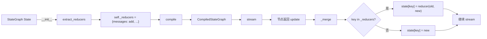
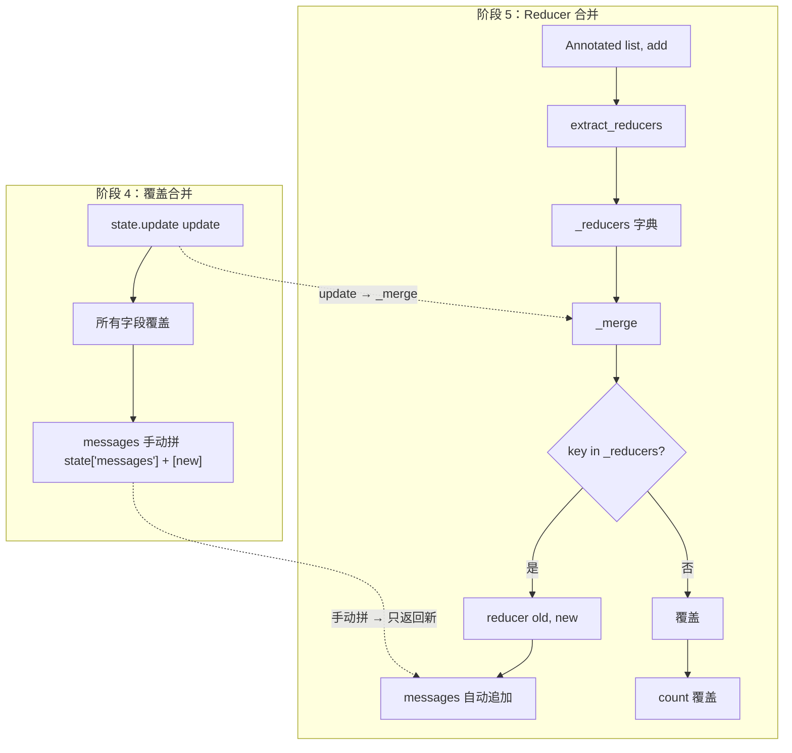
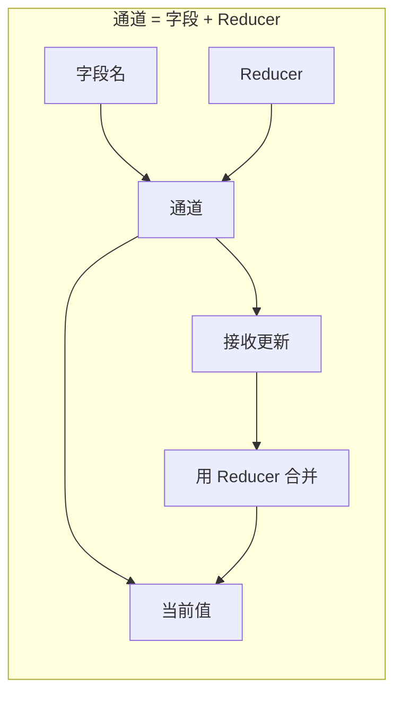

# 阶段 5：Reducer 机制

> **阶段目标**：让状态字段能**声明合并策略**——消息列表自动追加而非覆盖，且支持按 `id` 智能合并（流式更新同一条消息时覆盖而非追加多条半成品）。
>
> **前置条件**：已读完 [阶段 4 - 循环图 + stream](stage_4_cycle.md)，理解 `stream`、`while pending`、`_merge`（虽然阶段 4 的 `_merge` 还是覆盖合并）、ReAct 循环里 `state["messages"] + [new]` 的痛点。
>
> **git tag**：`stage-5` · **核心代码**：`src/tiny_langgraph/reducers.py`（`add_messages`、`extract_reducers`）+ `graph.py` 的 `_merge`
>
> **新增 API**：
>
> - `Annotated[T, reducer]` 语法给状态字段声明 Reducer
> - `add_messages(old, new)` 智能合并消息列表
> - `extract_reducers(state_type)` 从 TypedDict 注解提取 Reducer
>
> **核心思想**：合并策略从"写死覆盖"升级为"按字段声明"。字段 + Reducer = 通道（Channel）。

---

## 目录

- [1. 阶段目标拆解](#1-阶段目标拆解)
- [2. 为什么需要 Reducer](#2-为什么需要-reducer)
- [3. Annotated 语法详解](#3-annotated-语法详解)
- [4. add_messages 智能合并](#4-add_messages-智能合并)
- [5. extract_reducers 提取 Reducer](#5-extract_reducers-提取-reducer)
- [6. _merge 方法](#6-_merge-方法)
- [7. 通道概念引入](#7-通道概念引入)
- [8. 完整代码逐行解读](#8-完整代码逐行解读)
- [9. 可运行示例（含输出）](#9-可运行示例含输出)
- [10. 测试解读](#10-测试解读)
- [11. 对照真实 LangGraph](#11-对照真实-langgraph)
- [12. 从阶段 4 到阶段 5 的 diff 解读](#12-从阶段-4-到阶段-5-的-diff-解读)
- [13. 设计思考：为什么不用 operator.add](#13-设计思考为什么不用-operatoradd)
- [14. 常见误区与 FAQ](#14-常见误区与-faq)
- [15. 这一阶段的局限](#15-这一阶段的局限)

---

## 1. 阶段目标拆解

阶段 5 解决一个具体的痛点，并引入一个影响深远的概念。

### 1.1 痛点：消息列表的合并

阶段 4 的 ReAct 示例里，每个节点都要手动拼接 messages：

```python
def agent_node(state):
    msg = "AI: ..."
    return {"messages": state["messages"] + [msg]}   # ← 手动拼

def tool_node(state):
    return {
        "messages": state["messages"] + [tool_msg],   # ← 又手动拼
        "tool_calls": state["tool_calls"] + 1,
    }
```

这有两个问题：

1. **繁琐**：每个节点都要写 `state["messages"] + [new]`，容易忘
2. **容易错**：忘了拼就变成覆盖，messages 只剩新的一条，历史丢失

理想的是：节点只返回新消息，引擎自动追加：

```python
def agent_node(state):
    return {"messages": ["AI: ..."]}   # ← 只返回新的，引擎自动追加
```

这就是 Reducer 要做的事。

### 1.2 概念：合并策略声明

不同字段需要不同的合并策略：

| 字段 | 合并策略 | 例子 |
|------|---------|------|
| `count: int` | 覆盖（新值替换旧值） | `count=5` 被 `count=6` 覆盖 |
| `messages: list` | 追加（新列表拼到旧列表后） | `[a,b]` + `[c]` → `[a,b,c]` |
| `tool_messages: list[dict]` | 按 id 覆盖（同 id 替换，否则追加） | 流式更新同一条消息 |
| `score: float` | 取最大？取平均？ | 业务自定义 |

阶段 1-4 只有"覆盖"一种策略（`state.update(update)`）。阶段 5 让**每个字段能声明自己的合并策略**，这就是 Reducer。

### 1.3 影响深远：为并行铺路

Reducer 不只是省代码。它定义了"两个更新怎么合"，这是阶段 6 Pregel 并行的基础——多个节点同时返回对同一字段的更新，Reducer 决定怎么合。`add` 天然可交换可结合，适合并行；自定义 Reducer 可以表达更复杂的合并语义。

---

## 2. 为什么需要 Reducer

### 2.1 阶段 4 的覆盖合并

阶段 1-4 的合并是 `state.update(update)`，即**覆盖**：

```python
state = {"messages": ["a", "b"], "count": 1}
update = {"messages": ["c"], "count": 2}
state.update(update)
# state = {"messages": ["c"], "count": 2}   ← messages 被覆盖，历史丢失！
```

这对 `count` 是对的（新值替换旧值），但对 `messages` 是**灾难**——历史消息全丢了。

### 2.2 阶段 4 的 workaround

阶段 4 的节点被迫手动拼：

```python
def node(state):
    return {"messages": state["messages"] + [new_msg]}
```

这样 update 是 `{"messages": [a, b, c]}`，覆盖合并后 state 还是 `[a, b, c]`。但这把"追加"逻辑散在每个节点里，违反 DRY。

### 2.3 Reducer 的解法

Reducer 让字段声明合并策略：

```python
from typing import Annotated
from operator import add

class State(TypedDict):
    messages: Annotated[list, add]   # ← 声明：messages 用 add 合并（追加）
    count: int                       # ← 没声明，默认覆盖
```

节点只返回新消息：

```python
def node(state):
    return {"messages": [new_msg]}   # ← 只返回新的
```

引擎合并时看到 `messages` 有 Reducer `add`，就调 `add(old, new)`：

```python
# 引擎内部
old_messages = state["messages"]          # [a, b]
new_messages = update["messages"]         # [c]
state["messages"] = add(old_messages, new_messages)  # [a, b, c]
```

### 2.4 对比表

| 维度 | 阶段 4（覆盖） | 阶段 5（Reducer） |
|------|---------------|------------------|
| 合并方式 | `state.update(update)` | `self._merge(state, update)` |
| 策略 | 写死覆盖 | 按字段声明 |
| 节点代码 | `state["messages"] + [new]` | `[new]` |
| 历史保留 | 靠节点手动拼 | 引擎自动 |
| 策略可换 | 否 | 是（换 Reducer 函数即可） |
| 为并行铺路 | 否 | 是 |

---

## 3. Annotated 语法详解

### 3.1 Annotated 是什么

`typing.Annotated` 是 Python 3.9+ 的类型工具，给类型加**元数据**：

```python
from typing import Annotated

x: Annotated[int, "positive"] = 5
#       类型是 int，元数据是 "positive"
```

`Annotated[T, meta1, meta2, ...]`：

- 第一个参数 `T` 是真正的类型
- 后面的参数是元数据，可以有多个
- 运行时通过 `get_type_hints(..., include_extras=True)` 拿到元数据

### 3.2 用 Annotated 声明 Reducer

```python
from typing import Annotated, TypedDict
from operator import add

class State(TypedDict):
    messages: Annotated[list[str], add]   # 类型 list[str]，元数据 add
    count: int                            # 普通 int，无元数据
```

`Annotated[list[str], add]`：

- 类型是 `list[str]`（消息列表）
- 元数据是 `add`（`operator.add`，列表拼接）
- `add` 就是这个字段的 Reducer

### 3.3 Annotated 的元数据可以是任何东西

```python
# 元数据是函数（我们的用法）
x: Annotated[list, add]

# 元数据是字符串
x: Annotated[int, "positive"]

# 元数据是 pydantic Field
from pydantic import Field
x: Annotated[int, Field(gt=0)]

# 多个元数据
x: Annotated[int, "positive", Field(gt=0), "metadata3"]
```

我们只用"元数据是函数"这一种，把函数当作 Reducer。

### 3.4 为什么用 Annotated 而不是单独的参数

!!! info "为什么把 Reducer 写在类型注解里"
    有几种可选设计：

    **设计 A（我们采用的）**：写在 Annotated 里
    ```python
    class State(TypedDict):
        messages: Annotated[list, add]
    ```

    **设计 B**：单独传 reducers 字典
    ```python
    graph = StateGraph(State, reducers={"messages": add})
    ```

    **设计 C**：用 dataclass field 的 metadata
    ```python
    @dataclass
    class State:
        messages: list = field(metadata={"reducer": add})
    ```

    选设计 A 的理由：
    - **合并策略和字段定义在一起**：看 `messages: Annotated[list, add]` 一眼知道它用 add 合并
    - **和真实 LangGraph 一致**：真实 LangGraph 就是这么写的
    - **类型检查器友好**：mypy/pyright 能看到 `list[str]` 类型
    - **不需要额外参数**：StateGraph(State) 就够，不用 StateGraph(State, reducers=...)

### 3.5 TypedDict + Annotated 的注意点

```python
from typing import Annotated, TypedDict

class State(TypedDict):
    messages: Annotated[list[str], add]
    count: int
```

- `TypedDict` 是 Python 3.8+ 的，用于声明 dict 的键和类型
- `Annotated` 是 Python 3.9+ 的
- `get_type_hints(State, include_extras=True)` 才能拿到 Annotated 元数据（默认会剥掉）

---

## 4. add_messages 智能合并

### 4.1 为什么 operator.add 不够

`operator.add` 对列表是简单拼接：

```python
from operator import add
add(["a", "b"], ["c"])   # ["a", "b", "c"]
```

这对简单消息够用，但 LLM 消息需要更智能的合并——**按 id 覆盖**。

### 4.2 流式补全的场景

LLM 流式生成一条消息时，会多次发送**同 id** 的部分内容（越来越长）：

```
t=0: {"id": 1, "content": "Hel"}
t=1: {"id": 1, "content": "Hello"}
t=2: {"id": 1, "content": "Hello w"}
t=3: {"id": 1, "content": "Hello world"}
```

如果用 `add`（追加），会得到 4 条消息：

```python
# 用 add（错误）
[
    {"id": 1, "content": "Hel"},
    {"id": 1, "content": "Hello"},
    {"id": 1, "content": "Hello w"},
    {"id": 1, "content": "Hello world"},
]
```

正确行为是**覆盖**同 id 的旧版本，最终只有一条：

```python
# 用 add_messages（正确）
[
    {"id": 1, "content": "Hello world"},
]
```

### 4.3 add_messages 的规则

```python
def add_messages(old, new):
    """
    规则：
    - 新消息若是 dict 且有 "id"，且旧列表有同 id 的消息：覆盖该条
    - 否则：追加到末尾
    """
```

两条规则：

1. **按 id 覆盖**：新消息有 id 且旧列表有同 id → 替换旧的那条
2. **否则追加**：新消息没 id，或旧列表没这个 id → 追加到末尾

### 4.4 例子

```python
from tiny_langgraph import add_messages

# 例 1：纯追加（无 id）
add_messages(["a"], ["b", "c"])
# → ["a", "b", "c"]

# 例 2：按 id 覆盖
add_messages(
    [{"id": 1, "content": "old"}, {"id": 2, "content": "keep"}],
    [{"id": 1, "content": "new"}],
)
# → [{"id": 1, "content": "new"}, {"id": 2, "content": "keep"}]
#    id=1 被覆盖，id=2 保留

# 例 3：混合覆盖和追加
add_messages(
    [{"id": 1, "content": "old"}, "plain"],
    [{"id": 1, "content": "updated"}, {"id": 3, "content": "new"}],
)
# → [{"id": 1, "content": "updated"}, "plain", {"id": 3, "content": "new"}]
#    id=1 覆盖，"plain" 保留，id=3 追加

# 例 4：流式补全
add_messages(
    [{"id": 1, "content": "Hel"}],
    [{"id": 1, "content": "Hello"}],
)
# → [{"id": 1, "content": "Hello"}]   # 覆盖，不是两条
```

### 4.5 边界情况

```python
# old 为 None
add_messages(None, ["a"])       # → ["a"]
add_messages([], ["a"])         # → ["a"]

# new 为 None
add_messages(["a"], None)       # → ["a"]
add_messages(["a"], [])         # → ["a"]

# 不修改输入
old = ["a"]
new = ["b"]
add_messages(old, new)
assert old == ["a"]             # old 没被改
assert new == ["b"]             # new 没被改
```

### 4.6 实现逐行

```python
def add_messages(old, new):
    # ① 空列表快速返回
    if not old:
        return list(new) if new else []
    if not new:
        return list(old)

    # ② 复制旧列表（不修改输入）
    result = list(old)

    # ③ 建 id → index 索引，方便 O(1) 查找
    id_to_index = {}
    for i, msg in enumerate(result):
        if isinstance(msg, dict) and "id" in msg:
            id_to_index[msg["id"]] = i

    # ④ 遍历新消息：有同 id 则覆盖，否则追加
    for msg in new:
        msg_id = msg.get("id") if isinstance(msg, dict) else None
        if msg_id is not None and msg_id in id_to_index:
            result[id_to_index[msg_id]] = msg       # 覆盖
        else:
            result.append(msg)                      # 追加
            if msg_id is not None:
                id_to_index[msg_id] = len(result) - 1   # 更新索引

    return result
```

逐行：

- **①** 空列表快速返回，避免建索引的开销
- **②** `result = list(old)` 复制，保证不修改输入
- **③** 建 `id_to_index` 索引：`{msg_id: 在 result 中的位置}`，让覆盖操作 O(1)
- **④** 遍历新消息：
  - 有 id 且旧列表有同 id → `result[index] = msg` 覆盖
  - 否则 → `result.append(msg)` 追加，并更新索引（新追加的也可能被后续新消息覆盖）

### 4.7 复杂度

- 时间：O(|old| + |new|)，建索引 O(|old|)，遍历新消息 O(|new|)
- 空间：O(|old|)（索引 + 复制的列表）

---

## 5. extract_reducers 提取 Reducer

### 5.1 功能

`extract_reducers(state_type)` 从 TypedDict 的 Annotated 注解提取 Reducer：

```python
class State(TypedDict):
    messages: Annotated[list, add]
    count: int
    history: Annotated[list, add]

extract_reducers(State)
# → {"messages": add, "history": add}
#    count 没有 Reducer，不在结果里
```

### 5.2 实现

```python
from typing import Annotated, get_args, get_origin, get_type_hints

def extract_reducers(state_type):
    reducers = {}
    try:
        hints = get_type_hints(state_type, include_extras=True)   # ①
    except Exception:
        return reducers

    for key, hint in hints.items():                                # ②
        if get_origin(hint) is Annotated:                          # ③
            _base, *metadata = get_args(hint)                      # ④
            if metadata and callable(metadata[0]):                 # ⑤
                reducers[key] = metadata[0]                        # ⑥
    return reducers
```

逐行：

- **①** `get_type_hints(state_type, include_extras=True)`：拿类型注解。**关键**：`include_extras=True` 保留 Annotated 元数据。默认会剥掉，拿到的是 `list` 而非 `Annotated[list, add]`。
- **②** 遍历每个字段的注解
- **③** `get_origin(hint) is Annotated`：判断这个注解是不是 Annotated
- **④** `get_args(hint)`：拆出 `(base_type, meta1, meta2, ...)`。`_base` 是基础类型，`metadata` 是元数据列表
- **⑤** `metadata and callable(metadata[0])`：元数据非空且第一个是可调用对象（函数）
- **⑥** `reducers[key] = metadata[0]`：把第一个元数据当作 Reducer

### 5.3 include_extras=True 的关键性

```python
from typing import Annotated, get_type_hints, get_type_hints

class State(TypedDict):
    messages: Annotated[list, add]

# 默认（剥掉 Annotated）
get_type_hints(State)
# → {"messages": list}   ← add 丢了！

# include_extras=True（保留）
get_type_hints(State, include_extras=True)
# → {"messages": Annotated[list, add]}   ← add 保留
```

!!! warning "忘了 include_extras=True 是常见坑"
    ```python
    # 错误：忘了 include_extras
    hints = get_type_hints(State)
    # hints = {"messages": list}
    # get_origin(list) is Annotated → False
    # 提取不到 Reducer！
    ```

    这是 `extract_reducers` 最容易写错的地方。Python 3.9+ 才支持 `include_extras` 参数。

### 5.4 异常处理

```python
try:
    hints = get_type_hints(state_type, include_extras=True)
except Exception:
    return reducers
```

`get_type_hints` 可能抛异常（比如注解引用了未定义的类型）。我们 catch 所有异常返回空 dict，意思是"提取不到就当没 Reducer"。这是防御性编程，避免 Reducer 提取失败导致整个图不能用。

### 5.5 只取第一个元数据

```python
_base, *metadata = get_args(hint)
if metadata and callable(metadata[0]):
    reducers[key] = metadata[0]
```

`Annotated[T, m1, m2, m3]` 可能有多个元数据。我们只看第一个 `m1`，且要求它是 callable。这和真实 LangGraph 一致——第一个 callable 元数据就是 Reducer。

---

## 6. _merge 方法

### 6.1 阶段 4 的覆盖合并

```python
# 阶段 4（伪代码）
state.update(update)
```

`dict.update` 是覆盖：`update` 里的每个键值对直接替换 `state` 里的同名键。

### 6.2 阶段 5 的 _merge

```python
def _merge(self, state, update):
    """把更新片段合并进状态：有 Reducer 用 Reducer，否则覆盖。"""
    for key, value in update.items():
        if key in self._reducers:                                    # ①
            state[key] = self._reducers[key](state.get(key), value)  # ②
        else:                                                        # ③
            state[key] = value
```

逐行：

- **①** `if key in self._reducers`：这个字段有 Reducer 吗？
- **②** 有 Reducer：调 `reducer(old, new)`，结果是合并后的值。`state.get(key)` 拿旧值（可能不存在，返回 None，Reducer 要能处理 None）
- **③** 无 Reducer：直接覆盖（和 `dict.update` 一样）

### 6.3 对比

| 情况 | 阶段 4（update） | 阶段 5（_merge） |
|------|-----------------|------------------|
| 字段无 Reducer | `state[key] = value` | `state[key] = value`（同） |
| 字段有 Reducer | `state[key] = value`（覆盖） | `state[key] = reducer(old, new)` |

阶段 5 的 `_merge` 在无 Reducer 时行为和阶段 4 完全一样（覆盖），只是有 Reducer 时改用 Reducer。所以 Reducer 是**可选的**——不声明就用默认覆盖，声明了就用声明的。

### 6.4 _merge 在 stream 里的调用位置

```python
# stream 方法里
for node_name in sorted(pending):
    update = self._nodes[node_name](step_state)
    updates.append(update)
for update in updates:
    self._merge(state, update)   # ← 这里调 _merge
```

每个节点执行完，把它的 update 用 `_merge` 合并回 state。阶段 4 是 `state.update(update)`，阶段 5 改成 `self._merge(state, update)`。

### 6.5 Reducer 函数的签名约定

```python
reducer: Callable[[Any, Any], Any]
# reducer(old_value, new_value) -> merged_value
```

- 接收两个参数：旧值、新值
- 返回合并后的值
- **不修改**输入（`add_messages` 保证这一点，`operator.add` 也保证）
- 要能处理 `old=None`（字段第一次被设置时旧值不存在）

```python
# add 能处理 None 吗？
from operator import add
add(None, ["a"])   # TypeError: unsupported operand type(s) for +: 'NoneType' and 'list'
```

`operator.add` **不能**处理 None！所以第一次设置 messages 时会报错。解决办法：

- 初始化时给 `messages` 一个空列表 `[]`（不是 None）
- 或者用自定义 Reducer 处理 None（`add_messages` 就处理了 None）

这也是为什么 `add_messages` 要处理 `old=None`：

```python
def add_messages(old, new):
    if not old:               # None 或空列表
        return list(new) if new else []
    ...
```

---

## 7. 通道概念引入

### 7.1 字段 + Reducer = 通道

阶段 5 引入了一个重要概念：**通道（Channel）**。

> **通道** = 状态的一个字段 + 这个字段的 Reducer。

通道是 Pregel 模型里的核心概念（阶段 6 主题）。每个通道：

- 有一个**名字**（字段名）
- 有一个**当前值**（state 里的值）
- 有一个**合并策略**（Reducer）
- 接收**更新**（节点返回的 update 片段里的对应字段）
- 用 Reducer 把更新合并进当前值

### 7.2 通道的抽象

```python
# 概念上，通道是个对象
class Channel:
    name: str
    value: Any
    reducer: Callable[[Any, Any], Any]

    def update(self, new_value):
        self.value = self.reducer(self.value, new_value)
```

阶段 5 没有显式的 Channel 类，但 `_merge` 的行为就是在操作通道：

```python
def _merge(self, state, update):
    for key, value in update.items():
        if key in self._reducers:
            # key 是通道名，state[key] 是通道值，self._reducers[key] 是 Reducer
            state[key] = self._reducers[key](state.get(key), value)
        else:
            # 无 Reducer 的字段也是通道，只是 Reducer 是"覆盖"
            state[key] = value
```

### 7.3 两种通道

| 通道类型 | Reducer | 行为 | 例子 |
|---------|---------|------|------|
| 覆盖通道 | 无（默认） | 新值替换旧值 | `count: int` |
| 追加通道 | `add` | 新值拼到旧值后 | `messages: Annotated[list, add]` |
| 智能消息通道 | `add_messages` | 按 id 覆盖、否则追加 | `messages: Annotated[list, add_messages]` |
| 自定义通道 | 任意函数 | 自定义 | `score: Annotated[float, max]` |

### 7.4 为什么引入通道概念

!!! info "通道是 Pregel 的基础"
    阶段 6 的 Pregel 超级步模型里，**通道是一等公民**：

    - 每个超级步，多个节点并行执行
    - 每个节点读所有通道的当前值
    - 每个节点返回对某些通道的更新
    - 超级步结束时，每个通道用它的 Reducer 合并所有更新

    通道让"并行更新同一字段"有明确定义——Reducer 决定怎么合。`add` 天然可交换可结合（`add(a, b) == add(b, a)`、`add(add(a, b), c) == add(a, add(b, c))`），适合并行。

    阶段 5 引入 Reducer 和 `_merge`，就是在为阶段 6 的通道和并行铺路。

### 7.5 阶段 5 vs 阶段 6 的通道

| 维度 | 阶段 5 | 阶段 6 |
|------|--------|--------|
| 通道显式化 | 否（隐式在 _merge） | 是（Channel 类） |
| 并行更新 | 否（串行 _merge） | 是（同层多节点同时更新） |
| Reducer 作用 | 合并单节点更新 | 合并多节点并行更新 |

---

## 8. 完整代码逐行解读

### 8.1 reducers.py 完整代码

```python
"""Reducer 机制 - 阶段 5。"""
from __future__ import annotations

from collections.abc import Callable
from typing import Annotated, Any, get_args, get_origin, get_type_hints

__all__ = ["add_messages", "extract_reducers"]


def add_messages(old, new):
    """智能合并消息列表。"""
    # ① 空列表快速返回
    if not old:
        return list(new) if new else []
    if not new:
        return list(old)

    # ② 复制旧列表
    result = list(old)

    # ③ 建 id → index 索引
    id_to_index = {}
    for i, msg in enumerate(result):
        if isinstance(msg, dict) and "id" in msg:
            id_to_index[msg["id"]] = i

    # ④ 遍历新消息：覆盖或追加
    for msg in new:
        msg_id = msg.get("id") if isinstance(msg, dict) else None
        if msg_id is not None and msg_id in id_to_index:
            result[id_to_index[msg_id]] = msg
        else:
            result.append(msg)
            if msg_id is not None:
                id_to_index[msg_id] = len(result) - 1
    return result


def extract_reducers(state_type):
    """从 TypedDict 的 Annotated 注解提取 Reducer。"""
    reducers = {}
    try:
        hints = get_type_hints(state_type, include_extras=True)
    except Exception:
        return reducers

    for key, hint in hints.items():
        if get_origin(hint) is Annotated:
            _base, *metadata = get_args(hint)
            if metadata and callable(metadata[0]):
                reducers[key] = metadata[0]
    return reducers
```

### 8.2 graph.py 的相关变化

#### StateGraph.__init__

```python
def __init__(self, state_type):
    self._state_type = state_type
    self._reducers = extract_reducers(state_type)   # ← 新增：提取 Reducer
    self._nodes = {}
    self._edges = {}
    self._conditional_edges = {}
    self._entry_point = None
```

`__init__` 里调 `extract_reducers(state_type)` 提取 Reducer，存进 `self._reducers`。这一步在 `StateGraph` 构造时就完成，之后不变。

#### compile

```python
def compile(self, ...):
    ...
    return CompiledStateGraph(
        nodes=self._nodes,
        edges=self._edges,
        conditional_edges=self._conditional_edges,
        entry_point=self._entry_point,
        reducers=self._reducers,          # ← 传给 CompiledStateGraph
        checkpointer=checkpointer,
        ...
    )
```

`compile` 把 `self._reducers` 传给 `CompiledStateGraph`。

#### CompiledStateGraph.__init__

```python
def __init__(self, ..., reducers=None, ...):
    ...
    self._reducers = reducers or {}       # ← 存 Reducer 字典
    ...
```

#### CompiledStateGraph._merge

```python
def _merge(self, state, update):
    """把更新片段合并进状态：有 Reducer 用 Reducer，否则覆盖。"""
    for key, value in update.items():
        if key in self._reducers:                                    # ① 有 Reducer
            state[key] = self._reducers[key](state.get(key), value)  # ② 用 Reducer 合并
        else:                                                        # ③ 无 Reducer
            state[key] = value                                       #    覆盖
```

逐行：

- **①** `if key in self._reducers`：查这个字段有没有 Reducer。`self._reducers` 是 `{字段名: reducer 函数}` 字典。
- **②** 有 Reducer：调 `reducer(state.get(key), value)`。`state.get(key)` 拿旧值（字段可能还没被设置，返回 None）。Reducer 负责处理 None。
- **③** 无 Reducer：`state[key] = value`，直接覆盖。这和阶段 4 的 `state.update(update)` 行为一致。

#### stream 里调 _merge

```python
# stream 方法里
for node_name in sorted(pending):
    update = self._nodes[node_name](step_state)
    updates.append(update)
for update in updates:
    self._merge(state, update)   # ← 阶段 4 是 state.update(update)
```

阶段 4 的 `state.update(update)` 被替换成 `self._merge(state, update)`。这是阶段 5 唯一的执行逻辑变化。

### 8.3 数据流



---

## 9. 可运行示例（含输出）

### 9.1 运行命令

```bash
python -m examples.stage_5_reducer.run
```

### 9.2 完整代码

```python
# examples/stage_5_reducer/run.py
from operator import add
from typing import Annotated, TypedDict
from tiny_langgraph import END, START, StateGraph, add_messages

class AgentState(TypedDict):
    messages: Annotated[list[str], add]                    # 自动追加
    tool_messages: Annotated[list[dict], add_messages]     # 按 id 智能合并
    tool_calls: int                                        # 默认覆盖

def main():
    # ===== 示例 1：messages 自动追加 =====
    def agent(state):
        if state["tool_calls"] < 2:
            return {"messages": [f"AI: 需要查资料 #{state['tool_calls'] + 1}"]}
        return {"messages": ["AI: 最终答案是 42"]}

    def tool(state):
        return {
            "messages": [f"Tool: 结果 #{state['tool_calls'] + 1}"],
            "tool_calls": state["tool_calls"] + 1,
        }

    graph = StateGraph(AgentState)
    graph.add_node("agent", agent)
    graph.add_node("tools", tool)
    graph.add_edge(START, "agent")
    graph.add_conditional_edges(
        "agent",
        lambda s: "tools" if "需要查" in s["messages"][-1] else "end",
        {"tools": "tools", "end": END},
    )
    graph.add_edge("tools", "agent")

    result = graph.compile().invoke({"messages": [], "tool_messages": [], "tool_calls": 0})
    for msg in result["messages"]:
        print(f"  {msg}")

    # ===== 示例 2：add_messages 按 id 覆盖 =====
    def draft(state):
        return {"tool_messages": [{"id": 1, "content": "草稿..."}]}

    def stream_update(state):
        return {"tool_messages": [{"id": 1, "content": "完整内容"}]}

    def add_new(state):
        return {"tool_messages": [{"id": 2, "content": "另一条消息"}]}

    graph2 = StateGraph(AgentState)
    graph2.add_node("draft", draft)
    graph2.add_node("stream_update", stream_update)
    graph2.add_node("add_new", add_new)
    graph2.add_edge(START, "draft")
    graph2.add_edge("draft", "stream_update")
    graph2.add_edge("stream_update", "add_new")
    graph2.add_edge("add_new", END)

    result2 = graph2.compile().invoke({"messages": [], "tool_messages": [], "tool_calls": 0})
    for msg in result2["tool_messages"]:
        print(f"  id={msg['id']}: {msg['content']}")
```

### 9.3 输出

```
============================================================
示例 1：messages 自动追加（不用手动拼）
============================================================
  AI: 需要查资料 #1
  Tool: 结果 #1
  AI: 需要查资料 #2
  Tool: 结果 #2
  AI: 最终答案是 42

============================================================
示例 2：add_messages 按 id 覆盖（流式更新同一条消息）
============================================================
  id=1: 完整内容
  id=2: 另一条消息

  → id=1 被 stream_update 覆盖（草稿→完整内容），没有变成两条
  → id=2 是新消息，追加

============================================================
关键对比：阶段 4 vs 阶段 5
============================================================
  阶段 4: return {'messages': state['messages'] + [new]}  # 手动拼
  阶段 5: return {'messages': [new]}                      # 引擎自动追加
```

### 9.4 示例 1 解读

```python
class AgentState(TypedDict):
    messages: Annotated[list[str], add]   # ← Reducer 是 add
    ...
```

- `agent` 节点返回 `{"messages": ["AI: 需要查资料 #1"]}`，只含新消息
- 引擎 `_merge` 看到 `messages` 有 Reducer `add`，调 `add([], ["AI: ..."])` → `["AI: ..."]`
- 下一步 `tool` 返回 `{"messages": ["Tool: 结果 #1"]}`，引擎调 `add(["AI: ..."], ["Tool: ..."])` → `["AI: ...", "Tool: ..."]`
- 消息自动累积，节点不用手动拼

### 9.5 示例 2 解读

```python
class AgentState(TypedDict):
    tool_messages: Annotated[list[dict], add_messages]   # ← Reducer 是 add_messages
    ...
```

- `draft` 返回 `{"tool_messages": [{"id": 1, "content": "草稿..."}]}`
- `stream_update` 返回 `{"tool_messages": [{"id": 1, "content": "完整内容"}]}`
- 引擎调 `add_messages([{"id": 1, "content": "草稿..."}], [{"id": 1, "content": "完整内容"}])`
- 因为 id=1 已存在，**覆盖**：`[{"id": 1, "content": "完整内容"}]`
- `add_new` 返回 `{"tool_messages": [{"id": 2, "content": "另一条消息"}]}`
- 引擎调 `add_messages([{"id": 1, ...}], [{"id": 2, ...}])`
- id=2 不存在，**追加**：`[{"id": 1, ...}, {"id": 2, ...}]`

最终 `tool_messages` 有 2 条，id=1 是完整内容（草稿被覆盖），id=2 是新追加的。

---

## 10. 测试解读

测试文件：`tests/tiny_langgraph/test_reducers.py`

### 10.1 TestExtractReducers 类

#### test_extracts_annotated_reducers

```python
class State(TypedDict):
    messages: Annotated[list[str], add]
    count: int
    history: Annotated[list[str], add]

def test_extracts_annotated_reducers(self):
    reducers = extract_reducers(State)
    assert "messages" in reducers
    assert "history" in reducers
    assert "count" not in reducers
```

**测的是什么**：`extract_reducers` 正确提取有 Annotated 的字段（messages、history），不提取普通字段（count）。

#### test_no_reducers_for_plain_types

```python
def test_no_reducers_for_plain_types(self):
    class Plain(TypedDict):
        a: int
        b: str
    assert extract_reducers(Plain) == {}
```

**测的是什么**：完全没有 Annotated 的 TypedDict，提取结果是空 dict。

### 10.2 TestReducerMerge 类

#### test_list_appends_with_add

```python
def test_list_appends_with_add(self):
    graph.add_node("a", lambda s: {"messages": ["hello"]})
    graph.add_node("b", lambda s: {"messages": ["world"]})
    ...
    result = graph.compile().invoke({"messages": [], "count": 0, "history": []})
    assert result["messages"] == ["hello", "world"]
```

**测的是什么**：`messages` 有 Reducer `add`，两个节点各返回一条消息，最终累积成 `["hello", "world"]`。验证 Reducer 的追加行为。

#### test_non_reducer_field_overwrites

```python
def test_non_reducer_field_overwrites(self):
    graph.add_node("a", lambda s: {"count": 1})
    graph.add_node("b", lambda s: {"count": 2})
    ...
    result = graph.compile().invoke({"messages": [], "count": 0, "history": []})
    assert result["count"] == 2
```

**测的是什么**：`count` 没有 Reducer，两个节点各返回一个值，最终是后一个（覆盖）。验证无 Reducer 字段的覆盖行为。

#### test_mixed_reducer_and_overwrite

```python
def test_mixed_reducer_and_overwrite(self):
    graph.add_node("a", lambda s: {"messages": ["m1"], "count": 10})
    graph.add_node("b", lambda s: {"messages": ["m2"], "count": 20})
    ...
    result = graph.compile().invoke(...)
    assert result["messages"] == ["m1", "m2"]   # 追加
    assert result["count"] == 20                # 覆盖
```

**测的是什么**：同一图里，有 Reducer 的字段追加，无 Reducer 的字段覆盖。验证 `_merge` 的分支逻辑。

#### test_reducer_in_cycle

```python
def test_reducer_in_cycle(self):
    graph.add_node("loop", lambda s: {"messages": [f"step-{s['count']}"], "count": s["count"] + 1})
    graph.add_edge(START, "loop")
    graph.add_conditional_edges("loop", lambda s: "again" if s["count"] < 3 else "done",
                                {"again": "loop", "done": END})
    result = graph.compile().invoke({"messages": [], "count": 0, "history": []})
    assert result["messages"] == ["step-0", "step-1", "step-2"]
    assert result["count"] == 3
```

**测的是什么**：循环图里 Reducer 累积。`loop` 节点循环 3 次，每次返回一条新消息，最终 messages 累积 3 条。验证 Reducer 在循环里的正确性。

### 10.3 TestAddMessages 类

#### test_append_new_messages

```python
def test_append_new_messages(self):
    result = add_messages(["a"], ["b", "c"])
    assert result == ["a", "b", "c"]
```

**测的是什么**：无 id 的消息纯追加。

#### test_overwrite_by_id

```python
def test_overwrite_by_id(self):
    old = [{"id": 1, "content": "old"}, {"id": 2, "content": "keep"}]
    new = [{"id": 1, "content": "new"}]
    result = add_messages(old, new)
    assert result == [{"id": 1, "content": "new"}, {"id": 2, "content": "keep"}]
```

**测的是什么**：同 id 覆盖，其他保留。

#### test_mixed_overwrite_and_append

```python
def test_mixed_overwrite_and_append(self):
    old = [{"id": 1, "content": "old"}, "plain"]
    new = [{"id": 1, "content": "updated"}, {"id": 3, "content": "new"}]
    result = add_messages(old, new)
    assert result[0] == {"id": 1, "content": "updated"}
    assert result[1] == "plain"
    assert result[2] == {"id": 3, "content": "new"}
```

**测的是什么**：混合覆盖和追加。id=1 覆盖，"plain"（无 id）保留，id=3 追加。

#### test_empty_old / test_empty_new

```python
def test_empty_old(self):
    assert add_messages(None, ["a"]) == ["a"]
    assert add_messages([], ["a"]) == ["a"]

def test_empty_new(self):
    assert add_messages(["a"], None) == ["a"]
    assert add_messages(["a"], []) == ["a"]
```

**测的是什么**：边界情况——old 或 new 为 None/空列表。

#### test_does_not_mutate_inputs

```python
def test_does_not_mutate_inputs(self):
    old = ["a"]
    new = ["b"]
    add_messages(old, new)
    assert old == ["a"]
    assert new == ["b"]
```

**测的是什么**：`add_messages` 不修改输入列表（纯函数）。这很重要——如果修改了输入，调用方持有的 state 会被意外改动。

### 10.4 TestAddMessagesInGraph 类

#### test_messages_accumulate

```python
def test_messages_accumulate(self):
    class MsgState(TypedDict):
        messages: Annotated[list[dict], add_messages]

    graph.add_node("a", lambda s: {"messages": [{"id": 1, "role": "user", "content": "hi"}]})
    graph.add_node("b", lambda s: {"messages": [{"id": 2, "role": "ai", "content": "hello"}]})
    ...
    result = graph.compile().invoke({"messages": []})
    assert len(result["messages"]) == 2
    assert result["messages"][0]["id"] == 1
    assert result["messages"][1]["id"] == 2
```

**测的是什么**：`add_messages` 作为 Reducer 在图中使用，不同 id 的消息累积。

#### test_messages_overwrite_by_id_in_graph

```python
def test_messages_overwrite_by_id_in_graph(self):
    graph.add_node("init", lambda s: {"messages": [{"id": 1, "content": "draft"}]})
    graph.add_node("update", lambda s: {"messages": [{"id": 1, "content": "final"}]})
    ...
    result = graph.compile().invoke({"messages": []})
    assert len(result["messages"]) == 1
    assert result["messages"][0]["content"] == "final"
```

**测的是什么**：同 id 消息在图中被覆盖（draft → final），不变成两条。这是流式补全的核心场景。

### 10.5 测试覆盖矩阵

| 测试 | 覆盖点 |
|------|--------|
| test_extracts_annotated_reducers | extract_reducers 提取有 Annotated 的字段 |
| test_no_reducers_for_plain_types | 无 Annotated 时提取空 |
| test_list_appends_with_add | add Reducer 追加 |
| test_non_reducer_field_overwrites | 无 Reducer 覆盖 |
| test_mixed_reducer_and_overwrite | 混合字段各自策略 |
| test_reducer_in_cycle | 循环里 Reducer 累积 |
| test_append_new_messages | add_messages 纯追加 |
| test_overwrite_by_id | add_messages 按 id 覆盖 |
| test_mixed_overwrite_and_append | add_messages 混合 |
| test_empty_old / test_empty_new | add_messages 边界 |
| test_does_not_mutate_inputs | add_messages 纯函数 |
| test_messages_accumulate | add_messages 在图中累积 |
| test_messages_overwrite_by_id_in_graph | add_messages 在图中覆盖 |

---

## 11. 对照真实 LangGraph

### 11.1 API 对比

| 维度 | 真实 LangGraph | 我们的阶段 5 | 说明 |
|------|----------------|-------------|------|
| `Annotated[list, add]` | 支持 | 支持 | 语法一致 |
| `add_messages` | 支持 | 支持（简化版） | |
| `extract_reducers` | 内部实现 | 同 | 提取方式一致 |
| `get_type_hints(include_extras=True)` | 用 | 用 | |
| Reducer 存在哪 | Channel 对象 | `CompiledStateGraph._reducers` 字典 | 阶段 6 统一到 Channel |

### 11.2 真实版 add_messages 的额外能力

真实 LangGraph 的 `add_messages` 处理更多消息类型：

| 能力 | 真实版 | 我们 |
|------|--------|------|
| dict 消息 | 支持 | 支持 |
| `BaseMessage`（langchain 对象） | 支持 | ❌ |
| `AIMessage` / `HumanMessage` / `ToolMessage` | 支持 | ❌ |
| 按 `id` 覆盖 | 支持 | 支持 |
| 按 `tool_call_id` 去重 | 支持（ToolMessage） | ❌ |
| 删除消息（id 前加 `remove` 标记） | 支持 | ❌ |

我们的 `add_messages` 只处理 dict，是真实版的简化子集。教学上 dict 已经足够说明"按 id 覆盖"的概念。

### 11.3 真实版的 Channel

真实 LangGraph 有显式的 Channel 概念：

```python
# 真实 LangGraph（概念）
from langgraph.channels import BinaryOperatorAggregate

class Channel:
    def update(self, new_value):
        ...
    def get(self):
        ...
    def checkpoint(self):
        ...
```

我们阶段 5 没有显式 Channel 类，通道隐式存在于 `_merge` 和 `_reducers` 字典里。阶段 6 会把通道显式化。

### 11.4 真实版的 Reducer 验证

真实 LangGraph 在编译时验证 Reducer：

- Reducer 必须是二元函数
- Reducer 的输入输出类型要匹配字段类型
- 某些 Reducer 有特殊语义（如 `add_messages` 要支持删除标记）

我们阶段 5 只检查 `callable(metadata[0])`，不做类型验证。这是教学简化。

### 11.5 真实版的 Annotated 用法

真实 LangGraph 的 `Annotated` 用法和我们完全一致：

```python
# 真实 LangGraph
from typing import Annotated
from operator import add
from langgraph.graph import MessagesState

class State(MessagesState):
    messages: Annotated[list[BaseMessage], add_messages]
    count: int
```

这就是为什么我们坚持用 `Annotated` 语法——让教学代码能直接迁移到真实 LangGraph。

---

## 12. 从阶段 4 到阶段 5 的 diff 解读

### 12.1 新增文件

```diff
+src/tiny_langgraph/reducers.py   # 新增：add_messages + extract_reducers
+tests/tiny_langgraph/test_reducers.py   # 新增：测试
+examples/stage_5_reducer/run.py   # 新增：示例
```

### 12.2 graph.py 的变化

#### StateGraph.__init__

```diff
 def __init__(self, state_type):
     self._state_type = state_type
+    self._reducers = extract_reducers(state_type)   # 新增：提取 Reducer
     self._nodes = {}
     self._edges = {}
     self._conditional_edges = {}
     self._entry_point = None
```

#### compile

```diff
 def compile(self, ...):
     ...
     return CompiledStateGraph(
         nodes=self._nodes,
         edges=self._edges,
         conditional_edges=self._conditional_edges,
         entry_point=self._entry_point,
+        reducers=self._reducers,          # 新增：传 Reducer
         checkpointer=checkpointer,
         ...
     )
```

#### CompiledStateGraph.__init__

```diff
 def __init__(self, ..., reducers=None, ...):
     ...
+    self._reducers = reducers or {}       # 新增：存 Reducer
     ...
```

#### _merge（新增方法）

```diff
+def _merge(self, state, update):
+    """把更新片段合并进状态：有 Reducer 用 Reducer，否则覆盖。"""
+    for key, value in update.items():
+        if key in self._reducers:
+            state[key] = self._reducers[key](state.get(key), value)
+        else:
+            state[key] = value
```

#### stream 里的合并调用

```diff
 for node_name in sorted(pending):
     update = self._nodes[node_name](step_state)
     updates.append(update)
 for update in updates:
-    state.update(update)                  # 阶段 4：覆盖合并
+    self._merge(state, update)            # 阶段 5：按 Reducer 合并
```

### 12.3 __init__.py 的导出

```diff
+from tiny_langgraph.reducers import add_messages
+
 __all__ = [
     "START",
     "END",
     "Graph",
     "CompiledGraph",
     "StateGraph",
     "CompiledStateGraph",
+    "add_messages",
 ]
```

### 12.4 diff 总结

| 变化类型 | 内容 |
|---------|------|
| 新增文件 | `reducers.py`、测试、示例 |
| 新增数据结构 | `StateGraph._reducers`、`CompiledStateGraph._reducers` |
| 新增方法 | `CompiledStateGraph._merge` |
| 新增 API | `add_messages`（导出） |
| 核心语义 | `state.update(update)` → `self._merge(state, update)` |

### 12.5 变化范围

!!! info "阶段 5 的代码变化非常小"
    核心变化只有**一行**：`state.update(update)` → `self._merge(state, update)`。

    其余都是基础设施：`reducers.py`（新增）、`extract_reducers`（构造时调一次）、`_reducers` 字典（存 Reducer）。

    这说明 Reducer 的设计是**正交的**——它只改变"合并"这一个环节，不影响执行模型、条件边、循环、stream。好的设计就是这样：新增能力不破坏现有结构。

---

## 13. 设计思考：为什么不用 operator.add

### 13.1 问题

`operator.add` 对列表是简单拼接，能解决"消息追加"的基本需求：

```python
from operator import add

class State(TypedDict):
    messages: Annotated[list, add]   # 用 add 追加
```

为什么还要自定义 `add_messages`？

### 13.2 理由 1：按 id 覆盖

`add` 永远追加，无法覆盖。但 LLM 消息需要按 id 覆盖（流式补全场景，见 §4.2）：

```python
# add（永远追加）
add([{"id": 1, "content": "Hel"}], [{"id": 1, "content": "Hello"}])
# → [{"id": 1, "content": "Hel"}, {"id": 1, "content": "Hello"}]   # 两条！

# add_messages（按 id 覆盖）
add_messages([{"id": 1, "content": "Hel"}], [{"id": 1, "content": "Hello"}])
# → [{"id": 1, "content": "Hello"}]   # 一条，覆盖
```

这是 `add_messages` 存在的核心理由。

### 13.3 理由 2：处理 None

`add` 不能处理 `old=None`：

```python
add(None, ["a"])   # TypeError!
```

字段第一次被设置时 `state.get(key)` 返回 None，`add` 会崩。`add_messages` 处理了 None：

```python
def add_messages(old, new):
    if not old:               # None 或空列表
        return list(new) if new else []
    ...
```

用户可以用 `add` 但必须保证初始化时给空列表 `[]`。`add_messages` 更健壮。

### 13.4 理由 3：不修改输入

`add` 不修改输入（`+` 创建新列表）。`add_messages` 也保证不修改输入（`result = list(old)` 复制）。但有些自定义 Reducer 可能不小心修改输入，`add_messages` 树立了正确范例。

### 13.5 理由 4：为更智能的合并铺路

真实 LangGraph 的 `add_messages` 还支持：

- 按 `tool_call_id` 去重（ToolMessage）
- 删除消息（id 前加 `remove` 标记）
- 处理 `BaseMessage` 对象

我们的 `add_messages` 是简化版，但结构上和真实版一致——都是"按 id 覆盖、否则追加"。未来扩展（支持删除、支持 Message 对象）只需改 `add_messages`，不影响其他代码。

### 13.6 什么时候用 add vs add_messages

| 场景 | 用什么 | 理由 |
|------|--------|------|
| 普通字符串列表追加 | `add` | 简单，无 id 概念 |
| 日志累积 | `add` | 日志不需要覆盖 |
| LLM 消息（dict 带 id） | `add_messages` | 要按 id 覆盖 |
| 流式补全 | `add_messages` | 同 id 的部分内容要覆盖 |
| 计数器（int） | 无 Reducer（覆盖） | 新值替换旧值 |
| 自定义聚合 | 自定义函数 | 业务逻辑 |

### 13.7 自定义 Reducer 示例

Reducer 可以是任何二元函数。比如"取最大值"：

```python
class State(TypedDict):
    score: Annotated[float, max]   # 取最大

def node(state):
    return {"score": 0.8}   # 引擎调 max(old_score, 0.8)
```

或者"累加但上限 100"：

```python
def capped_add(old, new):
    return min((old or 0) + new, 100)

class State(TypedDict):
    usage: Annotated[int, capped_add]
```

Reducer 的灵活性让状态合并能表达任意业务逻辑。

---

## 14. 常见误区与 FAQ

### 14.1 误区：Reducer 改变了节点的返回值

!!! warning "节点返回的是更新片段，不是完整状态"
    无论有没有 Reducer，节点都返回 `{"字段": 新值}`。Reducer 只改变**引擎怎么合并**这个新值，不改变节点写法。

    ```python
    # 有 Reducer
    def node(state):
        return {"messages": [new_msg]}   # 返回新消息列表

    # 无 Reducer
    def node(state):
        return {"count": 5}              # 返回新 count
    ```

    引擎根据有没有 Reducer 决定是追加还是覆盖。

### 14.2 误区：忘了 include_extras=True

!!! warning "get_type_hints 默认剥掉 Annotated"
    ```python
    # 错误
    hints = get_type_hints(State)
    # hints = {"messages": list}   ← Annotated 元数据丢了

    # 正确
    hints = get_type_hints(State, include_extras=True)
    # hints = {"messages": Annotated[list, add]}   ← 保留
    ```

    但这是 `extract_reducers` 内部的事，用户不用关心。用户只需写 `Annotated[list, add]`，`extract_reducers` 自动处理。

### 14.3 误区：用 add 但忘了初始化空列表

```python
class State(TypedDict):
    messages: Annotated[list, add]   # 用 add

# 错误：messages 初始化为 None
app.invoke({"messages": None})
# 节点返回 {"messages": ["a"]}
# 引擎调 add(None, ["a"]) → TypeError!

# 正确：初始化为空列表
app.invoke({"messages": []})
```

`add` 不能处理 None。要么用 `add_messages`（处理 None），要么初始化时给 `[]`。

### 14.4 FAQ：一个字段能有多个 Reducer 吗

不能。`Annotated[list, add]` 只取第一个元数据 `add` 作为 Reducer。`Annotated[list, add, add_messages]` 也只取 `add`（第一个 callable）。

### 14.5 FAQ：Reducer 可以是 lambda 吗

可以，只要它是二元函数：

```python
class State(TypedDict):
    score: Annotated[float, lambda old, new: max(old or 0, new)]
```

但 lambda 没有名字，调试时不方便。建议用命名函数或 `operator` 里的现成函数。

### 14.6 FAQ：Reducer 能访问整个 state 吗

不能。Reducer 签名是 `reducer(old_value, new_value)`，只看这一个字段的旧值和新值，不看其他字段。如果合并逻辑需要跨字段，得在节点里处理，不能靠 Reducer。

### 14.7 FAQ：为什么 _merge 用 state.get(key) 而不是 state[key]

```python
state[key] = self._reducers[key](state.get(key), value)
#                                  ^^^^^^^^^^^^^^^
```

`state.get(key)` 在字段不存在时返回 None，`state[key]` 会抛 KeyError。字段第一次被设置时 state 里还没有这个键，用 `.get` 避免 KeyError。Reducer 要能处理 None（`add_messages` 处理了，`add` 没有）。

### 14.8 FAQ：Reducer 和 Channel 是什么关系

阶段 5：通道 = 字段 + Reducer（隐式概念）。
阶段 6：通道是显式对象（Channel 类），Reducer 是通道的合并策略。

阶段 5 的 `_reducers` 字典可以理解为"通道名 → 通道的 Reducer"的映射，是阶段 6 显式 Channel 的前身。

---

## 15. 这一阶段的局限

| 局限 | 影响 | 谁来解决 |
|------|------|----------|
| 同层多节点不能并行 | `_merge` 串行合并，同层多节点顺序执行 | 阶段 6 Pregel |
| Reducer 和 Channel 还是两个概念 | 通道隐式在 `_merge`，没有显式对象 | 阶段 6 统一到 Channel |
| `add_messages` 不支持删除 | 不能删除已添加的消息 | 不解决（教学简化） |
| `add_messages` 只处理 dict | 不支持 langchain BaseMessage | 不解决（教学简化） |
| 没有检查点 | 挂了不能续跑 | 阶段 7 Checkpoint |
| 没有 interrupt | 不能暂停等人介入 | 阶段 8 Interrupt |

---

## 本阶段心智模型





**一句话**：阶段 5 让状态字段能声明合并策略（`Annotated[T, reducer]`），消息自动追加、按 id 智能合并，节点代码从此不用手动拼列表；同时引入"通道 = 字段 + Reducer"的概念，为阶段 6 Pregel 并行铺路。

---

👉 **下一阶段**：[阶段 6 - Pregel 超级步](stage_6_pregel.md)——把执行模型从"单节点串行遍历"升级为"超级步并行层"，同层多个节点读同一状态快照、各自计算、最后用 Reducer 合并，通道概念正式显式化。
