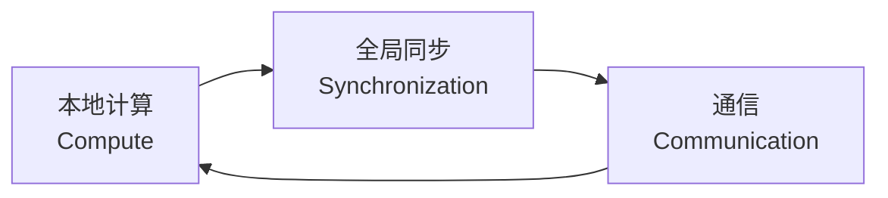
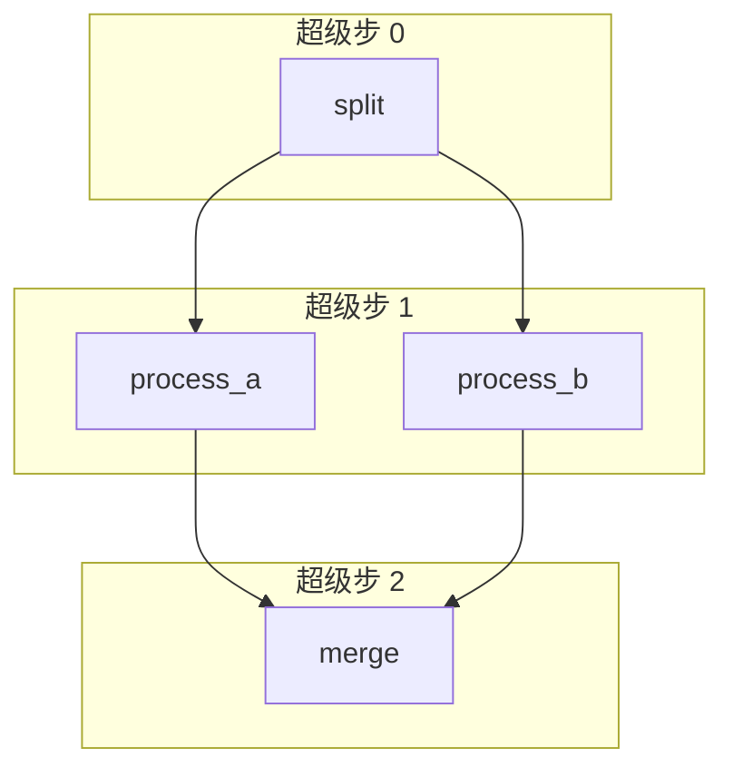
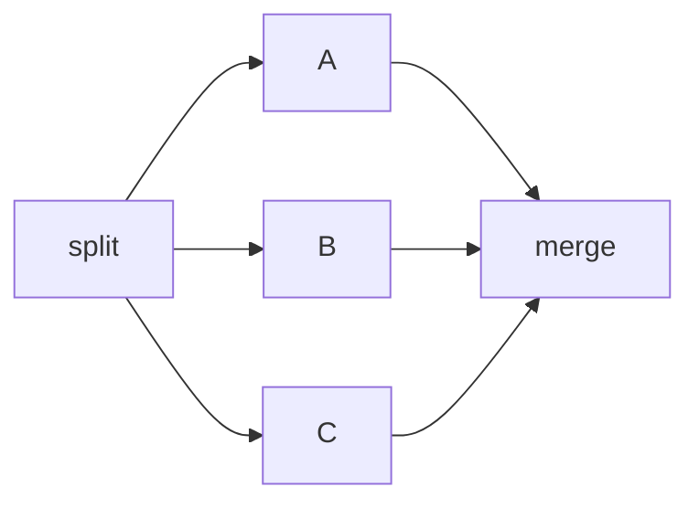
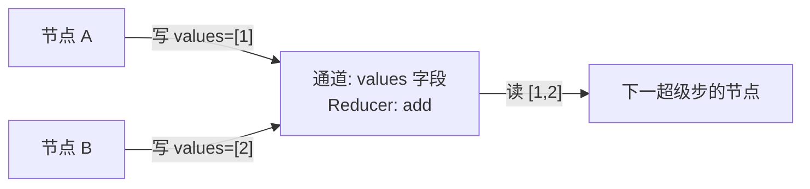
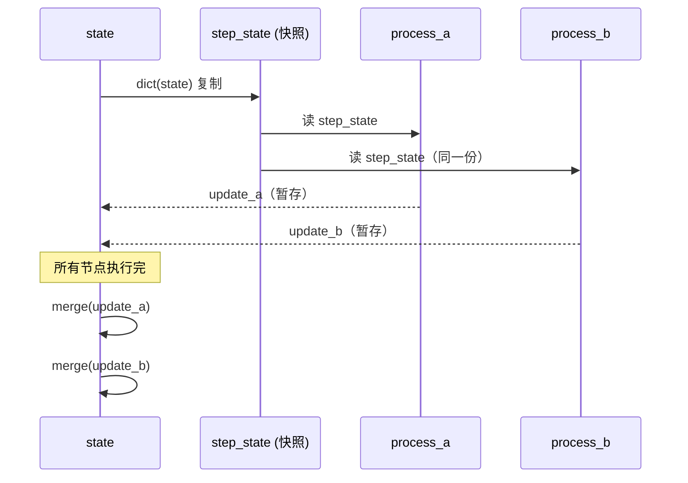

# 阶段 6：Pregel 超级步引擎

> **目标**：把执行模型从"单节点遍历"升级为"超级步并行层"——同层节点并行执行，层间合并。
>
> **git tag**：`stage-6` · **代码**：`CompiledStateGraph.stream` 的超级步循环
>
> **前置条件**：已读完[阶段 5 Reducer](stage_5_reducer.md)，理解 `Annotated[T, reducer]` 与 `_merge` 的覆盖/合并语义。

---

## 0. 一句话总结

> 把 `while current != END` 改成 `while pending:`，让 `pending` 从"一个节点"变成"一层节点集合"，于是图就能 fan-out 出并行层——这就是 Pregel。

---

## 1. 阶段目标

| 维度 | 阶段 5（Reducer） | 阶段 6（Pregel） |
|------|-------------------|------------------|
| 执行循环 | `while current != END`（单节点） | `while pending:`（节点集合） |
| 每步执行 | 1 个节点 | **一层**节点（可多个） |
| 同层关系 | 不存在 | 读同一快照、各自计算、最后合并 |
| 出边 | 每节点最多一条 | **fan-out**：多条出边 → 多个后继 |
| 事件格式 | `{"node": str, ...}` | `{"nodes": set[str], ...}` |
| 后继计算 | `_next_node(node) -> str` | `_next_nodes(pending) -> set[str]` |

本阶段**不改 Reducer、不改条件边语义**，只改"执行循环的形状"——从一根线变成一层一层的并行层。

---

## 2. Google Pregel 论文背景

### 2.1 BSP 模型（Bulk Synchronous Parallel）

Pregel 是 Google 在 2010 年论文《Pregel: A System for Large-Scale Graph Processing》提出的图计算模型，根植于 **BSP（Bulk Synchronous Parallel，整体同步并行）** 模型。

BSP 的三个要素：



1. **本地计算**：每个进程用自己的本地数据算一段
2. **通信**：进程间交换消息（在 Pregel 里就是写通道）
3. **全局同步**：所有进程都到达栅栏（barrier）后才进入下一轮

BSP 的核心契约：**一轮之内，进程之间看不见彼此的更新**。这保证了"逻辑并行"——不管你实际是串行还是并行执行，结果都一样。

### 2.2 超级步（Superstep）

Pregel 把 BSP 的"一轮"叫做**超级步**。整个计算是一串超级步：

```
超级步 0 → 超级步 1 → 超级步 2 → ... → 终止
```

每个超级步里：

- 所有**活跃节点**读上一超级步结束时的全局状态快照
- 各自计算，写出更新
- 超级步结束时，所有更新一次性合并，形成下一超级步的输入

!!! info "Pregel 的关键不变量"
    同一超级步内的节点**互不可见**。节点 A 在超级步 k 写的值，节点 B 在超级步 k 看不到，要到超级步 k+1 才能看到。

### 2.3 为什么图计算用 BSP 而不是异步？

| 模型 | 优点 | 缺点 |
|------|------|------|
| 异步消息传递 | 快、无需等慢节点 | 结果依赖调度顺序，难推理 |
| BSP（Pregel） | 结果确定、易推理、易容错 | 每步要等最慢的节点 |

图算法（PageRank、最短路径、连通分量）天然适合 BSP：每轮所有节点用上一轮的全局状态更新自己。LangGraph 借用了这个模型来表达"一层节点并行执行"。

!!! tip "LangGraph 与 Pregel 的关系"
    LangGraph 的执行引擎名字就叫 `Pregel`。它把"节点"对应到 Pregel 的 vertex，把"状态字段 + Reducer"对应到 Pregel 的 channel。本教学项目正是复刻这一映射。

### 2.4 BSP vs MapReduce vs 数据流

| 模型 | 同步 | 通信 | 典型代表 | 适合 |
|------|------|------|----------|------|
| MapReduce | 每阶段同步 | 框架自动 shuffle | Hadoop | 批处理 ETL |
| BSP（Pregel） | 每超级步同步 | 显式写通道 | Pregel/Giraph/LangGraph | 图算法、Agent 循环 |
| 数据流 | 异步 | 消息队列 | Spark/Flink | 流处理 |

LangGraph 选 BSP 是因为 Agent 的执行模式像图算法：每轮所有活跃节点用上一轮全局状态更新自己，轮间同步。

### 2.5 Pregel 的"顶点活跃性"

Pregel 论文里每个顶点有个 `active` 标志，顶点可以 `vote_to_halt()` 把自己设为 inactive。当所有顶点都 inactive，计算终止。

本项目的对应：`pending` 集合为空就终止。节点不会显式 halt，而是通过**没有后继**（或后继是 END）自然退出 pending。

```python
while pending:          # pending 非空就继续（有活跃节点）
    ...
    pending = self._next_nodes(pending, state)   # 算下一批活跃节点
# pending 为空，终止
```

---

## 3. 超级步概念在本项目的落地

### 3.1 从"单节点遍历"到"超级步并行层"

阶段 4-5 的执行循环：

```python
current = self._entry_point
while current != END:
    update = self._nodes[current](state)
    self._merge(state, update)
    current = self._next_node(current, state)   # 返回单个节点
```

阶段 6 的执行循环：

```python
pending = {self._entry_point}                   # 一层节点的集合
while pending:
    step_state = dict(state)                    # 快照
    updates = []
    for name in sorted(pending):                # 同层所有节点
        updates.append(self._nodes[name](step_state))
    for update in updates:
        self._merge(state, update)              # 合并
    pending = self._next_nodes(pending, state)  # 返回下一层集合
```

变化只有两处：

1. `current: str` → `pending: set[str]`
2. `_next_node` 返回单个 → `_next_nodes` 返回集合

但语义跃迁是巨大的：现在图能表达"一层多个节点并行"。

### 3.2 超级步的可视化



- 超级步 0：执行 `{split}`
- 超级步 1：执行 `{process_a, process_b}`（**同一层**，读同一快照）
- 超级步 2：执行 `{merge}`（收集上一步两个节点的结果）
- 超级步 3：`pending = {}`，循环结束

---

## 4. fan-out：一个节点多条出边

### 4.1 阶段 5 的限制

阶段 5 的 `add_edge` 在 `StateGraph` 里其实已经允许 `dict[str, list[str]]`（看 `self._edges.setdefault(source, []).append(target)`），但执行循环是单节点的，所以多条出边没有意义——`_next_node` 只能返回一个。

### 4.2 阶段 6 的 fan-out

```python
graph.add_edge("split", "process_a")
graph.add_edge("split", "process_b")   # 第二条出边 = fan-out
```

执行完 `split` 后，`_next_nodes` 把两条出边都收进集合：

```python
next_set = set()
for target in self._edges.get("split", []):   # ["process_a", "process_b"]
    if target != END:
        next_set.add(target)
# next_set = {"process_a", "process_b"}
```

于是下一个超级步的 `pending = {"process_a", "process_b"}`，两节点同层执行。

### 4.3 fan-out 的典型场景

| 场景 | 例子 |
|------|------|
| 分发-并行-收集 | split → {a, b} → merge（本阶段示例） |
| 多 Agent 投票 | query → {agent_1, agent_2, agent_3} → vote |
| 多视角检索 | query → {search_web, search_db, search_cache} → merge |
| Map 阶段 | input → {mapper_1, mapper_2, ...} → reducer |

!!! warning "fan-out 不是条件边的多路"
    条件边 `add_conditional_edges` 是"根据状态选**一个**目标"。fan-out 是"**所有**出边都走"。两者正交：一个节点要么有条件边（选一个），要么有静态边（全走）。

### 4.4 fan-out 与 fan-in 的对称



- **fan-out**（分发）：`split` 有多条出边 → 下一超级步多个节点
- **fan-in**（收集）：`merge` 有多条入边 → 上一超级步多个节点都指向它

fan-in 不需要特殊语法，`_next_nodes` 的 set 去重天然处理：`a → merge, b → merge, c → merge` 时，`next_set = {merge}`（去重），merge 只执行一次。

### 4.5 fan-out 的超级步展开

考虑 `split → {a, b, c} → merge`：

| 超级步 | pending | 说明 |
|--------|---------|------|
| 0 | `{split}` | 单节点 |
| 1 | `{a, b, c}` | fan-out 展开成 3 节点同层 |
| 2 | `{merge}` | fan-in 收束回单节点 |

fan-out 把"一个节点"展开成"一层多个节点"，fan-in 把"一层多个节点"收束回"一个节点"。超级步的层就是这种展开-收束的节奏。

---

## 5. `_next_nodes` 方法：返回 set 而非单个节点

完整代码（`graph.py:480-503`）：

```python
def _next_nodes(self, pending: set[str], state: dict[str, Any]) -> set[str]:
    """收集所有 pending 节点的后继，构成下一个超级步。

    - 条件边：路由选一个目标
    - 静态边：所有出边目标都走（fan-out）
    - END 被过滤掉
    """
    next_set: set[str] = set()
    for node in pending:
        if node in self._conditional_edges:
            router, mapping = self._conditional_edges[node]
            label = router(state)
            if label not in mapping:
                raise ValueError(
                    f"节点 '{node}' 的路由返回了未知标签 '{label}'"
                )
            target = mapping[label]
            if target != END:
                next_set.add(target)
        else:
            for target in self._edges.get(node, []):
                if target != END:
                    next_set.add(target)
    return next_set
```

逐行解读：

| 行 | 作用 |
|----|------|
| `next_set: set[str] = set()` | 用 set 自动去重——两个节点都指向 `merge` 时，`merge` 只出现一次 |
| `for node in pending:` | 遍历当前层的每个节点 |
| `if node in self._conditional_edges:` | 该节点有条件边 → 走条件分支 |
| `label = router(state)` | 调路由函数，拿标签 |
| `if label not in mapping:` | 路由返回未知标签 → 报错（防御） |
| `target = mapping[label]` | 标签 → 目标节点 |
| `if target != END: next_set.add(target)` | END 不入集合（END 是终止符） |
| `else: for target in self._edges.get(node, []):` | 静态边：所有出边都走（fan-out） |

!!! tip "为什么用 set 去重"
    考虑 `a → c, b → c`：超级步 k 执行 `{a, b}`，两者都指向 `c`。如果用 list，`c` 会出现两次，下一个超级步会执行两次 `c`——错误。set 自动去重，`c` 只执行一次。

---

## 6. 事件格式变化

阶段 4-5 的事件：

```python
{"node": "loop", "state": {...}, "step": 3}     # 单个节点
```

阶段 6 的事件：

```python
{"nodes": {"process_a", "process_b"}, "state": {...}, "step": 1}   # 一层节点集合
```

`node` → `nodes`（复数 + set 类型）。这是破坏性变更：下游消费事件的地方要改。

!!! warning "如果你在阶段 5 写过 `event["node"]`"
    阶段 6 起要改成 `event["nodes"]`。本项目的示例和测试都已同步更新。

---

## 7. 通道 = 字段 + Reducer 的概念统一

Pregel 论文里有 **channel**（通道）的概念：节点往通道里写消息，下一超级步其他节点从通道读。本项目的对应：

```
Pregel 通道  ⟷  状态的一个字段 + 该字段的 Reducer
```



- **通道** = 状态的一个字段（如 `values`）
- **合并策略** = 该字段的 Reducer（如 `add`）
- 同层多个节点写同一通道，Reducer 决定怎么合

`add` 天然可交换可结合：`add([1], [2]) == add([2], [1]) == [1, 2]`。所以同层节点不管以什么顺序执行，合并结果都一样——这就是"逻辑并行"的数学保证。

!!! question "如果 Reducer 不可交换会怎样？"
    比如 `str.__add__`（字符串拼接）：`"a" + "b" != "b" + "a"`。这时同层节点的合并结果**依赖执行顺序**。本项目用 `sorted(pending)` 保证顺序确定，但语义上这已经不算"真并行"了。真实 LangGraph 在文档里也警告：Reducer 最好可交换。

---

## 8. `step_state` 快照：为什么同层节点要读同一快照

核心代码：

```python
step_state = dict(state)           # 快照本超级步的输入
updates: list[dict[str, Any]] = []
for node_name in sorted(pending):
    update = self._nodes[node_name](step_state)   # 都读同一快照
    updates.append(update)
for update in updates:
    self._merge(state, update)     # 最后合并到 state
```

### 8.1 如果不快照会怎样？

假设不复制，直接传 `state`：

```python
for node_name in sorted(pending):
    update = self._nodes[node_name](state)   # 直接传 state
    self._merge(state, update)               # 立即合并
```

那么 `process_a` 改了 `state["x"]` 后，`process_b` 会看到新的 `state["x"]`。结果依赖 `sorted(pending)` 的顺序——`process_a` 在前和 `process_b` 在前结果不同。这违反了 Pregel 的"同层互不可见"契约。

### 8.2 快照的两步合并



1. **读阶段**：所有节点读 `step_state`（同一份快照），各自算出 update，**不写 state**
2. **写阶段**：所有 update 算完后，依次 `_merge` 进 `state`

这保证同层节点的输入完全一致，输出合并顺序由 `sorted(pending)` 确定（对可交换 Reducer 无关）。

!!! info "BSP 的栅栏就在这里"
    "所有节点执行完"就是 BSP 的 barrier。读阶段是本地计算，写阶段是通信+同步。

---

## 9. `sorted(pending)`：确定性执行顺序

`pending` 是 `set[str]`，迭代顺序在 Python 里是哈希序（对字符串而言，CPython 实现上是不确定的，跨 Python 版本可能不同）。`sorted(pending)` 强制成字典序：

```python
>>> sorted({"process_b", "process_a"})
['process_a', 'process_b']
```

为什么重要：

1. **测试可复现**：同一输入永远同一输出，不会因为 set 迭代顺序飘忽
2. **调试可重现**：bug 不会"偶发"
3. **Reducer 不可交换时的明确语义**：至少顺序是确定的，能推理

!!! tip "真实 LangGraph 怎么做"
    真实 LangGraph 在 Pregel 引擎里也对同层节点排序（按节点名），同样为了确定性。生产里同层节点用 `asyncio.gather` 真并行，但**写通道时仍按确定顺序合并**，所以结果还是确定的。

---

## 10. 完整代码逐行解读

### 10.1 `stream` 方法（`graph.py:326-410`）

```python
def stream(
    self,
    input: dict[str, Any] | None,
    *,
    recursion_limit: int = DEFAULT_RECURSION_LIMIT,
    config: dict[str, Any] | None = None,
) -> Generator[dict[str, Any], None, None]:
```

签名：`input` 可为 `None`（续跑，阶段 7）；`config` 含 `thread_id`（阶段 7）；返回生成器，每个超级步 yield 一个事件。

```python
    thread_id = self._get_thread_id(config)

    if input is None and self._checkpointer and thread_id:
        cp = self._checkpointer.get(thread_id)
        if cp is None:
            raise ValueError(f"thread '{thread_id}' 没有检查点，无法续跑")
        state = dict(cp["state"])
        pending = set(cp["pending"])
        step = cp["step"] + 1
        resuming = True
    else:
        state = dict(input) if input else {}
        pending = {self._entry_point}
        step = 0
        resuming = False
```

| 分支 | 触发条件 | 作用 |
|------|----------|------|
| 续跑 | `input is None` 且有 checkpointer 且有 thread_id | 从检查点恢复 state/pending/step |
| 新跑 | 其他 | state 从 input 复制，pending = 入口，step = 0 |

`resuming` 标志阶段 8 用于跳过 interrupt 检查，本阶段不影响。

```python
    while pending:
        if step >= recursion_limit:
            raise RecursionError(
                f"执行超过 recursion_limit ({recursion_limit}) 步，疑似死循环"
            )
```

主循环：`pending` 非空就继续。`recursion_limit` 防死循环（默认 25）。

```python
        if not resuming and self._interrupt_before and (
            pending & self._interrupt_before
        ):
            if self._checkpointer and thread_id:
                self._checkpointer.put(thread_id, step, dict(state), pending)
            yield {
                "nodes": pending,
                "state": dict(state),
                "step": step,
                "interrupt": "before",
            }
            return
        resuming = False
```

阶段 8 的 `interrupt_before` 检查。本阶段 `_interrupt_before` 是空 set，整段跳过。`resuming = False` 在检查后重置。

```python
        step_state = dict(state)
        updates: list[dict[str, Any]] = []
        for node_name in sorted(pending):
            update = self._nodes[node_name](step_state)
            updates.append(update)
        for update in updates:
            self._merge(state, update)
```

**Pregel 超级步的核心**：

1. `step_state = dict(state)` 快照
2. `for node_name in sorted(pending)`：同层所有节点，按字典序
3. 每个节点读 `step_state`，返回 update，**暂存** `updates` 列表
4. 所有节点算完后，依次 `_merge` 进 `state`

```python
        if self._interrupt_after and (pending & self._interrupt_after):
            next_pending = self._next_nodes(pending, state)
            if self._checkpointer and thread_id:
                self._checkpointer.put(thread_id, step, dict(state), next_pending)
            yield {
                "nodes": pending,
                "state": dict(state),
                "step": step,
                "interrupt": "after",
            }
            return
```

阶段 8 的 `interrupt_after` 检查。本阶段为空，跳过。

```python
        if self._checkpointer and thread_id:
            self._checkpointer.put(thread_id, step, dict(state), pending)
        yield {"nodes": pending, "state": dict(state), "step": step}
        pending = self._next_nodes(pending, state)
        step += 1
```

- 有 checkpointer 就存快照（阶段 7）
- yield 事件：`{"nodes": set, "state": dict, "step": int}`
- 算下一层：`pending = self._next_nodes(pending, state)`
- step 递增

### 10.2 `_next_nodes` 方法（`graph.py:480-503`）

已在第 5 节详述。

### 10.3 `add_edge` 的变化（`graph.py:208-221`）

```python
def add_edge(self, source: str, target: str) -> None:
    if source == START:
        if target not in self._nodes:
            raise ValueError(f"目标节点 '{target}' 不存在")
        self._entry_point = target
        return
    if source not in self._nodes:
        raise ValueError(f"源节点 '{source}' 不存在")
    if target != END and target not in self._nodes:
        raise ValueError(f"目标节点 '{target}' 不存在")
    if source in self._conditional_edges:
        raise ValueError(f"节点 '{source}' 已有条件出边，不能再加静态边")
    self._edges.setdefault(source, []).append(target)   # ← 关键
```

最后一行 `setdefault(source, []).append(target)`：同一 source 多次 `add_edge` 会累积成 list。阶段 1 的 `Graph` 这里是 `self._edges[source] = target`（覆盖，只留一条），阶段 6 的 `StateGraph` 是 append（累积，fan-out）。

!!! info "其实阶段 2-5 的 StateGraph.add_edge 已经是 append"
    没错，`setdefault(...).append(...)` 在阶段 2 就有了。但阶段 2-5 的执行循环是单节点，多条出边没有效果。阶段 6 的 `_next_nodes` 才真正让多条出边生效。

---

## 11. 可运行示例

### 11.1 代码（`examples/stage_6_pregel/run.py`）

```python
from operator import add
from typing import Annotated, TypedDict
from tiny_langgraph import END, START, StateGraph


class State(TypedDict):
    number: int
    doubled: Annotated[list[int], add]      # Reducer: 追加
    shifted: Annotated[list[int], add]      # Reducer: 追加
    combined: int


def main() -> None:
    def split(state: State) -> dict:
        return {}

    def process_a(state: State) -> dict:
        result = state["number"] * 2
        return {"doubled": [result]}

    def process_b(state: State) -> dict:
        result = state["number"] + 100
        return {"shifted": [result]}

    def merge(state: State) -> dict:
        d, s = state["doubled"][-1], state["shifted"][-1]
        return {"combined": d + s}

    graph = StateGraph(State)
    graph.add_node("split", split)
    graph.add_node("process_a", process_a)
    graph.add_node("process_b", process_b)
    graph.add_node("merge", merge)
    graph.add_edge(START, "split")
    graph.add_edge("split", "process_a")    # fan-out
    graph.add_edge("split", "process_b")    # fan-out
    graph.add_edge("process_a", "merge")
    graph.add_edge("process_b", "merge")
    graph.add_edge("merge", END)

    app = graph.compile()
    initial = {"number": 7, "doubled": [], "shifted": [], "combined": 0}

    for event in app.stream(initial):
        print(f"  超级步 {event['step']}: 执行 {event['nodes']}")

    result = app.invoke(initial)
    print(f"最终结果: combined = {result['combined']}")
```

### 11.2 运行

```bash
python -m examples.stage_6_pregel.run
```

### 11.3 输出

```
============================================================
示例：Pregel 超级步 —— 分发-并行-收集
============================================================
图: split -> {process_a, process_b} -> merge
     process_a 和 process_b 在同一超级步并行执行

按超级步执行：
------------------------------------------------------------
  [split] 收到 number=7, 分发到两个处理器
  超级步 0: 执行 {'split'}
  [process_a] 并行执行: 7 * 2 = 14
  [process_b] 并行执行: 7 + 100 = 107
  超级步 1: 执行 {'process_a', 'process_b'}
  [merge] 收集并行结果: 14 + 107 = 121
  超级步 2: 执行 {'merge'}

最终结果: combined = 121
  (doubled=[14], shifted=[107])

============================================================
关键观察：Pregel 超级步
============================================================
  - 超级步 0: split（1 个节点）
  - 超级步 1: process_a + process_b（2 个节点并行，读同一快照）
  - 超级步 2: merge（收集并行结果）
  - fan-out: split 有两条出边 -> process_a 和 process_b
  - 同层节点读同一状态快照，互不影响，最后用 Reducer 合并
```

### 11.4 逐步追踪

| 超级步 | pending | step_state | 各节点输出 | 合并后 state |
|--------|---------|------------|------------|--------------|
| 0 | `{split}` | `{number:7,...}` | `split → {}` | 不变 |
| 1 | `{process_a, process_b}` | `{number:7,...}` | `a → {doubled:[14]}`, `b → {shifted:[107]}` | `doubled:[14], shifted:[107]` |
| 2 | `{merge}` | `{doubled:[14], shifted:[107]}` | `merge → {combined:121}` | `combined:121` |
| 3 | `{}`（END 过滤） | — | — | 循环结束 |

注意超级步 1：`process_a` 和 `process_b` 都读 `step_state`（`number=7`），互不影响。合并时 `doubled` 用 `add` Reducer 追加 `[14]`，`shifted` 用 `add` 追加 `[107]`。

### 11.5 第二个示例：多 Agent 投票

```python
from operator import add
from typing import Annotated, TypedDict
from tiny_langgraph import END, START, StateGraph


class VoteState(TypedDict):
    question: str
    votes: Annotated[list[str], add]   # 收集各 Agent 的票
    tally: dict[str, int]
    winner: str


def main() -> None:
    def ask(state: VoteState) -> dict:
        return {}   # 分发问题

    def agent_a(state: VoteState) -> dict:
        return {"votes": ["A"]}   # Agent A 投 A

    def agent_b(state: VoteState) -> dict:
        return {"votes": ["B"]}   # Agent B 投 B

    def agent_c(state: VoteState) -> dict:
        return {"votes": ["A"]}   # Agent C 投 A

    def tally(state: VoteState) -> dict:
        counts: dict[str, int] = {}
        for v in state["votes"]:
            counts[v] = counts.get(v, 0) + 1
        winner = max(counts, key=counts.get)
        return {"tally": counts, "winner": winner}

    graph = StateGraph(VoteState)
    graph.add_node("ask", ask)
    graph.add_node("agent_a", agent_a)
    graph.add_node("agent_b", agent_b)
    graph.add_node("agent_c", agent_c)
    graph.add_node("tally", tally)
    graph.add_edge(START, "ask")
    graph.add_edge("ask", "agent_a")
    graph.add_edge("ask", "agent_b")
    graph.add_edge("ask", "agent_c")
    graph.add_edge("agent_a", "tally")
    graph.add_edge("agent_b", "tally")
    graph.add_edge("agent_c", "tally")
    graph.add_edge("tally", END)

    app = graph.compile()
    result = app.invoke({"question": "选谁?", "votes": [], "tally": {}, "winner": ""})
    print(result["tally"])   # {"A": 2, "B": 1}
    print(result["winner"])  # A
```

| 超级步 | pending | 说明 |
|--------|---------|------|
| 0 | `{ask}` | 分发问题 |
| 1 | `{agent_a, agent_b, agent_c}` | 三个 Agent 并行投票，都写 `votes` 通道 |
| 2 | `{tally}` | 收集所有票，统计 |

三个 Agent 都写 `votes` 字段（同一通道），Reducer `add` 把 `["A"]`、`["B"]`、`["A"]` 合成 `["A", "B", "A"]`。这就是"通道 = 字段 + Reducer"的威力——同层多节点写同一通道，自动合并。

---

## 12. 测试解读

### 12.1 `test_pregel.py` 全貌

```python
class TestFanOut:
    """一个节点多条出边 → fan-out 并行。"""

    def test_fan_out_parallel(self) -> None: ...
    def test_parallel_nodes_read_same_snapshot(self) -> None: ...
    def test_superstep_events_show_parallel(self) -> None: ...
    def test_multiple_edges_allowed(self) -> None: ...

class TestSuperstepSemantics:
    """超级步语义。"""

    def test_reducer_merges_parallel_updates(self) -> None: ...
```

### 12.2 `test_fan_out_parallel`

```python
def test_fan_out_parallel(self) -> None:
    graph = StateGraph(State)
    graph.add_node("split", lambda s: {})
    graph.add_node("process_a", lambda s: {"result_a": [s["input"] * 2]})
    graph.add_node("process_b", lambda s: {"result_b": [s["input"] + 100]})
    graph.add_node("merge", lambda s: {"final": s["result_a"][-1] + s["result_b"][-1]})
    graph.add_edge(START, "split")
    graph.add_edge("split", "process_a")
    graph.add_edge("split", "process_b")
    graph.add_edge("process_a", "merge")
    graph.add_edge("process_b", "merge")
    graph.add_edge("merge", END)

    result = graph.compile().invoke(
        {"input": 5, "result_a": [], "result_b": [], "final": 0}
    )
    assert result["result_a"] == [10]
    assert result["result_b"] == [105]
    assert result["final"] == 115
```

验证 fan-out 的端到端正确性：`5*2 + (5+100) = 115`。

### 12.3 `test_parallel_nodes_read_same_snapshot`

```python
def test_parallel_nodes_read_same_snapshot(self) -> None:
    """同层节点读同一快照，互不影响。"""
    graph.add_node("src", lambda s: {"input": 10})
    graph.add_node("a", lambda s: {"result_a": [s["input"]]})  # 读 input=10
    graph.add_node("b", lambda s: {"result_b": [s["input"]]})  # 也读 input=10
    graph.add_edge(START, "src")
    graph.add_edge("src", "a")
    graph.add_edge("src", "b")
    ...
    assert result["result_a"] == [10]
    assert result["result_b"] == [10]
```

**关键测试**：`src` 在超级步 0 把 `input` 改成 10。`a` 和 `b` 在超级步 1 都读 `input`，都该看到 10。如果没快照，`a` 先执行改了某字段，`b` 可能受影响（这里 `a` 没改 `input`，所以即使不快照也碰巧过——但语义上快照才对）。

### 12.4 `test_superstep_events_show_parallel`

```python
def test_superstep_events_show_parallel(self) -> None:
    ...
    events = list(graph.compile().stream(...))
    assert events[0]["nodes"] == {"split"}
    assert events[1]["nodes"] == {"a", "b"}  # 并行层
```

验证事件格式：`nodes` 是 set，且同层节点在同一事件里。

### 12.5 `test_multiple_edges_allowed`

```python
def test_multiple_edges_allowed(self) -> None:
    """阶段 6 允许一个节点多条出边。"""
    graph.add_edge("a", "b")
    graph.add_edge("a", "c")  # 不报错
    assert graph._edges["a"] == ["b", "c"]
```

验证 `add_edge` 累积而非覆盖。

### 12.6 `test_reducer_merges_parallel_updates`

```python
def test_reducer_merges_parallel_updates(self) -> None:
    """同层两个节点都写同一 Reducer 字段，合并。"""
    class S(TypedDict):
        values: Annotated[list[int], add]

    graph.add_node("src", lambda s: {})
    graph.add_node("a", lambda s: {"values": [1]})
    graph.add_node("b", lambda s: {"values": [2]})
    graph.add_edge(START, "src")
    graph.add_edge("src", "a")
    graph.add_edge("src", "b")
    ...
    result = graph.compile().invoke({"values": []})
    assert result["values"] == [1, 2]
```

**通道合并的核心测试**：`a` 和 `b` 都写 `values` 字段（同一通道），Reducer `add` 把 `[1]` 和 `[2]` 合成 `[1, 2]`。如果用覆盖合并，后写的会覆盖先写的，结果只剩 `[2]`——错。

---

## 13. 对照真实 LangGraph 的 Pregel 引擎

| 真实 LangGraph | 我们的阶段 6 | 说明 |
|----------------|-------------|------|
| `Pregel` 类 | `CompiledStateGraph` | 同一角色：编译后的执行器 |
| `Pregel.step` 超级步循环 | `while pending:` | 核心语义一致 |
| `Channel` 对象 | 字段 + Reducer | 概念统一，实现简化 |
| `asyncio.gather` 真并行 | `for name in sorted(pending)` 串行 | 教学简化，语义并行 |
| `Send` API（动态 fan-out） | ❌ | 我们用静态多条边 |
| `Command` 对象（节点返回路由指令） | ❌ | 我们用条件边 |
| 批处理调度（batch） | ❌ | 单次执行 |
| `Writer` / `Reader` 通道抽象 | 直接 dict + Reducer | 简化 |
| 优先级队列（节点排序） | `sorted(pending)` | 简化版 |
| 持久化通道（Channel persistence） | ❌（阶段 7 才有 checkpoint） | |

!!! info "真实 LangGraph 的 Pregel 源码"
    在 `langgraph.pregel.Pregel` 类里，`step` 方法是超级步循环。每个 channel 有 `Writer` 和 `Reader`，节点通过 Writer 写通道，下一超级步通过 Reader 读。同层节点用 `asyncio.gather` 并行执行，但写通道时按确定顺序合并——和我们的 `sorted(pending)` + 串行合并是同一思路的简化。

---

## 14. 从阶段 5 到阶段 6 的 diff 解读

```bash
git diff stage-5 stage-6 --stat
```

```
 docs/stages/stage_6_pregel.md       | 158 +++++++++++++++++++++++++++++++++---
 examples/stage_6_pregel/__init__.py |   0
 examples/stage_6_pregel/run.py      |  92 +++++++++++++++++++++
 src/tiny_langgraph/__init__.py      |   4 +-
 src/tiny_langgraph/graph.py         |  89 +++++++++++++-------
 tests/tiny_langgraph/test_cycle.py  |   4 +-
 tests/tiny_langgraph/test_pregel.py | 106 ++++++++++++++++++++++++
 7 files changed, 409 insertions(+), 44 deletions(-)
```

### 14.1 `graph.py` 的核心改动

```bash
git diff stage-5 stage-6 -- src/tiny_langgraph/graph.py
```

关键 hunk：

```diff
-        current: str = self._entry_point
-        step = 0
-        while current is not None and current != END:
+        pending = {self._entry_point}
+        step = 0
+        while pending:
             ...
-            update = self._nodes[current](state)
-            self._merge(state, update)
+            step_state = dict(state)
+            updates: list[dict[str, Any]] = []
+            for node_name in sorted(pending):
+                update = self._nodes[node_name](step_state)
+                updates.append(update)
+            for update in updates:
+                self._merge(state, update)
             ...
-            yield {"node": current, "state": dict(state), "step": step}
-            current = self._next_node(current, state)
+            yield {"nodes": pending, "state": dict(state), "step": step}
+            pending = self._next_nodes(pending, state)
             step += 1
```

以及新增 `_next_nodes` 方法（替换 `_next_node`）。

### 14.2 `test_cycle.py` 的小改

阶段 4 的循环测试用 `event["node"]`，阶段 6 改成 `event["nodes"]`：

```diff
-        assert events[0]["node"] == "loop"
+        assert events[0]["nodes"] == {"loop"}
```

### 14.3 新增 `test_pregel.py`

106 行新测试，覆盖 fan-out、快照、事件格式、多出边、Reducer 合并。

### 14.4 新增 `examples/stage_6_pregel/run.py`

92 行可运行示例。

---

## 15. 设计思考：为什么不是真并行（asyncio）

### 15.1 教学清晰

Pregel 的核心是**快照语义**（同层互不可见 + 层间合并），不是线程。用串行 + 快照就能完整表达这个语义。引入 `asyncio` 会把注意力分散到 `async/await`、事件循环、协程调度上，对理解 Pregel 没帮助。

### 15.2 确定性

`sorted(pending)` 串行执行，结果**完全确定**。`asyncio.gather` 虽然也按提交顺序合并，但执行顺序不可控，调试时难复现。教学项目要的是"每次跑都一样"。

### 15.3 GIL

Python 的 `asyncio` 是单线程协程，对 CPU 密集型节点（纯计算）没有真并行收益——GIL 还在。只有 I/O 密集型（如调 LLM API）才受益。本教学项目节点都是纯函数，`asyncio` 价值有限。

### 15.4 真实 LangGraph 的选择

真实 LangGraph 用 `asyncio` 是因为节点常是 `async def`（调 LLM API、查数据库），I/O 密集。它用 `asyncio.gather` 让同层节点的 I/O 并行（一个等 API 时另一个也能等），但**写通道仍按确定顺序合并**——所以语义上和我们的串行一样，只是 I/O 并行。

??? question "如果要加真并行怎么改"
    1. 节点签名改成 `async def`
    2. `for name in sorted(pending)` 改成 `await asyncio.gather(*[self._nodes[name](step_state) for name in sorted(pending)])`
    3. `stream` 改成 `async def`，调用方 `async for event in app.astream(...)`
    4. 合并阶段仍按 `sorted(pending)` 顺序 `_merge`，保证确定性

    本项目保持同步是为了让初学者专注 Pregel 语义。

### 15.5 为什么不用多线程/多进程

| 方案 | 问题 |
|------|------|
| `threading` | GIL 限制 CPU 并行；I/O 并行但共享 state 要加锁，复杂 |
| `multiprocessing` | state 要序列化跨进程，开销大；教学项目过重 |
| `asyncio` | 单线程协程，I/O 并行无锁，但要求节点 async |
| 串行 | 最简单，语义清晰，确定性强 |

教学项目选串行：最少的概念，最清晰的语义。

---

## 16. 性能与复杂度分析

### 16.1 每超级步的开销

| 操作 | 复杂度 | 说明 |
|------|--------|------|
| `step_state = dict(state)` | O(\|state\|) | 浅拷贝整个 state |
| `for name in sorted(pending)` | O(\|pending\| log \|pending\|) | 排序 |
| 节点执行 | 取决于节点 | 同层所有节点 |
| `_merge` | O(\|update\|) | 每个字段一次合并 |
| `_next_nodes` | O(\|pending\| × 平均出边数) | 收集后继 |

### 16.2 浅拷贝的代价

`step_state = dict(state)` 每超级步复制一次 state。对大 state（如长对话历史）这是 O(n)。真实 LangGraph 用通道版本号避免全量复制——只复制被写的通道。本项目简化为全量浅拷贝。

### 16.3 何时浅拷贝成为瓶颈

- state 有几万条消息：每步复制几万元素
- 超级步很多（如循环 1000 次）：1000 × 几万 = 几千万次拷贝

这时该上真实 LangGraph 的通道增量更新。教学项目不优化。

---

## 17. 调试技巧

### 17.1 打印每超级步的 pending 和 state

```python
for event in app.stream(initial):
    print(f"step {event['step']}: pending={event['nodes']}")
    print(f"  state={event['state']}")
```

能看到超级步的层结构和状态演变。

### 17.2 检查 fan-out 是否生效

如果期望同层多节点但事件显示单节点：

```python
assert event["nodes"] == {"a", "b"}, f"fan-out 没生效: {event['nodes']}"
```

常见原因：`add_edge` 写错，或用了条件边（条件边只选一个）。

### 17.3 检查快照隔离

如果同层节点互相影响（后执行的看到前执行的更新），说明快照失效。测试：

```python
def test_snapshot_isolation():
    # a 改 x，b 读 x
    # 如果 b 读到 a 改后的 x，说明没快照
    ...
```

本项目的 `test_parallel_nodes_read_same_snapshot` 就是这个测试。

### 17.4 Reducer 不可交换时的顺序

如果 Reducer 不可交换（如字符串拼接），结果依赖 `sorted(pending)` 顺序。调试时打印合并顺序：

```python
for name in sorted(pending):
    update = self._nodes[name](step_state)
    print(f"  {name} -> {update}")   # 看合并顺序
    updates.append(update)
```

---

## 18. 常见误区

### 18.1 "同层节点并行 = 同时执行"

**错**。同层节点**逻辑并行**（互不可见），但**物理上可能串行**。本项目就是串行。真实 LangGraph 用 asyncio 也是单线程协程，不是多线程。

### 18.2 "fan-out 后的节点一定并行"

**不一定**。fan-out 出的多个后继在**同一超级步**执行（逻辑并行）。但如果这些后继又都指向同一个节点，那个节点只执行一次（set 去重）。

### 18.3 "同层节点写不同字段就不需要 Reducer"

**对**。如果 `process_a` 只写 `doubled`，`process_b` 只写 `shifted`，两字段不同，没有 Reducer 也安全（覆盖合并，但没人竞争同一字段）。Reducer 只在**多节点写同一字段**时才必要。但给字段加 Reducer（如 `add`）是无害的，且为未来扩展留余地。

### 18.4 "快照 = 深拷贝"

**不是**。`dict(state)` 是**浅拷贝**——顶层 dict 是新的，但值是引用。如果节点修改了 `state["messages"].append(...)`（原地改），会泄漏到快照。本项目节点都返回新 list（如 `{"doubled": [result]}`），不原地改，所以浅拷贝够用。真实 LangGraph 用更严格的通道隔离。

!!! warning "别在节点里原地改 state 的值"
    错误示范：`state["messages"].append(msg); return {}`。正确示范：`return {"messages": [msg]}`，让引擎用 Reducer 合并。

---

## 19. 阶段 6 的局限

| 局限 | 谁来解决 |
|------|----------|
| 挂了不能续跑，没有执行历史 | 阶段 7 Checkpoint |
| 不能暂停等人输入 | 阶段 8 Interrupt |
| 同层节点串行，I/O 不并行 | 不解决（教学简化） |
| 没有动态 fan-out（运行时决定分发到谁） | 不解决（用条件边近似） |

---

## 20. 小结

阶段 6 把执行模型从"一根线"升级为"一层一层的并行层"：

1. `pending` 从 `str` 变 `set[str]`
2. `_next_nodes` 返回集合，静态边全走（fan-out）
3. 同层节点读 `step_state` 快照，互不可见
4. 合并按 `sorted(pending)` 顺序，对可交换 Reducer 无关
5. 事件格式 `node` → `nodes`

这一步让图能表达 MapReduce、多 Agent 投票、多视角检索等"分发-并行-收集"模式，是走向真实 Agent 框架的关键一跃。

---

👉 下一阶段：[阶段 7 - Checkpoint](stage_7_checkpoint.md)——每个超级步存快照，支持断点续跑和时间旅行。
