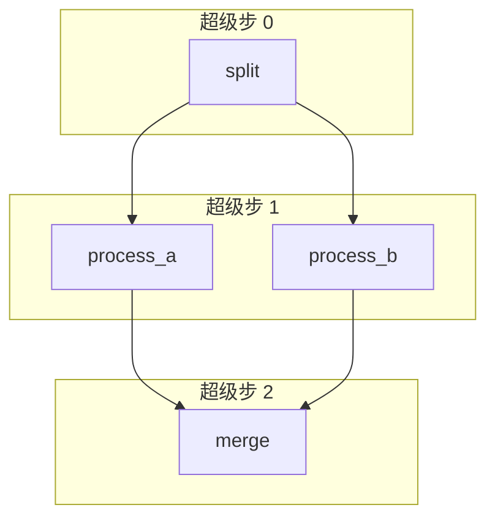

# 阶段 6：Pregel 超级步引擎

> **目标**：把执行模型从"单节点遍历"升级为"超级步并行层"——同层节点并行执行，层间合并。
>
> **git tag**：`stage-6` · **代码**：`CompiledStateGraph.stream` 的超级步循环

## 这一阶段做了什么

### 1. 执行模型升级



| | 阶段 4-5 | 阶段 6 |
|---|---|---|
| 执行循环 | `while current != END`（单节点） | `while pending:`（节点集合） |
| 每步执行 | 1 个节点 | **一层**节点（可多个） |
| 同层关系 | 不存在 | 读同一快照、各自计算、最后合并 |
| 出边 | 每节点最多一条 | **fan-out**：多条出边 → 多个后继 |

### 2. fan-out：一个节点多条出边

```python
graph.add_edge("split", "process_a")
graph.add_edge("split", "process_b")   # 第二条出边 = fan-out
```

执行完 `split` 后，`process_a` 和 `process_b` 在**同一超级步**执行。

### 3. 同层节点读同一快照

这是 Pregel 的核心语义：

```python
step_state = dict(state)           # 快照本超级步的输入
updates = []
for node_name in sorted(pending):
    update = self._nodes[node_name](step_state)   # 都读同一快照
    updates.append(update)
for update in updates:
    self._merge(state, update)     # 最后合并
```

`process_a` 和 `process_b` 都读超级步开始的状态，**互不影响**。即使 `process_a` 改了某字段，`process_b` 看到的还是旧值。合并发生在所有节点执行完之后。

**为什么这样？** 如果串行执行且第二个节点读第一个节点的更新，结果依赖执行顺序——不并行就不安全。Pregel 的快照语义保证：同层节点**逻辑并行**，结果与执行顺序无关。

### 4. 通道 = 字段 + Reducer

阶段 5 的 Reducer 和阶段 6 的超级步在这里统一：

```
节点 ──写──▶ [通道: 字段 + Reducer] ──读──▶ 节点
```

- **通道**就是状态的一个字段
- **Reducer** 就是通道的合并策略
- 同层多个节点写同一通道，Reducer 决定怎么合（`add` 天然可交换可结合，合并顺序无关）

## 代码走读

=== "超级步循环"
    ```python
    def stream(self, input, *, recursion_limit=25):
        state = dict(input)
        pending = {self._entry_point}      # 超级步 0：入口
        step = 0
        while pending:                      # 还有节点要执行
            step_state = dict(state)        # 快照
            updates = []
            for name in sorted(pending):    # 同层所有节点
                updates.append(self._nodes[name](step_state))
            for update in updates:
                self._merge(state, update)  # 合并
            yield {"nodes": pending, "state": dict(state), "step": step}
            pending = self._next_nodes(pending, state)  # 下一层
            step += 1
    ```

=== "收集后继"
    ```python
    def _next_nodes(self, pending, state):
        next_set = set()
        for node in pending:
            if node in self._conditional_edges:
                target = mapping[router(state)]   # 条件边选一个
            else:
                for target in self._edges.get(node, []):  # 静态边全走
                    next_set.add(target)
        return next_set
    ```

## 运行示例

```bash
python -m examples.stage_6_pregel.run
```

输出：
```
按超级步执行：
  超级步 0: 执行 {'split'}
  超级步 1: 执行 {'process_a', 'process_b'}
  超级步 2: 执行 {'merge'}

最终结果: combined = 121
  (doubled=[14], shifted=[107])
```

## 关于"并行"

本阶段同层节点**串行执行**（`for name in sorted(pending)`），但**读同一快照**，所以**语义上并行**——结果与执行顺序无关。

真实 LangGraph 用 `asyncio` 做真并行。我们保持串行是为了：

1. 教学清晰——Pregel 的核心是**快照语义**，不是线程
2. 确定性——`sorted(pending)` 保证执行顺序稳定，便于测试和调试
3. GIL——Python 的真并行对 CPU 密集型意义有限

## 对照真实 LangGraph

| 真实 LangGraph | 我们的阶段 6 | 说明 |
|----------------|-------------|------|
| Pregel 超级步循环 | 同 | 核心语义一致 |
| 通道（Channel） | 字段 + Reducer | 概念统一 |
| `asyncio` 真并行 | 串行（语义并行） | 教学简化 |
| `Send` API（动态 fan-out） | ❌ | 我们用静态多条边 |
| 批处理调度 | ❌ | |

## 这一阶段的局限

| 局限 | 谁来解决 |
|------|----------|
| 挂了不能续跑，没有执行历史 | 阶段 7 Checkpoint |
| 不能暂停等人输入 | 阶段 8 Interrupt |

---

👉 下一阶段：[阶段 7 - Checkpoint](stage_7_checkpoint.md)——每个超级步存快照，支持断点续跑和时间旅行。
