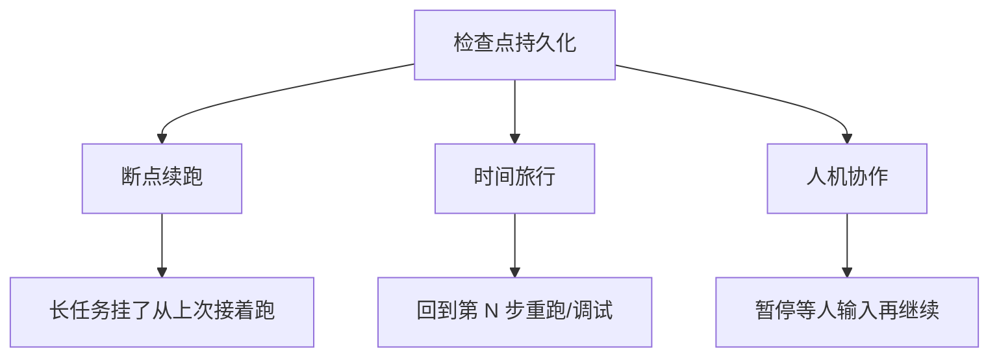
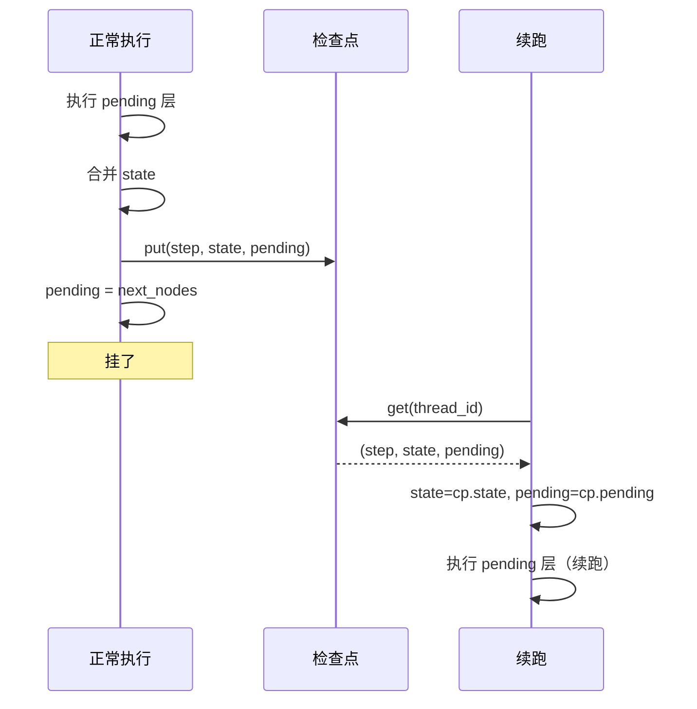

# 阶段 7：Checkpoint 持久化

> **目标**：每个超级步存一个状态快照，支持断点续跑和时间旅行。
>
> **git tag**：`stage-7` · **代码**：`src/tiny_langgraph/checkpoint.py` + `graph.py` 的检查点逻辑
>
> **前置条件**：已读完[阶段 6 Pregel](stage_6_pregel.md)，理解超级步、`pending` 集合、`step` 计数。

---

## 0. 一句话总结

> 给每个超级步拍一张快照 `(thread_id, step, state, pending)`，挂了能续跑，回看能时间旅行，暂停能等人输入。

---

## 1. 阶段目标

| 维度 | 阶段 6（Pregel） | 阶段 7（Checkpoint） |
|------|------------------|----------------------|
| 执行历史 | 不保留，yield 完就丢 | 每步存快照 |
| 挂了 | 重跑 | 从检查点续跑 |
| 回看 | 不行 | `get_state_history` 时间旅行 |
| 标识 | 无 | `thread_id`（一次会话） |
| 续跑 API | 无 | `invoke(None, config)` |
| 存储 | 无 | `MemorySaver` / `SqliteSaver` |

本阶段**不改超级步语义**，只在每个超级步后加一行 `put(...)`，并在 `input=None` 时从检查点恢复。

---

## 2. 为什么需要检查点

### 2.1 三个核心场景



#### 断点续跑

一个 Agent 循环 100 次才收敛。跑到第 60 次机器挂了。没有检查点 → 从头重来。有检查点 → 从第 60 次接着跑。

#### 时间旅行

Agent 给了答案但你发现它在第 5 步走错了分支。`get_state_history` 列出每步状态，回到第 5 步，改个输入重跑——这就是"时间旅行"。

#### 人机协作（阶段 8 的基础）

Agent 提了一个方案，要等人类审批。审批可能要几小时。检查点存住"等待审批"的状态，人类批了再 `invoke(None, config)` 续跑。

### 2.2 为什么不能只靠 stream 的事件

阶段 6 的 `stream` yield 事件，调用方可以自己收集。但：

| 问题 | 检查点怎么解决 |
|------|----------------|
| 事件在调用方内存，进程挂就没了 | 检查点可存磁盘（SqliteSaver） |
| 事件没有 `pending`，只有 `state` | 检查点存 `pending`，能续跑 |
| 事件没有 `thread_id`，多会话混 | 检查点按 `thread_id` 隔离 |
| 事件是 yield 的，不能"回到第 N 步" | `get_at(thread_id, step)` 随机访问 |

---

## 3. `BaseCheckpointSaver` 接口

`checkpoint.py:26-53`：

```python
class BaseCheckpointSaver:
    """检查点存储接口。

    检查点是一个 dict：{"thread_id", "step", "state", "pending"}。
    pending 是下一步要执行的节点集合（续跑的关键）。
    """

    def put(self, thread_id, step, state, pending) -> None:
        """存一个检查点。"""
        raise NotImplementedError

    def get(self, thread_id) -> dict[str, Any] | None:
        """取该 thread 最新的检查点。"""
        raise NotImplementedError

    def get_at(self, thread_id, step) -> dict[str, Any] | None:
        """取该 thread 指定步的检查点。"""
        raise NotImplementedError

    def list(self, thread_id) -> Iterator[dict[str, Any]]:
        """按步数升序列出该 thread 的所有检查点。"""
        raise NotImplementedError
```

四个方法：

| 方法 | 作用 | 用在哪 |
|------|------|--------|
| `put` | 存一个快照 | 每个超级步后 |
| `get` | 取最新快照 | 续跑时 |
| `get_at` | 取指定步快照 | 时间旅行到具体步 |
| `list` | 列全部快照 | `get_state_history` |

### 3.1 检查点的数据结构

```python
def _make_checkpoint(thread_id, step, state, pending) -> dict[str, Any]:
    return {
        "thread_id": thread_id,
        "step": step,
        "state": state,
        "pending": pending,
    }
```

一个四元组：

| 字段 | 类型 | 含义 |
|------|------|------|
| `thread_id` | `str` | 一次会话的标识 |
| `step` | `int` | 第几个超级步 |
| `state` | `dict` | 该步执行完的完整状态 |
| `pending` | `set[str]` | 续跑时要执行的节点集合 |

---

## 4. `MemorySaver`：内存存储，开发调试

`checkpoint.py:67-92`：

```python
class MemorySaver(BaseCheckpointSaver):
    """内存检查点存储。

    用 dict[thread_id, list[checkpoint]] 存储。进程结束即丢失。
    适合开发调试和单元测试。
    """

    def __init__(self) -> None:
        self._storage: dict[str, list[dict[str, Any]]] = {}

    def put(self, thread_id, step, state, pending) -> None:
        history = self._storage.setdefault(thread_id, [])
        history.append(_make_checkpoint(thread_id, step, state, pending))

    def get(self, thread_id) -> dict[str, Any] | None:
        history = self._storage.get(thread_id, [])
        return history[-1] if history else None

    def get_at(self, thread_id, step) -> dict[str, Any] | None:
        for cp in self._storage.get(thread_id, []):
            if cp["step"] == step:
                return cp
        return None

    def list(self, thread_id) -> Iterator[dict[str, Any]]:
        yield from self._storage.get(thread_id, [])
```

存储结构：`dict[thread_id, list[checkpoint]]`。每个 thread 一个 list，按 `put` 顺序追加。

| 方法 | 实现 | 复杂度 |
|------|------|--------|
| `put` | `setdefault` 拿到 list，`append` | O(1) |
| `get` | 取 list 的 `[-1]`（最新） | O(1) |
| `get_at` | 遍历找 `step` 匹配的 | O(n) |
| `list` | `yield from` 整个 list | O(n) |

!!! tip "为什么用 list 而不是 dict[step, checkpoint]"
    list 保留写入顺序，`get` 取 `[-1]` 就是最新，O(1)。dict 也能做但 `get` 要先算 max(step)。list 的 `get_at` 是 O(n)，但时间旅行不频繁，可接受。

---

## 5. `SqliteSaver`：SQLite 持久化，跨进程续跑

`checkpoint.py:95-163`：

```python
class SqliteSaver(BaseCheckpointSaver):
    """SQLite 检查点存储。

    用 sqlite3 持久化到磁盘。进程结束仍保留，支持跨进程续跑。

    Args:
        path: SQLite 数据库文件路径。":memory:" 为内存数据库。
    """

    def __init__(self, path: str) -> None:
        self._conn = sqlite3.connect(path)
        self._conn.execute(
            """
            CREATE TABLE IF NOT EXISTS checkpoints (
                thread_id TEXT NOT NULL,
                step      INTEGER NOT NULL,
                state     TEXT NOT NULL,
                pending   TEXT NOT NULL,
                PRIMARY KEY (thread_id, step)
            )
            """
        )
        self._conn.commit()
```

### 5.1 表结构

| 列 | 类型 | 说明 |
|----|------|------|
| `thread_id` | TEXT | 会话标识 |
| `step` | INTEGER | 超级步序号 |
| `state` | TEXT | JSON 序列化的状态 |
| `pending` | TEXT | JSON 序列化的节点列表 |

主键 `(thread_id, step)`：同一 thread 同一 step 只存一份（`INSERT OR REPLACE`）。

### 5.2 `put`：序列化与存储

```python
def put(self, thread_id, step, state, pending) -> None:
    self._conn.execute(
        "INSERT OR REPLACE INTO checkpoints VALUES (?, ?, ?, ?)",
        (
            thread_id,
            step,
            json.dumps(state, ensure_ascii=False),
            json.dumps(sorted(pending), ensure_ascii=False),
        ),
    )
    self._conn.commit()
```

- `state`：`json.dumps` 序列化（dict → JSON 字符串）
- `pending`：`sorted(pending)` 转 list 再 `json.dumps`（set 不能直接 JSON 序列化，先转 list）
- `INSERT OR REPLACE`：同 (thread_id, step) 覆盖
- `commit`：立即落盘

### 5.3 `_row_to_checkpoint`：反序列化

```python
def _row_to_checkpoint(self, row) -> dict[str, Any]:
    thread_id, step, state_json, pending_json = row
    return {
        "thread_id": thread_id,
        "step": step,
        "state": json.loads(state_json),
        "pending": set(json.loads(pending_json)),   # list → set
    }
```

`pending` 反序列化时 `set(json.loads(...))` 把 list 转回 set。

### 5.4 `get` / `get_at` / `list`

```python
def get(self, thread_id) -> dict[str, Any] | None:
    row = self._conn.execute(
        "SELECT * FROM checkpoints WHERE thread_id=? ORDER BY step DESC LIMIT 1",
        (thread_id,),
    ).fetchone()
    return self._row_to_checkpoint(row) if row else None

def get_at(self, thread_id, step) -> dict[str, Any] | None:
    row = self._conn.execute(
        "SELECT * FROM checkpoints WHERE thread_id=? AND step=?",
        (thread_id, step),
    ).fetchone()
    return self._row_to_checkpoint(row) if row else None

def list(self, thread_id) -> Iterator[dict[str, Any]]:
    rows = self._conn.execute(
        "SELECT * FROM checkpoints WHERE thread_id=? ORDER BY step ASC",
        (thread_id,),
    ).fetchall()
    for row in rows:
        yield self._row_to_checkpoint(row)
```

| 方法 | SQL |
|------|-----|
| `get` | `ORDER BY step DESC LIMIT 1`（最新） |
| `get_at` | `WHERE step=?`（指定步） |
| `list` | `ORDER BY step ASC`（升序全部） |

### 5.5 跨进程续跑

```python
def close(self) -> None:
    self._conn.close()
```

`SqliteSaver` 写磁盘，进程结束后再开一个 `SqliteSaver(path)` 能读到之前的数据——这就是跨进程续跑。

!!! info "为什么用 SQLite 不用 JSON 文件"
    1. **并发安全**：SQLite 有文件锁，多进程同时写不会坏
    2. **索引**：`get` 用 `ORDER BY step DESC LIMIT 1` 走索引，O(log n)；JSON 文件要全读再找
    3. **增量写**：`put` 只写一行，不重写整个文件
    4. **标准库**：`sqlite3` 是 Python 内置，零依赖

---

## 6. 检查点格式：`{thread_id, step, state, pending}`

### 6.1 `thread_id`：一次会话的标识

```python
config = {"configurable": {"thread_id": "run-1"}}
app.invoke({"count": 0}, config=config)
```

`thread_id` 在 `config["configurable"]["thread_id"]` 里。同一个 `thread_id` 的检查点属于同一次会话。不同 `thread_id` 互不干扰。

### 6.2 `step`：超级步序号

从 0 开始，每个超级步 +1。`get` 取 `step` 最大的就是最新。

### 6.3 `state`：该步执行完的完整状态

注意是**执行完**的状态（已合并 update），不是执行前的。续跑时直接用这个 state 作为起点。

### 6.4 `pending`：续跑时要执行的节点集合

**这是续跑的关键**。详见第 7 节。

---

## 7. `pending` 的含义：续跑时要执行的节点集合

### 7.1 为什么存 `pending`

续跑时不仅需要恢复 `state`，还需要知道"下一步该执行哪些节点"。没有 `pending`，续跑不知道从哪个节点继续。

考虑循环图：

```
START → loop → (条件边) → loop 或 END
```

跑到 `step=2`，`state={"count": 3}`，`pending={"loop"}`。如果只存 `state` 不存 `pending`：

- 续跑时不知道从哪开始
- 重新算 `pending = {entry_point}`？那会从头跑，不是续跑

存了 `pending`：续跑时 `pending = {"loop"}`，直接从 loop 接着跑。

### 7.2 `put` 的时机与 `pending` 的值

看 `graph.py:406-410`：

```python
if self._checkpointer and thread_id:
    self._checkpointer.put(thread_id, step, dict(state), pending)   # ① 存
yield {"nodes": pending, "state": dict(state), "step": step}        # ② yield
pending = self._next_nodes(pending, state)                          # ③ 算下一层
step += 1                                                           # ④ step+1
```

`put` 在 ①，此时 `pending` 是**当前超级步刚执行完的节点集合**，`state` 是**合并后的最新状态**。下一行 ③ 才算出下一层。

所以检查点记录的是：**"在 state 这个状态下，下一步要执行 pending 这些节点"**。对循环图（自环 `loop → loop`），当前层执行完后的 `pending` 恰好就是下一层要执行的节点，续跑正确。

### 7.3 续跑如何用 `pending`

`graph.py:352-359`：

```python
if input is None and self._checkpointer and thread_id:
    cp = self._checkpointer.get(thread_id)
    if cp is None:
        raise ValueError(f"thread '{thread_id}' 没有检查点，无法续跑")
    state = dict(cp["state"])        # 恢复状态
    pending = set(cp["pending"])    # 恢复要执行的节点
    step = cp["step"] + 1           # 步数 +1
    resuming = True
```

恢复三元组 `(state, pending, step)`，然后进 `while pending:` 循环，执行 `pending` 这层。



---

## 8. 续跑机制：`input=None` + config 含 `thread_id`

### 8.1 续跑的信号

```python
def stream(self, input, *, config=None):
    thread_id = self._get_thread_id(config)

    if input is None and self._checkpointer and thread_id:
        # 续跑：从检查点恢复
        cp = self._checkpointer.get(thread_id)
        ...
    else:
        # 从头开始
        state = dict(input) if input else {}
        pending = {self._entry_point}
        step = 0
```

**`input=None` 是续跑的信号**：不传初始状态，从检查点恢复。这和真实 LangGraph 的语义一致。

三个条件全满足才续跑：

1. `input is None`
2. 有 checkpointer（编译时传了）
3. 有 thread_id（config 里传了）

### 8.2 续跑的步骤


### 8.3 没有 checkpointer 或 thread_id 时

```python
def get_state_history(self, config) -> list[dict[str, Any]]:
    thread_id = self._get_thread_id(config)
    if not self._checkpointer or not thread_id:
        return []
    return list(self._checkpointer.list(thread_id))
```

没 checkpointer 或没 thread_id → `get_state_history` 返回空 list。`update_state`（阶段 8）会报错。

---

## 9. `get_state_history`：时间旅行

`graph.py:436-450`：

```python
def get_state_history(self, config: dict[str, Any]) -> list[dict[str, Any]]:
    """列出该 thread 的所有检查点（按步数升序）。"""
    thread_id = self._get_thread_id(config)
    if not self._checkpointer or not thread_id:
        return []
    return list(self._checkpointer.list(thread_id))
```

返回 `[{thread_id, step, state, pending}, ...]`，按 step 升序。

### 9.1 时间旅行的用法

```python
history = app.get_state_history(config)
# history[0]  → step 0 的状态
# history[1]  → step 1 的状态
# history[-1] → 最新状态

# 回到第 2 步看当时状态
cp_at_2 = history[2]
print(cp_at_2["state"])      # 当时的 state
print(cp_at_2["pending"])    # 当时下一步要执行的节点
```

### 9.2 时间旅行的场景

| 场景 | 怎么用 |
|------|--------|
| 调试：Agent 在哪步走错 | 逐 step 看 state，找到分支错误 |
| 重跑：从第 N 步换输入 | `get_at(thread_id, N)` 拿 state，改后重新 invoke |
| 审计：记录每步决策 | 把 history 存日志 |
| 回滚：撤销到某步 | 用 `get_at` 的 state 作为新起点 |

---

## 10. 状态复制问题：`dict(cp["state"])` 避免引用共享

### 10.1 为什么要复制

续跑时：

```python
state = dict(cp["state"])        # ← dict() 复制
pending = set(cp["pending"])     # ← set() 复制
```

为什么不直接 `state = cp["state"]`？

因为 `cp["state"]` 是检查点存储里的对象。如果直接赋值，`state` 和存储里的 dict 是**同一个引用**。后续执行 `self._merge(state, update)` 会原地改 `state`，连带改了存储里的检查点——**历史被污染**。

### 10.2 浅拷贝够不够

`dict(state)` 是**浅拷贝**：顶层 dict 是新的，但值是引用。

```python
original = {"count": 3, "messages": [{"role": "user", "content": "hi"}]}
copied = dict(original)
copied["count"] = 4              # 不影响 original
copied["messages"].append(...)   # 影响 original！（同一 list）
```

本项目节点都返回新 list（如 `{"messages": [new_msg]}`），Reducer `add` 创建新 list，不原地改。所以浅拷贝够用。

!!! warning "如果你的节点原地改 state 的值"
    错误：`state["messages"].append(msg); return {}`。这会破坏浅拷贝的隔离。正确：`return {"messages": [msg]}`，让引擎用 Reducer 合并。

### 10.3 `put` 时也要复制

```python
self._checkpointer.put(thread_id, step, dict(state), pending)
```

`dict(state)` 复制后存。否则存储里存的是执行循环里的 `state` 引用，下一步 `_merge` 改 state，存储里的历史全变成最新值——**所有检查点都指向同一个 state**。

!!! tip "真实 LangGraph 怎么做"
    真实 LangGraph 的通道值用不可变结构或深拷贝隔离。本项目用浅拷贝 + "节点不原地改"的约定，简化了。

---

## 11. 完整代码逐行解读

### 11.1 `checkpoint.py` 全貌

已在第 3-5 节详述。这里汇总：

| 类/函数 | 行 | 作用 |
|---------|-----|------|
| `BaseCheckpointSaver` | 26-53 | 接口，4 个方法都 raise NotImplementedError |
| `_make_checkpoint` | 56-64 | 构造检查点 dict |
| `MemorySaver` | 67-92 | 内存存储，`dict[thread_id, list]` |
| `SqliteSaver` | 95-163 | SQLite 存储，JSON 序列化 |

### 11.2 `graph.py` 的检查点逻辑

#### `compile` 接受 checkpointer

`graph.py:258-285`：

```python
def compile(
    self,
    checkpointer: BaseCheckpointSaver | None = None,
    *,
    interrupt_before: list[str] | None = None,
    interrupt_after: list[str] | None = None,
) -> CompiledStateGraph:
    ...
    return CompiledStateGraph(
        ...
        checkpointer=checkpointer,
        ...
    )
```

`compile` 新增 `checkpointer` 参数，传给 `CompiledStateGraph`。

#### `CompiledStateGraph.__init__` 存储 checkpointer

`graph.py:295-316`：

```python
def __init__(self, ..., checkpointer=None, ...):
    ...
    self._checkpointer = checkpointer
    ...
```

#### `stream` 的续跑分支

`graph.py:350-364`：

```python
thread_id = self._get_thread_id(config)

if input is None and self._checkpointer and thread_id:
    cp = self._checkpointer.get(thread_id)
    if cp is None:
        raise ValueError(f"thread '{thread_id}' 没有检查点，无法续跑")
    state = dict(cp["state"])
    pending = set(cp["pending"])
    step = cp["step"] + 1
    resuming = True
else:
    state = dict(input) if input else {}
    pending = {self._entry_point}
    step = 0
    resuming = False
```

| 行 | 作用 |
|----|------|
| `thread_id = self._get_thread_id(config)` | 从 config 提取 thread_id |
| `if input is None and ...` | 续跑条件：无 input + 有 checkpointer + 有 thread_id |
| `cp = self._checkpointer.get(thread_id)` | 取最新检查点 |
| `if cp is None: raise` | 没检查点不能续跑 |
| `state = dict(cp["state"])` | 复制恢复 state |
| `pending = set(cp["pending"])` | 复制恢复 pending |
| `step = cp["step"] + 1` | 步数 +1 |
| `resuming = True` | 续跑标志（阶段 8 用） |

#### `stream` 主循环里的 `put`

`graph.py:406-410`：

```python
if self._checkpointer and thread_id:
    self._checkpointer.put(thread_id, step, dict(state), pending)
yield {"nodes": pending, "state": dict(state), "step": step}
pending = self._next_nodes(pending, state)
step += 1
```

每个超级步执行完、合并完，如果有 checkpointer 和 thread_id 就存快照。`dict(state)` 复制后存，避免引用共享。

#### `get_state_history`

`graph.py:436-450`：

```python
def get_state_history(self, config) -> list[dict[str, Any]]:
    thread_id = self._get_thread_id(config)
    if not self._checkpointer or not thread_id:
        return []
    return list(self._checkpointer.list(thread_id))
```

#### `_get_thread_id` 静态方法

`graph.py:473-478`：

```python
@staticmethod
def _get_thread_id(config: dict[str, Any] | None) -> str | None:
    if not config:
        return None
    thread_id = config.get("configurable", {}).get("thread_id")
    return thread_id if isinstance(thread_id, str) else None
```

从 `config["configurable"]["thread_id"]` 提取，防御性处理：config 为空、configurable 为空、thread_id 不是 str 都返回 None。

---

## 12. 可运行示例

### 12.1 代码（`examples/stage_7_checkpoint/run.py`）

```python
from typing import TypedDict
from tiny_langgraph import END, START, MemorySaver, SqliteSaver, StateGraph


class State(TypedDict):
    count: int


def make_graph() -> StateGraph:
    graph = StateGraph(State)
    graph.add_node("loop", lambda s: {"count": s["count"] + 1})
    graph.add_edge(START, "loop")
    graph.add_conditional_edges(
        "loop",
        lambda s: "again" if s["count"] < 10 else "done",
        {"again": "loop", "done": END},
    )
    return graph


def main() -> None:
    # 示例 1：MemorySaver 断点续跑
    app = make_graph().compile(checkpointer=MemorySaver())
    config = {"configurable": {"thread_id": "run-1"}}

    try:
        app.invoke({"count": 0}, recursion_limit=4, config=config)
    except RecursionError:
        print("→ 触发 recursion_limit，已存检查点")

    history = app.get_state_history(config)
    print(f"已存 {len(history)} 个检查点，最新 count={history[-1]['state']['count']}")

    # 续跑
    result = app.invoke(None, config=config, recursion_limit=25)
    print(f"续跑完成，最终 count={result['count']}")

    # 示例 2：时间旅行
    for cp in app.get_state_history(config):
        print(f"step {cp['step']}: count={cp['state']['count']}, pending={cp['pending']}")

    # 示例 3：SqliteSaver 持久化
    app2 = make_graph().compile(checkpointer=SqliteSaver(db_path))
    config2 = {"configurable": {"thread_id": "run-2"}}
    result2 = app2.invoke({"count": 0}, config=config2)
    print(f"磁盘上存了 {len(app2.get_state_history(config2))} 个检查点")
```

### 12.2 运行

```bash
python -m examples.stage_7_checkpoint.run
```

### 12.3 输出

```
============================================================
示例 1：MemorySaver 断点续跑
============================================================
第一次执行（recursion_limit=4，跑到 count=4 就停）：
  → 触发 recursion_limit，已存检查点
  已存 4 个检查点，最新 count=4

续跑（invoke(None, config)）：
  续跑完成，最终 count=10

============================================================
示例 2：时间旅行 —— 查看每一步的状态
============================================================
  step 0: count=1, pending={'loop'}
  step 1: count=2, pending={'loop'}
  step 2: count=3, pending={'loop'}
  step 3: count=4, pending={'loop'}
  step 4: count=5, pending={'loop'}
  step 5: count=6, pending={'loop'}
  step 6: count=7, pending={'loop'}
  step 7: count=8, pending={'loop'}
  step 8: count=9, pending={'loop'}
  step 9: count=10, pending={'loop'}

============================================================
示例 3：SqliteSaver 持久化到磁盘
============================================================
用 SqliteSaver 存到 .../tiny_langgraph_demo.db
  执行完成，count=10
  磁盘上存了 10 个检查点
  → 进程结束后仍保留，可跨进程续跑

============================================================
关键观察：检查点 = 每超级步一个快照
============================================================
  - put(thread_id, step, state, pending) 存快照
  - invoke(None, config) 从最新快照续跑
  - get_state_history(config) 列历史，能时间旅行
  - MemorySaver 调试用，SqliteSaver 持久化
```

### 12.4 续跑的逐步追踪

| 阶段 | step | count | pending | 说明 |
|------|------|-------|---------|------|
| 第一次 invoke | 0 | 0→1 | {loop} | 存 cp |
| | 1 | 1→2 | {loop} | 存 cp |
| | 2 | 2→3 | {loop} | 存 cp |
| | 3 | 3→4 | {loop} | 存 cp |
| | 4 | — | — | step≥4，raise RecursionError |
| 续跑 invoke(None) | 4 | 4→5 | {loop} | 从 cp(step=3) 恢复 |
| | 5 | 5→6 | {loop} | |
| | ... | ... | ... | |
| | 9 | 9→10 | {loop} | |
| | 10 | — | {} | count=10，路由到 END，pending={}，结束 |

---

## 13. 测试解读

### 13.1 `test_checkpoint.py` 全貌

```python
class TestMemorySaver:
    """MemorySaver 基本操作。"""
    def test_put_and_get(self): ...
    def test_get_nonexistent(self): ...
    def test_list_ordered(self): ...
    def test_get_at(self): ...

class TestSqliteSaver:
    """SqliteSaver 基本操作。"""
    def test_put_and_get(self, tmp_path): ...
    def test_persistence_across_connections(self, tmp_path): ...
    def test_list(self, tmp_path): ...

class TestCheckpointInGraph:
    """检查点在图执行中的存储与续跑。"""
    def test_invoke_stores_checkpoints(self): ...
    def test_resume_from_checkpoint(self): ...
    def test_no_checkpointer_no_history(self): ...
    def test_resume_without_checkpoint_raises(self): ...
    def test_time_travel(self): ...
```

### 13.2 `TestMemorySaver`

```python
def test_put_and_get(self) -> None:
    saver = MemorySaver()
    saver.put("t1", 0, {"count": 1}, {"loop"})
    cp = saver.get("t1")
    assert cp["step"] == 0
    assert cp["state"] == {"count": 1}
    assert cp["pending"] == {"loop"}
```

验证基本存取：put 后 get 拿回相同数据。

```python
def test_get_nonexistent(self) -> None:
    saver = MemorySaver()
    assert saver.get("nope") is None
```

不存在的 thread 返回 None。

```python
def test_list_ordered(self) -> None:
    saver = MemorySaver()
    for step in range(3):
        saver.put("t1", step, {"count": step}, {"loop"})
    cps = list(saver.list("t1"))
    assert [cp["step"] for cp in cps] == [0, 1, 2]
```

`list` 按 step 升序。

### 13.3 `TestSqliteSaver`

```python
def test_persistence_across_connections(self, tmp_path) -> None:
    path = str(tmp_path / "cp.db")
    saver1 = SqliteSaver(path)
    saver1.put("t1", 0, {"count": 42}, {"loop"})
    saver1.close()

    saver2 = SqliteSaver(path)          # 新连接，同一文件
    cp = saver2.get("t1")
    assert cp["state"]["count"] == 42
```

**跨连接持久化测试**：saver1 关闭后，saver2 打开同一文件能读到数据。这是 SqliteSaver 的核心价值。

### 13.4 `TestCheckpointInGraph`

```python
def test_invoke_stores_checkpoints(self) -> None:
    app = _make_counter_graph().compile(checkpointer=MemorySaver())
    config = {"configurable": {"thread_id": "t1"}}
    app.invoke({"count": 0}, config=config)
    history = app.get_state_history(config)
    assert len(history) == 5  # count 1..5
```

图跑到 count=5，存 5 个检查点（step 0-4）。

```python
def test_resume_from_checkpoint(self) -> None:
    app = _make_counter_graph().compile(checkpointer=MemorySaver())
    config = {"configurable": {"thread_id": "t1"}}

    with pytest.raises(RecursionError):
        app.invoke({"count": 0}, recursion_limit=3, config=config)

    history = app.get_state_history(config)
    assert len(history) == 3
    assert history[-1]["state"]["count"] == 3

    result = app.invoke(None, config=config, recursion_limit=25)
    assert result["count"] == 5
```

**核心续跑测试**：

1. recursion_limit=3 跑到 count=3，触发 RecursionError，存 3 个检查点
2. 续跑 `invoke(None, config)` 从 count=3 接着跑到 count=5

```python
def test_no_checkpointer_no_history(self) -> None:
    app = _make_counter_graph().compile()   # 没 checkpointer
    config = {"configurable": {"thread_id": "t1"}}
    app.invoke({"count": 0}, config=config)
    assert app.get_state_history(config) == []
```

没 checkpointer → 没历史。

```python
def test_resume_without_checkpoint_raises(self) -> None:
    app = _make_counter_graph().compile(checkpointer=MemorySaver())
    config = {"configurable": {"thread_id": "ghost"}}
    with pytest.raises(ValueError, match="没有检查点"):
        app.invoke(None, config=config)
```

续跑但没检查点 → 报错。

```python
def test_time_travel(self) -> None:
    app = _make_counter_graph().compile(checkpointer=MemorySaver())
    config = {"configurable": {"thread_id": "t1"}}
    app.invoke({"count": 0}, config=config)

    history = app.get_state_history(config)
    step2 = history[1]  # count=2
    assert step2["state"]["count"] == 2
```

时间旅行：history[1] 是 step 1 的检查点，count=2。

---

## 14. 对照真实 LangGraph 的 `CheckpointSaver`

| 真实 LangGraph | 我们的阶段 7 | 说明 |
|----------------|-------------|------|
| `BaseCheckpointSaver` | 同 | 接口一致 |
| `MemorySaver` | 同 | 内存存储 |
| `SqliteSaver` | 同 | SQLite 持久化 |
| `AsyncSqliteSaver` | ❌ | 我们只有同步 |
| `PostgresSaver` | ❌ | 我们只有 SQLite |
| `config["configurable"]["thread_id"]` | 同 | thread_id 提取 |
| `invoke(None, config)` 续跑 | 同 | 语义一致 |
| `get_state_history(config)` | 同 | 时间旅行 |
| `put` 存 `(step, state, pending)` | 同 | pending 是续跑关键 |
| checkpoint 结构 | 简化 | 真实有 metadata、channel_values、versions |
| `get_state(config)` 返回 StateSnapshot | 我们返回 dict | 简化 |
| `update_state(config, values)` | 阶段 8 | 人机协作 |

!!! info "真实 LangGraph 的 checkpoint 结构"
    真实 LangGraph 的检查点更复杂：有 `channel_values`（各通道的值）、`versions_seen`（每个节点看到的通道版本，用于去重）、`metadata`（如 source、writes）。本项目简化为一个 `state` dict + `pending` set。

---

## 15. 从阶段 6 到阶段 7 的 diff 解读

```bash
git diff stage-6 stage-7 --stat
```

```
 docs/stages/stage_7_checkpoint.md       | 121 ++++++++++++++++++++----
 examples/stage_7_checkpoint/__init__.py |   0
 examples/stage_7_checkpoint/run.py      |  98 +++++++++++++++++++
 src/tiny_langgraph/__init__.py          |   8 +-
 src/tiny_langgraph/checkpoint.py        | 163 ++++++++++++++++++++++++++++++++
 src/tiny_langgraph/graph.py             |  89 ++++++++++++-----
 tests/tiny_langgraph/test_checkpoint.py | 134 ++++++++++++++++++++++++++
 7 files changed, 570 insertions(+), 43 deletions(-)
```

### 15.1 新增 `checkpoint.py`（163 行）

全新模块：`BaseCheckpointSaver` + `MemorySaver` + `SqliteSaver`。

### 15.2 `graph.py` 的改动

```bash
git diff stage-6 stage-7 -- src/tiny_langgraph/graph.py
```

关键 hunk：

```diff
+from tiny_langgraph.checkpoint import BaseCheckpointSaver
```

```diff
+    def compile(
+        self,
+        checkpointer: BaseCheckpointSaver | None = None,
+        *,
+        interrupt_before: list[str] | None = None,
+        interrupt_after: list[str] | None = None,
+    ) -> CompiledStateGraph:
```

`compile` 新增 `checkpointer` 参数。

```diff
+        thread_id = self._get_thread_id(config)
+
+        if input is None and self._checkpointer and thread_id:
+            cp = self._checkpointer.get(thread_id)
+            if cp is None:
+                raise ValueError(...)
+            state = dict(cp["state"])
+            pending = set(cp["pending"])
+            step = cp["step"] + 1
+            resuming = True
+        else:
+            state = dict(input) if input else {}
+            pending = {self._entry_point}
+            step = 0
+            resuming = False
```

`stream` 开头新增续跑分支。

```diff
+            if self._checkpointer and thread_id:
+                self._checkpointer.put(thread_id, step, dict(state), pending)
```

主循环里每个超级步后新增 `put`。

```diff
+    def get_state_history(self, config) -> list[dict[str, Any]]:
+        ...
+
+    @staticmethod
+    def _get_thread_id(config) -> str | None:
+        ...
```

新增 `get_state_history` 和 `_get_thread_id`。

### 15.3 新增 `test_checkpoint.py`（134 行）

覆盖 MemorySaver、SqliteSaver、图执行中的检查点存储与续跑。

### 15.4 新增 `examples/stage_7_checkpoint/run.py`（98 行）

可运行示例。

---

## 16. 设计思考：为什么用 `thread_id` 而不是 `session_id`

### 16.1 历史渊源

`thread_id` 来自 LangGraph（进而来自 OpenAI Assistants API 的 thread 概念）。一个 thread = 一次连续会话，可能跨多次 invoke。

### 16.2 为什么不叫 `session_id`

| 名字 | 含义 | 适合度 |
|------|------|--------|
| `session_id` | HTTP 会话，隐含"一次连接" | 偏 Web，隐含短生命周期 |
| `thread_id` | 对话线程，隐含"一条对话流" | 偏聊天，隐含可中断可续 |
| `run_id` | 一次执行 | 太短，一次 invoke 就没了 |
| `conversation_id` | 一次对话 | 太长 |

`thread_id` 的语义最贴切：一个 Agent 的对话线程，可能跑很多步，可能挂了续跑，可能暂停等人输入，但都属于同一个 thread。

### 16.3 `thread_id` 与多用户

```python
config = {"configurable": {"thread_id": f"user-{user_id}-task-{task_id}"}}
```

不同用户、不同任务的检查点用不同 thread_id 隔离。`MemorySaver` 和 `SqliteSaver` 都按 thread_id 分组存储。

### 16.4 为什么放在 `config["configurable"]` 里

```python
config = {"configurable": {"thread_id": "run-1"}}
```

而不是 `config = {"thread_id": "run-1"}`？

因为真实 LangGraph 的 `config` 还可能含 `configurable` 之外的字段（如 `callbacks`、`metadata`）。`configurable` 是"用户可配置的部分"，`thread_id` 属于这类。本项目沿用这个结构，便于迁移到真实 LangGraph。

??? question "为什么检查点按 (thread_id, step) 主键，而不是 (thread_id, timestamp)？"
    1. **step 是确定性的**：同一输入同一图，step 序列固定，便于测试
    2. **timestamp 不可控**：跨进程续跑时时钟可能不同，难对齐
    3. **随机访问**：`get_at(thread_id, step)` 用 step 索引，timestamp 做不到
    4. **覆盖语义**：同 step 重跑用 `INSERT OR REPLACE` 覆盖，timestamp 每次都新

---

## 17. 常见误区

### 17.1 "检查点 = stream 的事件"

**错**。事件是 `{"nodes", "state", "step"}`，检查点是 `{"thread_id", "step", "state", "pending"}`。检查点多了 `thread_id` 和 `pending`，少了 `nodes`。事件用于实时流式输出，检查点用于持久化和续跑。

### 17.2 "续跑会从头跑"

**错**。续跑从最新检查点恢复 `state` 和 `pending`，从 `pending` 这层接着跑。不会重新执行已完成的步骤。

### 17.3 "MemorySaver 能跨进程"

**错**。`MemorySaver` 存在进程内存里，进程结束即丢失。跨进程续跑必须用 `SqliteSaver`（或未来的 PostgresSaver）。

### 17.4 "每个 invoke 都存检查点"

**对**，只要编译时传了 checkpointer 且 config 含 thread_id。即使图正常跑完，也会存每步检查点。这是特性不是 bug——你可能想事后时间旅行。

### 17.5 "检查点的 state 是执行前的"

**错**。检查点的 `state` 是**该超级步执行完、合并后**的状态。这样续跑时直接用这个 state 作为起点，不用重算当前步。

---

## 18. 阶段 7 的局限

| 局限 | 谁来解决 |
|------|----------|
| 不能在指定节点暂停等人输入 | 阶段 8 Interrupt |
| 流式只 yield 超级步事件，没有节点内流式 | 不解决 |
| 没有 AsyncSqliteSaver / PostgresSaver | 不解决（教学简化） |
| 检查点结构简单（无 metadata、versions） | 不解决 |

---

## 19. 小结

阶段 7 给每个超级步拍快照，让图具备了"记忆"：

1. `BaseCheckpointSaver` 接口：`put/get/get_at/list`
2. `MemorySaver` 内存存储（调试），`SqliteSaver` SQLite 持久化（生产）
3. 检查点四元组：`(thread_id, step, state, pending)`
4. 续跑：`invoke(None, config)` 从最新检查点恢复
5. 时间旅行：`get_state_history(config)` 列全部历史
6. 状态复制：`dict(state)` 避免引用共享

这一步是阶段 8 人机协作的基础——interrupt 的"暂停"本质就是"存检查点 + 交回控制权"。

---

👉 下一阶段：[阶段 8 - Interrupt](stage_8_interrupt.md)——在指定节点暂停，等人类审批再继续。
