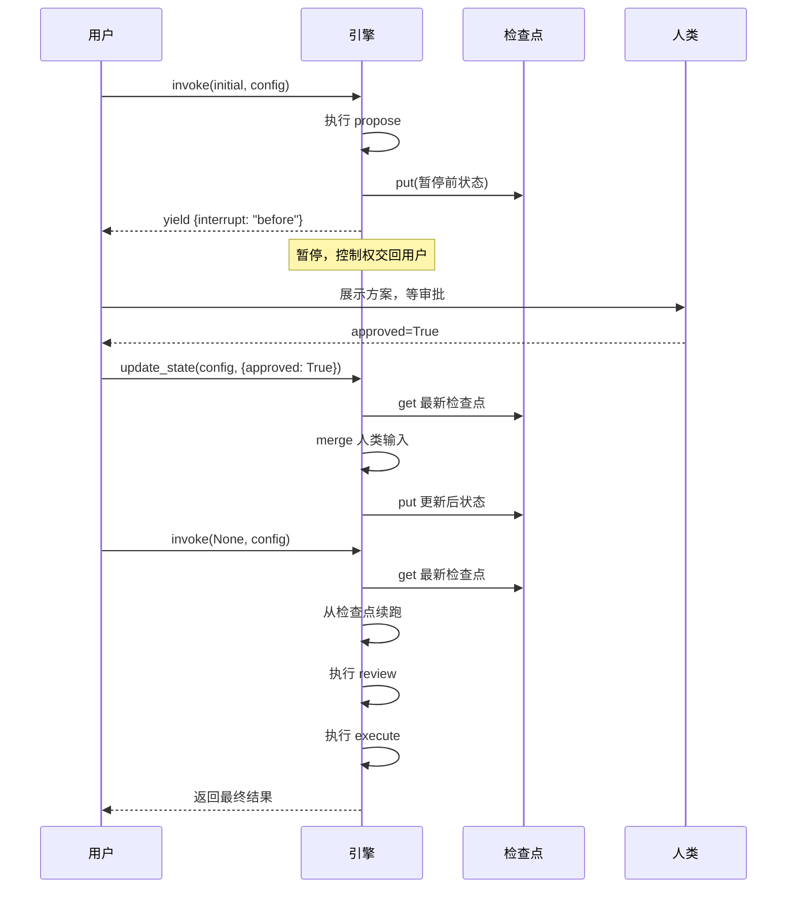
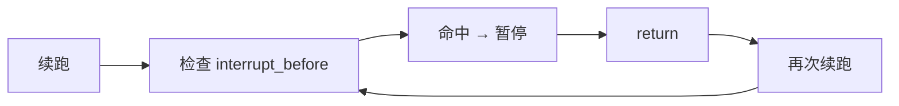
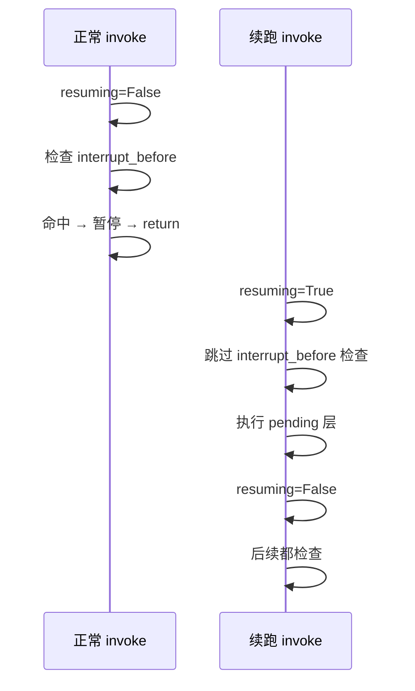
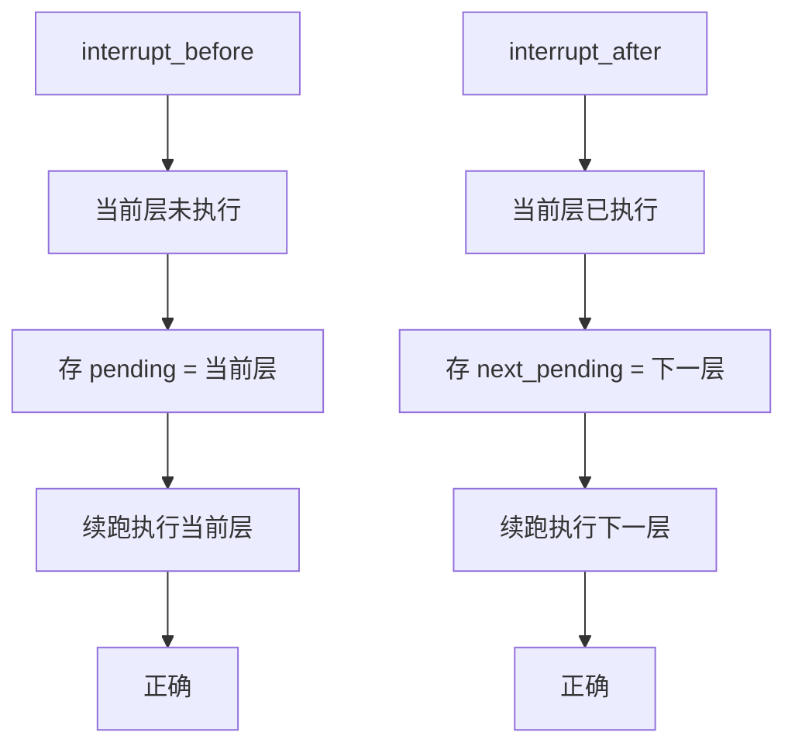

# 阶段 8：Interrupt 人机协作

> **目标**：在指定节点暂停，交回控制权，等人类输入再继续。
>
> **git tag**：`stage-8` · **代码**：`compile(interrupt_before=...)` + `update_state`
>
> **前置条件**：已读完[阶段 7 Checkpoint](stage_7_checkpoint.md)，理解检查点、`thread_id`、续跑机制。

---

## 0. 一句话总结

> `interrupt_before` / `interrupt_after` 让图在指定节点暂停并存检查点，人类用 `update_state` 写入决策，再 `invoke(None, config)` 续跑——人机协作的本质是"检查点 + 暂停 + 续跑"。

---

## 1. 阶段目标

| 维度 | 阶段 7（Checkpoint） | 阶段 8（Interrupt） |
|------|----------------------|---------------------|
| 暂停 | 不能主动暂停 | `interrupt_before` / `interrupt_after` |
| 人类输入 | 无 | `update_state(config, values)` |
| 事件 | `{"nodes", "state", "step"}` | 新增 `"interrupt"` 字段 |
| 续跑 | 从最新检查点 | 同（检查点已含暂停状态） |
| 典型场景 | 断点续跑 | Agent 提案 → 人类审批 → 续跑执行 |

本阶段**不改超级步语义、不改检查点存储**，只在主循环里加两处暂停检查 + 一个 `update_state` 方法。

---

## 2. 为什么需要 Interrupt

### 2.1 Agent 不能完全自主

LLM Agent 能提方案、能调工具，但有些决策不该交给机器：

| 场景 | 为什么人类要介入 |
|------|------------------|
| 删数据库 | 不可逆操作，要人确认 |
| 发邮件给客户 | 对外沟通，要人审批 |
| 执行付费操作 | 涉及金钱，要人授权 |
| 选择战略方向 | 高层决策，要人定 |

`interrupt` 让 Agent 跑到关键节点时**暂停**，把控制权交回调用方，等人类决策后再续跑。

### 2.2 人机协作的完整流程



三步：

1. **暂停**：`invoke(initial, config)` 跑到 interrupt 节点前，存检查点，yield interrupt 事件，return
2. **人类决策**：`update_state(config, {"approved": True})` 把人类决策写入检查点
3. **续跑**：`invoke(None, config)` 从更新后的检查点续跑

---

## 3. `interrupt_before`：在指定节点前暂停

### 3.1 用法

```python
app = graph.compile(
    checkpointer=MemorySaver(),
    interrupt_before=["review"],   # 在 review 之前暂停
)

config = {"configurable": {"thread_id": "approval-1"}}
for event in app.stream(initial, config=config):
    print(event["nodes"], event.get("interrupt"))
    # {'propose'} None
    # {'review'} before    ← 暂停
```

### 3.2 实现（`graph.py:372-384`）

```python
if not resuming and self._interrupt_before and (
    pending & self._interrupt_before
):
    if self._checkpointer and thread_id:
        self._checkpointer.put(thread_id, step, dict(state), pending)
    yield {
        "nodes": pending,
        "state": dict(state),
        "step": step,
        "interrupt": "before",
    }
    return
resuming = False
```

逐行：

| 行 | 作用 |
|----|------|
| `if not resuming and ...` | 续跑第一步跳过（见第 5 节） |
| `self._interrupt_before` | 编译时设的暂停节点集合 |
| `pending & self._interrupt_before` | 当前层与暂停集合的交集——非空说明要暂停 |
| `self._checkpointer.put(...)` | 存检查点（state 是暂停前的，pending 是即将执行的） |
| `yield {..., "interrupt": "before"}` | yield 暂停事件 |
| `return` | 退出 stream，交回控制权 |
| `resuming = False` | 检查后重置（后续步骤都检查） |

### 3.3 关键：`put` 在执行前

注意这里的 `put` 在**节点执行前**：

```python
# pending = {"review"}，还没执行 review
self._checkpointer.put(thread_id, step, dict(state), pending)
# state 是 review 执行前的，pending = {"review"}（即将执行）
```

所以检查点存的是：**"在 state 这个状态下，下一步要执行 review"**。续跑时执行 review——**正确**，没重复。

这与阶段 7 正常执行的 `put`（执行后）不同：

| 场景 | put 时机 | state | pending |
|------|----------|-------|---------|
| 正常执行 | 节点执行后 | 执行后的 state | 当前层（已执行） |
| interrupt_before | 节点执行前 | 执行前的 state | 即将执行的层 |

两种都续跑正确：interrupt 的语义是"还没执行，续跑时执行它"。

### 3.4 `pending & self._interrupt_before` 的含义

`pending` 是当前层要执行的节点集合，`self._interrupt_before` 是要暂停的节点集合。交集非空 → 当前层有节点要暂停。

```python
pending = {"review"}
interrupt_before = {"review"}
pending & interrupt_before  # {"review"}  → 非空 → 暂停
```

如果当前层有多个节点，其中一些要暂停：

```python
pending = {"review", "log"}
interrupt_before = {"review"}
pending & interrupt_before  # {"review"}  → 非空 → 整层暂停
```

**整层暂停**：只要有一个节点要 interrupt，整个超级步都不执行。这是保守策略——避免部分执行导致状态不一致。

---

## 4. `interrupt_after`：在指定节点后暂停

### 4.1 用法

```python
app = graph.compile(
    checkpointer=MemorySaver(),
    interrupt_after=["propose"],   # 在 propose 之后暂停
)

for event in app.stream(initial, config=config):
    print(event["nodes"], event.get("interrupt"))
    # {'propose'} after    ← 执行完 propose 后暂停
```

### 4.2 实现（`graph.py:394-404`）

```python
if self._interrupt_after and (pending & self._interrupt_after):
    next_pending = self._next_nodes(pending, state)
    if self._checkpointer and thread_id:
        self._checkpointer.put(thread_id, step, dict(state), next_pending)
    yield {
        "nodes": pending,
        "state": dict(state),
        "step": step,
        "interrupt": "after",
    }
    return
```

逐行：

| 行 | 作用 |
|----|------|
| `self._interrupt_after` | 编译时设的暂停节点集合 |
| `pending & self._interrupt_after` | 当前层与暂停集合交集 |
| `next_pending = self._next_nodes(pending, state)` | **算出下一层** |
| `self._checkpointer.put(..., next_pending)` | **存 next_pending 而非 pending** |
| `yield {..., "interrupt": "after"}` | yield 暂停事件 |
| `return` | 退出 |

### 4.3 关键：存 `next_pending` 而非 `pending`

这是 `interrupt_after` 与 `interrupt_before` 的核心区别：

| 场景 | put 的 pending | 含义 |
|------|----------------|------|
| interrupt_before | `pending`（当前层，未执行） | 续跑执行当前层 |
| interrupt_after | `next_pending`（下一层，未执行） | 续跑执行下一层 |

`interrupt_after` 时当前层**已经执行完**（state 已合并），所以要存"下一层要执行的节点"，续跑时直接执行下一层。

```python
# pending = {"propose"}，已执行完，state 已合并
next_pending = self._next_nodes(pending, state)  # {"review"}
self._checkpointer.put(thread_id, step, dict(state), next_pending)
# 存的是：state 是 propose 执行后的，pending = {"review"}（下一步执行）
```

续跑时 `pending = {"review"}`，执行 review——**正确**，跳过了已执行的 propose。

!!! warning "如果 interrupt_after 存 pending 而非 next_pending"
    续跑会重新执行 propose（已执行过），用 propose 执行后的 state 再算一次——**重复**。所以必须存 `next_pending`。

---

## 5. `resuming` 标志：续跑时跳过 interrupt 检查

### 5.1 问题

续跑时第一步如果还检查 `interrupt_before`，会**立即再次暂停**——死循环：



### 5.2 解决

`graph.py:352-364`：

```python
if input is None and self._checkpointer and thread_id:
    cp = self._checkpointer.get(thread_id)
    ...
    resuming = True          # ← 续跑标志
else:
    ...
    resuming = False
```

`graph.py:372-384`：

```python
if not resuming and self._interrupt_before and (...):
    # 暂停
    return
resuming = False             # ← 检查后重置
```

续跑时 `resuming = True`，第一次进循环 `not resuming` 为 False，**跳过 interrupt_before 检查**，直接执行 pending 这层。`resuming = False` 在检查后重置，后续步骤都正常检查。

### 5.3 时序



!!! question "为什么只跳过第一步？"
    因为检查点存的 `pending` 就是"被 interrupt 拦住的那层"。续跑要执行这层，所以第一步不能再次拦截。但执行完这层后，后续的层如果也命中 interrupt，应该正常拦截——所以 `resuming = False` 在第一步后重置。

---

## 6. `update_state` 方法：人类输入写入检查点

### 6.1 用法

```python
app.update_state(config, {"approved": True})
```

在 interrupt 暂停后，调用方用此方法写入人类决策，再 `invoke(None, config)` 续跑。

### 6.2 实现（`graph.py:452-471`）

```python
def update_state(
    self, config: dict[str, Any], values: dict[str, Any]
) -> None:
    """更新最新检查点的状态（人类输入，阶段 8）。"""
    thread_id = self._get_thread_id(config)
    if not self._checkpointer or not thread_id:
        raise ValueError("需要 checkpointer 和 thread_id 才能 update_state")
    cp = self._checkpointer.get(thread_id)
    if cp is None:
        raise ValueError(f"thread '{thread_id}' 没有检查点")
    new_state = dict(cp["state"])
    self._merge(new_state, values)
    self._checkpointer.put(thread_id, cp["step"], new_state, cp["pending"])
```

逐行：

| 行 | 作用 |
|----|------|
| `thread_id = self._get_thread_id(config)` | 提取 thread_id |
| `if not self._checkpointer or not thread_id:` | 防御：没 checkpointer 或 thread_id |
| `cp = self._checkpointer.get(thread_id)` | 取最新检查点 |
| `if cp is None:` | 防御：没检查点 |
| `new_state = dict(cp["state"])` | 复制 state（避免引用共享） |
| `self._merge(new_state, values)` | **用 Reducer 合并人类输入** |
| `self._checkpointer.put(...)` | 存回（同 step 覆盖） |

### 6.3 关键：用 `_merge` 合并

```python
self._merge(new_state, values)
```

人类输入 `values` 不是直接覆盖，而是走 `_merge`——有 Reducer 用 Reducer，否则覆盖。

```python
# 人类输入
app.update_state(config, {"approved": True})

# 如果 state 有 messages: Annotated[list, add]
app.update_state(config, {"messages": [{"role": "user", "content": "改一下"}]})
# messages 会追加，不是覆盖
```

这让人类输入与节点输出**走同一合并通道**，语义一致。

### 6.4 存回时 step 不变

```python
self._checkpointer.put(thread_id, cp["step"], new_state, cp["pending"])
```

`cp["step"]` 不变，`cp["pending"]` 不变，只更新 `state`。同 (thread_id, step) 用 `INSERT OR REPLACE`（SqliteSaver）或 list 追加（MemorySaver）。

!!! warning "MemorySaver 的 update_state 会追加新检查点"
    `MemorySaver.put` 是 `append`，所以 `update_state` 后 `get_state_history` 会多一条。`get` 取 `[-1]` 仍是更新后的。`SqliteSaver` 用 `INSERT OR REPLACE`，同 step 覆盖，history 不变。

---

## 7. `interrupt_after` 的检查点存储：存 `next_pending` 而非 `pending`

### 7.1 已在第 4.3 节详述

核心：`interrupt_after` 时当前层已执行完，存 `next_pending`（下一层）让续跑直接执行下一层，避免重复执行当前层。

### 7.2 对比表

| 场景 | put 的 state | put 的 pending | 续跑行为 |
|------|--------------|----------------|----------|
| 正常执行后 | 执行后的 state | 当前层 | 续跑执行当前层（循环图 = 下一步） |
| interrupt_before | 执行前的 state | 当前层（未执行） | 续跑执行当前层（正确，未执行过） |
| interrupt_after | 执行后的 state | 下一层 | 续跑执行下一层（正确，当前层已执行） |

### 7.3 为什么 interrupt_before 不用算 next_pending

`interrupt_before` 在节点执行前拦截，当前层**没执行**，续跑就该执行当前层。所以存 `pending`（当前层）即可，不用算 next。

`interrupt_after` 在节点执行后拦截，当前层**已执行**，续跑该执行下一层。所以要先算 `next_pending` 再存。

---

## 8. 完整的人机协作流程：暂停 → 人类决策 → update_state → 续跑

### 8.1 完整代码

```python
from typing import TypedDict
from tiny_langgraph import END, START, MemorySaver, StateGraph


class State(TypedDict):
    proposal: str
    approved: bool
    outcome: str


def propose(state: State) -> dict:
    return {"proposal": "把数据库迁移到 PostgreSQL"}

def review(state: State) -> dict:
    if state["approved"]:
        return {"outcome": "approved"}
    return {"outcome": "rejected"}

def execute(state: State) -> dict:
    if state["outcome"] == "approved":
        return {"outcome": "done"}
    return {"outcome": "cancelled"}


graph = StateGraph(State)
graph.add_node("propose", propose)
graph.add_node("review", review)
graph.add_node("execute", execute)
graph.add_edge(START, "propose")
graph.add_edge("propose", "review")
graph.add_edge("review", "execute")
graph.add_edge("execute", END)

app = graph.compile(
    checkpointer=MemorySaver(),
    interrupt_before=["review"],      # ← 在 review 前暂停
)
config = {"configurable": {"thread_id": "approval-1"}}
initial = {"proposal": "", "approved": False, "outcome": ""}

# ① 执行到 review 前暂停
for event in app.stream(initial, config=config):
    print(event["nodes"], event.get("interrupt"))
# {'propose'} None
# {'review'} before    ← 暂停

# ② 人类审批
app.update_state(config, {"approved": True})

# ③ 续跑
result = app.invoke(None, config=config)
print(result["outcome"])   # done
```

### 8.2 逐步追踪

| 步骤 | 操作 | state | pending | 检查点 |
|------|------|-------|---------|--------|
| ① stream | 执行 propose | `{proposal: "...", approved: False}` | `{review}` | put(step=1, state, {review}) |
| | 命中 interrupt_before | | | yield {interrupt: "before"}, return |
| ② update_state | merge {approved: True} | `{proposal: "...", approved: True}` | `{review}` | put(step=1, new_state, {review}) |
| ③ invoke(None) | 从检查点恢复 | `{proposal: "...", approved: True}` | `{review}` | |
| | resuming=True，跳过 interrupt 检查 | | | |
| | 执行 review | `{..., outcome: "approved"}` | `{execute}` | put(step=2) |
| | 执行 execute | `{..., outcome: "done"}` | `{}` | put(step=3) |
| | pending={}，结束 | | | |

### 8.3 关键观察

1. **propose 执行完**：state 有 proposal，但 approved 还是 False
2. **interrupt_before review**：存检查点（state 含 approved=False），暂停
3. **update_state**：人类写 approved=True，merge 进检查点的 state
4. **续跑**：resuming=True 跳过 interrupt，执行 review（读 approved=True → outcome=approved）
5. **execute**：读 outcome=approved → outcome=done

---

## 9. 事件中的 `interrupt` 字段

### 9.1 事件格式

阶段 7 的事件：

```python
{"nodes": {"review"}, "state": {...}, "step": 1}
```

阶段 8 新增 `interrupt` 字段：

```python
{"nodes": {"review"}, "state": {...}, "step": 1, "interrupt": "before"}
```

`interrupt` 只在暂停时出现，正常步骤没有这个字段（或为 None）。

### 9.2 消费事件

```python
for event in app.stream(initial, config=config):
    print(f"超级步 {event['step']}: 执行 {event['nodes']}", end="")
    if event.get("interrupt"):
        print(f"  [interrupt: {event['interrupt']}]")
    else:
        print()
```

输出：

```
超级步 0: 执行 {'propose'}
超级步 1: 执行 {'review'}  [interrupt: before]
```

### 9.3 `interrupt` 的两个值

| 值 | 触发 | 含义 |
|----|------|------|
| `"before"` | `interrupt_before` 命中 | 在节点执行前暂停 |
| `"after"` | `interrupt_after` 命中 | 在节点执行后暂停 |
| 无 | 正常步骤 | 没暂停 |

---

## 10. 完整代码逐行解读

### 10.1 `compile` 接受 interrupt 参数（`graph.py:258-285`）

```python
def compile(
    self,
    checkpointer: BaseCheckpointSaver | None = None,
    *,
    interrupt_before: list[str] | None = None,
    interrupt_after: list[str] | None = None,
) -> CompiledStateGraph:
    ...
    return CompiledStateGraph(
        ...
        interrupt_before=set(interrupt_before or []),
        interrupt_after=set(interrupt_after or []),
    )
```

`interrupt_before` / `interrupt_after` 是 list，转成 set 存（便于 `&` 交集运算）。

### 10.2 `CompiledStateGraph.__init__`（`graph.py:295-316`）

```python
self._interrupt_before = interrupt_before or set()
self._interrupt_after = interrupt_after or set()
```

### 10.3 `stream` 的 interrupt_before 检查（`graph.py:372-384`）

已在第 3.2 节详述。

### 10.4 `stream` 的 interrupt_after 检查（`graph.py:394-404`）

已在第 4.2 节详述。

### 10.5 `update_state`（`graph.py:452-471`）

已在第 6.2 节详述。

### 10.6 完整 `stream` 方法串读

```python
def stream(self, input, *, recursion_limit=25, config=None):
    # ① 提取 thread_id
    thread_id = self._get_thread_id(config)

    # ② 续跑 or 新跑
    if input is None and self._checkpointer and thread_id:
        cp = self._checkpointer.get(thread_id)
        if cp is None:
            raise ValueError(...)
        state = dict(cp["state"])
        pending = set(cp["pending"])
        step = cp["step"] + 1
        resuming = True
    else:
        state = dict(input) if input else {}
        pending = {self._entry_point}
        step = 0
        resuming = False

    # ③ 主循环
    while pending:
        if step >= recursion_limit:
            raise RecursionError(...)

        # ④ interrupt_before 检查
        if not resuming and self._interrupt_before and (pending & self._interrupt_before):
            if self._checkpointer and thread_id:
                self._checkpointer.put(thread_id, step, dict(state), pending)
            yield {"nodes": pending, "state": dict(state), "step": step, "interrupt": "before"}
            return
        resuming = False

        # ⑤ 执行超级步
        step_state = dict(state)
        updates = []
        for node_name in sorted(pending):
            update = self._nodes[node_name](step_state)
            updates.append(update)
        for update in updates:
            self._merge(state, update)

        # ⑥ interrupt_after 检查
        if self._interrupt_after and (pending & self._interrupt_after):
            next_pending = self._next_nodes(pending, state)
            if self._checkpointer and thread_id:
                self._checkpointer.put(thread_id, step, dict(state), next_pending)
            yield {"nodes": pending, "state": dict(state), "step": step, "interrupt": "after"}
            return

        # ⑦ 存检查点 + yield + 算下一层
        if self._checkpointer and thread_id:
            self._checkpointer.put(thread_id, step, dict(state), pending)
        yield {"nodes": pending, "state": dict(state), "step": step}
        pending = self._next_nodes(pending, state)
        step += 1
```

| 步骤 | 作用 |
|------|------|
| ① | 提取 thread_id |
| ② | 续跑（input=None）或新跑 |
| ③ | 主循环 |
| ④ | interrupt_before：执行前检查，命中则存检查点 + yield + return |
| ⑤ | Pregel 超级步：快照 + 并行执行 + 合并 |
| ⑥ | interrupt_after：执行后检查，命中则存 next_pending + yield + return |
| ⑦ | 正常：存检查点 + yield + 算下一层 |

---

## 11. 可运行示例

### 11.1 代码（`examples/stage_8_interrupt/run.py`）

```python
from typing import TypedDict
from tiny_langgraph import END, START, MemorySaver, StateGraph


class State(TypedDict):
    proposal: str
    approved: bool
    outcome: str


def main() -> None:
    def propose(state: State) -> dict:
        print("  [propose] Agent 提出方案")
        return {"proposal": "把数据库迁移到 PostgreSQL"}

    def review(state: State) -> dict:
        if state["approved"]:
            print("  [review] 人类已批准")
            return {"outcome": "approved"}
        print("  [review] 人类未批准")
        return {"outcome": "rejected"}

    def execute(state: State) -> dict:
        if state["outcome"] == "approved":
            print(f"  [execute] 执行方案: {state['proposal']}")
            return {"outcome": "done"}
        print("  [execute] 方案被拒绝，不执行")
        return {"outcome": "cancelled"}

    graph = StateGraph(State)
    graph.add_node("propose", propose)
    graph.add_node("review", review)
    graph.add_node("execute", execute)
    graph.add_edge(START, "propose")
    graph.add_edge("propose", "review")
    graph.add_edge("review", "execute")
    graph.add_edge("execute", END)

    app = graph.compile(
        checkpointer=MemorySaver(),
        interrupt_before=["review"],
    )
    config = {"configurable": {"thread_id": "approval-1"}}
    initial = {"proposal": "", "approved": False, "outcome": ""}

    print("第一次执行（跑到 review 前暂停）：")
    for event in app.stream(initial, config=config):
        print(f"  超级步 {event['step']}: 执行 {event['nodes']}", end="")
        if event.get("interrupt"):
            print(f"  [interrupt: {event['interrupt']}]")
        else:
            print()

    print("\n人类审批：调用 update_state 写入决策")
    app.update_state(config, {"approved": True})

    print("\n续跑（invoke(None, config)）：")
    result = app.invoke(None, config=config)
    print(f"\n最终结果: outcome={result['outcome']}")
```

### 11.2 运行

```bash
python -m examples.stage_8_interrupt.run
```

### 11.3 输出

```
============================================================
示例：人机协作审批流程
============================================================
图: propose -> [interrupt] -> review -> execute

第一次执行（跑到 review 前暂停）：
------------------------------------------------------------
  [propose] Agent 提出方案
  超级步 0: 执行 {'propose'}
  超级步 1: 执行 {'review'}  [interrupt: before]

人类审批：调用 update_state 写入决策
  → approved = True

续跑（invoke(None, config)）：
------------------------------------------------------------
  [review] 人类已批准
  [execute] 执行方案: 把数据库迁移到 PostgreSQL

最终结果: outcome=done

============================================================
关键观察：interrupt = 检查点 + 暂停 + 续跑
============================================================
  - interrupt_before=['review']: 执行到 review 前暂停
  - update_state: 人类写入决策到检查点
  - invoke(None, config): 从检查点续跑
  - 整个过程状态不丢失，靠的是阶段 7 的检查点
```

### 11.4 逐步追踪

| 阶段 | 超级步 | 执行 | state 变化 | interrupt |
|------|--------|------|------------|-----------|
| 第一次 stream | 0 | propose | proposal="..." | — |
| | 1 | （未执行 review） | — | before → return |
| update_state | — | merge {approved: True} | approved=True | — |
| 续跑 invoke(None) | 1 | review | outcome="approved" | — |
| | 2 | execute | outcome="done" | — |
| | 3 | （pending={}） | — | 结束 |

---

## 12. 测试解读

### 12.1 `test_interrupt.py` 全貌

```python
class TestInterruptBefore:
    """interrupt_before 在指定节点前暂停。"""
    def test_pauses_before_node(self): ...
    def test_resume_after_interrupt(self): ...

class TestInterruptAfter:
    """interrupt_after 在指定节点后暂停。"""
    def test_pauses_after_node(self): ...
    def test_resume_after_interrupt_after(self): ...

class TestHumanInTheLoop:
    """人机协作：暂停 → 人类修改状态 → 续跑。"""
    def test_update_state_then_resume(self): ...
    def test_update_state_with_approval(self): ...
```

### 12.2 `TestInterruptBefore`

```python
def test_pauses_before_node(self) -> None:
    app = _make_approval_graph().compile(
        checkpointer=MemorySaver(), interrupt_before=["review"]
    )
    config = {"configurable": {"thread_id": "t1"}}
    events = list(app.stream({"step_name": "", "approved": False, "result": ""}, config=config))
    assert len(events) == 2
    assert events[0]["nodes"] == {"propose"}
    assert events[1]["nodes"] == {"review"}
    assert events[1].get("interrupt") == "before"
```

验证：

1. 执行 2 个事件（propose + 暂停）
2. 第 0 个事件执行 propose
3. 第 1 个事件 nodes 是 review（**未执行**，只是要执行）
4. 第 1 个事件 interrupt == "before"

```python
def test_resume_after_interrupt(self) -> None:
    app = _make_approval_graph().compile(
        checkpointer=MemorySaver(), interrupt_before=["review"]
    )
    config = {"configurable": {"thread_id": "t1"}}
    list(app.stream({"step_name": "", "approved": False, "result": ""}, config=config))

    result = app.invoke(None, config=config)
    assert result["step_name"] == "reviewed"
    assert "执行" in result["result"]
```

验证续跑：interrupt 后 `invoke(None, config)` 能继续执行 review 和 execute。

### 12.3 `TestInterruptAfter`

```python
def test_pauses_after_node(self) -> None:
    app = _make_approval_graph().compile(
        checkpointer=MemorySaver(), interrupt_after=["propose"]
    )
    config = {"configurable": {"thread_id": "t1"}}
    events = list(app.stream({"step_name": "", "approved": False, "result": ""}, config=config))
    assert len(events) == 1
    assert events[0].get("interrupt") == "after"
```

验证：

1. 只 1 个事件（propose 执行完就暂停）
2. interrupt == "after"

```python
def test_resume_after_interrupt_after(self) -> None:
    app = _make_approval_graph().compile(
        checkpointer=MemorySaver(), interrupt_after=["propose"]
    )
    config = {"configurable": {"thread_id": "t1"}}
    list(app.stream({"step_name": "", "approved": False, "result": ""}, config=config))
    result = app.invoke(None, config=config)
    assert "执行" in result["result"]
```

验证 interrupt_after 续跑：从 propose 之后继续，执行 review 和 execute。

### 12.4 `TestHumanInTheLoop`

```python
def test_update_state_then_resume(self) -> None:
    graph = StateGraph(State)
    graph.add_node("propose", lambda s: {"result": "原始方案"})
    graph.add_node("execute", lambda s: {"result": f"执行: {s['result']}"})
    graph.add_edge(START, "propose")
    graph.add_edge("propose", "execute")
    graph.add_edge("execute", END)

    app = graph.compile(
        checkpointer=MemorySaver(), interrupt_after=["propose"]
    )
    config = {"configurable": {"thread_id": "t1"}}

    list(app.stream({"step_name": "", "approved": False, "result": ""}, config=config))

    app.update_state(config, {"result": "人类修改的方案"})   # ← 人类改方案

    result = app.invoke(None, config=config)
    assert result["result"] == "执行: 人类修改的方案"
```

**核心人机协作测试**：

1. propose 写 "原始方案"
2. interrupt_after propose 暂停
3. `update_state` 把 result 改成 "人类修改的方案"
4. 续跑 execute，读 result="人类修改的方案" → "执行: 人类修改的方案"

验证人类输入能覆盖节点的输出。

```python
def test_update_state_with_approval(self) -> None:
    graph = StateGraph(State)

    def review(s: State) -> dict[str, Any]:
        return {"step_name": "approved" if s["approved"] else "rejected"}

    graph.add_node("propose", lambda s: {"result": "方案"})
    graph.add_node("review", review)
    graph.add_edge(START, "propose")
    graph.add_edge("propose", "review")
    graph.add_edge("review", END)

    app = graph.compile(
        checkpointer=MemorySaver(), interrupt_before=["review"]
    )
    config = {"configurable": {"thread_id": "t1"}}

    list(app.stream({"step_name": "", "approved": False, "result": ""}, config=config))
    app.update_state(config, {"approved": True})   # ← 人类批准
    result = app.invoke(None, config=config)
    assert result["step_name"] == "approved"
```

验证审批流程：人类写 approved=True，续跑 review 读到 True → "approved"。

---

## 13. 对照真实 LangGraph 的 `interrupt_before` / `interrupt_after`

| 真实 LangGraph | 我们的阶段 8 | 说明 |
|----------------|-------------|------|
| `interrupt_before` / `interrupt_after` | 同 | 语义一致 |
| `update_state(config, values)` | 同 | 人类输入 |
| `invoke(None, config)` 续跑 | 同 | 续跑机制 |
| `Command` 对象 | ❌ | 我们用 dict，真实用 Command 更丰富 |
| `Command(goto="node")` 动态路由 | ❌ | 续跑时改下一步 |
| `Command(update=...)` 更新 | 简化 | 我们用 dict + merge |
| `Command(resume=...)` 恢复 | ❌ | 真实能传值给 interrupt 节点 |
| `astream` 异步流式 | ❌ | 我们用同步生成器 |
| `interrupt()` 函数（节点内主动暂停） | ❌ | 我们只在编译时声明 |
| 多次 interrupt（暂停多次） | 同 | 续跑时再命中再暂停 |

!!! info "真实 LangGraph 的 `Command`"
    真实 LangGraph 0.2+ 引入 `Command` 对象，节点可以返回 `Command(goto="review", update={"approved": True})` 同时更新状态和路由。`update_state` 也接受 `Command`。本项目用 dict 简化，但 `update_state` 的 merge 语义与真实一致。

!!! tip "真实 LangGraph 的 `interrupt()` 函数"
    真实 LangGraph 还提供 `interrupt(value)` 函数，可以在节点**内部**主动暂停并传出一个值给人类。人类用 `Command(resume=human_value)` 续跑时把值传回节点。这是比 `interrupt_before/after` 更灵活的"节点内暂停"。本项目不实现这个，用 `interrupt_before/after` 已能覆盖审批场景。

---

## 14. 从阶段 7 到阶段 8 的 diff 解读

```bash
git diff stage-7 stage-8 --stat
```

```
 docs/stages/stage_8_interrupt.md       | 133 ++++++++++++++++++++++++++++-----
 examples/stage_8_interrupt/__init__.py |   0
 examples/stage_8_interrupt/run.py      |  93 +++++++++++++++++++++++
 src/tiny_langgraph/__init__.py         |   4 +-
 src/tiny_langgraph/graph.py            |  81 +++++++++++++++++---
 tests/tiny_langgraph/test_interrupt.py | 120 +++++++++++++++++++++++++++++
 6 files changed, 402 insertions(+), 29 deletions(-)
```

### 14.1 `graph.py` 的改动

```bash
git diff stage-7 stage-8 -- src/tiny_langgraph/graph.py
```

关键 hunk：

```diff
+        if not resuming and self._interrupt_before and (
+            pending & self._interrupt_before
+        ):
+            if self._checkpointer and thread_id:
+                self._checkpointer.put(thread_id, step, dict(state), pending)
+            yield {
+                "nodes": pending,
+                "state": dict(state),
+                "step": step,
+                "interrupt": "before",
+            }
+            return
+        resuming = False
```

新增 `interrupt_before` 检查块。

```diff
+        if self._interrupt_after and (pending & self._interrupt_after):
+            next_pending = self._next_nodes(pending, state)
+            if self._checkpointer and thread_id:
+                self._checkpointer.put(thread_id, step, dict(state), next_pending)
+            yield {
+                "nodes": pending,
+                "state": dict(state),
+                "step": step,
+                "interrupt": "after",
+            }
+            return
```

新增 `interrupt_after` 检查块。

```diff
+    def update_state(
+        self, config: dict[str, Any], values: dict[str, Any]
+    ) -> None:
+        ...
```

新增 `update_state` 方法。

```diff
+        interrupt_before=set(interrupt_before or []),
+        interrupt_after=set(interrupt_after or []),
```

`compile` 把 list 转 set。

### 14.2 新增 `test_interrupt.py`（120 行）

覆盖 interrupt_before、interrupt_after、人机协作。

### 14.3 新增 `examples/stage_8_interrupt/run.py`（93 行）

可运行示例。

---

## 15. 设计思考：为什么 `interrupt_after` 要存 `next_pending`

### 15.1 核心问题

`interrupt_after` 在节点执行**后**暂停。此时当前层已执行完，state 已合并。检查点该存什么作为 `pending`？

- 选项 A：存 `pending`（当前层）
- 选项 B：存 `next_pending`（下一层）

### 15.2 选 A 会怎样

续跑时 `pending = cp["pending"]`（当前层），执行当前层。但当前层**已经执行过**，state 已是执行后的。再执行一次：

- 对纯函数节点：用执行后的 state 再算一次，**结果可能不同**（如 `count += 1` 会再加一次）
- 对有副作用节点：副作用重复触发（如发两次邮件）

**重复执行，错误**。

### 15.3 选 B 会怎样

续跑时 `pending = cp["pending"]`（下一层），执行下一层。当前层已执行完，下一层还没执行——**正确**。

### 15.4 对比 `interrupt_before`

`interrupt_before` 在节点执行**前**暂停。当前层**没执行**，state 是执行前的。存 `pending`（当前层），续跑执行当前层——**正确**，没执行过。

| 场景 | 当前层状态 | 存什么 | 续跑行为 | 正确性 |
|------|------------|--------|----------|--------|
| interrupt_before | 未执行 | pending（当前层） | 执行当前层 | ✓ 没执行过 |
| interrupt_after | 已执行 | next_pending（下一层） | 执行下一层 | ✓ 当前层已执行 |
| interrupt_after | 已执行 | pending（当前层） | 执行当前层 | ✗ 重复 |

### 15.5 一致性视角

从"检查点是下一步要执行什么"的视角：

- interrupt_before：下一步要执行当前层（还没执行）→ 存 pending
- interrupt_after：下一步要执行下一层（当前层已执行）→ 存 next_pending

两者都符合"pending = 下一步要执行的节点集合"的语义。



??? question "为什么 interrupt_before 不用算 next_pending？"
    因为 interrupt_before 拦截在执行前，当前层就是"下一步要执行的"，直接存 `pending` 即可，不用算 next。interrupt_after 拦截在执行后，要跳过当前层，所以要先算 next_pending 再存。

??? question "如果 interrupt_after 命中的节点有 fan-out 怎么办？"
    `next_pending = self._next_nodes(pending, state)` 会返回所有后继（fan-out 的多个目标）。续跑时执行所有后继——正确。interrupt_after 不影响 fan-out 语义，只是把"执行后继"这件事推迟到续跑时。

---

## 16. 常见误区

### 16.1 "interrupt 就是 break"

**不完全**。interrupt 是"存检查点 + yield 事件 + return"。如果没 checkpointer，interrupt 仍然 yield 事件并 return，但**续跑会失败**（没检查点）。所以 interrupt 必须配合 checkpointer。

### 16.2 "update_state 直接覆盖 state"

**错**。`update_state` 用 `_merge` 合并：有 Reducer 用 Reducer，否则覆盖。对 `messages: Annotated[list, add]`，`update_state(config, {"messages": [new]})` 是追加，不是覆盖。

### 16.3 "续跑会再次暂停"

**不会**。续跑时 `resuming = True`，第一步跳过 interrupt_before 检查。执行完第一步后 `resuming = False`，后续步骤正常检查。所以续跑**至少执行一步**才可能再次暂停。

### 16.4 "interrupt_before 和 interrupt_after 能同时用"

**能**。可以同时声明 `interrupt_before=["a"], interrupt_after=["b"]`。执行时先检查 before（执行前），再检查 after（执行后）。两者命中哪个就暂停哪个。

### 16.5 "interrupt_after 存的 pending 和 interrupt_before 一样"

**不一样**。interrupt_before 存 `pending`（当前层，未执行），interrupt_after 存 `next_pending`（下一层）。这是第 15 节的核心。

---

## 17. 典型人机协作模式

### 17.1 审批模式（本阶段示例）

```python
app = graph.compile(checkpointer=..., interrupt_before=["review"])
# propose → [暂停] → review → execute
```

Agent 提案，人类审批，续跑执行。

### 17.2 确认模式

```python
app = graph.compile(checkpointer=..., interrupt_before=["delete_db"])
# ... → [暂停] → delete_db → ...
```

危险操作前要人类确认。

### 17.3 修正模式

```python
app = graph.compile(checkpointer=..., interrupt_after=["draft"])
# draft → [暂停] → 人类改草稿 → refine → ...
```

Agent 出草稿，人类修改，续跑精炼。

### 17.4 多轮审批

```python
app = graph.compile(checkpointer=..., interrupt_before=["review_1", "review_2"])
# → [暂停] → review_1 → [暂停] → review_2 → ...
```

多个审批节点，每次暂停等人类。

---

## 18. 阶段 8 的局限

| 局限 | 谁来解决 |
|------|----------|
| 还没接真 LLM | 阶段 9 完整 Agent |
| 没有 `Command` 对象（续跑时改路由） | 不解决 |
| 没有 `interrupt()` 节点内暂停 | 不解决 |
| 没有 `astream` 异步流式 | 不解决 |

---

## 19. 小结

阶段 8 让图能"暂停等人输入"：

1. `interrupt_before`：节点执行前检查，命中则存检查点 + yield + return
2. `interrupt_after`：节点执行后检查，存 `next_pending` + yield + return
3. `resuming` 标志：续跑第一步跳过 interrupt_before，避免立即再暂停
4. `update_state`：人类输入用 `_merge` 合并进检查点 state
5. 事件新增 `interrupt` 字段：`"before"` / `"after"` / 无
6. 人机协作三步：暂停 → update_state → 续跑

人机协作的本质是"检查点 + 暂停 + 续跑"——阶段 7 的检查点是基础，阶段 8 加上暂停时机和人类输入通道。

---

👉 下一阶段：[阶段 9 - 完整 Agent](stage_9_agent.md)——接真 OpenAI，拼出 Tool-calling Agent，对比真 LangGraph。
