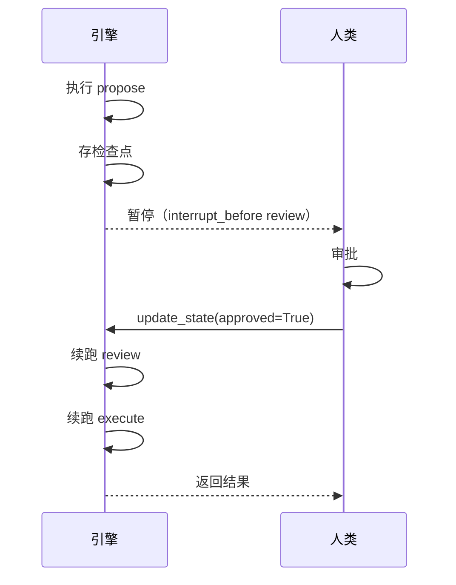

# 阶段 8：Interrupt 人机协作 + 流式

> **目标**：在指定节点暂停，交回控制权，等人类输入再继续。
>
> **git tag**：`stage-8` · **代码**：`compile(interrupt_before=...)` + `update_state`

## 这一阶段做了什么

```python
app = graph.compile(
    checkpointer=MemorySaver(),
    interrupt_before=["human_review"],   # 在 human_review 之前暂停
)

config = {"configurable": {"thread_id": "run-1"}}

# 1. 执行到 human_review 前暂停
app.invoke(initial, config=config)

# 2. 人类写入决策
app.update_state(config, {"approved": True})

# 3. 续跑
result = app.invoke(None, config=config)
```

## Interrupt 机制



### `interrupt_before`

执行到指定节点**之前**暂停：

```python
if not resuming and self._interrupt_before and (pending & self._interrupt_before):
    self._checkpointer.put(thread_id, step, state, pending)  # 存检查点
    yield {..., "interrupt": "before"}
    return  # 暂停，交回控制权
```

### `interrupt_after`

执行完指定节点**之后**暂停：

```python
if self._interrupt_after and (pending & self._interrupt_after):
    yield {..., "interrupt": "after"}
    return
```

### `resuming` 标志

续跑时第一步**跳过** `interrupt_before` 检查，否则会立即再次暂停（死循环）：

```python
if input is None:
    resuming = True   # 续跑第一步不检查 interrupt_before
...
while pending:
    if not resuming and ...interrupt_before...:
        return
    resuming = False  # 后续都检查
```

## `update_state`：人类输入

```python
def update_state(self, config, values):
    cp = self._checkpointer.get(thread_id)
    new_state = dict(cp["state"])
    self._merge(new_state, values)   # 用 Reducer 合并人类输入
    self._checkpointer.put(thread_id, cp["step"], new_state, cp["pending"])
```

人类输入通过 `update_state` 写入检查点的状态，续跑时从更新后的状态恢复。

## 流式输出

阶段 4 已实现 `stream`，本阶段的事件新增 `interrupt` 字段：

```python
for event in app.stream(initial, config=config):
    print(event["nodes"], event.get("interrupt"))
    # {'propose'} None
    # {'review'} before    ← 暂停
```

## 运行示例

```bash
python -m examples.stage_8_interrupt.run
```

输出展示审批流程：Agent 提方案 → 暂停 → 人类批准 → 续跑执行。

## 对照真实 LangGraph

| 真实 LangGraph | 我们的阶段 8 | 说明 |
|----------------|-------------|------|
| `interrupt_before` / `interrupt_after` | 同 | |
| `update_state(config, values)` | 同 | |
| `invoke(None, config)` 续跑 | 同 | |
| `Command` 对象（更丰富的人类输入） | ❌ | 我们用 dict |
| `astream` 异步流式 | ❌ | 我们用同步生成器 |

## 这一阶段的局限

| 局限 | 谁来解决 |
|------|----------|
| 还没接真 LLM | 阶段 9 完整 Agent |

---

👉 下一阶段：[阶段 9 - 完整 Agent](stage_9_agent.md)——接真 OpenAI，拼出 Tool-calling Agent，对比真 LangGraph。
