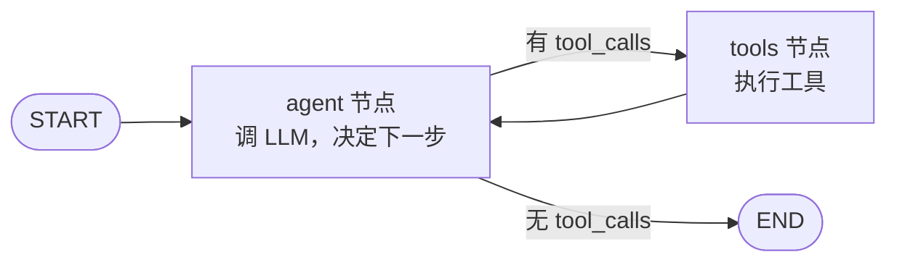
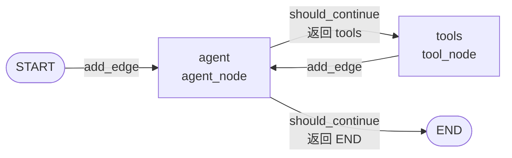
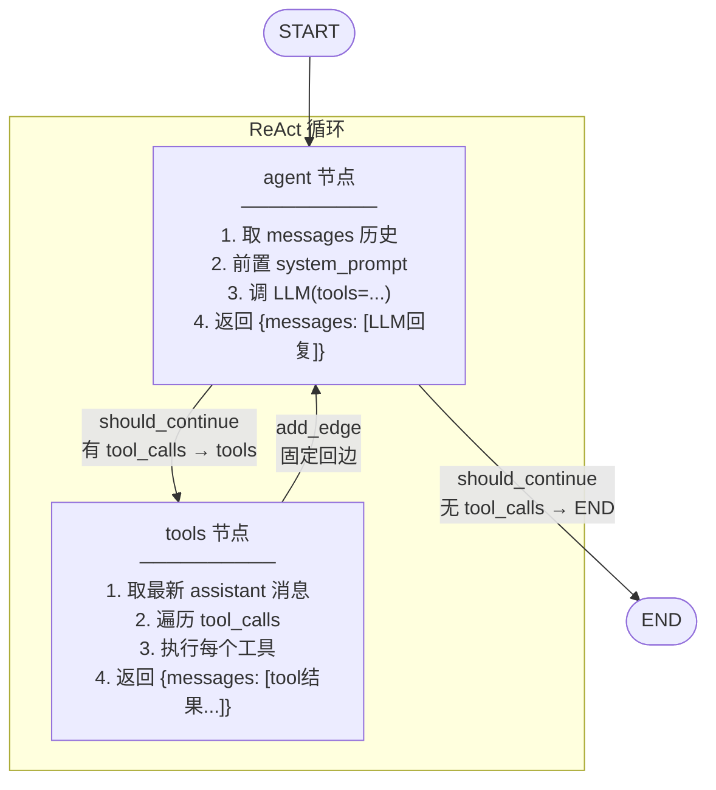
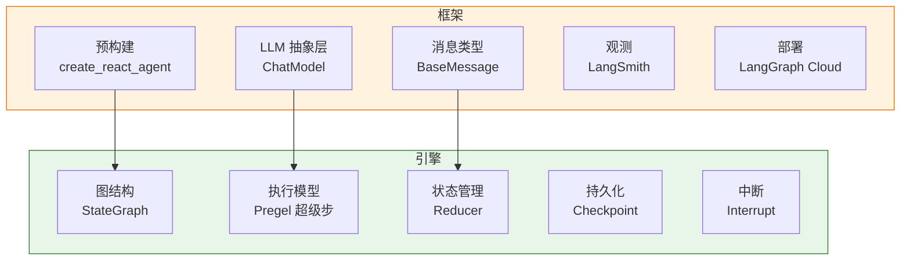

# 阶段 9：完整 Tool-calling Agent

!!! success "本阶段完成"
    用阶段 1-8 搭好的引擎，拼出一个**完整的 ReAct Agent**，接真 OpenAI API。
    这是整个教学项目的高潮——前面 8 个阶段的所有能力，在这里组装成一个真实可用的 Agent。

## 概述

本阶段是 tiny-langgraph 项目的"收官之作"。我们不再给引擎加新能力，而是把前 8 个阶段
已经造好的"积木"拼起来，搭出一个**工业可用的 Tool-calling Agent**。这个 Agent 的行为
和真实 LangGraph 的 `create_react_agent` 在骨架上完全一致：它接 OpenAI API，能调用工具，
能在工具执行前暂停等人类审批，能把对话历史持久化到检查点。

读完本篇你会理解：

1. **ReAct 模式**到底是什么——它不是玄学，就是一个带循环的图。
2. **Tool-calling** 的完整数据流：用户消息 → LLM → 工具调用 → 工具结果 → LLM → 最终回复。
3. **`create_react_agent`** 内部到底做了什么——它只是一个返回 `CompiledStateGraph` 的工厂函数。
4. 为什么说"Agent 只是图的一种模式"——Agent 框架的核心循环，就是我们前面造的图引擎。
5. **"框架"和"引擎"的边界**在哪里——哪些是 LangGraph 框架加的，哪些是我们已经实现的引擎核心。

!!! info "本篇定位"
    本篇是**阶段解读**中篇幅最长的一篇。因为 Agent 是所有能力的集大成者，要讲清楚它，
    必须把前面每个阶段在 Agent 里扮演的角色都串一遍。如果你对某个阶段还不熟，建议先回看
    对应的阶段文档，再回来读这篇。

---

## 1. 阶段目标

### 1.1 一句话目标

**用我们手写的图引擎，拼出一个能接真 OpenAI API、能调工具、能人机协作的 ReAct Agent。**

### 1.2 拆解目标

这个一句话目标其实包含了好几个子目标：

| 子目标 | 依赖的前置阶段 | 实现方式 |
|--------|----------------|----------|
| 能调 LLM 决定下一步 | 阶段 2（共享状态） | `agent_node` 把消息历史发给 LLM |
| 能根据 LLM 回复路由 | 阶段 3（条件边） | `should_continue` 看有无 `tool_calls` |
| 能循环执行 | 阶段 4（循环图） | `tools → agent` 的回边 |
| 能累积消息历史 | 阶段 5（Reducer） | `add_messages` 智能追加 |
| 能并行执行同层节点 | 阶段 6（Pregel） | 超级步执行模型（Agent 是线性的，但模型在） |
| 能保存对话历史 | 阶段 7（Checkpoint） | `MemorySaver` / `SqliteSaver` |
| 能在工具前暂停审批 | 阶段 8（Interrupt） | `interrupt_before=["tools"]` |
| **拼成一个工厂函数** | **以上全部** | **`create_react_agent`** |

### 1.3 成功标准

写完本阶段，下面这段代码应该能跑通（接真 OpenAI 时）：

```python
from openai import OpenAI
from tiny_langgraph import MemorySaver, Tool, create_react_agent

@Tool("calculator", "计算数学表达式", {
    "type": "object",
    "properties": {"expr": {"type": "string"}},
    "required": ["expr"],
})
def calculator(expr: str) -> str:
    return str(eval(expr))

agent = create_react_agent(
    OpenAI(),
    tools=[calculator],
    system_prompt="你是一个有用的助手。",
    checkpointer=MemorySaver(),
)

result = agent.invoke({"messages": [{"role": "user", "content": "算 17 * 23"}]})
print(result["messages"][-1]["content"])
# 输出类似: 17 * 23 = 391
```

而且，把 `OpenAI()` 换成任意遵循同样接口的客户端（比如 FakeLLM），图执行流程完全一样。
这就是"引擎和 LLM 解耦"的好处——测试时用假 LLM，生产时换真 LLM，图定义不用改一行。

---

## 2. ReAct 模式深度解析

### 2.1 ReAct 是什么

**ReAct = Reasoning + Acting**，是 2022 年 Yao 等人提出的论文
*"ReAct: Synergizing Reasoning and Acting in Language Models"* 中的思路。
核心思想极其简单：

> 让 LLM 交替进行"思考"（Reasoning）和"行动"（Acting），直到任务完成。

- **Reasoning**：LLM 看当前情况，决定下一步该做什么（调工具？直接回复？）。
- **Acting**：执行 LLM 决定的动作（调工具、查数据库、发邮件……）。
- **Observation**：把动作的结果喂回给 LLM，进入下一轮 Reasoning。

这三步循环往复，直到 LLM 觉得"不用再调工具了，直接回复用户"为止。

### 2.2 用图表达 ReAct

ReAct 循环画成图，就是：



就这么简单。**ReAct 不是什么神秘的算法，它就是一张带循环的有向图**：

- `agent` 节点 = Reasoning（调 LLM）
- `tools` 节点 = Acting（执行工具）
- `tools → agent` 的回边 = Observation（把工具结果喂回 LLM）
- `agent` 的条件边 = 终止判断（LLM 不调工具了就结束）

!!! tip "为什么 ReAct 比纯 Prompt 强"
    纯 Prompt 让 LLM"一次想完所有事"，复杂任务容易出错。ReAct 让 LLM"想一步做一步"，
    每步都能拿到真实世界的反馈（工具结果），下一步决策更靠谱。这就像人解题时"算一步、
    验证一步"，比"心算到底"可靠得多。

### 2.3 ReAct 的三种消息

在 ReAct 循环中，消息历史会累积三种角色：

| 消息角色 | 谁产生的 | 内容 |
|----------|----------|------|
| `user` | 用户输入 | 用户的提问 |
| `assistant` | `agent` 节点（LLM） | LLM 的回复，可能含 `tool_calls` |
| `tool` | `tools` 节点 | 工具执行的结果，带 `tool_call_id` |

一个完整的 ReAct 轮次（一次工具调用）会让消息列表增长 2 条：

```
[..., {role: assistant, tool_calls: [...]}, {role: tool, content: "工具结果"}]
```

然后下一轮 `agent` 节点看到这两条新消息，决定下一步。

### 2.4 ReAct vs Chain-of-Thought

??? question "ReAct 和 CoT（Chain-of-Thought）有什么区别？"
    **CoT** 让 LLM 在回复里"自言自语"地推理（"首先...然后...所以..."），但 LLM 不能
    **真正去做**任何事——它只是在生成文本。

    **ReAct** 让 LLM 的推理能**触发真实动作**（调工具），动作的结果**真实地**进入下一轮
    推理。这是"想"和"做"的闭环。

    举个例子：问"2024 年中国 GDP 多少？"
    - CoT：LLM 凭记忆猜一个数（可能过时、可能错）。
    - ReAct：LLM 调 `search("2024 中国 GDP")` 工具，拿到真实数据，再回复。

### 2.5 ReAct 的终止条件

ReAct 循环什么时候停？三种情况：

1. **LLM 不调工具了**：`should_continue` 返回 `END`，跳出循环。这是正常终止。
2. **超过最大步数**：`recursion_limit` 触发 `RecursionError`，防止死循环。
3. **遇到 interrupt**：在 `tools` 前暂停，等人类审批。审批后续跑或终止。

正常情况下是第 1 种。第 2 种是兜底保护。第 3 种是人机协作场景。

---

## 3. Tool 类详解

### 3.1 Tool 的角色

`Tool` 把一个**普通的 Python 函数**包装成**LLM 可调用的工具**。它做两件事：

1. **存元数据**：工具名、描述、参数 schema——这些是给 LLM 看的，LLM 据此决定"要不要调这个工具、传什么参数"。
2. **存函数本身**：当 LLM 真的决定调用时，`Tool` 实例可像函数一样被调用，执行真正的逻辑。

### 3.2 装饰器用法

```python
from tiny_langgraph import Tool

@Tool(
    "calculator",                       # 工具名
    "计算数学表达式",                   # 描述（给 LLM 看的）
    {                                   # 参数 JSON schema
        "type": "object",
        "properties": {
            "expr": {"type": "string", "description": "数学表达式"},
        },
        "required": ["expr"],
    },
)
def calculator(expr: str) -> str:
    return str(eval(expr))
```

装饰器用法的工作原理：`Tool.__init__` 先存了 name/description/parameters，但 `func=None`。
然后 `Tool` 实例作为装饰器"调用"被装饰的函数——这时 `__call__` 检测到"第一个参数是函数、
没有别的参数"，就把函数存进 `self._func`，并返回 `self`（不是返回原函数）。

所以装饰完后，`calculator` 是一个 `Tool` 实例，既能当工具传给 Agent，又能像函数一样调用：
`calculator(expr="1+1")` 返回 `"2"`。

### 3.3 直接构造用法

```python
calculator = Tool(
    "calculator",
    "计算数学表达式",
    {"type": "object", "properties": {"expr": {"type": "string"}}},
    func=lambda expr: str(eval(expr)),
)
```

直接构造就是把函数通过 `func=` 关键字传进去。适合不想用装饰器的场景，或者函数已经存在
的情况（比如把一个库函数包装成工具）。

### 3.4 `__call__` 的双重身份

`Tool.__call__` 有两种模式，这是它最巧妙的设计：

```python
def __call__(self, *args, **kwargs):
    # 模式 1：装饰器模式——被装饰的函数作为第一个参数传入
    if self._func is None and len(args) == 1 and callable(args[0]) and not kwargs:
        self._func = args[0]
        if self.name == "tool":
            self.name = args[0].__name__
        if not self.description:
            self.description = args[0].__doc__ or ""
        return self
    # 模式 2：正常调用——执行绑定的函数
    if self._func is None:
        raise RuntimeError(f"Tool '{self.name}' 没有绑定函数")
    return self._func(*args, **kwargs)
```

- **模式 1（绑定函数）**：`_func` 还是 None，且第一个参数是 callable——这是装饰器在调用我。
  存函数、自动补全 name/description（如果没指定）、返回 self。
- **模式 2（执行函数）**：`_func` 已绑定——这是 Agent 在调用我。直接执行 `_func`。

!!! warning "装饰器模式的陷阱"
    如果你写 `@Tool` 不加括号（即 `@Tool` 而不是 `@Tool(...)`），会出错——因为这时
    `Tool` 没有预先存 name/description，且 `__init__` 的参数对不上。必须用 `@Tool(...)`
    带括号的形式。

### 3.5 `to_openai_schema`

```python
def to_openai_schema(self) -> dict:
    return {
        "type": "function",
        "function": {
            "name": self.name,
            "description": self.description,
            "parameters": self.parameters,
        },
    }
```

这个方法把 Tool 转成 OpenAI Chat Completions API 的 `tools` 参数格式。例如上面的
`calculator` 转出来就是：

```json
{
  "type": "function",
  "function": {
    "name": "calculator",
    "description": "计算数学表达式",
    "parameters": {
      "type": "object",
      "properties": {"expr": {"type": "string", "description": "数学表达式"}},
      "required": ["expr"]
    }
  }
}
```

`create_react_agent` 内部会调 `t.to_openai_schema()` 把所有工具转成这个格式，传给
`llm.chat.completions.create(tools=...)`。LLM 据此知道"有哪些工具可用、每个工具要什么参数"。

### 3.6 Tool 的完整代码逐行解读

```python
class Tool:
    def __init__(
        self,
        name: str | None = None,        # 工具名，None 时用 "tool" 占位，装饰器模式会自动补全
        description: str = "",           # 描述，空时装饰器模式会从 __doc__ 补全
        parameters: dict | None = None,  # 参数 schema，None 时用空 object 占位
        *,
        func: Callable | None = None,    # 绑定的函数，直接构造模式用
    ) -> None:
        self.name = name or "tool"
        self.description = description
        self.parameters = parameters or {
            "type": "object", "properties": {}, "required": [],
        }
        self._func = func
```

设计要点：

- `name` 允许 None：因为装饰器模式可能想"用函数名作工具名"，这时先占位，`__call__` 里补。
- `parameters` 给默认空 schema：这样最简单的 `@Tool("foo", "描述")` 也能用。
- `func` 是关键字参数：避免和位置参数（装饰器模式的函数）混淆。

---

## 4. AgentState 详解

### 4.1 定义

```python
from typing import Annotated
from tiny_langgraph.reducers import add_messages

class AgentState(dict[str, Any]):
    messages: Annotated[list[dict[str, Any]], add_messages]
```

就这一行有效内容。但它承载了三个设计决策：

### 4.2 决策 1：为什么继承 `dict` 而不是 `TypedDict`？

真实 LangGraph 用 `TypedDict`。我们这里用 `dict` 子类，是为了：

- 运行时直接能当 dict 用，不用 `cast`。
- 教学时少一层类型系统的复杂度。

`Annotated` 注解写在类属性上，`extract_reducers` 用 `get_type_hints(cls, include_extras=True)`
照样能提取到——这是 Python 类型系统的一个特性：`get_type_hints` 对 `dict` 子类的属性注解
一样工作。

### 4.3 决策 2：为什么只有一个 `messages` 字段？

ReAct Agent 的状态**就是消息历史**。所有上下文（用户问了什么、LLM 想了什么、工具返回了什么）
都在消息里。不需要额外的 `tool_calls_count`、`current_step` 之类的字段——那些是"过程状态"，
而 ReAct 的精髓是**无状态地看消息历史决策**。

如果你想加字段（比如 `user_id`、`memory`），继承 `AgentState` 加就行：

```python
class MyAgentState(AgentState):
    user_id: str
    memory: Annotated[list, add]  # 长期记忆，追加合并
```

### 4.4 决策 3：为什么用 `add_messages` 而不是 `operator.add`？

`add_messages` 比 `list + list` 多一个能力：**按 `id` 覆盖**。

LLM 流式补全时，同一条消息会被多次更新（每次内容更长）。如果用 `+`，会追加出无数条
半成品消息。`add_messages` 看 `id` 字段：有同 `id` 的就覆盖，没有就追加。

```python
old = [{"id": "a", "content": "你"}, {"id": "b", "content": "好"}]
new = [{"id": "a", "content": "你好"}]  # 更新 id=a 的消息
add_messages(old, new)
# => [{"id": "a", "content": "你好"}, {"id": "b", "content": "好"}]
```

非流式场景下，`add_messages` 退化为纯追加，和 `+` 一样。

---

## 5. `create_react_agent` 详解

这是本阶段的核心函数。它是一个**工厂函数**：输入 LLM、工具、配置，输出一个编译好的图
（`CompiledStateGraph`）。下面逐块拆解。

### 5.1 函数签名

```python
def create_react_agent(
    llm: OpenAI,                              # OpenAI 客户端
    tools: list[Tool],                        # 工具列表
    *,
    model: str = "gpt-4o-mini",              # 模型名
    system_prompt: str | None = None,        # 系统提示词
    checkpointer: Any = None,                # 检查点存储
    interrupt_before_tools: bool = False,    # 工具执行前是否暂停
) -> CompiledStateGraph:
```

设计要点：

- `llm` 和 `tools` 是位置参数（必填），其余是关键字参数（可选）。
- `system_prompt` 每次 `agent_node` 调 LLM 时前置，**不存入状态**——这样换 system prompt
  不影响已保存的对话历史。
- `interrupt_before_tools` 是个布尔开关，比直接暴露 `interrupt_before=["tools"]` 更友好。

### 5.2 准备工作

```python
tool_map = {t.name: t for t in tools}              # 按名字索引，tool_node 执行时用
openai_tools = [t.to_openai_schema() for t in tools]  # 转成 OpenAI schema，传给 LLM
```

`tool_map` 是给 `tool_node` 用的：LLM 回复里说"调 calculator"，`tool_node` 用 `tool_map["calculator"]`
找到对应的 `Tool` 实例并执行。

`openai_tools` 是给 `agent_node` 用的：每次调 LLM 都把这个列表传进去，LLM 据此知道有哪些工具。

### 5.3 `agent_node`：调 LLM

```python
def agent_node(state: dict[str, Any]) -> dict[str, Any]:
    messages = list(state["messages"])
    if system_prompt:
        messages = [{"role": "system", "content": system_prompt}, *messages]
    response = llm.chat.completions.create(
        model=model,
        messages=messages,
        tools=openai_tools,
    )
    msg = _message_to_dict(response.choices[0].message)
    return {"messages": [msg]}
```

逐行：

1. `messages = list(state["messages"])`：取出当前消息历史，`list()` 浅拷贝避免改原状态。
2. `if system_prompt:`：如果有系统提示词，**前置**一条 system 消息。注意是每次调用都前置，
   不是存进状态——这样 system_prompt 可以随时改，不影响历史。
3. `llm.chat.completions.create(...)`：调 OpenAI API。`tools=openai_tools` 告诉 LLM 有哪些工具。
4. `response.choices[0].message`：取 LLM 的回复消息。这条消息可能是：
   - 纯文本回复（`content` 有值，`tool_calls` 为 None）→ `should_continue` 会返回 `END`。
   - 工具调用请求（`content` 为 None，`tool_calls` 有值）→ `should_continue` 会返回 `"tools"`。
   - 两者都有（少见但合法）。
5. `_message_to_dict`：把 OpenAI 返回的 Pydantic model 转成 dict（统一格式）。
6. `return {"messages": [msg]}`：返回更新片段。`add_messages` Reducer 会把这条消息追加到历史。

!!! info "为什么 agent_node 不直接调 LLM 的流式接口？"
    教学简化。真实 LangGraph 支持 `astream_events` 逐 token 流式输出。我们这里一次拿完整回复。
    如果你想加流式，可以在 `agent_node` 里用 `stream=True` 并逐 chunk yield——但那需要改引擎
    的流式协议，超出本阶段范围。

### 5.4 `tool_node`：执行工具

```python
def tool_node(state: dict[str, Any]) -> dict[str, Any]:
    last = state["messages"][-1]                    # 上一条消息（LLM 的工具调用请求）
    results: list[dict[str, Any]] = []
    for tc in last.get("tool_calls", []):           # 遍历所有工具调用
        tool_name = tc["function"]["name"]          # 工具名
        tool = tool_map[tool_name]                  # 找到 Tool 实例
        args = json.loads(tc["function"]["arguments"])  # 解析参数（LLM 给的是 JSON 字符串）
        output = tool(**args)                       # 执行工具
        results.append({
            "role": "tool",
            "tool_call_id": tc["id"],               # 关联到哪个工具调用
            "content": str(output),                 # 工具结果
        })
    return {"messages": results}
```

逐行：

1. `last = state["messages"][-1]`：取最新消息，应该是 `agent_node` 刚加的 assistant 消息。
2. `for tc in last.get("tool_calls", [])`：LLM 可以一次请求多个工具调用（并行），遍历它们。
3. `tool_name = tc["function"]["name"]`：从工具调用结构里取工具名。
4. `tool = tool_map[tool_name]`：从预建的映射里找 Tool 实例。
5. `args = json.loads(tc["function"]["arguments"])`：LLM 给的参数是 **JSON 字符串**，要 parse。
6. `output = tool(**args)`：执行工具。`Tool.__call__` 模式 2 会调绑定的函数。
7. `results.append({"role": "tool", "tool_call_id": ..., "content": ...})`：构造 tool 消息。
   `tool_call_id` 很关键——它告诉 LLM "这条工具结果对应我请求的哪个工具调用"。
8. `return {"messages": results}`：返回所有工具结果消息，`add_messages` 会全部追加。

!!! warning "工具执行出错怎么办？"
    当前实现里，工具抛异常会直接向上传播，终止整个图执行。真实 LangGraph 可以让工具返回
    错误消息（`{"content": "Error: ..."}`）让 LLM 看到、自己重试。你可以包一层 try/except
    把异常转成 tool 消息内容，就能实现"工具失败 → LLM 知道 → 换个工具或改参数"的容错。

### 5.5 `should_continue`：路由函数

```python
def should_continue(state: dict[str, Any]) -> str:
    last = state["messages"][-1]
    if isinstance(last, dict) and last.get("tool_calls"):
        return "tools"
    return END
```

就两行：看最新消息有没有 `tool_calls`。有就调工具，没有就结束。

这是**阶段 3 条件边**在 Agent 里的具体应用——`if/else` 变成图上的分支。

### 5.6 组装图

```python
graph = StateGraph(AgentState)
graph.add_node("agent", agent_node)
graph.add_node("tools", tool_node)
graph.add_edge(START, "agent")
graph.add_conditional_edges(
    "agent", should_continue, {"tools": "tools", END: END}
)
graph.add_edge("tools", "agent")

interrupt_before = ["tools"] if interrupt_before_tools else None
return graph.compile(
    checkpointer=checkpointer,
    interrupt_before=interrupt_before,
)
```

这就是把前面定义的节点和边组装起来。对应到图结构：



- `add_edge(START, "agent")`：入口。
- `add_conditional_edges("agent", should_continue, ...)`：agent 后的条件分支。
- `add_edge("tools", "agent")`：tools 后的回边——**这就是 ReAct 循环的来源**。
- `interrupt_before=["tools"]`：如果要求人机协作，在 tools 前暂停。

最后 `graph.compile(...)` 返回 `CompiledStateGraph`，调用方拿到后用 `.invoke()` 或 `.stream()` 执行。

---

## 6. 图结构总览

### 6.1 完整图



### 6.2 一次完整执行的数据流

假设用户问"算 12×7+3，再查北京天气"，LLM 决定先算后查。数据流：

```mermaid
sequenceDiagram
    participant U as 用户
    participant A as agent 节点
    participant L as LLM
    participant T as tools 节点
    participant C as calculator
    participant W as get_weather

    U->>A: {messages: [user: "算12×7+3，查北京天气"]}
    A->>L: chat.create(messages + system, tools=[calc, weather])
    L-->>A: assistant(tool_calls=[calc("12*7+3")])
    Note over A: add_messages 追加 assistant 消息
    A->>T: should_continue → "tools"
    T->>C: calculator(expr="12*7+3")
    C-->>T: "87"
    Note over T: add_messages 追加 tool 消息
    T->>A: 回边
    A->>L: chat.create(messages + system, tools=[...])
    L-->>A: assistant(tool_calls=[weather("北京")])
    A->>T: should_continue → "tools"
    T->>W: get_weather(city="北京")
    W-->>T: "北京今天晴，25°C"
    T->>A: 回边
    A->>L: chat.create(...)
    L-->>A: assistant(content="12×7+3=87，北京晴25°C")
    A->>END: should_continue → END
```

最终 `state["messages"]` 有 7 条：

| # | role | 内容 |
|---|------|------|
| 0 | user | "算12×7+3，查北京天气" |
| 1 | assistant | tool_calls=[calc("12*7+3")] |
| 2 | tool | "87" |
| 3 | assistant | tool_calls=[weather("北京")] |
| 4 | tool | "北京今天晴，25°C" |
| 5 | assistant | "12×7+3=87，北京晴25°C" |

（具体几条取决于 LLM 是一次调两个工具还是分两次。）

### 6.3 超级步视角

从 Pregel 超级步（阶段 6）看，这次执行是 5 个超级步：

| 超级步 | pending | 执行 | 合并后状态 |
|--------|---------|------|-----------|
| 0 | {agent} | 调 LLM，得 tool_calls | messages + [assistant(tcs)] |
| 1 | {tools} | 执行 calculator | messages + [tool("87")] |
| 2 | {agent} | 调 LLM，得 tool_calls | messages + [assistant(tcs)] |
| 3 | {tools} | 执行 get_weather | messages + [tool("北京晴")] |
| 4 | {agent} | 调 LLM，得最终回复 | messages + [assistant("...")] |

每个超级步后存一个检查点。Agent 是线性的（每步只一个节点），所以这里 Pregel 的并行能力
没用上——但执行模型是统一的。

---

## 7. 人机协作：`interrupt_before_tools`

### 7.1 场景

有些工具执行后不可撤销（发邮件、转账、删数据）。我们希望：**LLM 决定调工具后，先暂停，
让人类审批，人类同意了再真正执行**。

### 7.2 用法

```python
agent = create_react_agent(
    OpenAI(),
    tools=[send_email],
    checkpointer=MemorySaver(),          # 人机协作必须要有 checkpointer
    interrupt_before_tools=True,         # 在 tools 节点前暂停
)

config = {"configurable": {"thread_id": "email-thread"}}

# 第一次执行：agent 决定发邮件，但在 tools 前暂停
events = list(agent.stream(
    {"messages": [{"role": "user", "content": "帮我给老板发请假邮件"}]},
    config=config,
))
# events[-1]["interrupt"] == "before"  ← 暂停了

# 这时工具还没执行！人类可以审查 LLM 想发什么邮件
last_msg = events[-1]["state"]["messages"][-1]
proposed_call = last_msg["tool_calls"][0]
print(proposed_call["function"]["name"], proposed_call["function"]["arguments"])
# send_email {"to": "boss@company.com", "subject": "请假申请"}

# 人类审批通过，续跑
result = agent.invoke(None, config=config)   # input=None 表示续跑
```

### 7.3 内部机制

`interrupt_before_tools=True` 时，`create_react_agent` 内部：

```python
interrupt_before = ["tools"] if interrupt_before_tools else None
return graph.compile(checkpointer=checkpointer, interrupt_before=interrupt_before)
```

`CompiledStateGraph.stream` 执行时，在 `pending & interrupt_before` 非空时：

1. 存当前检查点（state + pending）。
2. yield 一个带 `"interrupt": "before"` 的事件。
3. `return`（暂停，控制权交回调用方）。

调用方调 `invoke(None, config)` 续跑时，引擎从检查点恢复 `state` 和 `pending`，继续执行。

### 7.4 人类否决

如果人类看了 LLM 的提议后觉得"不该发这邮件"，怎么办？两种做法：

**做法 1：不续跑，直接结束**。检查点还在，但你不调 `invoke(None, config)`，对话就停在那。
下次用同一个 thread_id 调 `invoke` 新输入时，会从最新检查点续（但那是中断点的检查点，
要小心处理）。

**做法 2：用 `update_state` 改状态再续跑**。比如往 messages 里加一条"用户拒绝了这个操作"，
让 LLM 下一轮看到后改主意：

```python
agent.update_state(config, {
    "messages": [{"role": "user", "content": "不要发这封邮件，告诉我为什么你想发"}]
})
result = agent.invoke(None, config=config)
```

`update_state` 用 Reducer 合并，所以这条 user 消息会追加到历史。续跑时 LLM 看到这条新消息，
会重新决策。

---

## 8. 各阶段能力的运用

这是本阶段最关键的表格——看清"Agent 是怎么由前面 8 个阶段拼出来的"：

| 阶段 | 能力 | 在 Agent 中的具体作用 | 对应代码 |
|------|------|----------------------|----------|
| 1 | 最小 DAG | 图的基本执行能力（add_node/add_edge/compile） | `StateGraph` 构造 |
| 2 | 共享状态 | `messages` 列表在 agent/tools 节点间传递 | `AgentState`、节点读 `state["messages"]` |
| 3 | 条件边 | `should_continue` 根据 LLM 回复决定走 tools 还是 END | `add_conditional_edges("agent", should_continue, ...)` |
| 4 | 循环图 | agent → tools → agent 的 ReAct 循环 | `add_edge("tools", "agent")` 回边 |
| 5 | Reducer | `add_messages` 智能追加消息（按 id 覆盖） | `Annotated[list, add_messages]` |
| 6 | Pregel | 超级步执行模型（同层并行，检查点对齐） | `stream` 的 while pending 循环 |
| 7 | Checkpoint | `MemorySaver` 保存对话历史，支持续跑 | `checkpointer=MemorySaver()` |
| 8 | Interrupt | 工具执行前暂停，人类审批 | `interrupt_before=["tools"]` |
| **9** | **Agent** | **把上面所有能力组装成一个完整的 Agent** | **`create_react_agent` 工厂函数** |

!!! tip "看这张表的正确方式"
    不要把它当成"功能清单"。要看成"**一个 Agent 框架需要哪些底层能力，而这些能力是
    怎么分层构建的**"。每一层都不是为 Agent 专门造的——阶段 3 的条件边能用于任何分支逻辑，
    阶段 7 的检查点能用于任何需要持久化的图。Agent 只是这些通用能力的**一种组合方式**。

---

## 9. 完整代码逐行解读

下面是 `prebuilt.py` 的完整代码，带详细注释。这是本阶段的核心交付物。

### 9.1 模块头

```python
"""预构建 Agent - 阶段 9：完整 Tool-calling Agent。

用阶段 1-8 搭好的引擎，拼出一个完整的 ReAct Agent：

    用户消息 → agent 节点（调 LLM）→ 有工具调用？→ tools 节点（执行工具）→ agent ...
                                         → 无工具调用 → END
"""
```

模块文档串直接画出了图结构。这是好习惯——模块做什么，一张图说清楚。

### 9.2 导入

```python
from __future__ import annotations       # 延迟注解求值，能用 str | None 等

import json                               # 解析 LLM 给的工具调用参数
from collections.abc import Callable      # 类型注解
from typing import TYPE_CHECKING, Annotated, Any

from tiny_langgraph.graph import END, START, CompiledStateGraph, StateGraph
from tiny_langgraph.reducers import add_messages

if TYPE_CHECKING:
    from openai import OpenAI             # 只在类型检查时导入，运行时不强制依赖 openai
```

`TYPE_CHECKING` 技巧：`openai` 是可选依赖（没装 openai 也能用引擎的其他部分），
所以只在类型注解里用，运行时不导入。

### 9.3 `AgentState`

```python
class AgentState(dict[str, Any]):
    """ReAct Agent 的状态：一个消息列表。

    messages 用 add_messages Reducer 合并——节点返回
    {"messages": [new_msg]}，引擎自动追加到已有列表。
    """
    messages: Annotated[list[dict[str, Any]], add_messages]
```

已在 §4 详解。

### 9.4 `Tool` 类

```python
class Tool:
    """把一个 Python 函数包装成 LLM 可调用的工具。"""
    # ...（已在 §3 详解）
```

### 9.5 辅助函数

```python
def _message_to_dict(message: Any) -> dict[str, Any]:
    """把 OpenAI 消息对象（Pydantic model 或 dict）统一转成 dict。"""
    if isinstance(message, dict):
        return dict(message)
    if hasattr(message, "model_dump"):      # Pydantic v2
        return dict(message.model_dump())
    if hasattr(message, "to_dict"):         # 其他自定义对象
        return dict(message.to_dict())
    return dict(message)                    # 兜底
```

为什么需要这个函数？OpenAI SDK 不同版本返回的消息对象类型不同：

- 旧版：dict 或有 `to_dict` 的对象。
- 新版（Pydantic v2）：有 `model_dump` 的对象。

`_message_to_dict` 统一处理，让 `agent_node` 不用关心具体是哪种。

### 9.6 `create_react_agent`

```python
def create_react_agent(llm, tools, *, model="gpt-4o-mini",
                       system_prompt=None, checkpointer=None,
                       interrupt_before_tools=False) -> CompiledStateGraph:
    # 准备
    tool_map = {t.name: t for t in tools}
    openai_tools = [t.to_openai_schema() for t in tools]

    # 节点定义
    def agent_node(state): ...     # §5.3
    def tool_node(state): ...      # §5.4
    def should_continue(state): ... # §5.5

    # 组装图
    graph = StateGraph(AgentState)
    graph.add_node("agent", agent_node)
    graph.add_node("tools", tool_node)
    graph.add_edge(START, "agent")
    graph.add_conditional_edges("agent", should_continue, {"tools": "tools", END: END})
    graph.add_edge("tools", "agent")

    # 编译
    interrupt_before = ["tools"] if interrupt_before_tools else None
    return graph.compile(checkpointer=checkpointer, interrupt_before=interrupt_before)
```

已在 §5 详解。注意三个节点函数都是**闭包**——它们捕获了 `llm`、`tool_map`、`openai_tools`、
`model`、`system_prompt`。这是工厂函数的常见模式：用闭包避免定义类。

---

## 10. 可运行示例

### 10.1 FakeLLM 演示（不需要 API Key）

`examples/stage_9_agent/run.py` 里的 `demo_with_fake_llm` 用一个假 LLM 演示完整流程。

**FakeLLM 的实现**：

```python
class FakeLLM:
    def __init__(self, responses):     # 预设 LLM 的回复序列
        self._r = list(responses)
        self._i = 0

    @property
    def chat(self): return self        # 模拟 openai.OpenAI 的 .chat.completions.create
    @property
    def completions(self): return self

    def create(self, **kw):
        msg = self._r[self._i]         # 按顺序返回预设回复
        self._i += 1
        return FakeResponse(msg)
```

FakeLLM 模拟了 `openai.OpenAI` 的接口（`.chat.completions.create`），但按预设顺序返回
固定回复。这让测试不依赖真 API。

**构造工具**：

```python
@Tool("calculator", "计算数学表达式", {
    "type": "object",
    "properties": {"expr": {"type": "string", "description": "数学表达式"}},
    "required": ["expr"],
})
def calculator(expr: str) -> str:
    try:
        return str(eval(expr))
    except Exception as e:
        return f"错误: {e}"

@Tool("get_weather", "查询城市天气", {
    "type": "object",
    "properties": {"city": {"type": "string", "description": "城市名"}},
    "required": ["city"],
})
def get_weather(city: str) -> str:
    return f"{city}今天晴，25°C"
```

**预设 LLM 回复**：

```python
llm = FakeLLM([
    FakeMessage(content=None, tool_calls=[tc("c1", "calculator", {"expr": "12 * 7 + 3"})]),
    FakeMessage(content=None, tool_calls=[tc("c2", "get_weather", {"city": "北京"})]),
    FakeMessage(content="12×7+3=87，北京今天晴25°C。还有什么需要帮助的吗？"),
])
```

三次 LLM 调用，分别返回：调计算器、调天气、最终回复。这模拟了真实 LLM 的决策序列。

**运行**：

```python
agent = create_react_agent(
    llm,
    tools=[calculator, get_weather],
    system_prompt="你是一个有用的助手，可以计算和查天气。",
    checkpointer=MemorySaver(),
)
config = {"configurable": {"thread_id": "demo"}}
result = agent.invoke(
    {"messages": [{"role": "user", "content": "算 12×7+3，再查北京天气"}]},
    config=config,
)
```

**输出**：

```
[0] user: 算 12×7+3，再查北京天气
[1] assistant: (无文字，有工具调用)
       → 调用工具 calculator({'expr': '12 * 7 + 3'})
[2] tool: 87
[3] assistant: (无文字，有工具调用)
       → 调用工具 get_weather({'city': '北京'})
[4] tool: 北京今天晴，25°C
[5] assistant: 12×7+3=87，北京今天晴25°C。还有什么需要帮助的吗？
```

### 10.2 真 OpenAI 演示

`demo_with_real_openai` 用真 OpenAI API。和 FakeLLM 版唯一的区别是 `llm = OpenAI()`
而不是 FakeLLM——**图定义完全一样**。这就是引擎和 LLM 解耦的好处。

```python
from openai import OpenAI
llm = OpenAI()
agent = create_react_agent(llm, tools=[calculator, get_weather], ...)

# 流式执行看每步
for event in agent.stream({"messages": [...]}, config=config):
    print(f"超级步 {event['step']}: 执行 {event['nodes']}")
```

输出类似：

```
超级步 0: 执行 {'agent'}
超级步 1: 执行 {'tools'}
超级步 2: 执行 {'agent'}
超级步 3: 执行 {'tools'}
超级步 4: 执行 {'agent'}
```

### 10.3 人机协作演示

`demo_human_in_the_loop` 演示工具执行前暂停：

```python
agent = create_react_agent(
    llm,
    tools=[send_email],
    checkpointer=MemorySaver(),
    interrupt_before_tools=True,    # 关键：工具前暂停
)
config = {"configurable": {"thread_id": "hitl"}}

# 第一次：agent 决定发邮件，但暂停
events = list(agent.stream(
    {"messages": [{"role": "user", "content": "帮我给老板发请假邮件"}]},
    config=config,
))
# events[-1]["interrupt"] == "before"

# 审查 LLM 的提议
last_msg = events[-1]["state"]["messages"][-1]
print(last_msg["tool_calls"][0]["function"])
# {'name': 'send_email', 'arguments': '{"to": "boss@company.com", "subject": "请假申请"}'}

# 审批通过，续跑
result = agent.invoke(None, config=config)
```

输出：

```
超级步 0: 执行 {'agent'} [interrupt: before]
  ⚠ Agent 想调用 send_email({'to': 'boss@company.com', 'subject': '请假申请'})
  ⚠ 已暂停！等待人类审批...

人类审批通过，续跑：
  [0] user: 帮我给老板发请假邮件
  [1] assistant: (无文字，有工具调用)
         → 调用工具 send_email({'to': 'boss@company.com', 'subject': '请假申请'})
  [2] tool: 已发送邮件到 boss@company.com：请假申请
  [3] assistant: 邮件已发送。
```

### 10.4 运行方式

```bash
# 安装（带 LLM 依赖）
pip install tiny-langgraph[llm]

# 设置 API Key（可选，没有会用 FakeLLM）
export OPENAI_API_KEY=sk-...

# 运行
python examples/stage_9_agent/run.py
```

---

## 11. 测试解读

`tests/tiny_langgraph/test_prebuilt.py` 用 FakeLLM 对 Agent 做端到端测试。

### 11.1 测试基础设施

**`_FakeMessage`**：模拟 OpenAI 的回复消息。

```python
class _FakeMessage:
    def __init__(self, role="assistant", content=None, tool_calls=None):
        self.role = role
        self.content = content
        self.tool_calls = tool_calls

    def model_dump(self):  # 模拟 Pydantic v2 的 model_dump
        d = {"role": self.role, "content": self.content}
        if self.tool_calls:
            d["tool_calls"] = self.tool_calls
        return d
```

**`_FakeResponse`**：模拟 OpenAI 的 ChatCompletion 响应。

```python
class _FakeResponse:
    def __init__(self, message):
        self.choices = [type("Choice", (), {"message": message})()]
```

**`FakeLLM`**：模拟 `openai.OpenAI`，按预设顺序返回响应，并记录所有调用参数。

```python
class FakeLLM:
    def __init__(self, responses):
        self._responses = list(responses)
        self._idx = 0
        self.calls = []          # 记录每次 create() 的参数，供断言

    @property
    def chat(self): return self
    @property
    def completions(self): return self

    def create(self, **kwargs):
        self.calls.append(kwargs)    # 记录调用参数
        msg = self._responses[self._idx]
        self._idx += 1
        return _FakeResponse(msg)
```

`self.calls` 记录每次调 LLM 时的参数，测试可以断言"system_prompt 有没有正确前置"等。

**`_make_tool_call`**：构造工具调用结构。

```python
def _make_tool_call(call_id, name, arguments):
    return {
        "id": call_id,
        "type": "function",
        "function": {"name": name, "arguments": json.dumps(arguments)},
    }
```

### 11.2 Tool 测试

```python
class TestTool:
    def test_basic_tool(self):
        def add(a, b): return a + b
        t = Tool("add", "加法", {"type": "object"}, func=add)
        assert t.name == "add"
        assert t(a=1, b=2) == 3       # Tool 可像函数一样调用

    def test_openai_schema(self):
        t = Tool("echo", "回声", {"type": "object"}, func=lambda x: x)
        schema = t.to_openai_schema()
        assert schema["type"] == "function"
        assert schema["function"]["name"] == "echo"
        assert schema["function"]["description"] == "回声"
```

测 Tool 的基本行为：调用、schema 转换。

### 11.3 Agent 端到端测试

**`test_no_tool_call`**：LLM 直接回复，不调工具。

```python
def test_no_tool_call(self):
    llm = FakeLLM([_FakeMessage(content="你好！我是助手。")])
    agent = create_react_agent(llm, tools=[])
    result = agent.invoke({"messages": [{"role": "user", "content": "你好"}]})
    assert len(result["messages"]) == 2          # user + assistant
    assert result["messages"][1]["content"] == "你好！我是助手。"
```

执行路径：`agent → should_continue → END`。只 1 个超级步。

**`test_single_tool_call`**：一次工具调用。

```python
def test_single_tool_call(self):
    calc = Tool("calc", "计算器", {"type": "object"}, func=lambda expr: str(eval(expr)))
    llm = FakeLLM([
        _FakeMessage(content=None, tool_calls=[_make_tool_call("c1", "calc", {"expr": "2 + 3"})]),
        _FakeMessage(content="2 + 3 = 5"),
    ])
    agent = create_react_agent(llm, tools=[calc])
    result = agent.invoke({"messages": [{"role": "user", "content": "算 2+3"}]})

    messages = result["messages"]
    assert len(messages) == 4                     # user, assistant(tc), tool, assistant
    assert messages[0]["role"] == "user"
    assert messages[1]["role"] == "assistant"
    assert messages[1]["tool_calls"] is not None
    assert messages[2]["role"] == "tool"
    assert messages[2]["content"] == "5"          # eval("2+3") = "5"
    assert messages[3]["content"] == "2 + 3 = 5"
```

执行路径：`agent → tools → agent → END`。3 个超级步。

**`test_multi_tool_call`**：LLM 一次请求多个工具（并行）。

```python
def test_multi_tool_call(self):
    search = Tool("search", "搜索", {"type": "object"}, func=lambda q: f"结果: {q}")
    llm = FakeLLM([
        _FakeMessage(content=None, tool_calls=[
            _make_tool_call("c1", "search", {"q": "天气"}),
            _make_tool_call("c2", "search", {"q": "新闻"}),
        ]),
        _FakeMessage(content="天气晴，新闻无大事"),
    ])
    agent = create_react_agent(llm, tools=[search])
    result = agent.invoke({"messages": [{"role": "user", "content": "查天气和新闻"}]})

    messages = result["messages"]
    assert len(messages) == 5     # user, assistant(2 tcs), tool, tool, assistant
    assert messages[2]["content"] == "结果: 天气"
    assert messages[3]["content"] == "结果: 新闻"
```

`tool_node` 遍历 `tool_calls` 列表，一次返回多条 tool 消息。

**`test_react_loop`**：多轮工具调用（真正的 ReAct 循环）。

```python
def test_react_loop(self):
    echo = Tool("echo", "回声", {"type": "object"}, func=lambda x: x)
    llm = FakeLLM([
        _FakeMessage(content=None, tool_calls=[_make_tool_call("c1", "echo", {"x": "第一次"})]),
        _FakeMessage(content=None, tool_calls=[_make_tool_call("c2", "echo", {"x": "第二次"})]),
        _FakeMessage(content="完成"),
    ])
    agent = create_react_agent(llm, tools=[echo])
    result = agent.invoke({"messages": [{"role": "user", "content": "开始"}]})

    messages = result["messages"]
    assert len(messages) == 6      # user, asst(tc), tool, asst(tc), tool, asst
    assert messages[5]["content"] == "完成"
```

执行路径：`agent → tools → agent → tools → agent → END`。5 个超级步，2 轮 ReAct 循环。

**`test_system_prompt`**：验证 system_prompt 正确前置。

```python
def test_system_prompt(self):
    llm = FakeLLM([_FakeMessage(content="收到")])
    agent = create_react_agent(llm, tools=[], system_prompt="你是中文助手")
    agent.invoke({"messages": [{"role": "user", "content": "hi"}]})
    sent_messages = llm.calls[0]["messages"]      # 第一次调 LLM 时传的 messages
    assert sent_messages[0]["role"] == "system"
    assert sent_messages[0]["content"] == "你是中文助手"
```

通过 `llm.calls` 检查传给 LLM 的实际参数，确认 system_prompt 被前置了。

**`test_with_checkpoint`**：带检查点的调用。

```python
def test_with_checkpoint(self):
    llm = FakeLLM([_FakeMessage(content="第一轮回复")])
    agent = create_react_agent(llm, tools=[], checkpointer=MemorySaver())
    config = {"configurable": {"thread_id": "t1"}}
    result = agent.invoke({"messages": [{"role": "user", "content": "第一轮"}]}, config=config)
    assert result["messages"][-1]["content"] == "第一轮回复"
```

检查点存了，后续可以用 `invoke(None, config=config)` 续跑。

**`test_interrupt_before_tools`**：人机协作完整流程。

```python
def test_interrupt_before_tools(self):
    echo = Tool("echo", "回声", {"type": "object"}, func=lambda x: x)
    llm = FakeLLM([
        _FakeMessage(content=None, tool_calls=[_make_tool_call("c1", "echo", {"x": "test"})]),
        _FakeMessage(content="工具执行完毕"),
    ])
    agent = create_react_agent(llm, tools=[echo], checkpointer=MemorySaver(),
                               interrupt_before_tools=True)
    config = {"configurable": {"thread_id": "t1"}}

    events = list(agent.stream({"messages": [{"role": "user", "content": "调用 echo"}]}, config=config))
    assert events[-1].get("interrupt") == "before"    # 暂停了

    result = agent.invoke(None, config=config)        # 续跑
    assert result["messages"][-1]["content"] == "工具执行完毕"
```

完整测试人机协作：第一次 stream 暂停，第二次 invoke(None) 续跑完成。

---

## 12. 对照真 LangGraph 的 `create_react_agent`

### 12.1 真 LangGraph 的版本

```python
# 真 LangGraph
from langgraph.graph import StateGraph, END, START
from langgraph.prebuilt import ToolNode, create_react_agent
from langchain_openai import ChatOpenAI

agent = create_react_agent(
    ChatOpenAI(model="gpt-4o-mini"),
    tools=[...],
    state_modifier="你是一个助手",
)
result = agent.invoke({"messages": [HumanMessage("你好")]})
```

### 12.2 我们的版本

```python
# tiny-langgraph
from tiny_langgraph import create_react_agent, Tool
from openai import OpenAI

agent = create_react_agent(
    OpenAI(),
    tools=[...],
    system_prompt="你是一个助手",
)
result = agent.invoke({"messages": [{"role": "user", "content": "你好"}]})
```

### 12.3 API 对照

| 方面 | 真 LangGraph | tiny-langgraph | 一致性 |
|------|--------------|----------------|--------|
| 工厂函数名 | `create_react_agent` | `create_react_agent` | ✅ 完全一致 |
| 第一个参数 | `model: BaseChatModel` | `llm: OpenAI` | ⚠ 我们更窄（只要 OpenAI） |
| tools 参数 | `list[BaseTool]` | `list[Tool]` | ✅ 概念一致 |
| 状态 | `AgentState`（TypedDict） | `AgentState`（dict 子类） | ✅ 结构一致 |
| 消息类型 | `BaseMessage` 体系 | 原生 dict | ⚠ 我们更朴素 |
| 返回值 | `CompiledStateGraph` | `CompiledStateGraph` | ✅ 完全一致 |
| invoke 入口 | `.invoke({"messages": [...]})` | `.invoke({"messages": [...]})` | ✅ 完全一致 |
| 检查点 | `checkpointer=` | `checkpointer=` | ✅ 完全一致 |
| 中断 | `interrupt_before=` | `interrupt_before_tools=` | ⚠ 我们简化了 |

### 12.4 内部实现对照

真 LangGraph 的 `create_react_agent` 内部也是：

1. 定义 `agent_node`（调 LLM）和 `tool_node`（执行工具）。
2. 定义 `should_continue` 路由。
3. `StateGraph(AgentState)` + `add_node` + `add_edge` + `add_conditional_edges`。
4. `compile(checkpointer=, interrupt_before=)`。

**结构和我们的完全一样**。区别只在节点内部：

- 真 LangGraph 的 `agent_node` 用 LangChain 的 `ChatModel` 抽象（支持 100+ 提供商）。
- 真 LangGraph 的 `tool_node` 用 `ToolNode` 类（更完善的错误处理、并行执行）。
- 真 LangGraph 的消息是 `BaseMessage` 对象（有 `HumanMessage`、`AIMessage` 等子类）。

但这些区别都是**生态集成**层面的，不是**执行引擎**层面的。

---

## 13. 我们砍掉了什么

| 特性 | 真 LangGraph | tiny-langgraph | 为什么砍 |
|------|--------------|----------------|----------|
| LLM 抽象层 | LangChain ChatModel（100+ 提供商） | 直接用 OpenAI SDK | 教学聚焦，避免引入 LangChain 庞大生态 |
| 消息类型 | BaseMessage 体系（AIMessage 等） | 原生 dict | 减少类型系统复杂度，dict 更直观 |
| 流式协议 | 逐 token 流式（`astream_events`） | 逐超级步 yield | 逐 token 需要改引擎流式协议，超出教学范围 |
| 并行执行 | 真并行（asyncio + 批次） | 同层节点顺序执行 | 并行需 async，教学用同步更易懂 |
| 持久化后端 | Redis, Postgres, Firestore... | Memory + SQLite | 接口已抽象，加后端只是实现 `BaseCheckpointSaver` |
| 生态集成 | LangChain tools, retrievers, memory... | 自定义 `Tool` 类 | 生态集成是框架价值，不是引擎核心 |
| 分布式 | LangGraph Cloud / Server | 无 | 分布式是部署能力，不是引擎核心 |
| 子图 | `StateGraph.add_subgraph` | 无（阶段 10 待加） | 子图是组织手段，不影响执行模型 |
| 多 Agent | `Supervisor`、`Swarm` 等模式 | 无（阶段 10 待加） | 多 Agent 是图的组织模式，引擎已支持 |
| 错误处理 | 工具失败可重试、可降级 | 工具抛异常即终止 | 教学简化，可包 try/except 实现 |
| 观测 | LangSmith 集成 | 无 | 观测是运维能力，不是引擎核心 |

### 13.1 砍掉的东西分两类

**第一类：生态集成**（LLM 抽象、消息类型、工具生态、观测）。
这些是"框架"加的，让用户用得更方便。砍掉它们不影响"图怎么执行"。

**第二类：工程能力**（真并行、分布式、流式协议）。
这些是"生产级"要求。砍掉它们不影响"图执行模型是什么"，只影响"执行得多快多稳"。

!!! info "教学项目的取舍"
    本项目的目标是讲清**图执行引擎的核心**，所以两类都砍了。但第二类的"骨架"还在——
    我们的 Pregel 模型支持同层并行（只是用顺序执行模拟），我们的 stream 是流式的（只是
    粒度是超级步不是 token），我们的检查点接口能扩展到任何后端。

---

## 14. 核心骨架完全一致的部分

尽管砍了很多，下面这些**核心骨架和真 LangGraph 完全一致**：

### 14.1 图定义 API

| API | 真 LangGraph | tiny-langgraph |
|-----|--------------|----------------|
| `StateGraph(State)` | ✅ | ✅ |
| `graph.add_node(name, func)` | ✅ | ✅ |
| `graph.add_edge(src, dst)` | ✅ | ✅ |
| `graph.add_conditional_edges(src, router, mapping)` | ✅ | ✅ |
| `graph.compile(checkpointer=, interrupt_before=)` | ✅ | ✅ |
| `START` / `END` 常量 | ✅ | ✅ |

### 14.2 执行模型

| 概念 | 真 LangGraph | tiny-langgraph |
|------|--------------|----------------|
| Pregel 超级步 | ✅ | ✅ |
| while pending 循环 | ✅ | ✅ |
| 同层节点读同一快照 | ✅ | ✅ |
| Reducer 合并更新 | ✅ | ✅ |
| `recursion_limit` 防死循环 | ✅ | ✅ |

### 14.3 状态管理

| 概念 | 真 LangGraph | tiny-langgraph |
|------|--------------|----------------|
| `Annotated[T, reducer]` 声明合并策略 | ✅ | ✅ |
| `add_messages` 智能合并 | ✅ | ✅ |
| 节点返回更新片段 | ✅ | ✅ |
| 引擎负责合并 | ✅ | ✅ |

### 14.4 持久化

| 概念 | 真 LangGraph | tiny-langgraph |
|------|--------------|----------------|
| `BaseCheckpointSaver` 接口 | ✅ | ✅ |
| `MemorySaver` / `SqliteSaver` | ✅ | ✅ |
| `thread_id` 隔离会话 | ✅ | ✅ |
| `input=None` 续跑 | ✅ | ✅ |
| `get_state_history` 时间旅行 | ✅ | ✅ |

### 14.5 人机协作

| 概念 | 真 LangGraph | tiny-langgraph |
|------|--------------|----------------|
| `interrupt_before` / `interrupt_after` | ✅ | ✅ |
| 暂停时存检查点 | ✅ | ✅ |
| `update_state` 写人类输入 | ✅ | ✅ |
| `invoke(None, config)` 续跑 | ✅ | ✅ |

---

## 15. "框架"和"引擎"的边界

这是本篇最核心的洞察。把它单独拎出来讲。

### 15.1 什么是"引擎"

**引擎 = 图执行的核心机制**。具体包括：

1. **图结构**：节点、边、条件边的表示。
2. **执行模型**：Pregel 超级步、while 循环、状态合并。
3. **状态管理**：Reducer 机制、更新片段合并。
4. **持久化接口**：检查点的存取、续跑、时间旅行。
5. **中断机制**：interrupt_before/after、暂停返回、续跑。

这些是"**不管你做什么应用，都要有的东西**"。Agent 要用，工作流要用，ETL 要用，任何
"图状逻辑"都要用。引擎不关心节点里干什么——节点是调 LLM 还是查数据库，引擎不关心。

### 15.2 什么是"框架"

**框架 = 引擎之上的生态和约定**。具体包括：

1. **LLM 抽象**：ChatModel 接口、100+ 提供商适配。
2. **消息类型**：BaseMessage 体系、序列化、验证。
3. **预构建组件**：ToolNode、create_react_agent、Supervisor、Swarm...
4. **工具生态**：LangChain tools、retrievers、memory...
5. **流式协议**：astream_events、逐 token、事件类型。
6. **观测**：LangSmith 集成、trace、span。
7. **部署**：LangGraph Cloud、Server、分布式。

这些是"**为了让你更方便地做 LLM 应用，加的东西**"。它们让你不用从零写 agent_node、
不用适配每个 LLM 提供商、不用自己接观测。

### 15.3 边界在哪



**边界就是：引擎是绿色的，框架是橙色的。**

- 我们这 9 个阶段实现的是**绿色部分**（引擎）。
- 真 LangGraph 在绿色之上加了**橙色部分**（框架）。
- Agent（`create_react_agent`）横跨两层：它用引擎的图定义能力，用框架的 LLM 抽象和消息类型。

### 15.4 为什么这个边界重要

1. **理解 LangGraph**：知道哪些是核心、哪些是生态，才不会被 LangChain 庞大的生态吓到。
   核心其实很小——就是这张图引擎。

2. **知道自己在哪一层**：如果你在写一个 Agent，你大部分时间在"框架层"（选模型、写工具、
   调 prompt）。但出了问题要 debug 执行流程时，你要下到"引擎层"看图怎么跑的。

3. **可替换性**：引擎层是通用的。你可以用我们的 tiny-langgraph 引擎，接自己的 LLM 客户端、
   自己的消息类型，搭一个完全不同的框架。引擎不绑定你用 OpenAI 还是 Anthropic、用 dict
   还是 dataclass。

4. **教学价值**：把引擎讲清楚，比把框架讲清楚更有价值。框架会变（新 LLM、新工具），
   引擎核心理念（图、Pregel、Reducer、检查点）十年不会变。

??? question "那为什么不直接用真 LangGraph？"
    **生产环境当然用真 LangGraph**——它有完整的生态、测试、社区。但**学习时用 tiny-langgraph**
    更好，因为：
    - 代码量小（~500 行 vs ~数万行），能完整读懂。
    - 没有依赖地狱，一个 `pip install` 就跑。
    - 每个阶段只加一个概念，学习曲线平缓。
    - 读完你能"理解 LangGraph 的核心"，而不是"会用 LangGraph 的 API"。

    这就是本项目的定位：**不是替代品，是理解真 LangGraph 的脚手架**。

---

## 16. 常见问题

??? question "为什么 agent_node 每次都重新前置 system_prompt，不存进状态？"
    两个原因：
    1. **system_prompt 是配置，不是状态**。它不该和对话历史一起被检查点持久化——
       否则换 system_prompt 就得清历史。
    2. **省 token**。如果存进状态，每次 Reducer 合并都要处理它。前置方式更简单。

??? question "tool_node 怎么处理工具执行失败？"
    当前实现：工具抛异常 → 异常向上传播 → 图执行终止。
    改进做法：在 `tool(**args)` 外包 try/except，把异常转成 tool 消息内容：
    ```python
    try:
        output = tool(**args)
    except Exception as e:
        output = f"Error: {e}"
    ```
    这样 LLM 能看到错误，自己重试或换工具。

??? question "能在一个图里放多个 agent 节点吗（多 Agent）？"
    能。比如：
    ```python
    graph.add_node("planner", planner_agent)   # 一个 LLM 做规划
    graph.add_node("executor", executor_agent)  # 另一个 LLM 做执行
    graph.add_edge("planner", "executor")
    ```
    这就是多 Agent 的雏形。更复杂的模式（Supervisor、Swarm）阶段 10 会讲。

??? question "recursion_limit=25 够用吗？"
    对大多数 Agent 够用——一个用户问题很少需要超过 25 轮工具调用。如果不够，
    `invoke(..., recursion_limit=100)` 调大。但要警惕：如果真需要 100 轮，可能是
    prompt 或工具设计有问题，不是 limit 太小。

??? question "为什么用 dict 不用 dataclass 当状态？"
    教学简化。dict 不用定义类、不用 import、JSON 友好。真 LangGraph 用 TypedDict
    （有类型检查）。生产可以用 dataclass 或 Pydantic model，但引擎要适配——这是
    "框架层"的事。

---

## 17. 阶段 9 的代码地图

| 文件 | 作用 | 行数 |
|------|------|------|
| `src/tiny_langgraph/prebuilt.py` | `Tool`、`AgentState`、`create_react_agent` | ~210 |
| `examples/stage_9_agent/run.py` | 可运行示例（FakeLLM + 真 OpenAI + 人机协作） | ~360 |
| `tests/tiny_langgraph/test_prebuilt.py` | 端到端测试 | ~230 |

`prebuilt.py` 是本阶段的**唯一新代码**。它只用了前面阶段的 `StateGraph`、`add_messages`、
`MemorySaver` 等，没有改引擎任何代码。这正说明了引擎设计得好——加 Agent 不用改引擎，
只用组合现有能力。

---

## 18. 小结

阶段 9 做的事，用一句话说：**用前 8 个阶段造的积木，拼出一个 ReAct Agent**。

关键认知：

1. **ReAct 就是带循环的图**——agent 节点（Reasoning）+ tools 节点（Acting）+ 回边（Observation）。
2. **`create_react_agent` 是工厂函数**——输入 LLM 和工具，输出一个编译好的图。
3. **Agent 用到了前面所有阶段**——状态、条件边、循环、Reducer、Pregel、检查点、中断。
4. **核心骨架和真 LangGraph 完全一致**——图定义 API、执行模型、状态管理、持久化、人机协作。
5. **我们砍的是框架层（生态、工程能力），不是引擎层**——引擎核心一个没砍。

**这就是 LangGraph 的核心：一个图执行引擎，Agent 只是图的一种模式。**

---

## 相关链接

- 上一阶段：[阶段 8：人机协作](stage_8_interrupt.md)
- 下一阶段：[阶段 10：多 Agent](stage_10_multi_agent.md)
- 原理：[图即程序](../principles/graph_as_program.md)
- 原理：[状态与 Reducer](../principles/state_and_reducer.md)
- 原理：[Pregel 超级步](../principles/pregel.md)
- 原理：[检查点与时间旅行](../principles/checkpoint.md)
- 源码：[`src/tiny_langgraph/prebuilt.py`](https://github.com/your-repo/blob/main/src/tiny_langgraph/prebuilt.py)
- 示例：[`examples/stage_9_agent/run.py`](https://github.com/your-repo/blob/main/examples/stage_9_agent/run.py)
- 测试：[`tests/tiny_langgraph/test_prebuilt.py`](https://github.com/your-repo/blob/main/tests/tiny_langgraph/test_prebuilt.py)
