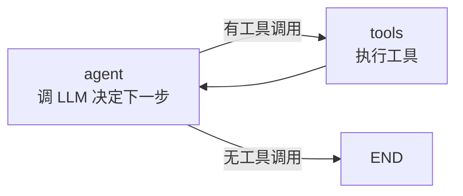

# 阶段 9：完整 Tool-calling Agent

!!! success "本阶段完成"
    用阶段 1-8 搭好的引擎，拼出一个**完整的 ReAct Agent**，接真 OpenAI API。

## 目标

把前面所有阶段的能力组装成一个真实可用的 Agent：



## ReAct 模式

ReAct = **Reasoning + Acting**。Agent 交替进行"思考"（调 LLM）和"行动"（执行工具）：

1. **agent 节点**：把当前消息历史发给 LLM，LLM 决定是调用工具还是直接回复
2. **tools 节点**：执行 LLM 请求的工具调用，把结果作为 `tool` 消息追加到历史
3. **循环**：回到 agent 节点，LLM 看到工具结果后决定下一步

这就是所有 Agent 框架的核心循环。

## 实现

### Tool 类

```python
@Tool("calculator", "计算数学表达式", {
    "type": "object",
    "properties": {"expr": {"type": "string"}},
    "required": ["expr"],
})
def calculator(expr: str) -> str:
    return str(eval(expr))
```

`Tool` 把 Python 函数包装成 OpenAI tools API 需要的 JSON schema。

### create_react_agent

```python
from openai import OpenAI
from tiny_langgraph import MemorySaver, create_react_agent

agent = create_react_agent(
    OpenAI(),
    tools=[calculator, search],
    system_prompt="你是一个助手",
    checkpointer=MemorySaver(),
)

result = agent.invoke({"messages": [{"role": "user", "content": "算 2+3"}]})
```

内部构建的图：

```python
graph = StateGraph(AgentState)
graph.add_node("agent", agent_node)      # 调 LLM
graph.add_node("tools", tool_node)      # 执行工具
graph.add_edge(START, "agent")
graph.add_conditional_edges("agent", should_continue, {
    "tools": "tools",   # LLM 请求工具 → 执行工具
    END: END,           # LLM 直接回复 → 结束
})
graph.add_edge("tools", "agent")        # 工具执行完 → 回到 agent
```

### AgentState

```python
class AgentState(dict):
    messages: Annotated[list[dict], add_messages]
```

`add_messages` Reducer（阶段 5）负责把节点返回的新消息**追加**到历史列表。

## 各阶段能力的运用

| 阶段 | 能力 | 在 Agent 中的作用 |
|------|------|-------------------|
| 1 | 最小 DAG | 图的基本执行能力 |
| 2 | 共享状态 | `messages` 在节点间传递 |
| 3 | 条件边 | `should_continue`: 有工具调用? → tools : → END |
| 4 | 循环图 | agent → tools → agent 的 ReAct 循环 |
| 5 | Reducer | `add_messages` 智能追加消息 |
| 6 | Pregel | 超级步执行模型 |
| 7 | Checkpoint | `MemorySaver` 保存对话历史 |
| 8 | Interrupt | 工具执行前暂停，人类审批 |
| **9** | **Agent** | **把上面所有能力组装成一个完整的 Agent** |

## 人机协作

```python
agent = create_react_agent(
    OpenAI(),
    tools=[send_email],
    checkpointer=MemorySaver(),
    interrupt_before_tools=True,  # 工具执行前暂停
)

# 第一次执行：agent 决定发邮件，但在 tools 前暂停
events = list(agent.stream(
    {"messages": [{"role": "user", "content": "帮我发邮件"}]},
    config=config,
))
# events[-1]["interrupt"] == "before"

# 人类审批后续跑
result = agent.invoke(None, config=config)
```

## 对照真 LangGraph

同样的 Agent，用真 LangGraph 写出来几乎一样：

```python
# 真 LangGraph
from langgraph.graph import StateGraph, END, START
from langgraph.prebuilt import ToolNode, create_react_agent

agent = create_react_agent(model, tools)  # 一行搞定
```

```python
# 我们的 tiny_langgraph
from tiny_langgraph import create_react_agent, Tool

agent = create_react_agent(OpenAI(), tools=[...])  # 也是一行
```

### 我们砍掉了什么

| 特性 | 真 LangGraph | tiny-langgraph |
|------|-------------|----------------|
| LLM 抽象层 | LangChain ChatModel（支持 100+ 提供商） | 直接用 OpenAI SDK |
| 消息类型 | BaseMessage 体系（AIMessage, HumanMessage...） | 原生 dict |
| 流式协议 | 逐 token 流式输出 | 逐超级步 yield |
| 并行执行 | 真并行（asyncio） | 同层节点顺序执行 |
| 持久化 | Redis, Postgres, Firestore... | Memory + SQLite |
| 生态集成 | LangChain tools, retrievers... | 自定义 Tool 类 |
| 分布式 | LangGraph Cloud / Server | 无 |

### 核心骨架完全一致

- **图定义**：`StateGraph` + `add_node` + `add_edge` + `add_conditional_edges`
- **执行模型**：Pregel 超级步（while 循环 + 状态合并 + 路由）
- **状态管理**：Reducer 机制（`add_messages`）
- **持久化**：Checkpoint + 续跑
- **人机协作**：Interrupt + `update_state`

**这就是"框架"和"引擎"的边界**：LangGraph 框架在引擎之上加了生态集成、流式协议、分布式能力，但核心执行引擎就是我们这 9 个阶段实现的这些东西。

## 运行示例

```bash
# 安装 openai
pip install tiny-langgraph[llm]

# 设置 API Key
export OPENAI_API_KEY=sk-...

# 运行
python examples/stage_9_agent/run.py
```

没有 API Key 也能运行——脚本会用 FakeLLM 演示同样的图执行流程。
