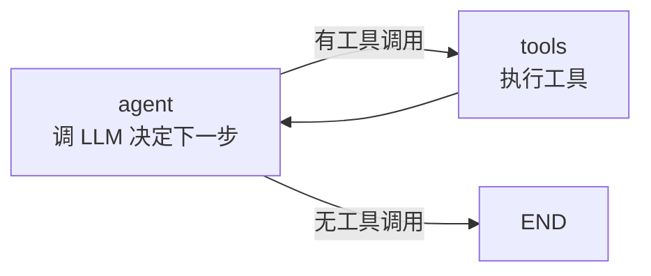

# 阶段 9：完整 Tool-calling Agent

!!! info "待实现"
    本阶段将在 `stage-9` tag 实现。

## 目标

用我们手写的引擎，拼出一个**完整的 Tool-calling Agent**，接真 OpenAI API，和真 LangGraph 对比。

## 将实现的 Agent



```python
from openai import OpenAI

llm = OpenAI()
tools = [search_tool, calculator_tool]

graph = StateGraph(AgentState)
graph.add_node("agent", agent_node)
graph.add_node("tools", tool_node)
graph.add_edge(START, "agent")
graph.add_conditional_edges("agent", should_continue, {
    "tools": "tools",
    END: END,
})
graph.add_edge("tools", "agent")

app = graph.compile(checkpointer=MemorySaver())
result = app.invoke({"messages": [user_msg]}, config)
```

## 对照真 LangGraph

同样的 Agent，用真 LangGraph 写出来几乎一样。我们会并排展示两份代码，指出：

- 哪些是我们砍掉的（流式协议、LangChain 生态、分布式...）
- 哪些是核心骨架（完全一致）
- 由此理解"框架"和"引擎"的边界